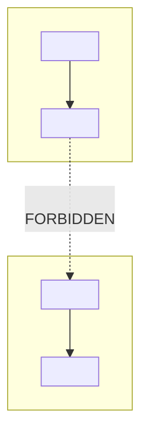

<!--
FRONTMATTER NOTE (do not ship this comment):
This frontmatter INHERITS the hand-authored DISCOVERY shape defined in
`discovery-writing.md` + `frontmatter.md` (the OWNING conventions — inherit by reference,
do not re-derive). The ONLY local delta is `governance_status: project-local-overlay`.
This is HAND-AUTHORED DISCOVERY frontmatter; bootstrap-only fields are FORBIDDEN here:
NO surface_kind / canonical_source / generated_by / mutation_policy (those assert a
regenerate-from-canonical-source contract that does not exist for a hand-authored artifact).
The view rides node_type:discovery for catalog/edge-legality — every discovery-keyed edge
rule in the constitution applies to it unchanged.
-->

# Ontology-view — <PROJECT>

> This is the **ontology-view** — the typed node/edge layer beneath the sibling views.
> Companions (fill in the ones that exist):
> [`discovery.md`](discovery.md) — plain-language orientation + open *business* questions;
> [`system-view.md`](system-view.md) — the *shape* at stakeholder altitude;
> [`engineer-view.md`](engineer-view.md) — the contracts, schemas, and the full decision inventory.
>
> **What this view OWNS:** the formalized ontology — every domain concept declared as a
> **typed node** (`node_type` + a project-local kind axis + branch + optional scope + schema +
> precedent, and — for belief-bearing types only — veracidade/convicção); every relationship
> declared as a **typed edge** (directionality, cardinality, rule, forward/inverse pair); the
> **forbidden-edge guard** (category-errors made unconstructible-by-type, plus predicate guards
> for the reflexive/self-loop class); and a **residue ledger** where every load-bearing claim is logged.
>
> **What this view POINTS ACROSS for:** every *verdict*. No decision is re-decided here.
> Where a stance touches a decision row, this view names it and points to `engineer-view.md`.
> Read `system-view.md` first for the shape; descend here for the schema; go to
> `engineer-view.md` for the verdicts.
>
> **Frontmatter note:** this view carries one field beyond the sibling house style —
> `governance_status: project-local-overlay`. It is intentional and load-bearing (the overlay
> status is this view's central governance claim, surfaced again in *Governance posture*), not
> schema drift.

---

## Objective

<!-- <= 3 sentences. State the project's load-bearing invariants and the typing discipline that
makes them structural rather than asserted. Inherit the objective-first <=3-sentence gate from
discovery-writing.md. -->

<FILL-IN: 1–3 sentences. Name the load-bearing invariants this ontology makes machine-checkable,
and state the discipline: when a forbidden relationship would be an edge, type the endpoints so
the edge cannot be well-formed; for the reflexive/self-loop class, back it with a predicate guard.>

**veracidade/convicção note:** per `ontology-conventions.md` §6, confidence is meaningful only
for **axiom / premise / audit** roles. Name the belief-bearing node(s) here (if any) and state
that every other node OMITS confidence — they are conceptual / constitution / spec / backlog
roles, not bets.

> EXAMPLE-REPLACE-ME (worked example): *"The sole belief-bearing node was a premise-typed
> Insight node; every other node omitted confidence."* — replace with your project's belief-bearing nodes.

---

## Governance posture (load-bearing)

<!-- Produced by Step 1 (resolve constitution by version+path, count live forward-edge tables).
This section is REQUIRED and carries the RESOLVED-CONSTITUTION record + catalog-conformance row. -->

### Resolved-constitution record

The canonical ontology-conventions was resolved by **highest-version frontmatter + recorded path**
(NOT nearest-path), searching **only within this project's own repository tree** (not the skill
package's tree — the disagreeing copies can live in different repos). Record the file actually used:

| Field | Value |
|---|---|
| Resolved constitution path | `<absolute/path/to/ontology-conventions.md>` |
| Version (frontmatter) | `<vX.Y.Z>` |
| Commit / dirty-state | `<commit-sha or "working-tree modified">` |
| Lower-version copies flagged as stale mirrors | `<path(s) + version, or "none found">` |

> EXAMPLE-REPLACE-ME: in the worked example the SKILL output sat in the upstream repo, whose
> beside-file constitution was **v2.4.0** (canonical), with an **embedded submodule copy at
> v2.1.1** flagged as a stale mirror. **Note:** the worked-example artifact itself cites the
> *embedded v2.1.1* copy — that is a known stale-mirror citation; do NOT propagate it. Resolve
> by highest version and record the path you actually used.

### Catalog-conformance check (live forward-edge count)

Count the **live forward-edge subsections** of the resolved constitution **at run time** — every
forward-edge subsection between the Appendix-C header and the first deprecated/previously-named
region, **whatever they are named in the resolved version** (the names are version-specific, NOT
the predicate: v2.4.0 = `epistemic / provenance / reference`; v2.1.1 = `universal /
document-specific / session-specific` — re-derive the names from YOUR resolved file). **EXCLUDE**
the "Edges deprecated by this catalog" table and the "Edges previously named" mapping table.
**GUARD:** if the count comes back zero under the names you used, the predicate mis-matched the
version — re-derive the subsection names from the resolved file first. Write the counting predicate
out so the count is reproducible:

- Counting predicate used: `<which tables counted as live forward-edge; line ranges; where the deprecated/mapping region begins>`
- **Counted live-forward-edge total (live tables):** `<N counted on disk>`
- Appendix-C header value: `<H>`
- Prose value: `
`
- **Mismatch flag:** if these three disagree, RECORD ALL THREE — do **not** reconcile to one literal. Flag as a blocker note.

> EXAMPLE-REPLACE-ME: in the canonical v2.4.0 (what a correct version-resolution yields) the live
> subsections counted **25** (15 epistemic + 9 provenance + 1 reference), while its own Appendix-C
> header said **22** and its prose said **21** — a genuine three-way self-disagreement. The skill
> surfaces 25 / 22 / 21 as a blocker note and pins no single literal. (The worked-example artifact
> never performed any live count — it records only the literal **21**; **24 / 21 / 21** is what an
> author would *derive* from the wrongly-resolved v2.1.1 mirror under its
> `universal/document-specific/session-specific` subsections, not a value the artifact states.
> Re-derive; do not copy either literal.) Replace with YOUR counted values.

### Coined-vs-canonical edge accounting

| Accounting | Value |
|---|---|
| Coined edges (flagged `COINED`) | `<count>` |
| Canonical edges reused verbatim | `<count>` |
| Total edge types | `<sum>` |
| Version-skew edges (reuse-pending-version-bump) | `<count, or 0>` |

> EXAMPLE-REPLACE-ME: *"16 COINED + 3 canonical = 19 edge types"* (worked example). Replace with
> your own accounting — do NOT carry the 16-COINED count forward.

### Local label axis declaration

- Project-local kind axis: `<your kind axis name>` (justify why its value is not predictable from `node_type`).
- OPTIONAL scope axis (if declared): `<your scope axis>` — mark **project-declared, NOT a universal typing primitive**, and cite the discovery decision that owns it.

> EXAMPLE-REPLACE-ME: the worked example used a project-local kind axis and an optional
> ontology-type / runtime-instance scope axis backed by a settled discovery decision. Those exact
> values are GoldenQuill locals — declare your own; do NOT inherit them as defaults.

### Amendment / discovery routing status

- Coined-edge vocabulary is recorded here as **PROPOSED-UNFILED** (`governance_status: project-local-overlay`),
  promotion **HALTED**, because no external amendment-routing convention is codified.
- **BLOCKER flag:** the amendment-routing-path convention itself is undecided on disk. Surface it as a blocker OQ;
  do not reference an undefined external amendment path. The concrete fallback is to keep the vocabulary in THIS section.

---

## Node types

<!-- Produced by Step 4. Group by your project's axis / branch. -->

Declare each domain concept as a TYPED NODE. Columns:
**Node | Definition | Schema (load-bearing) | instances | Precedent**

> OPTIONAL scope-axis note: if you declared a scope axis, state it is **project-declared, not a
> universal typing primitive**. EXAMPLE-REPLACE-ME — the worked example's ontology-type /
> runtime-instance scope values are GoldenQuill locals; do not ship them as defaults.

### <Axis / branch group A — fill in>

| Node | Definition | Schema (load-bearing) | instances | Precedent |
|---|---|---|---|---|
| `<NodeName>` | `<definition>` | `node_type: <enum>; <kind-axis>: <value>; branch: <business\|system\|bridge\|mixed>; scope: <optional>`. `<load-bearing schema, on-disk fields>` | `<on-disk instances>` | `<precedent cite>` |
| `<NodeName>` ⚖️ *(belief-bearing example)* | `<definition>` | `node_type: premise; ...`. **veracidade + convicção REQUIRED** (§6). | `<instances>` | `<cite>` |

### <Axis / branch group B — fill in>

| Node | Definition | Schema (load-bearing) | instances | Precedent |
|---|---|---|---|---|
| `<NodeName>` | `<definition>` | `<schema>` | `<instances>` | `<cite>` |

**Reflexive-guard inputs (flag here, gate downstream):** list any **role-discriminated type**
(a single type carrying a `role` discriminator whose two roles can be both endpoints of one edge,
or any node that could edge to itself) whose self-relation is forbidden. These surface as inputs
to the reflexive/self-loop guard in *Forbidden edges & guards*.

> EXAMPLE-REPLACE-ME (worked example, line 152): a role-discriminated `Behavior[running|designed]`
> type — one declared type with a `role` enum — whose `running→designed` edge forbids a self-loop.
> Replace with your project's role-discriminated types; do not carry `Behavior` forward.

---

## Edge types

<!-- Produced by Step 5. Group by edge family. -->

Declare each relationship as a TYPED EDGE. Columns:
**Edge | From→To | Dir. | Card. | Rule (load-bearing) | Precedent**

Per edge: a **`COINED`** flag where it is not a verbatim catalog edge, a declared
**forward/inverse** pair, and a **version-skew** flag (`reuse-pending-version-bump`) where the edge
exists in a NEWER constitution version but not the resolved one. For any **self-relation-capable**
edge, the Rule cell MUST carry the predicate (e.g. `id(from) != id(to)`).

Tightening cardinality is permitted; **widening is forbidden** (flag a widening as PROPOSED-UNFILED).

### <Edge family A — fill in>

| Edge | From → To | Dir. | Card. | Rule (load-bearing) | Skew | Precedent |
|---|---|---|---|---|---|---|
| `<edge-name>` `COINED` | `<From>` → `<To>` | directed | `<N:1\|1:N\|N:M\|1:1>` | `<rule>`. INVERSE: `<inverse-name>`. | `<–\|reuse-pending-version-bump>` | `<cite>` |
| `<edge-name>` ✓ canonical | `<From>` → `<To>` | directed | `<card>` | `<rule>`. INVERSE: `<catalog inverse>`. Catalog shape `<...>` — `<tightening, not widening>`. | `–` | `<catalog line>` |

### <Edge family B — fill in (e.g. a reflexive/self-relation-capable family)>

| Edge | From → To | Dir. | Card. | Rule (load-bearing) | Skew | Precedent |
|---|---|---|---|---|---|---|
| `<self-relation-capable edge>` `COINED` | `<Type[roleA]>` → `<Type[roleB]>` | directed | `<card>` | **PREDICATE:** `id(from) != id(to) AND role(from)=<roleA> AND role(to)=<roleB>`; self-loop forbidden. INVERSE: `<inverse>`. | `–` | `<cite>` |

> EXAMPLE-REPLACE-ME (worked example, `drifts-from`, line 202):
> `behavior_id(from) != behavior_id(to) AND role(from)=running AND role(to)=designed` — a
> GoldenQuill-local edge. Replace with your own reflexive predicate; do not carry `drifts-from`/`Behavior` forward.

---

## The schema graph

*A **curated subset**, explicitly NOT exhaustive — name which nodes/edges are intentionally not
drawn (see the node/edge tables for full coverage). Include at least one **forbidden/dotted**
edge showing the re-introduction vector.*

> EXAMPLE-REPLACE-ME: the worked example drew a dotted `reads-during-eligibility ... FORBIDDEN`
> edge from a derived "matrix card" back into a council seat as its re-introduction vector. Replace
> with your project's forbidden vector; do not carry the matrix-card example forward.

---

## Forbidden edges & guards

The discipline: make forbidden relationships **unconstructible by type** FIRST (no catalog edge
admits that `source_type → target_type` pair), and back the residual paths with **named, fail-closed
guards** SECOND. The **EXCEPTION** is the **reflexive/self-loop class** — where the two forbidden
endpoints are IDENTICAL and LEGAL types, by-type-first does NOT apply (endpoints are admissible), so
a **predicate/runtime guard is PRIMARY**, not reinforcement.

> Provenance honesty: this forbidden-edge discipline is **SKILL-INTRODUCED**, not codified in
> `ontology-conventions.md` (the constitution's only edge-legality levers are per-edge source/target
> `node_type` constraints + "do not invent edges"). It GENERALIZES the constitution's own Appendix-C
> unconstructible-by-type argument (e.g. "a session cannot originate an epistemic edge — doing so
> would make the session an epistemic actor, which it is not").

### Guard narratives

1. **<Guard 1 — by-type / orthogonal-axis coupling>.** `<why it would corrupt the invariant; how
   distinct types make the edge non-well-formed; the on-disk reinforcement (schema const, registry).
   Name the verdict owner: engineer-view row D-N>`.
2. **<Guard 2 — derived/cache node as a decision target>.** `<the derived node is typed with
   decides=false; the decision edge's only legal target is the live-verdict type>`.
3. **<Guard 3 — reflexive/self-loop>.** `<the forbidden relationship has identical legal endpoints;
   the named predicate guard is PRIMARY; state its LIVE/PLANNED status verified on disk>`.

### Enforcement-tier gate table (REQUIRED)

A guard is **LIVE** iff its enforcement body is reachable and evaluates the predicate (no stub, no
unconditional pass, no not-yet-implemented marker), verified on disk **substrate-neutrally**.

**Threshold (tiered — a tiered rule, not a binary flip):**
- `by-type=N` **AND** no LIVE structural/schema-const layer **AND** runtime ≠ LIVE ⇒ **BLOCKER**.
- `by-type=N` **WITH** a LIVE structural/schema-const layer **but** PLANNED runtime ⇒ **MAJOR OQ**.
- Reflexive/self-loop rows (`by-type=N` by construction, identical legal endpoints) ⇒ gated on
  **predicate-guard status** under the SAME tiered rule.

> The tier threshold is a calibrated **DEFAULT a project MAY override** (e.g. escalate to blocker
> when the inadmissible relationship has a stored-row surface). Do not silently bind a new project to
> the worked example's enforcement posture.

| Forbidden relationship | by-type? (Y/N) | structural / schema-const layer (LIVE/none) | runtime-guard (LIVE/PLANNED/registered-dormant) | block? | Why it would corrupt the invariant | How it is made unconstructible / gated (enforcement honesty) |
|---|---|---|---|---|---|---|
| `<distinct-endpoint coupling>` | Y | LIVE | LIVE | no | `<rationale>` | `<distinct types; schema guard + runtime guard both LIVE>` |
| `<derived/cache → decision target>` | Y | LIVE | n/a | no | `<rationale>` | `<decides=false; only legal target is the verdict type>` |
| `<matrix-vector: schema-const LIVE / runtime PLANNED>` | N | **LIVE** | **PLANNED** | **MAJOR OQ** | `<rationale>` | `<schema const-false LIVE; runtime + structural guard PLANNED>` |
| `<reflexive self-loop>` | N | n/a | `<LIVE/PLANNED>` | `<no \| MAJOR OQ \| BLOCKER per predicate-guard status>` | `<self-reference corrupts the acyclic invariant>` | **predicate guard PRIMARY:** `id(from) != id(to) ...` — state on-disk status |

> EXAMPLE-REPLACE-ME (matrix-vector row): the worked example's `Matrix-card → Council-seat` vector
> had a `const false` schema layer LIVE but its runtime + structural guards PLANNED ⇒ MAJOR OQ.
> EXAMPLE-REPLACE-ME (reflexive row): the worked example's `drifts-from` self-loop (line 202) with
> the `behavior_id(from) != behavior_id(to)` predicate. Both rows are GoldenQuill-derived — mark and
> replace; do not ship `Matrix-card`, `Council-seat`, or `drifts-from` as defaults.

---

## Alternative framings we considered

| Framing | Why set aside |
|---|---|
| `<alternative framing 1>` | `<why set aside>` |
| `<alternative framing 2>` | `<why set aside>` |

> EXAMPLE-REPLACE-ME: e.g. *"Ontology-as-prose — the load-bearing invariants stay mere assertions;
> typing the endpoints makes them structural."* Replace with your project's considered framings.

---

## Open questions

<!-- Produced by Step 7. Each OQ carries a recommendation + a NAMED owner. Blocker OQs flagged.
NON-CONTIGUOUS numbering is ACCEPTABLE — do not renumber to fill gaps. -->

- **OQ-1** — `<question>`. Recommendation: `<rec>`. Owner: `<named owner>`.
- **OQ-2** — `<question>`. Recommendation: `<rec>`. Owner: `<named owner>`.
- **OQ-N (BLOCKER)** — `<the amendment-routing / unfiled-edge-vocabulary / mislabeled-LIVE-guard /
  constitution-version-skew / live-vs-header-vs-prose edge-count mismatch / reflexive-guard-with-no-
  predicate-body question>`. Recommendation: `<rec>`. Owner: `<named owner>`.

> EXAMPLE-REPLACE-ME: the worked example carried 11 questions with **gaps at OQ-5 and OQ-8** and a
> flagged **OQ-13 (BLOCKER)** for the unfiled edge-amendment vocabulary. Keep your own non-contiguous
> set; do not renumber.

---

## Residue ledger

Every load-bearing claim maps to ≥1 row. `closed` = adjudicated/fixed; `open` = a true domain
residue deliberately preserved (subset rule — never demoted).

| # | Claim | Status (closed/open) | Surviving residue | Citation |
|---|---|---|---|---|
| R1 | `<load-bearing claim>` | closed | `<what was fixed; none deceptive>` | `<citation from the per-agent files>` |
| R2 | `<load-bearing claim>` | open | `<the preserved true residue>` | `<citation>` |

> EXAMPLE-REPLACE-ME: the worked example ran a contiguous R1–R15 ledger mixing closed adjudications
> and one deliberately-preserved open residue. Replace with your own rows.

---

## Cross-reference map

Every verdict / schema contract this view *points to* (and does not restate). Per the
nothing-decided-twice discipline: the stance is named here; the verdict lives in the owning view —
**every verdict → engineer-view**.

| This view's node/edge | Points to (owner) | What is owned there |
|---|---|---|
| `<node/edge or guard>` | `engineer-view.md` §`<n>` row **D-N** | `<the verdict / schema contract owned there>` |
| `<coined-edge vocabulary + local kind axis>` | `ontology-conventions.md` (`<resolved version>`) + the **unwritten** amendment discovery | The catalog + label-admission gate; promotability blocked until the discovery is written (blocker OQ) |

> EXAMPLE-REPLACE-ME: the worked example pointed each guard/edge to a specific engineer-view decision
> row and pointed its whole coined-edge vocabulary at the (unwritten) project edge-amendments
> discovery. Replace owners/rows with your project's.

---

<!--
REUSABILITY — STRIP-LIST (deny-list; must NOT survive into a real project's artifact):
  gq_kind · TILTH-* · CIC · CLC · matrix-card · council-seat · the 16-COINED count ·
  the ontology-type / runtime-instance scope values.
Every EXAMPLE-REPLACE-ME row above is GoldenQuill-derived (the worked reference instance at
/Users/victorboscaro/domainspec-core/projects/goldenquill/victor/ontology-view.md — NOTE: that
artifact's own constitution citation points at the stale embedded v2.1.1 mirror; do not propagate).
Before publishing: zero EXAMPLE-REPLACE-ME rows survive, and zero strip-list tokens leak.
-->
