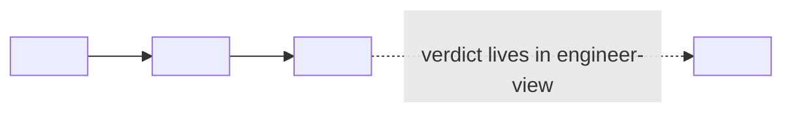

<!--
FRONTMATTER NOTE (do not ship this comment):
This frontmatter INHERITS the hand-authored DISCOVERY shape defined in
`discovery-writing.md` + `frontmatter.md` (the OWNING conventions — inherit by reference,
do not re-derive). The ONLY local delta is `governance_status: project-local-overlay`.
This is HAND-AUTHORED DISCOVERY frontmatter; bootstrap-only fields are FORBIDDEN here:
NO surface_kind / canonical_source / generated_by / mutation_policy (those assert a
regenerate-from-canonical-source contract that does not exist for a hand-authored artifact).
CONFIDENCE-APPLICABILITY RULE: per frontmatter.md, veracidade/convicção are required only for
axiom/premise and OPTIONAL for discovery — a system-view holds many framings at varying
confidence, so OMIT the confidence dyad from the frontmatter (per-stance confidence, if any,
belongs inline in the body, never as a single doc-level bet).
-->

# System-view — <PROJECT>

> This is the **system-view** — the upper half of a system-view / engineer-view pair. It
> explains the *shape* of the target at the altitude a stakeholder needs to judge whether the
> idea is sound — **one conceptual layer at a time, no schemas, no code**.
> Companions (fill in the ones that exist):
> [`ontology-view.md`](ontology-view.md) — the typed terms (every term DEFINED there, USED here);
> [`engineer-view.md`](engineer-view.md) — the contracts, schemas, and the full decision inventory
> (every VERDICT decided there, NAMED here);
> [`discovery.md`](discovery.md) — plain-language orientation + open *business* questions.
>
> **What this view OWNS:** the *shape* — the surface ("what this is"), the layered narrative told
> one conceptual layer at a time, the given-vs-optimized layering, the load-bearing stances **named
> but not decided**, a per-section "alternative framings we considered" table, optional shape
> diagrams (no schemas), and the closing "what this view does not cover" map.
>
> **What this view POINTS ACROSS for:** every *verdict* and every *term meaning*. No decision is
> decided here (it lives in `engineer-view.md`); no term is redefined here (it lives in
> `ontology-view.md`). Where the shape rests on a load-bearing choice, this view NAMES the stance
> and points to exactly one engineer-view decision row.
>
> **Frontmatter note:** this view carries one field beyond the sibling house style —
> `governance_status: project-local-overlay`. It is intentional and load-bearing (the overlay status
> is this view's central governance claim), not schema drift.
>
> **Provenance & mutation — derive-only.** This view is **reconciled from its source
> [`discovery.md`](discovery.md)**, the **sole sanctioned mutation trigger** for it: do not hand-edit
> this file. To change it, revise (or supersede) the discovery and re-run `/system-view <project>
> --mode draft` (evolve), which reconciles this view against the discovery delta while **preserving its
> authored named stances, layered shape, and alternative-framings**. The `## Connections` block records
> the `derives-from` edge and the discovery `version` last reconciled against — if the discovery's
> current `version` is higher, this view is **STALE**. This is *reconcile-not-regenerate*, which is
> exactly why no `generated_by` / `mutation_policy` frontmatter is carried.

---

## Objective

<!-- <= 3 sentences. State the target's load-bearing shape and the discipline that keeps it
name-don't-decide / use-don't-redefine. Inherit the objective-first <=3-sentence gate from
discovery-writing.md. NO motivation here. -->

<FILL-IN: 1–3 sentences. State what the target is at the highest level and the shape this view
authors; state plainly that it names every load-bearing stance and decides none — each pointing to
engineer-view — and redefines no term — each deferred to ontology-view.>

---

## What <PROJECT> is (the surface)

<!-- Produced by Step 4. The target stated plainly at stakeholder altitude. No schemas, no code.
Use the ontology-view's terms; do NOT redefine them. -->

<FILL-IN: the plain-language "what this is". State the target, who it is for, and the single
load-bearing promise or differentiator that drives everything downstream. Name any term you use;
do not define it — point to ontology-view if a definition is reached for.>

### Alternative framings we considered

| Framing | Why set aside |
|---|---|
| `<alternative framing of the surface>` | `<why set aside>` |
| `<alternative framing of the surface>` | `<why set aside>` |

> EXAMPLE-REPLACE-ME (neutral): *"Framing the target as a hosted service — set aside because it
> collapses the central promise; the owned-artifact model exists precisely to refuse that."*
> Replace with your target's considered framings. ZERO project locals.

---

## <Layer 1 — the protagonist idea / first conceptual layer>

<!-- Produced by Step 4. One conceptual layer at a time. Each layer-section carries its own
alternative-framings table. Name (do not decide) any stance the layer rests on. -->

<FILL-IN: explain ONE conceptual layer of the shape. Where the layer rests on a load-bearing choice
that could go another way, NAME the stance inline and point across — see the named-stance line
pattern below. State the tension; state no verdict.>

> **Named-stance line (pattern — use inline wherever the shape rests on a choice):**
> *The **<stance-slug>** stance — `<the tension, stated as "X versus Y — a real tension, not a
> settled answer">` — is **named here and decided nowhere in this view**. Its single owning verdict
> lives in [`engineer-view.md`](engineer-view.md), row **D-<id>** (`stance:<stance-slug> →
> engineer-view#D-<id>`).*
>
> EXAMPLE-REPLACE-ME (neutral): *"The **coupling** stance — whether any design-time link between the
> two axes is ever admissible — is named here and decided nowhere in this view; verdict in
> engineer-view#D-1."* Replace with your stance; do NOT carry any project locals.
> If the engineer-view row does NOT exist yet, write the handle PROVISIONAL —
> `stance:<slug> → engineer-view#D-<id> [PROVISIONAL — row not yet authored]` — and add a blocker OQ.
> NEVER state the verdict here to fill the gap.

### Alternative framings we considered

| Framing | Why set aside |
|---|---|
| `<alternative framing for this layer>` | `<why set aside>` |
| `<alternative framing for this layer>` | `<why set aside>` |

---

## <Layer 2 ... add one section per conceptual layer>

<!-- Repeat the layer pattern: prose for the layer, named-stance lines where it rests on a choice,
and an alternative-framings table. Add as many layer sections as the shape needs. -->

<FILL-IN.>

### Alternative framings we considered

| Framing | Why set aside |
|---|---|
| `<alternative framing for this layer>` | `<why set aside>` |

---

## Given vs optimized — the layering that makes it a product

<!-- Produced by Step 5. The discipline: separate what is FIXED-AND-OBEYED (you do not tune it)
from what is OPTIMIZED-TOWARD (the response surface you shape) from what merely ACCUMULATES (it
grows; not optimization). Domain equivalents are fine — keep the three-way separation. Name any
stance inside; decide none. -->

The shape is built one conceptual layer at a time, and each layer has a different relationship to
control:

- **`<the fixed signature>` — GIVEN, fixed forever.** `<you do not optimize the shape of the job>`.
- **`<the hard constraints>` — GIVEN by `<source>`, obeyed fail-closed.** `<binary; you optimize only
  your ability to detect and satisfy them>`.
- **`<the graded objectives>` — GIVEN, but you optimize your response toward them.** `<the response
  surface is shaped to score well>`.
- **`<the guardposts / craft layer>` — refined only to a general level, NOT maximized toward a metric.**
  `<a stance may live here — name it and point across, do not decide whether this layer is "optimized"
  at all>`.
- **`<the accumulating corpus>` — NOT optimization; it simply grows.** `<a stance may live here —
  e.g. whether accumulation is a defensible moat — name it and point across>`.

> Name each stance inside this layering with the inline named-stance line and point it to its one
> owning engineer-view row. EXAMPLE-REPLACE-ME (neutral): *"whether the craft layer is an 'optimized
> layer' at all is the **optimization-target** stance — named here, verdict in engineer-view#D-<id>."*
> Replace with your own; ZERO project locals.

### Alternative framings we considered

| Framing | Why set aside |
|---|---|
| `"Everything is a knob we tune"` | Flattens the layers and invites optimizing against constraints that must simply be obeyed — a fail-closed violation, not a tuning target. |
| `<your second considered framing>` | `<why set aside>` |

---

## Shape diagram (optional)

<!-- Optional. A flow/relationship sketch at STAKEHOLDER ALTITUDE. NO schemas, NO contracts, NO
field types. Include a dotted "stance — verdict lives in engineer-view" pointer if it clarifies. -->

> EXAMPLE-REPLACE-ME (neutral): a dotted edge from a layer element to a "stance — verdict in
> engineer-view" node, marking a choice this view names but does not decide. Replace with your
> target's shape; ZERO project locals, NO schema fields.

---

## What this view does not cover

<!-- Produced by Step 7. The closing map. State plainly that this view stops at the shape, names
stances, and states no verdicts. Enumerate what engineer-view owns and what ontology-view owns. End
on the nothing-decided-twice line. -->

This view deliberately stops at the *shape*. It names stances; it states no verdicts; it redefines
no terms. For the mechanics, descend to **`engineer-view.md`**, which refines this view and owns:

- the **decision inventory** — every load-bearing decision with its verdict and status
  (RESOLVED / OPEN / CRITICAL), including the rows for every stance named above;
- the **schemas and contracts** — `<the schemas / records / contracts this view did not draw>`;
- the **mechanics** — `<the runtime / process mechanics this view described only as shape>`;
- `<any further engineer-view-owned area>`.

For term meaning, descend to **`ontology-view.md`**, which owns the typed terms used above (each
term is USED here and DEFINED there).

Each stance named in this document — `<list the stance slugs>` — has its single owning verdict over
there. **Nothing is decided twice.**

---

## Stance-to-verdict cross-reference table

<!-- Produced by Step 8. Every stance named in this view, the tension it carries, and its one owning
engineer-view row. Per the nothing-decided-twice discipline: named here, decided there. Step 8 BLOCKS
publication if any stance has no owning row, if any verdict is stated in prose, or if any term is
redefined. -->

| Stance (slug) | Tension named here | Owning verdict |
|---|---|---|
| `<stance-slug>` | `<X versus Y — the tension, not the answer>` | [`engineer-view.md`](engineer-view.md) row **D-<id>** (`stance:<slug> → engineer-view#D-<id>`) |
| `<stance-slug>` | `<the tension>` | `engineer-view#D-<id>` `<or "[PROVISIONAL — row not yet authored]" + blocker OQ>` |

> EXAMPLE-REPLACE-ME (neutral): each row names a stance and points to exactly one decision row; no
> row states a verdict. Replace with your target's stances; ZERO project locals. Every row MUST
> resolve to exactly one engineer-view decision (or be marked PROVISIONAL with a matching blocker OQ).

---

## Open questions

<!-- Produced by Step 7. Each OQ carries a recommendation + a NAMED owner. Blocker OQs flagged.
NON-CONTIGUOUS numbering is ACCEPTABLE — do not renumber to fill gaps. -->

- **OQ-1** — `<question>`. Recommendation: `<rec>`. Owner: `<named owner>`.
- **OQ-2** — `<question>`. Recommendation: `<rec>`. Owner: `<named owner>`.
- **OQ-N (BLOCKER)** — `<a stance with no owning engineer-view row / a missing engineer-view
  inventory / a verdict that leaked into prose / a term redefined here / a missing closing map>`.
  Recommendation: `<rec>`. Owner: `<named owner>`.

---

## Connections

<!-- The load-bearing provenance link. This view rides node_type:discovery, so it is a vault graph
node and this edge is bidirectional (see .claude/skills/custom/edges.md). The discovery is the SOLE
sanctioned mutation trigger — change the view by revising the discovery and re-running the skill in
evolve mode, never by hand-editing this file. -->

| Document | Type | Description |
|----------|------|-------------|
| `discovery.md` | `derives-from` | Reconciled from this discovery — its sole sanctioned mutation trigger. Last reconciled against discovery `<vX.Y.Z>`. |
| `ontology-view.md` | `cites` | Uses the terms ontology-view defines; redefines none. (Inverse `cited-by` on ontology-view.) |
| `engineer-view.md` | `refined-by` | engineer-view refines this shape into mechanics + verdicts. (Inverse `refines` on engineer-view.) |

> **Inverse is MANDATORY:** `discovery.md` carries the inverse `derives` row pointing back to this view (every edge between vault nodes is bidirectional). **Drift check:** the discovery `version` recorded above is the reconcile baseline — if the discovery's current `version` is higher, this view is STALE and must be re-reconciled in evolve mode (never hand-patched).

---

<!--
REUSABILITY — STRIP-LIST (deny-list; must NOT survive into a real target's artifact):
  CIC · CLC · TILTH-* · council · gq_kind · matrix-card · council-seat names
  (Scout / Scribe / Editor / Judge / Red Team / Logician) · the six client identities ·
  the eight capital logics · the Five Operating Laws · KFR · Match DB.
Every EXAMPLE-REPLACE-ME row above is a NEUTRAL placeholder — replace with your target's content.
The worked reference instance is at
C:\Users\victo\domainspec-core\projects\goldenquill\victor\system-view.md — generalize FROM it,
do not copy its locals.
Before publishing: zero EXAMPLE-REPLACE-ME rows survive; zero strip-list tokens leak; zero verdicts
are stated; zero terms are redefined; every stance resolves to exactly one engineer-view row.
-->
