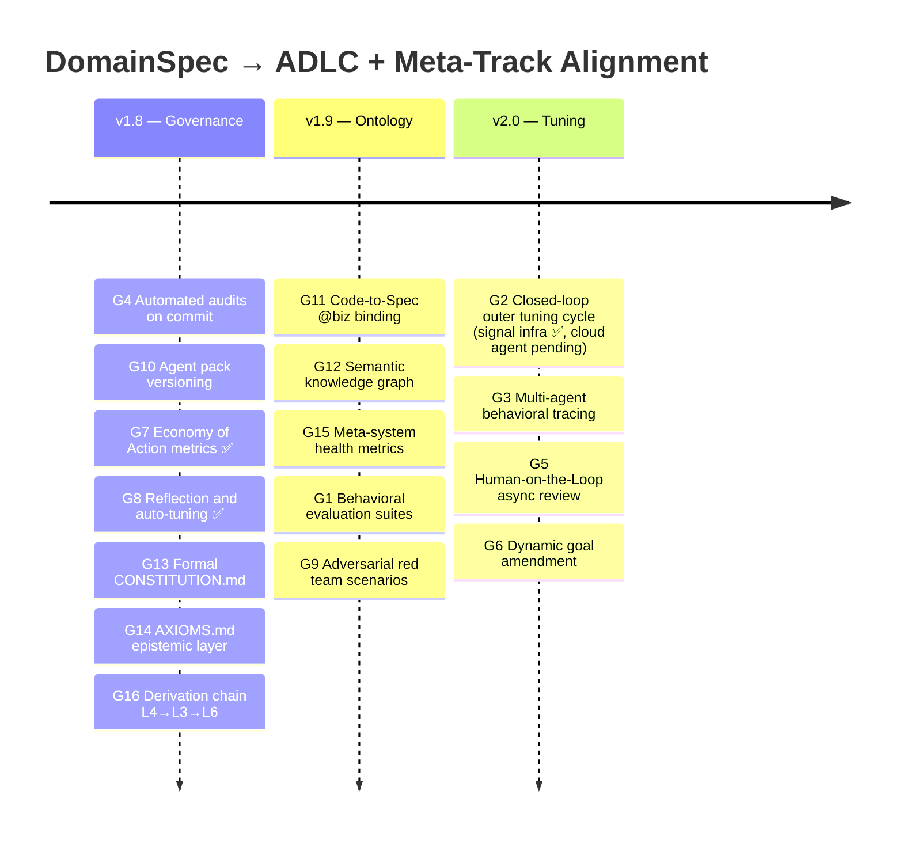

# ADLC Alignment & Meta-Track Bridge

> Tracking how DomainSpec converges with the [Agentic Delivery Lifecycle (ADLC)](https://caseywest.com/the-agentic-manifesto/#agentic-delivery-lifecycle-adlc) and the [Meta-Track Framework](https://github.com/VictorBoscaro/domain-code-mapping).

---

## Context

DomainSpec's long-term goal is to meet the premises of the **Agentic Delivery Lifecycle (ADLC)** — a continuous, tuning-centric methodology for governing autonomous AI that shifts engineering focus from static code to dynamic behavior.

This document also integrates concepts from the **Meta-Track Framework** (domain-code-mapping) — a 7-layer meta-system that bridges domain vocabulary to code via `@biz`/`@sys` annotations, orphan detection, semantic embeddings, and systems-dynamics health metrics. The Meta-Track synthesizes Donella Meadows (system structure over intent), Kahneman/Tversky (cognitive split between practitioners and builders), and Nassim Taleb (antifragility via Via Negativa — formalize rules only when their absence proves costly).

---

## Meta-Track Layer Mapping

DomainSpec's meta-models (business + operational) already define L0–L7. The table below maps the Meta-Track's concrete mechanisms onto those layers to identify what DomainSpec has, what it lacks, and where domain-code-mapping fills the gap.

| Meta-Track Layer                   | DomainSpec Equivalent                                                      | Coverage                                       | Gap                                                                                                               |
| ---------------------------------- | -------------------------------------------------------------------------- | ---------------------------------------------- | ----------------------------------------------------------------------------------------------------------------- |
| **L0 — Domain Reality**            | L0 in meta-model.mmd                                                       | ✅ Full                                        | —                                                                                                                 |
| **L1 — Understanding (Ontology)**  | TAXONOMY.md (24 types) + RELATIONSHIPS.md (26 edges) + domain.md templates | ✅ Richer than Meta-Track (13 types, 12 edges) | No runtime `@biz`/`@sys` code-to-doc binding → concepts live in docs but code can drift silently                  |
| **L2 — Software**                  | ARCHITECTURE.md + generated backend/UI code                                | ✅ Generates from docs                         | No orphan detection — code that drifts from SPEC concept tables is caught only by manual audits                   |
| **L3 — Governance (Constitution)** | ARCHITECTURE.md, TAXONOMY.md editing rules, TEST-PIPELINE derivation rules | ⚠️ Scattered                                   | No single constitution document. No formal derivation chain (L4 → L3 → L6)                                        |
| **L4 — Epistemic Foundations**     | Implicit in CHANGELOG policy, test-first rationale, Via Negativa principle | ⚠️ Implicit                                    | Axioms ("why this rule exists") are not formalized. Cannot trace a governance rule to its epistemic justification |
| **L5 — Navigation**                | L5B/L5O in meta-models + context discovery heuristics + feature-map.md     | ⚠️ File-based                                  | No queryable concept graph. Navigation is pattern-match on files, not semantic traversal of a knowledge graph     |
| **L6 — Enforcement**               | Alignment/layering audits, TEST-PIPELINE.md, PASS/FLAG/BLOCK verdicts      | ⚠️ Manual trigger                              | No pre-commit hooks. No automated orphan blocking. Audits require explicit agent invocation                       |
| **L7 — Orchestration**             | 14 agents + 25 skills + pipeline skill                                     | ✅ Richest layer                               | No behavioral tracing of agent decisions. No tuning feedback from L6 back to L7                                   |

---

## Feedback Dynamics (Meadows Model)

The Meta-Track identifies three critical feedback loops. DomainSpec's current state for each:

- **L2 → L1 (Gap Detection):** Implementation reveals spec gaps. DomainSpec handles this via alignment audits (manual). Meta-Track automates it: orphan anchors (code referencing undefined concepts) block commits. **Gap:** DomainSpec needs automated orphan detection.
- **L2 → L0 (Reconfiguration):** Software creates new reality. DomainSpec captures this when SPEC.md is updated after implementation, but there is no signal when code creates concepts that don't exist in docs. **Gap:** Reverse binding — code must declare what spec concepts it implements.
- **L6 → L1/L2 (Validation):** The only layer that actively blocks. DomainSpec has PASS/FLAG/BLOCK but only at pipeline end. Meta-Track blocks at commit time. **Gap:** Shift enforcement left to pre-commit.

---

## Meta-System Health Metrics

The Meta-Track defines 6 health indicators for the framework itself (not the software). DomainSpec should track these:

| ID    | Metric                | Definition                                                             | DomainSpec Source               | Current State               |
| ----- | --------------------- | ---------------------------------------------------------------------- | ------------------------------- | --------------------------- |
| M-001 | **Orphan Rate**       | Concepts in docs with no code, or code referencing no spec concept     | Alignment audit                 | Manual, no metric           |
| M-002 | **L6 Friction Rate**  | % of commits blocked by enforcement                                    | CI pipeline                     | No enforcement hooks yet    |
| M-003 | **Time-to-Alignment** | Latency from adding concept to SPEC.md to verified code implementation | Pipeline timestamps             | Not tracked                 |
| M-004 | **L4 Volatility**     | Frequency of axiom/premise changes vs. software changes                | CHANGELOG.md                    | No axiom layer exists       |
| M-005 | **Governance Ratio**  | % of domain code mapped to a governing rule                            | Layering audit                  | Manual, no aggregate metric |
| M-006 | **Overhead Ratio**    | Governance cost relative to domain work                                | Economy of Action counters (G7) | Tracked in `overhead` signals, computed by `analyze-signals.ts` |

---

## Where DomainSpec Already Aligns

| ADLC Phase                              | DomainSpec Today                                                                                                                                                                                              |
| --------------------------------------- | ------------------------------------------------------------------------------------------------------------------------------------------------------------------------------------------------------------- |
| **Phase 1 — Ideation & Guardrails**     | Taxonomy, relationships, and SPEC.md define domain boundaries before code. Agent persona constraints live in skill/agent instructions. Escalation paths exist via `--spec-only` / `--test-only` review gates. |
| **Phase 2 — Development & Empowerment** | 14 specialized agents + 25 skills form a multi-agent society. Natural language intent in, observable artifacts out. Knowledge base = the docs themselves.                                                     |
| **Phase 3 — Validation & Robustness**   | TEST-PIPELINE.md derives 100+ test obligations per feature. Alignment and layering audits catch drift. PASS/FLAG/BLOCK verdicts gate readiness.                                                               |
| **Phase 4 — Deployment & Release**      | INFRA-ARCHITECTURE graduated presets (Dev → Single VPS → Split VPS → HA). HA preset includes canary deploys and promotion gates.                                                                              |
| **Phase 5 — Monitoring & Tuning**       | Observability specs (16 O-rules), OTel instrumentation, SLO-based alerts, and OBSERVABILITY-REPORT.md provide production behavioral data.                                                                     |

---

## Gaps to Close

### ADLC gaps (G1–G10)

| #   | Gap                                | ADLC Principle                                                | Current State                                                                  | Target State                                                                                                                                              |
| --- | ---------------------------------- | ------------------------------------------------------------- | ------------------------------------------------------------------------------ | --------------------------------------------------------------------------------------------------------------------------------------------------------- |
| G1  | **Agent behavioral evaluation**    | Phase 3 — Validation is qualitative, not binary               | Tests validate deterministic code only                                         | Evaluation suites that score agent output quality (spec completeness, story coverage, test derivation accuracy) with rubrics, not just pass/fail          |
| G2  | **Continuous tuning outer loop**   | Phase 5 — Monitoring is the value engine                      | Signal accumulation + threshold-based CI trigger + `domainspec-reflect` async analysis (v1.8). Agent reflection via GitHub Action stubbed for cloud execution | Closed loop: production metrics → identify tuning opportunities → update prompts/skills → re-evaluate                                                     |
| G3  | **Multi-agent behavioral tracing** | Determinism Gap — distributed behavioral tracing              | OTel instruments backend code, not agent decision chains                       | Trace agent-to-agent delegation, tool calls, and reasoning chains across the full pipeline with distributed tracing                                       |
| G4  | **Automated governance**           | Value 4 — Automated governance over manual management         | `domainspec-tuning.yml` auto-analyzes signals on push to main, creates issues when thresholds met (v1.8). Full audit CI still pending | Continuous automated governance: audits run on every commit, drift alerts auto-created, compliance dashboards                                             |
| G5  | **Human-on-the-Loop**              | Principle 8 — Async oversight when safety permits             | Pipeline is either fully automated or blocking (review gates)                  | Async review channel: agent proceeds with low-risk steps, queues high-risk decisions for human review without blocking                                    |
| G6  | **Dynamic goals**                  | Principle 2 — Welcome dynamic goals, even late                | SPEC.md is static once written                                                 | Goal-states that can evolve: spec amendments mid-pipeline, re-derivation of downstream artifacts when goals shift                                         |
| G7  | **Economy of Action metrics**      | Principle 10 — Minimize computational and cognitive load      | Pipeline Step 10 emits structured signals (JSONL) with economy counters. `analyze-signals.ts` computes aggregates + thresholds (v1.8) | Track and report: tokens consumed, agent calls made, human questions asked, time-to-verdict per feature                                                   |
| G8  | **Reflection and auto-tuning**     | Principle 12 — System reflects and tunes at every interaction | Async: signals accumulate → thresholds trigger CI → `domainspec-reflect --from-signals` produces TUNING-REPORT.md with evidence-backed proposals (v1.8) | After each pipeline run, agent analyzes what worked/failed, proposes prompt/skill improvements, and logs them for review                                  |
| G9  | **Adversarial robustness**         | Phase 3 — Red teaming                                         | No adversarial testing of agent behavior                                       | Red team evaluation: adversarial prompts that test agent guardrails (e.g., "skip the spec and just code it", conflicting requirements, ambiguous domains) |
| G10 | **Versioned agent artifacts**      | ADLC key artifact = versioned agent (prompts, tools, model)   | Skills/agents are files in `.github/` but not versioned as a release unit      | Agent pack versioning: tag agent+skill+instruction bundles, track which version produced which feature artifacts                                          |

### Meta-Track integration gaps (G11–G16)

| #   | Gap                               | Meta-Track Layer | Current State                                                                                          | Target State                                                                                                                                                                                                       |
| --- | --------------------------------- | ---------------- | ------------------------------------------------------------------------------------------------------ | ------------------------------------------------------------------------------------------------------------------------------------------------------------------------------------------------------------------ |
| G11 | **Code-to-Spec binding**          | L1↔L2 Bridge     | DomainSpec generates code from docs but doesn't verify code stays bound to docs                        | `@biz`/`@sys`-style annotations in TypeScript (JSDoc or decorators) that reference SPEC concept IDs. Orphan detection blocks commits when code references undefined concepts or concepts have zero implementations |
| G12 | **Semantic knowledge graph**      | L5 Navigation    | Docs are Markdown files navigated by file path and grep. Agents rediscover context on every invocation | Unified registry (JSON) built from SPEC concept tables + RELATIONSHIPS edges, optionally embedded in pgvector. Agents query "what implements PaymentTransaction?" and get structured answers                       |
| G13 | **Formal constitution**           | L3 Governance    | Governance rules scattered across ARCHITECTURE.md, TAXONOMY.md, template headers, CHANGELOG policy     | Single `CONSTITUTION.md` collecting all enforcement rules with explicit derivation: each rule traces to an axiom (L4) and maps to an enforcement gate (L6)                                                         |
| G14 | **Epistemic foundations**         | L4 Axioms        | "Why" behind rules is implicit (e.g., "test-first because drift is expensive")                         | `AXIOMS.md` formalizing domain-agnostic premises. Via Negativa: only add an axiom when its absence has caused measurable harm. Each axiom links forward to the constitutions it justifies                          |
| G15 | **Meta-system health dashboard**  | L6 Observability | No framework-level health metrics — only software-level OTel                                           | Track M-001 to M-006 (Orphan Rate, Friction Rate, Time-to-Alignment, L4 Volatility, Governance Ratio, Overhead Ratio). Report in a `META-HEALTH.md` per pipeline run                                               |
| G16 | **Derivation chain traceability** | L4→L3→L6         | No formal chain from premise to rule to enforcement gate                                               | Every L3 constitution rule must reference its L4 axiom. Every L6 gate (CI check, pre-commit hook, audit) must reference its L3 rule. The chain $L4 \rightarrow L3 \rightarrow L6$ is auditable                     |

---

## Improvement Roadmap

---

## Task Breakdown

### v1.8 — Automated Governance & Epistemic Foundations

| Task | Type    | Description                                                                                                                                                                                                                                                                                                                                                                                  |
| ---- | ------- | -------------------------------------------------------------------------------------------------------------------------------------------------------------------------------------------------------------------------------------------------------------------------------------------------------------------------------------------------------------------------------------------- |
| T1   | infra   | Add CI workflow that runs `domainspec-audit-alignment` + `domainspec-audit-layering` on every PR touching `docs/` or `src/`                                                                                                                                                                                                                                                                  |
| T2   | docs    | Define agent pack versioning scheme (semver tag on `.github/` bundle) and add `AGENT-CHANGELOG.md`                                                                                                                                                                                                                                                                                           |
| ~~T3~~   | ~~backend~~ | ~~Instrument pipeline runs with Economy of Action counters: total tokens, agent invocations, human prompts, wall-clock time~~ → ✅ Implemented: `PIPELINE-REPORT.md` template + pipeline Step 10 captures all counters. Overhead ratio auto-assessed.                                                                                                                                                                                                                                                                    |
| ~~T4~~   | ~~docs~~    | ~~Add Economy of Action section to OBSERVABILITY-REPORT.md template~~ → ✅ Implemented: Dedicated `PIPELINE-REPORT.md` template with Economy of Action section (broader scope than patching OBSERVABILITY-REPORT).                                                                                                                                                                                                                                                                                                                                                            |
| T4b  | framework | ✅ Created `domainspec-reflect` skill: produces PIPELINE-REPORT.md with structured retrospective (G8). Pipeline Step 10 delegates reflection. Can also run standalone for manual retrospectives.                                                                                                                                                                                                                                                                                                                                                            |
| T5   | docs    | Create `domainspec/CONSTITUTION.md` — single governance document collecting all enforcement rules currently scattered across ARCHITECTURE.md, TAXONOMY.md, and template headers. Each rule states: ID, statement, L4 axiom reference, L6 gate                                                                                                                                                |
| T6   | docs    | Create `domainspec/AXIOMS.md` — epistemic foundations layer. Start with axioms already implicit in the framework: "Docs before code", "Tests derive from specs not implementation", "Domain purity — no framework in domain layer". Each axiom: ID, statement, evidence of harm when absent, constitutions it justifies. Via Negativa: add axioms only when violation has caused real damage |
| T7   | docs    | Add derivation chain table to CONSTITUTION.md: for each rule, trace L4 axiom → L3 constitution → L6 enforcement gate. Audit that no rule is unjustified (missing L4) and no gate is ungrounded (missing L3)                                                                                                                                                                                  |

### v1.9 — Ontology Bridge & Behavioral Evaluation

| Task | Type      | Description                                                                                                                                                                                                                                                               |
| ---- | --------- | ------------------------------------------------------------------------------------------------------------------------------------------------------------------------------------------------------------------------------------------------------------------------- |
| T8   | framework | Design TypeScript `@biz`/`@sys` annotation convention: JSDoc `@biz ConceptId \| type: operation` tags in domain entities, rules, operations, use-cases. Adapt domain-code-mapping's tag scanner for TypeScript AST (ts-morph or TypeScript compiler API)                  |
| T9   | framework | Build `domainspec-validate` CLI tool: cross-validates code `@biz` annotations against SPEC concept tables. Detects orphan anchors (code referencing unknown concept) and unanchored concepts (SPEC concept with zero code tags). Blocks on orphans, warns on unanchored   |
| T10  | framework | Build unified registry generator: reads all feature SPEC concept tables + RELATIONSHIPS edges + code `@biz` annotations → produces `registry.json` (same schema as domain-code-mapping: terms, anchors, edges, coverage meta). Registry is a CI artifact, never committed |
| T11  | framework | Optional: embed registry in pgvector for semantic queries. Compose concept text (name + description + edges + anchor details) → Gemini/OpenAI embeddings → cosine similarity search. Enables "what implements X?" and "how does Y work?" queries                          |
| T12  | framework | Create `domainspec-evaluate` skill that scores agent outputs against rubrics (spec completeness %, story traceability %, test coverage ratio)                                                                                                                             |
| T13  | framework | Build adversarial evaluation suite: 20+ red team scenarios testing agent guardrails and edge cases                                                                                                                                                                        |
| T14  | framework | Define 6 meta-health metrics (M-001 to M-006) in a `META-HEALTH.md` template. Wire M-001 (Orphan Rate) and M-005 (Governance Ratio) to `domainspec-validate` output. Wire M-006 (Overhead Ratio) to Economy of Action counters                                            |

### v2.0 — Continuous Tuning & Closed Loops

| Task | Type      | Description                                                                                                                                                                    |
| ---- | --------- | ------------------------------------------------------------------------------------------------------------------------------------------------------------------------------ |
| T15  | framework | Build outer loop: after pipeline verdict, agent analyzes production metrics + evaluation scores → proposes skill/prompt patches → logs to `TUNING-LOG.md`                      |
| T16  | framework | Add distributed tracing to agent pipeline: parent span per pipeline run, child spans per agent delegation, tool call spans with token counts                                   |
| T17  | framework | Implement Human-on-the-Loop: agent classifies each decision as low/medium/high risk, proceeds on low, queues medium/high for async human review                                |
| T18  | framework | Support dynamic goal amendment: `domainspec-amend <feature> --goal "new requirement"` re-derives affected downstream artifacts                                                 |
| ~~T19~~  | ~~framework~~ | ~~Add reflection step to pipeline: after PASS/FLAG/BLOCK, agent writes a structured retrospective~~ → ✅ Pulled forward to v1.8 as T4b                   |
| T20  | framework | Close the Meadows loop: M-001 Orphan Rate spike triggers auto-invocation of alignment audit → generates remediation PR → L6 validates → M-001 decreases. The system self-heals |

---

## Philosophical Grounding (Meta-Track Pillars)

The Meta-Track framework synthesizes three intellectual traditions that should inform DomainSpec evolution:

- **Meadows (Systems Dynamics):** Treat the framework as a dynamic system with stocks, flows, and feedback loops — not a static checklist. Technical entropy (R1) and bureaucratic collapse (R3) are mechanical responses, not character flaws. Health metrics (M-001 to M-006) measure the system's dynamics.
- **Kahneman/Tversky (Cognitive Architecture):** The split between business ontology (L1) and operational software (L2) mirrors System 1 (intuitive domain knowledge) vs System 2 (deliberate implementation). Agents operating at L7 must account for cognitive biases in both human collaborators and LLM reasoning.
- **Taleb (Antifragility / Via Negativa):** Don't write AXIOMS.md upfront. Use stressors (bugs, costly drift, miscommunication) as triggers. The pain must _pull_ the axiom into existence. An axiom without evidence of harm is premature bureaucracy.

---

## References

- [ADLC Manifesto — Casey West](https://caseywest.com/the-agentic-manifesto/#agentic-delivery-lifecycle-adlc)
- [domain-code-mapping — Victor Boscaro](https://github.com/VictorBoscaro/domain-code-mapping)
- [DomainSpec meta-model (business)](docs/meta-model.mmd)
- [DomainSpec meta-model (operational)](docs/meta-model-operational.mmd)
- [Tuning Loop Architecture](TUNING-LOOP.md)
