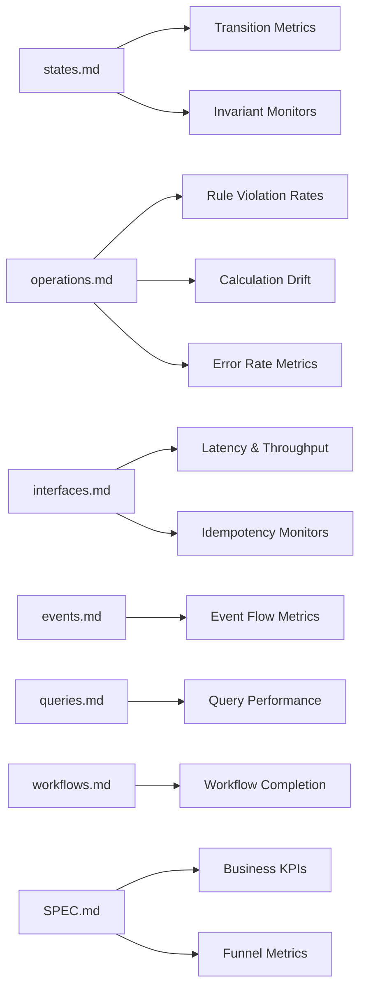

# Observability Pipeline: Documentation → Metrics

> How DomainSpec documentation maps to observable metrics.
> Each doc section produces specific metric obligations with deterministic derivation — the same way TEST-PIPELINE.md derives tests.

The inner loop (tests) validates that code matches the spec at build time.
The **outer loop** (observability) validates that the system behaves correctly in production — catching drift, business anomalies, and financial risk that tests cannot cover.

## Pipeline Overview



---

## The Three Metric Layers

Every DomainSpec feature produces metrics in three layers. Each layer answers a different question and has different consumers.

| Layer | Question | Derived From | Consumer | Alert Threshold |
|-------|----------|-------------|----------|-----------------|
| **Domain Fidelity** | Does production behavior match the spec? | states.md, operations.md, events.md | Engineering | Any violation = P0 |
| **Operational Health** | Is the system reliable and performant? | interfaces.md, queries.md, workflows.md | Platform/SRE | SLO breach = P1 |
| **Business Effectiveness** | Is the feature achieving its goal? | SPEC.md capabilities, STORIES.md journeys | Product/Business | Trend degradation = P2 |

### Why three layers

- **Domain Fidelity** catches bugs that tests missed — a state transition that should never happen in production, a rule bypassed by an edge case, a calculation that drifts from the formula.
- **Operational Health** catches infrastructure problems — latency spikes, throughput drops, dependency failures.
- **Business Effectiveness** catches product problems — conversion drops, revenue leaks, user friction — things that are technically correct but commercially wrong.

---

## Metric Derivation Rules

### From `states.md`

#### Rule O1: Transition Counters

**Every transition row = 1 counter metric.**

Each state machine transition documented in `states.md` produces a counter that tracks how often that transition occurs in production.

| Transition Table Row | Metric |
|---------------------|--------|
| `Created → Processing (ProcessPayment)` | `state_transition_total{feature, entity, from="Created", to="Processing", event="ProcessPayment"}` |

**Template:**
```
counter: {feature}.{entity}.transition.total
labels: from, to, event
increment: on every successful state transition
```

**Derived monitors:**
- **Invalid transition attempts** — counter for transitions NOT in the transition table. Any increment = domain fidelity violation.
- **Terminal state re-entry** — counter for attempts to transition from terminal states. Must remain 0.

```
counter: {feature}.{entity}.invalid_transition.total
labels: from, attempted_event, error_code
alert: any increment triggers P0 alert
```

#### Rule O2: State Distribution Gauge

**Every state machine = 1 distribution gauge.**

Track the current count of entities in each state. Validates that the system's population distribution matches expected steady-state ratios.

```
gauge: {feature}.{entity}.state_distribution
labels: state
```

**Derived monitors:**
- **State accumulation** — if entities pile up in a non-terminal state (e.g., PROCESSING grows unbounded), the system has a completion problem.
- **Terminal state ratio** — track `failed / (completed + failed)` over time. Trend increase = systemic issue.

#### Rule O3: Invariant Monitors

**Every invariant row = 1 runtime assertion metric.**

Invariants documented in `states.md` are checked at test time (TEST-PIPELINE rule 3), but they must also be monitored in production. Each invariant produces a gauge tracking violations.

| Invariant | Monitor |
|-----------|---------|
| `I1: status == Completed → gatewayRef != null` | Periodic scan: count entities where `status=Completed AND gatewayRef IS NULL`. Must be 0. |

```
gauge: {feature}.{entity}.invariant_violation
labels: invariant_id, expression
alert: any value > 0 triggers P0 alert
```

---

### From `operations.md`

#### Rule O4: Operation Execution Metrics

**Every operation = 4 base metrics.**

Each operation documented in `operations.md` produces:

| Metric | Type | Purpose |
|--------|------|---------|
| `{feature}.{operation}.executed.total` | counter | How often this operation runs |
| `{feature}.{operation}.succeeded.total` | counter | Successful completions |
| `{feature}.{operation}.failed.total` | counter | Failures by error code |
| `{feature}.{operation}.duration.seconds` | histogram | Execution latency distribution |

```
counter: {feature}.{operation}.executed.total
counter: {feature}.{operation}.succeeded.total
counter: {feature}.{operation}.failed.total
  labels: error_code, rule_violated
histogram: {feature}.{operation}.duration.seconds
  buckets: [0.01, 0.05, 0.1, 0.25, 0.5, 1, 2.5, 5, 10]
```

#### Rule O5: Rule Violation Rates

**Every rule = 1 violation counter.**

Each rule `R1`, `R2`, etc. documented in an operation produces a counter tracking how often it blocks execution in production. This validates that rules fire at expected rates.

| Rule | Metric |
|------|--------|
| `R1: amount.value > 0` | `{feature}.{operation}.rule_violation.total{rule="R1", expression="amount.value > 0"}` |

**Derived monitors:**
- **Rule never fires** — if a documented rule has 0 violations over a sustained period, either the system perfectly prevents invalid input (good) or the rule is dead code (bad). Flag for review.
- **Rule always fires** — if a rule has a violation rate > 50% of attempts, the upstream is sending invalid data consistently. Flag integration issue.

#### Rule O6: Calculation Drift Detection

**Every calculation = 1 drift monitor.**

Calculations (`C1`, `C2`, etc.) have documented formulas. The drift monitor compares the operation's computed result against a reference recalculation.

| Calculation | Monitor |
|-------------|---------|
| `C1: totalProfit = sum(statRecords.profit)` | Periodic: recompute C1 from source data, compare with stored result. Difference > 0 = drift. |
| `C4: makeup = applyMakeupPolicy(debt, profit, rakeback, split)` | Periodic: recompute makeup from inputs, compare with applied amount. |

```
gauge: {feature}.{calculation}.drift.absolute
  labels: calculation_id
  alert: any value != 0 triggers P1 alert

gauge: {feature}.{calculation}.drift.percentage
  labels: calculation_id
  alert: value > 0.01 (1%) triggers P0 alert
```

**Why this matters:** Calculation drift catches the most dangerous class of production bugs — the system appears to work correctly, but the numbers are wrong. In financial systems, this directly causes monetary loss.

#### Rule O7: Postcondition Verification

**Every postcondition = 1 async verification.**

Each postcondition bullet in an operation is verified after execution. This catches cases where the operation "succeeds" but leaves the system in an inconsistent state.

| Postcondition | Monitor |
|---------------|---------|
| "Settlement event created" | After GenerateSettlement: verify PAYOUT/MAKEUP_APPLIED record exists within 5s |
| "Email sent to candidate" | After ReviewCandidate(APPROVE): verify notification dispatched |

```
counter: {feature}.{operation}.postcondition.verified.total
  labels: postcondition_id
counter: {feature}.{operation}.postcondition.violated.total
  labels: postcondition_id
  alert: any increment triggers P1 alert
```

---

### From `interfaces.md`

#### Rule O8: Endpoint SLOs

**Every endpoint = latency + throughput + error rate SLOs.**

Each API endpoint documented in `interfaces.md` produces standard RED (Rate, Errors, Duration) metrics.

| Endpoint | Metrics |
|----------|---------|
| `POST /settlements` | request_rate, error_rate (by status code), p50/p95/p99 latency |

```
counter: http.request.total
  labels: method, path, status_code, feature
histogram: http.request.duration.seconds
  labels: method, path, feature
  buckets: [0.01, 0.05, 0.1, 0.25, 0.5, 1, 2.5, 5, 10]
```

**SLO template:**
```
availability: success_rate >= 99.9% over 30d rolling window
latency: p99 <= {threshold}ms (threshold per endpoint from interfaces.md)
```

#### Rule O9: Idempotency Monitors

**Every operation with documented idempotency rules = dedicated monitors.**

When `operations.md` documents idempotency constraints (e.g., "at most one PAYOUT per player per period"), the observability pipeline produces specific monitors.

| Idempotency Rule | Monitor |
|-----------------|---------|
| `R4: count(PAYOUT, playerId, endDate) <= 1` | Periodic scan: query for duplicates. Count > 0 = P0. |
| `R5: count(MAKEUP_APPLIED, playerId, endDate) <= 1` | Same pattern. |

```
gauge: {feature}.{operation}.idempotency_violation
  labels: rule_id, constraint
  alert: any value > 0 triggers P0 alert (indicates double-processing)

counter: {feature}.{operation}.idempotency_deduplicated.total
  labels: rule_id
  purpose: tracks how often deduplication logic prevents a repeat
```

**Financial impact estimation:**
```
monetary_exposure = idempotency_violation_count × avg_transaction_value
alert: monetary_exposure > 0 triggers P0 alert with estimated dollar impact
```

---

### From `events.md`

#### Rule O10: Event Flow Metrics

**Every event = producer + consumer lag metrics.**

Each domain event documented in `events.md` produces metrics tracking the full flow from emission to consumption.

| Event | Metrics |
|-------|---------|
| `PaymentCompleted` | emitted.total, consumed.total, consumer_lag.seconds |

```
counter: {feature}.event.emitted.total
  labels: event_type, producer
counter: {feature}.event.consumed.total
  labels: event_type, consumer
histogram: {feature}.event.consumer_lag.seconds
  labels: event_type, consumer
```

**Derived monitors:**
- **Event loss** — `emitted.total - consumed.total > threshold` over time window. Events are being dropped.
- **Consumer stall** — `consumer_lag.seconds > threshold`. Consumer is falling behind.
- **Phantom events** — `consumed.total > emitted.total`. Events appearing without a known producer = data integrity issue.

---

### From `queries.md`

#### Rule O11: Query Performance Metrics

**Every query = latency + result size + cache hit metrics.**

```
histogram: {feature}.query.duration.seconds
  labels: query_name, cache_hit
gauge: {feature}.query.result_size
  labels: query_name
counter: {feature}.query.cache.hit.total
counter: {feature}.query.cache.miss.total
```

**Derived monitors:**
- **Query degradation** — p95 latency trend increase over 7 days.
- **Result explosion** — result size growing beyond expected bounds (indicates missing pagination or filter).
- **Stale read** — cache age exceeds TTL without refresh.

---

### From `workflows.md`

#### Rule O12: Workflow Completion Metrics

**Every workflow = completion rate + step duration + compensation metrics.**

```
counter: {feature}.workflow.started.total
counter: {feature}.workflow.completed.total
counter: {feature}.workflow.failed.total
  labels: failed_at_step
counter: {feature}.workflow.compensated.total
  labels: compensated_step
histogram: {feature}.workflow.duration.seconds
histogram: {feature}.workflow.step.duration.seconds
  labels: step_name
```

---

### From `SPEC.md` capabilities

#### Rule O13: Business KPIs per Capability

**Every capability = at least 1 business effectiveness metric.**

Each capability documented in SPEC.md represents a user-facing behavior. The observability pipeline derives business metrics that validate whether the capability is achieving its intended outcome.

The derivation follows the capability's **business intent** (from SPEC overview) and its **acceptance criteria** (from STORIES.md):

| Capability Pattern | Metric Class | Derivation |
|-------------------|-------------|------------|
| Create/Submit (entity creation) | **Conversion funnel** | started → completed → rate |
| Review/Approve (decision workflow) | **Decision throughput** | submitted → decided, median time-to-decision |
| Calculate/Generate (computation) | **Accuracy & volume** | executions, drift from expected, monetary totals |
| Get/List (read operations) | **Engagement** | unique users, frequency, empty-result rate |
| Assign/Update (state modification) | **Churn & stability** | change frequency, reversal rate |
| Check/Validate (eligibility) | **Pass rate & fairness** | eligible/ineligible ratio, criteria distribution |

**Template:**
```
# For each capability in SPEC.md:
business_metric: {feature}.{capability}.{metric_name}
  type: counter | gauge | histogram
  business_question: "What does this metric answer?"
  healthy_range: {min}–{max} or trend direction
  alert: deviation from healthy range
```

#### Rule O14: Funnel Metrics from STORIES.md

**Every user journey with multiple steps = 1 funnel metric.**

User stories in STORIES.md that describe multi-step flows produce funnel metrics tracking drop-off at each step.

```
counter: {feature}.funnel.{journey}.step.total
  labels: step_name, outcome={completed|abandoned|error}

derived: {feature}.funnel.{journey}.conversion_rate
  formula: step_N_completed / step_1_started
  window: 7d rolling
```

---

## Financial Integrity Metrics

Features that handle money (`pillar: finance` in SPEC frontmatter) have additional mandatory metrics beyond the standard derivation rules.

### Rule O15: Transaction Integrity

**Every monetary operation = balance reconciliation metrics.**

```yaml
# Mandatory for finance-pillar features:
reconciliation:
  metric: {feature}.reconciliation.balance_mismatch
  type: gauge
  check: |
    computed_balance = replay all transactions from event log
    stored_balance = current balance in database
    mismatch = |computed_balance - stored_balance|
  frequency: hourly
  alert: mismatch > 0 → P0

duplicate_detection:
  metric: {feature}.transaction.duplicate.total
  type: counter
  check: |
    group transactions by idempotency_key
    count groups with size > 1
  alert: any increment → P0

monetary_exposure:
  metric: {feature}.exposure.amount
  type: gauge
  unit: currency
  check: sum of potentially duplicated transaction amounts
  alert: exposure > 0 → P0 with dollar amount in alert body
```

### Rule O16: Settlement Cycle Metrics

**Every settlement/payout operation = cycle-specific monitors.**

```yaml
settlement_cycle:
  total_settlements: counter
  total_payout_amount: counter (sum of payouts)
  total_makeup_applied: counter (sum of debt recovered)
  avg_settlement_value: gauge
  settlement_error_rate: ratio (failed / total)
  
  # Drift detection:
  profit_recalculation_drift: gauge
    check: recompute all C1-C4 calculations, compare with stored values
    frequency: after each settlement batch
    alert: drift > 0 → P0
```

---

## Observability Derivation Summary

| Source | Metric Rule | Layer | Count per Source Row |
|--------|------------|-------|---------------------|
| states.md transition row | O1: Transition Counter | Domain Fidelity | 1 counter + 1 invalid counter |
| states.md (per entity) | O2: State Distribution | Domain Fidelity | 1 gauge per state |
| states.md invariant row | O3: Invariant Monitor | Domain Fidelity | 1 gauge |
| operations.md operation | O4: Execution Metrics | Operational Health | 4 metrics (executed, succeeded, failed, duration) |
| operations.md rule | O5: Rule Violation Rate | Domain Fidelity | 1 counter |
| operations.md calculation | O6: Calculation Drift | Domain Fidelity | 2 gauges (absolute, percentage) |
| operations.md postcondition | O7: Postcondition Verification | Domain Fidelity | 2 counters (verified, violated) |
| interfaces.md endpoint | O8: Endpoint SLOs | Operational Health | 2 metrics (request counter, latency histogram) |
| interfaces.md idempotency rule | O9: Idempotency Monitor | Financial Integrity | 2 metrics (violation gauge, dedup counter) |
| events.md event | O10: Event Flow | Operational Health | 3 metrics (emitted, consumed, lag) |
| queries.md query | O11: Query Performance | Operational Health | 4 metrics (duration, result size, cache hit/miss) |
| workflows.md workflow | O12: Workflow Completion | Operational Health | 5 metrics (started, completed, failed, compensated, duration) |
| SPEC.md capability | O13: Business KPI | Business Effectiveness | 1+ per capability |
| STORIES.md journey | O14: Funnel Metric | Business Effectiveness | 1 funnel per journey |
| finance-pillar operations | O15: Transaction Integrity | Financial Integrity | 3 metrics (reconciliation, duplicate, exposure) |
| finance-pillar settlements | O16: Settlement Cycle | Financial Integrity | 6+ metrics |

---

## Metric Naming Convention

```
{feature}.{concept}.{metric_name}

Examples:
  financial_settlement.GenerateSettlement.executed.total
  financial_settlement.GenerateSettlement.rule_violation.total{rule="R4"}
  financial_settlement.PayoutTransaction.idempotency_violation
  player_onboarding.SubmitCandidate.funnel.conversion_rate
  player_onboarding.CandidateStatus.state_distribution{state="SUBMITTED"}
  player_stats.RecordPlayerStats.calculation_drift.absolute{calc="C1"}
```

Labels follow Prometheus conventions: `snake_case`, low cardinality, bounded set.

---

## Traceability Format

Metrics reference their documentation source, mirroring the test traceability in TEST-PIPELINE.md:

```yaml
# @source features/financial-settlement/operations.md#GenerateSettlement
# @rule O9: Idempotency Monitor
# @constraint R4: count(PAYOUT, playerId, endDate) <= 1
metric: financial_settlement.GenerateSettlement.idempotency_violation
type: gauge
labels:
  rule_id: R4
  constraint: "count(PAYOUT, playerId, endDate) <= 1"
alert:
  condition: value > 0
  severity: P0
  runbook: "Investigate duplicate payouts. Check settlement event table for matching (playerId, endDate) pairs."
```

This enables:
- **Doc change → find affected metrics** (grep for `@source`)
- **Metric alert → find the spec** (follow `@source` + `@rule`)
- **Coverage audit** — verify every critical doc row has an observability obligation
- **Alert runbook** — each alert links back to the domain documentation for investigation context

---

## Alert Severity Mapping

| Severity | Trigger | Response Time | Examples |
|----------|---------|---------------|---------|
| **P0** | Domain fidelity violation or financial exposure | < 15 minutes | Idempotency violation, invariant broken, calculation drift > 1%, duplicate transactions |
| **P1** | Operational SLO breach or postcondition failure | < 1 hour | Availability < 99.9%, p99 > threshold, postcondition violated, event loss |
| **P2** | Business effectiveness degradation | < 24 hours | Conversion rate drop > 10%, funnel abandonment spike, unusual rule violation pattern |
| **P3** | Informational trend | Weekly review | Query latency trending up, cache hit ratio declining, state accumulation growing |

---

## Relationship to Existing Pipeline Stages

```mermaid
flowchart TB
    subgraph Inner Loop — Build Time
        SPEC[SPEC.md + Aspects] --> TEST[TEST-PIPELINE.md]
        TEST --> IMPL[Implementation]
        IMPL --> VERIFY[Verify Feature]
    end
    
    subgraph Outer Loop — Runtime
        SPEC --> OBS[OBSERVABILITY.md]
        OBS --> INSTRUMENT[Instrument Code]
        INSTRUMENT --> MONITOR[Monitor Production]
        MONITOR --> DRIFT{Drift Detected?}
        DRIFT -->|Domain Fidelity| SPEC
        DRIFT -->|Operational| INSTRUMENT
        DRIFT -->|Business| SPEC
    end
    
    VERIFY --> INSTRUMENT
    MONITOR --> VERIFY
```

The outer loop feeds back into the inner loop:
- **Domain fidelity violations** mean the spec or the code is wrong → update docs, re-derive tests, re-implement.
- **Operational issues** mean the infrastructure needs attention → fix, re-verify.
- **Business effectiveness gaps** mean the feature design is wrong → evolve the spec, re-plan.
