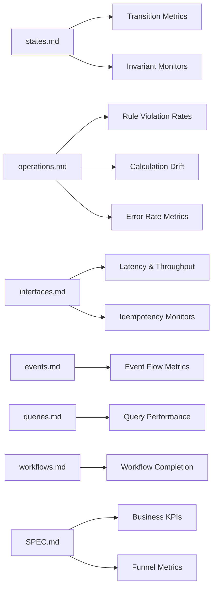

# Observability Pipeline: Documentation → Metrics

> How DomainSpec documentation maps to observable metrics.
> Each doc section produces specific metric obligations with deterministic derivation — the same way TEST-PIPELINE.md derives tests.

The inner loop (tests) validates that code matches the spec at build time.
The **outer loop** (observability) validates that the system behaves correctly in production — catching drift, business anomalies, and financial risk that tests cannot cover.

## OTel Instrumentation Standard

All metrics use the [OpenTelemetry API](https://opentelemetry.io/) for instrumentation. OTel is vendor-neutral — metrics export to Prometheus, Grafana, Datadog, or any OTLP-compatible backend without code changes.

**Meter scope:** One Meter per project, named after the project (e.g., `poker-team`). The Meter carries the project identity; metric names carry feature/module identity.

**Instruments:**

| OTel Instrument | Use Case | DomainSpec Mapping |
|-----------------|----------|-------------------|
| `Counter` | Monotonically increasing count | Transitions, invocations, rule violations, events |
| `UpDownCounter` | Value that goes up and down | State population, active workflows |
| `Histogram` | Distribution of values | Duration, drift magnitude, result sizes |
| `Gauge` | Point-in-time snapshot | Invariant violations, exposure amounts, reconciliation mismatches |

**Attributes** (not labels): Low-cardinality key-value pairs attached to each measurement. Feature, entity, operation, and rule are attributes — not embedded in the metric name.

**Reuse OTel Semantic Conventions** where they exist:
- HTTP: `http.server.request.duration`, `http.server.active_requests` ([HTTP semconv](https://opentelemetry.io/docs/specs/semconv/http/))
- Messaging: `messaging.process.duration` ([Messaging semconv](https://opentelemetry.io/docs/specs/semconv/messaging/))
- Custom domain metrics use the naming convention defined in [Metric Naming Convention](#metric-naming-convention).

## Pipeline Overview



---

## The Three Metric Layers

Every DomainSpec feature produces metrics in three layers. Each layer answers a different question and has different consumers.

| Layer | Question | Derived From | Consumer | Alert Threshold |
|-------|----------|-------------|----------|-----------------|
| **Domain Fidelity** | Does production behavior match the spec? | states.md, operations.md, events.md | Engineering | Any violation = P0 |
| **Operational Health** | Is the system reliable and performant? | interfaces.md, queries.md, workflows.md | Platform/SRE | SLO breach = P1 |
| **Business Effectiveness** | Is the feature achieving its goal? | SPEC.md capabilities, STORIES.md journeys | Product/Business | Trend degradation = P2 |

### Why three layers

- **Domain Fidelity** catches bugs that tests missed — a state transition that should never happen in production, a rule bypassed by an edge case, a calculation that drifts from the formula.
- **Operational Health** catches infrastructure problems — latency spikes, throughput drops, dependency failures.
- **Business Effectiveness** catches product problems — conversion drops, revenue leaks, user friction — things that are technically correct but commercially wrong.

---

## Metric Derivation Rules

### From `states.md`

#### Rule O1: Transition Counters

**Every transition row = 1 counter metric.**

Each state machine transition documented in `states.md` produces a counter that tracks how often that transition occurs in production.

| Transition Table Row | Metric |
|---------------------|--------|
| `Created → Processing (ProcessPayment)` | `state.transition` with attributes `{feature, entity, from="Created", to="Processing", event="ProcessPayment"}` |

**Template:**
```yaml
- name: state.transition
  instrument: Counter
  unit: "{transition}"
  description: Successful state transitions
  attributes: [feature, entity, from, to, event]
```

**Derived monitors:**
- **Invalid transition attempts** — counter for transitions NOT in the transition table. Any increment = domain fidelity violation.
- **Terminal state re-entry** — counter for attempts to transition from terminal states. Must remain 0.

```yaml
- name: state.invalid_transition
  instrument: Counter
  unit: "{attempt}"
  attributes: [feature, entity, from, attempted_event, error_code]
  alert: any increment triggers P0 alert
```

#### Rule O2: State Distribution Gauge

**Every state machine = 1 distribution gauge.**

Track the current count of entities in each state. Validates that the system's population distribution matches expected steady-state ratios.

```yaml
- name: state.population
  instrument: UpDownCounter
  unit: "{entity}"
  description: Current count of entities per state
  attributes: [feature, entity, state]
```

**Derived monitors:**
- **State accumulation** — if entities pile up in a non-terminal state (e.g., PROCESSING grows unbounded), the system has a completion problem.
- **Terminal state ratio** — track `failed / (completed + failed)` over time. Trend increase = systemic issue.

#### Rule O3: Invariant Monitors

**Every invariant row = 1 runtime assertion metric.**

Invariants documented in `states.md` are checked at test time (TEST-PIPELINE rule 3), but they must also be monitored in production. Each invariant produces a gauge tracking violations.

| Invariant | Monitor |
|-----------|---------|
| `I1: status == Completed → gatewayRef != null` | Periodic scan: count entities where `status=Completed AND gatewayRef IS NULL`. Must be 0. |

```yaml
- name: invariant.violation
  instrument: Gauge
  unit: "{entity}"
  description: Count of entities violating invariant (must be 0)
  attributes: [feature, entity, invariant_id, expression]
  alert: any value > 0 triggers P0 alert
```

---

### From `operations.md`

#### Rule O4: Operation Execution Metrics

**Every operation = 4 base metrics.**

Each operation documented in `operations.md` produces:

| Metric | Type | Purpose |
|--------|------|---------|
| `{feature}.{operation}.executed.total` | Counter | How often this operation runs |
| `{feature}.{operation}.succeeded.total` | Counter | Successful completions |
| `{feature}.{operation}.failed.total` | Counter | Failures by error code |
| `{feature}.{operation}.duration.seconds` | Histogram | Execution latency distribution |

```yaml
- name: operation.invocation
  instrument: Counter
  unit: "{invocation}"
  description: Operation execution count by result
  attributes: [feature, operation, result]  # result: success | error

- name: operation.duration
  instrument: Histogram
  unit: "s"
  description: Operation execution latency
  attributes: [feature, operation]
  bucket_advisory: [0.01, 0.05, 0.1, 0.25, 0.5, 1, 2.5, 5, 10]
```

#### Rule O5: Rule Violation Rates

**Every rule = 1 violation counter.**

Each rule `R1`, `R2`, etc. documented in an operation produces a counter tracking how often it blocks execution in production. This validates that rules fire at expected rates.

| Rule | Metric |
|------|--------|
| `R1: amount.value > 0` | `rule.violation` with attributes `{feature, operation, rule="R1", expression="amount.value > 0"}` |

**Derived monitors:**
- **Rule never fires** — if a documented rule has 0 violations over a sustained period, either the system perfectly prevents invalid input (good) or the rule is dead code (bad). Flag for review.
- **Rule always fires** — if a rule has a violation rate > 50% of attempts, the upstream is sending invalid data consistently. Flag integration issue.

#### Rule O6: Calculation Drift Detection

**Every calculation = 1 drift monitor.**

Calculations (`C1`, `C2`, etc.) have documented formulas. The drift monitor compares the operation's computed result against a reference recalculation.

| Calculation | Monitor |
|-------------|---------|
| `C1: totalProfit = sum(statRecords.profit)` | Periodic: recompute C1 from source data, compare with stored result. Difference > 0 = drift. |
| `C4: makeup = applyMakeupPolicy(debt, profit, rakeback, split)` | Periodic: recompute makeup from inputs, compare with applied amount. |

```yaml
- name: calculation.drift
  instrument: Histogram
  unit: "{unit}"  # currency unit for financial, raw for others
  description: Absolute drift between computed and stored value
  attributes: [feature, calculation_id]

- name: calculation.drift.alert
  instrument: Gauge
  unit: "1"  # ratio
  description: Percentage drift — triggers P0 when > 1%
  attributes: [feature, calculation_id]
```

**Why this matters:** Calculation drift catches the most dangerous class of production bugs — the system appears to work correctly, but the numbers are wrong. In financial systems, this directly causes monetary loss.

#### Rule O7: Postcondition Verification

**Every postcondition = 1 async verification.**

Each postcondition bullet in an operation is verified after execution. This catches cases where the operation "succeeds" but leaves the system in an inconsistent state.

| Postcondition | Monitor |
|---------------|---------|
| "Settlement event created" | After GenerateSettlement: verify PAYOUT/MAKEUP_APPLIED record exists within 5s |
| "Email sent to candidate" | After ReviewCandidate(APPROVE): verify notification dispatched |

```yaml
- name: postcondition.check
  instrument: Counter
  unit: "{check}"
  description: Postcondition verification outcomes
  attributes: [feature, operation, postcondition_id, result]  # result: verified | violated
  alert: any result=violated increment triggers P1 alert
```

---

### From `interfaces.md`

#### Rule O8: Endpoint SLOs

**Every endpoint = latency + throughput + error rate SLOs.**

Each API endpoint documented in `interfaces.md` produces standard RED (Rate, Errors, Duration) metrics.

| Endpoint | Metrics |
|----------|---------|
| `POST /settlements` | request_rate, error_rate (by status code), p50/p95/p99 latency |

Reuse [OTel HTTP semantic conventions](https://opentelemetry.io/docs/specs/semconv/http/) directly:

```yaml
# Standard OTel HTTP semconv — no custom metrics needed
- name: http.server.request.duration   # OTel semconv
  instrument: Histogram
  unit: "s"
  attributes: [http.request.method, url.path, http.response.status_code, feature]

- name: http.server.active_requests    # OTel semconv
  instrument: UpDownCounter
  unit: "{request}"
  attributes: [http.request.method, url.path, feature]
```

Add `feature` as a custom attribute to standard HTTP instruments for per-feature SLO slicing.

**SLO template:**
```
availability: success_rate >= 99.9% over 30d rolling window
latency: p99 <= {threshold}ms (threshold per endpoint from interfaces.md)
```

#### Rule O9: Idempotency Monitors

**Every operation with documented idempotency rules = dedicated monitors.**

When `operations.md` documents idempotency constraints (e.g., "at most one PAYOUT per player per period"), the observability pipeline produces specific monitors.

| Idempotency Rule | Monitor |
|-----------------|---------|
| `R4: count(PAYOUT, playerId, endDate) <= 1` | Periodic scan: query for duplicates. Count > 0 = P0. |
| `R5: count(MAKEUP_APPLIED, playerId, endDate) <= 1` | Same pattern. |

```yaml
- name: idempotency.violation
  instrument: Gauge
  unit: "{violation}"
  description: Detected idempotency constraint breaches
  attributes: [feature, operation, rule_id, constraint]
  alert: any value > 0 triggers P0 alert (indicates double-processing)

- name: idempotency.dedup
  instrument: Counter
  unit: "{dedup}"
  description: Deduplication logic prevented a repeat execution
  attributes: [feature, operation, rule_id]
```

**Financial impact estimation:**
```yaml
- name: exposure.amount
  instrument: Gauge
  unit: "{currency_minor}"  # e.g. BRL cents
  description: Estimated monetary exposure from idempotency violations
  attributes: [feature, operation]
  alert: value > 0 triggers P0 alert with estimated amount in alert body
```

---

### From `events.md`

#### Rule O10: Event Flow Metrics

**Every event = producer + consumer lag metrics.**

Each domain event documented in `events.md` produces metrics tracking the full flow from emission to consumption.

| Event | Metrics |
|-------|---------|
| `PaymentCompleted` | emitted.total, consumed.total, consumer_lag.seconds |

```yaml
- name: event.emit
  instrument: Counter
  unit: "{event}"
  attributes: [feature, event_type, producer]

- name: event.consume
  instrument: Counter
  unit: "{event}"
  attributes: [feature, event_type, consumer]

- name: event.consumer.lag
  instrument: Histogram
  unit: "s"
  attributes: [feature, event_type, consumer]
```

**Derived monitors:**
- **Event loss** — `emitted.total - consumed.total > threshold` over time window. Events are being dropped.
- **Consumer stall** — `consumer_lag.seconds > threshold`. Consumer is falling behind.
- **Phantom events** — `consumed.total > emitted.total`. Events appearing without a known producer = data integrity issue.

---

### From `queries.md`

#### Rule O11: Query Performance Metrics

**Every query = latency + result size + cache hit metrics.**

```yaml
- name: query.duration
  instrument: Histogram
  unit: "s"
  attributes: [feature, query_name, cache_hit]

- name: query.result_size
  instrument: Gauge
  unit: "{row}"
  attributes: [feature, query_name]

- name: query.cache
  instrument: Counter
  unit: "{operation}"
  attributes: [feature, query_name, result]  # result: hit | miss
```

**Derived monitors:**
- **Query degradation** — p95 latency trend increase over 7 days.
- **Result explosion** — result size growing beyond expected bounds (indicates missing pagination or filter).
- **Stale read** — cache age exceeds TTL without refresh.

---

### From `workflows.md`

#### Rule O12: Workflow Completion Metrics

**Every workflow = completion rate + step duration + compensation metrics.**

```yaml
- name: workflow.invocation
  instrument: Counter
  unit: "{invocation}"
  attributes: [feature, workflow, result]  # result: completed | failed | compensated

- name: workflow.duration
  instrument: Histogram
  unit: "s"
  attributes: [feature, workflow]

- name: workflow.step.duration
  instrument: Histogram
  unit: "s"
  attributes: [feature, workflow, step_name]

- name: workflow.failed
  instrument: Counter
  unit: "{failure}"
  attributes: [feature, workflow, failed_at_step]
```

---

### From `SPEC.md` capabilities

#### Rule O13: Business KPIs per Capability

**Every capability = at least 1 business effectiveness metric.**

Each capability documented in SPEC.md represents a user-facing behavior. The observability pipeline derives business metrics that validate whether the capability is achieving its intended outcome.

The derivation follows the capability's **business intent** (from SPEC overview) and its **acceptance criteria** (from STORIES.md):

| Capability Pattern | Metric Class | Derivation |
|-------------------|-------------|------------|
| Create/Submit (entity creation) | **Conversion funnel** | started → completed → rate |
| Review/Approve (decision workflow) | **Decision throughput** | submitted → decided, median time-to-decision |
| Calculate/Generate (computation) | **Accuracy & volume** | executions, drift from expected, monetary totals |
| Get/List (read operations) | **Engagement** | unique users, frequency, empty-result rate |
| Assign/Update (state modification) | **Churn & stability** | change frequency, reversal rate |
| Check/Validate (eligibility) | **Pass rate & fairness** | eligible/ineligible ratio, criteria distribution |

**Template:**
```yaml
# For each capability in SPEC.md:
- name: business.{metric_name}
  instrument: Counter | Gauge | Histogram
  unit: "{unit}"
  attributes: [feature, capability]
  business_question: "What does this metric answer?"
  healthy_range: "{min}–{max} or trend direction"
  alert: deviation from healthy range
```

#### Rule O14: Funnel Metrics from STORIES.md

**Every user journey with multiple steps = 1 funnel metric.**

User stories in STORIES.md that describe multi-step flows produce funnel metrics tracking drop-off at each step.

```yaml
- name: funnel.step
  instrument: Counter
  unit: "{step}"
  attributes: [feature, journey, step_name, outcome]  # outcome: completed | abandoned | error

# Derived:
- name: funnel.conversion_rate
  instrument: Gauge
  unit: "1"  # ratio
  attributes: [feature, journey]
  formula: step_N_completed / step_1_started
  window: 7d rolling
```

---

## Financial Integrity Metrics

Features that handle money (`pillar: finance` in SPEC frontmatter) have additional mandatory metrics beyond the standard derivation rules.

### Rule O15: Transaction Integrity

**Every monetary operation = balance reconciliation metrics.**

```yaml
# Mandatory for finance-pillar features:
- name: reconciliation.mismatch
  instrument: Gauge
  unit: "{currency_minor}"
  description: Absolute difference between computed and stored balance
  attributes: [feature, entity]
  check: |
    computed_balance = replay all transactions from event log
    stored_balance = current balance in database
    mismatch = |computed_balance - stored_balance|
  frequency: hourly
  alert: mismatch > 0 → P0

- name: transaction.duplicate
  instrument: Counter
  unit: "{duplicate}"
  description: Detected duplicate transactions
  attributes: [feature, transaction_type]
  check: |
    group transactions by idempotency_key
    count groups with size > 1
  alert: any increment → P0

- name: exposure.amount
  instrument: Gauge
  unit: "{currency_minor}"
  description: Total monetary exposure from detected anomalies
  attributes: [feature]
  alert: exposure > 0 → P0 with amount in alert body
```

### Rule O16: Settlement Cycle Metrics

**Every settlement/payout operation = cycle-specific monitors.**

```yaml
- name: settlement.cycle.invocations
  instrument: Counter
  unit: "{settlement}"
  attributes: [feature]

- name: settlement.cycle.payout_amount
  instrument: Counter
  unit: "{currency_minor}"
  attributes: [feature]

- name: settlement.cycle.makeup_applied
  instrument: Counter
  unit: "{currency_minor}"
  attributes: [feature]

- name: settlement.cycle.avg_value
  instrument: Gauge
  unit: "{currency_minor}"
  attributes: [feature]

- name: settlement.cycle.error_rate
  instrument: Gauge
  unit: "1"  # ratio: failed / total
  attributes: [feature]

# Drift detection:
- name: settlement.recalculation.drift
  instrument: Gauge
  unit: "{currency_minor}"
  description: Drift between recomputed and stored settlement values
  attributes: [feature, calculation_id]
  check: recompute all C1-C4 calculations, compare with stored values
  frequency: after each settlement batch
  alert: drift > 0 → P0
```

---

## Observability Derivation Summary

| Source | Metric Rule | Layer | Count per Source Row |
|--------|------------|-------|---------------------|
| states.md transition row | O1: Transition Counter | Domain Fidelity | 1 counter + 1 invalid counter |
| states.md (per entity) | O2: State Distribution | Domain Fidelity | 1 gauge per state |
| states.md invariant row | O3: Invariant Monitor | Domain Fidelity | 1 gauge |
| operations.md operation | O4: Execution Metrics | Operational Health | 4 metrics (executed, succeeded, failed, duration) |
| operations.md rule | O5: Rule Violation Rate | Domain Fidelity | 1 counter |
| operations.md calculation | O6: Calculation Drift | Domain Fidelity | 2 gauges (absolute, percentage) |
| operations.md postcondition | O7: Postcondition Verification | Domain Fidelity | 2 counters (verified, violated) |
| interfaces.md endpoint | O8: Endpoint SLOs | Operational Health | 2 metrics (request counter, latency histogram) |
| interfaces.md idempotency rule | O9: Idempotency Monitor | Financial Integrity | 2 metrics (violation gauge, dedup counter) |
| events.md event | O10: Event Flow | Operational Health | 3 metrics (emitted, consumed, lag) |
| queries.md query | O11: Query Performance | Operational Health | 4 metrics (duration, result size, cache hit/miss) |
| workflows.md workflow | O12: Workflow Completion | Operational Health | 5 metrics (started, completed, failed, compensated, duration) |
| SPEC.md capability | O13: Business KPI | Business Effectiveness | 1+ per capability |
| STORIES.md journey | O14: Funnel Metric | Business Effectiveness | 1 funnel per journey |
| finance-pillar operations | O15: Transaction Integrity | Financial Integrity | 3 metrics (reconciliation, duplicate, exposure) |
| finance-pillar settlements | O16: Settlement Cycle | Financial Integrity | 6+ metrics |

---

## Metric Naming Convention

Metric names follow [OTel Naming Guidelines](https://opentelemetry.io/docs/specs/semconv/general/metrics/):

- **Dots as separators** — `state.transition`, not `state_transition`
- **Singular nouns** — `event.emit`, not `events.emitted`
- **No units in names** — unit is a separate field on the instrument
- **No feature in name** — feature is an attribute, not a name prefix

```
Pattern: {domain_area}.{metric_semantic_name}

Standard OTel (reused as-is):
  http.server.request.duration           # OTel HTTP semconv
  http.server.active_requests            # OTel HTTP semconv
  messaging.process.duration             # OTel Messaging semconv

Custom DomainSpec instruments:
  state.transition                       # attrs: feature, entity, from, to, event
  state.population                       # attrs: feature, entity, state
  invariant.violation                    # attrs: feature, entity, invariant_id
  operation.invocation                   # attrs: feature, operation, result
  operation.duration                     # attrs: feature, operation
  rule.violation                         # attrs: feature, operation, rule_id
  calculation.drift                      # attrs: feature, calculation_id
  postcondition.check                    # attrs: feature, operation, postcondition_id, result
  idempotency.violation                  # attrs: feature, operation, rule_id
  event.emit                             # attrs: feature, event_type
  event.consume                          # attrs: feature, event_type, consumer
  query.duration                         # attrs: feature, query_name
  workflow.invocation                    # attrs: feature, workflow, result
  funnel.step                            # attrs: feature, journey, step_name, outcome
  reconciliation.mismatch                # attrs: feature, entity
  exposure.amount                        # attrs: feature
```

**Meter scope:** `{project-name}` (e.g., `poker-team`). Configured once in the OTel SDK setup. All instruments created from this Meter inherit the project identity.

**Attribute conventions:**
- `feature`: kebab-case feature ID from SPEC frontmatter (e.g., `financial-settlement`)
- `operation`, `entity`, `workflow`, `query_name`: PascalCase concept name from docs (e.g., `GenerateSettlement`)
- `rule_id`, `invariant_id`, `calculation_id`: doc reference ID (e.g., `R4`, `I1`, `C1`)
- `result`: bounded enum — `success | error` for operations, `verified | violated` for postconditions, `hit | miss` for cache
- `state`, `from`, `to`: exact state names from `states.md`

All attributes are low-cardinality and bounded.

---

## Traceability Format

Metrics reference their documentation source, mirroring the test traceability in TEST-PIPELINE.md:

```yaml
# @source features/financial-settlement/operations.md#GenerateSettlement
# @rule O9: Idempotency Monitor
# @constraint R4: count(PAYOUT, playerId, endDate) <= 1
- name: idempotency.violation
  instrument: Gauge
  unit: \"{violation}\"
  attributes:
    feature: financial-settlement
    operation: GenerateSettlement
    rule_id: R4
    constraint: \"count(PAYOUT, playerId, endDate) <= 1\"
  alert:
    condition: value > 0
    severity: P0
    runbook: \"Investigate duplicate payouts. Check settlement event table for matching (playerId, endDate) pairs.\"
```

This enables:
- **Doc change → find affected metrics** (grep for `@source`)
- **Metric alert → find the spec** (follow `@source` + `@rule`)
- **Coverage audit** — verify every critical doc row has an observability obligation
- **Alert runbook** — each alert links back to the domain documentation for investigation context

---

## Alert Severity Mapping

| Severity | Trigger | Response Time | Examples |
|----------|---------|---------------|---------|
| **P0** | Domain fidelity violation or financial exposure | < 15 minutes | Idempotency violation, invariant broken, calculation drift > 1%, duplicate transactions |
| **P1** | Operational SLO breach or postcondition failure | < 1 hour | Availability < 99.9%, p99 > threshold, postcondition violated, event loss |
| **P2** | Business effectiveness degradation | < 24 hours | Conversion rate drop > 10%, funnel abandonment spike, unusual rule violation pattern |
| **P3** | Informational trend | Weekly review | Query latency trending up, cache hit ratio declining, state accumulation growing |

---

## Relationship to Existing Pipeline Stages

```mermaid
flowchart TB
    subgraph Inner Loop — Build Time
        SPEC[SPEC.md + Aspects] --> TEST[TEST-PIPELINE.md]
        TEST --> IMPL[Implementation]
        IMPL --> VERIFY[Verify Feature]
    end
    
    subgraph Outer Loop — Runtime
        SPEC --> OBS[OBSERVABILITY.md]
        OBS --> INSTRUMENT[Instrument Code]
        INSTRUMENT --> MONITOR[Monitor Production]
        MONITOR --> DRIFT{Drift Detected?}
        DRIFT -->|Domain Fidelity| SPEC
        DRIFT -->|Operational| INSTRUMENT
        DRIFT -->|Business| SPEC
    end
    
    VERIFY --> INSTRUMENT
    MONITOR --> VERIFY
```

The outer loop feeds back into the inner loop:
- **Domain fidelity violations** mean the spec or the code is wrong → update docs, re-derive tests, re-implement.
- **Operational issues** mean the infrastructure needs attention → fix, re-verify.
- **Business effectiveness gaps** mean the feature design is wrong → evolve the spec, re-plan.
