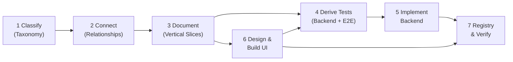

# domainspec

> Think first, code second. Understand the domain before writing a single line of code.

Most software problems are not caused by bad code. They are caused by building the wrong thing — misunderstood business rules, missing edge cases, contradictory behavior between systems. Code written before the domain is understood has to be rewritten once understanding arrives.

**domainspec** is a framework for documenting what your system does before you build it. It gives you a structured vocabulary, consistent templates, and a clear pipeline that turns domain documentation into formal specifications, tests, backend code, frontend UI, and verification — in that order.

---

## Table of Contents

- [The Pipeline at a Glance](#the-pipeline-at-a-glance)
- [Quick Start](#quick-start)
- [Stage 1 — Classify Concepts (Taxonomy)](#stage-1--classify-concepts-with-the-taxonomy)
- [Stage 2 — Connect Concepts (Relationships)](#stage-2--connect-concepts-with-relationships)
- [Stage 3 — Document Features (Vertical Slices)](#stage-3--structure-documentation-as-vertical-slices)
- [Stage 4 — Derive Tests](#stage-4--derive-tests-from-documentation)
- [Stage 5 — Implement Backend](#stage-5--implement-backend-from-formal-specifications)
- [Stage 6 — Design & Build UI](#stage-6--design--build-ui)
- [Stage 7 — Maintain the Global Registry](#stage-7--maintain-the-global-registry)
- [Copilot Integration](#copilot-integration)
  - [Installation](#installation)
  - [Skills Reference](#skills-reference)
  - [Agents Reference](#agents-reference)
  - [Intelligent Context Discovery](#intelligent-context-discovery)
  - [GSD Delegation](#gsd-delegation)
- [Templates](#templates)
- [Examples](#examples)
- [Reference](#reference)

---

## The Pipeline at a Glance



Each stage depends on the previous. You cannot write meaningful tests without formal specifications, and you cannot implement correctly without tests. DomainSpec makes skipping steps visible and deliberate.

| Stage                | Input                         | Output                                                  |
| -------------------- | ----------------------------- | ------------------------------------------------------- |
| 1. Classify          | Business knowledge            | Typed concept inventory                                 |
| 2. Connect           | Concept inventory             | Navigable knowledge graph                               |
| 3. Document          | Knowledge graph               | Feature vertical slices (SPEC + aspect files + stories) |
| 4. Derive Tests      | Aspect docs + UI-SPEC         | Backend TEST-SPEC + Playwright E2E scaffold             |
| 5. Implement Backend | TEST-SPEC + aspect docs       | Production code + passing tests                         |
| 6. Design & Build UI | UI-ARCHITECTURE + aspect docs | UI-SPEC + frontend pages + E2E tests                    |
| 7. Maintain Registry | All SPEC.md concept tables    | Global registry, glossary, verification verdicts        |

---

## Quick Start

```bash
# 1. Install framework into your project
cp -r domainspec/ your-project/

# 2. Install Copilot agent pack (agents, skills, MCP Playwright)
bash domainspec/copilot/install.sh

# 3. Bootstrap docs structure
cp -r domainspec/starter/ your-project/docs/

# 4. Create your first feature
mkdir your-project/docs/features/your-feature
cp domainspec/templates/SPEC.md your-project/docs/features/your-feature/
```

Then use the pipeline: write SPEC.md → add aspect files → generate tests → implement → verify.

For full installation details, see [copilot/INSTALL.md](copilot/INSTALL.md).

---

## Stage 1 — Classify Concepts with the Taxonomy

The first thing to understand is how DomainSpec classifies domain knowledge. Every concept in your system belongs to exactly one of 13 meta-types, organized into four categories.

These categories reflect the fundamental questions every system must answer:

| Question                        | Category       | What it contains                                      |
| ------------------------------- | -------------- | ----------------------------------------------------- |
| What things exist?              | **Structural** | Entity, Value Object, Enum                            |
| What happens?                   | **Behavioral** | Operation, Query, Calculation, Rule, Policy, Workflow |
| How do parts communicate?       | **Connective** | Interface, Event, Mapping                             |
| How do things change over time? | **Lifecycle**  | State Machine                                         |

### Structural — What things exist

These are the **nouns** of your domain.

**Entity** — An object with a unique identity that persists over time. Two entities can have identical values and still be different things. Entities have lifecycles, can be acted on by operations, and are tracked in state machines.

> _Examples:_ Order, PaymentTransaction, User, Invoice

**Value Object** — An immutable concept defined entirely by its content, with no identity. Two instances with the same fields are interchangeable. Value objects are often shared across features.

> _Examples:_ Money (amount + currency), Address, DateRange, Email

**Enum / Type** — A fixed, finite set of named values. They constrain field values and drive branching logic.

> _Examples:_ OrderStatus, PaymentMethod, UserRole, Currency

### Behavioral — What happens

These are the **verbs** of your domain.

**Operation** — A business action that changes state. Operations have input, validate rules, run calculations, transition entities, emit events, and define error modes. Every meaningful mutation in the system is an operation.

> _Examples:_ ProcessPayment, CreateOrder, CancelSubscription

**Query** — A read that returns data without side effects. Calling it twice produces the same result and nothing changes.

> _Examples:_ GetPaymentStatus, GetOrderHistory, SearchProducts

**Calculation** — A pure function that derives a value from inputs. Same input always produces same output. Calculations are extracted from operations because they carry their own formulas and test obligations.

> _Examples:_ FeeCalculation (amount × rate), TaxCalculation, DiscountAmount

**Rule** — A business constraint that must hold for an operation to proceed. Rules are the guards of the system — they have formal boolean expressions and block operations when violated.

> _Examples:_ `amount.value > 0`, `user.age >= 18`, `product.stock >= quantity`

**Policy** — Decision logic that selects between behaviors at runtime. Unlike rules (which block or allow), policies _choose_ how something happens.

> _Examples:_ RetryPolicy (when to retry), PricingPolicy (which tier applies), RoutingPolicy (which gateway to use)

**Workflow** — A multi-step process coordinating multiple operations in sequence, with decision points and compensation logic (undoing completed steps when later steps fail).

> _Examples:_ OrderFulfillment (charge → reserve → ship → notify), UserOnboarding

### Connective — How things communicate

These are the **boundaries** and **bridges** of your domain.

**Interface** — An API boundary exposing operations and queries to consumers. Can be external (REST, GraphQL) or internal (module contract between services).

> _Examples:_ PaymentAPI (REST), OrderModule (internal), NotificationService

**Event** — A notification that something happened. Events decouple producers from consumers — the thing that happened does not need to know who reacts.

> _Examples:_ PaymentCompleted, OrderShipped, UserRegistered

**Mapping** — A field-by-field data transformation between two shapes. Mappings make boundary translations explicit, including defaults, computed fields, and validation.

> _Examples:_ RequestToTransaction (API input → entity), TransactionToResponse (entity → API output)

### Lifecycle — How things evolve

**State Machine** — A formal specification of how an entity moves through states. Defines all possible states, valid transitions, guards (conditions for transitions), effects (side effects), and invariants (properties that must always hold).

> _Examples:_ PaymentStatus (Created → Processing → Completed/Failed), OrderLifecycle

> See [TAXONOMY.md](TAXONOMY.md) for the full reference with decision guides and disambiguation tables.

---

## Stage 2 — Connect Concepts with Relationships

Once you have classified concepts, you connect them using 12 typed relationship edges. This forms a **knowledge graph** — from any concept, you can follow edges to understand everything it touches.

| Edge           | Connects                    | Answers                                           |
| -------------- | --------------------------- | ------------------------------------------------- |
| `performs`     | Entity → Operation          | What can a User/Admin/System do?                  |
| `produces`     | Operation → Event           | What happens after this operation runs?           |
| `enforces`     | Rule → Operation            | What conditions must hold for this operation?     |
| `calculates`   | Calculation → Operation     | What values does this operation derive?           |
| `transitions`  | Event → State Machine       | What state changes does this event trigger?       |
| `exposes`      | Interface → Operation/Query | What does this API surface?                       |
| `orchestrates` | Workflow → Operation[]      | What steps does this process coordinate?          |
| `applies`      | Policy → Operation          | What strategies govern this operation?            |
| `maps`         | Mapping → Entity/Interface  | What data transformations exist at this boundary? |
| `contains`     | Entity → Value Object       | What value types does this entity embed?          |
| `queries`      | Query → Entity              | What data does this query read?                   |
| `emits`        | Entity → Event              | What events does this entity announce?            |

**Why this matters:** Relationships make your documentation navigable. To understand any feature, follow the chain: Entity → Operation → Rules/Calculations → Events → State Machine. Every connection is explicit and traceable.

> See [RELATIONSHIPS.md](RELATIONSHIPS.md) for navigation patterns and full edge details.

---

## Stage 3 — Structure Documentation as Vertical Slices

With a taxonomy and relationships in hand, you document each feature as a **vertical slice** — a directory containing only the aspect files relevant to that feature. You do not document everything at once; you document what the feature actually needs.

### The feature directory

```
docs/features/{feature-name}/
├── SPEC.md          # Feature index — overview, concept table, aspect links
├── domain.md        # Entities, value objects, enums
├── operations.md    # Operations with rules, calculations, state transitions
├── states.md        # State machines (mermaid diagram + transition tables)
├── interfaces.md    # API contracts (endpoints, module boundaries)
├── events.md        # Domain events (payload, producer, consumers)
├── queries.md       # Read models (input, output shape, auth rules)
├── workflows.md     # Multi-step orchestrations
└── mappings.md      # Data transformations at boundaries
```

**Not every feature needs all aspect files.** A simple read-only feature may only need `SPEC.md`, `domain.md`, and `queries.md`. Only create what the feature genuinely needs.

### SPEC.md is the entry point

Every feature starts with `SPEC.md`. It contains:

1. **Overview** — what the feature does and why it exists (business context, not technical)
2. **Concept table** — every domain concept in the feature with its ID and meta-type; this is the **source of truth** for the global registry
3. **Aspect links** — which files exist for this feature
4. **Cross-feature dependencies** — what this feature depends on and what it produces for others

Starting with SPEC.md forces you to name and classify every concept before detailing them. Once you have a concept table, the structure of the remaining aspect files follows naturally.

### Operations drive most documentation

The `operations.md` file is typically the most detailed. For each operation:

- **Input** — field table with types and requirements
- **Rules** — business constraints with formal boolean expressions (`R1`, `R2`, ...)
- **Calculations** — formulas that derive values used in the operation (`C1`, `C2`, ...)
- **State transition** — which entity moves from which state to which state
- **Postconditions** — what must be true after a successful run
- **Error states** — each failure mode and its result

This level of detail is what enables the next stage: generating tests.

### States are formal

When an entity has a lifecycle (an `OrderStatus`, a `PaymentStatus`, an `AccountStatus`), document it in `states.md` using three complementary formats:

1. **Mermaid diagram** — visual, renderable in any markdown viewer
2. **Transition table** — From / Event / To / Guard / Effect columns, one row per transition
3. **Invalid transitions** — explicit list of which transitions must be rejected
4. **Invariants** — formal expressions that must hold in every reachable state

The combination of diagram and table makes state machines both human-readable and machine-parseable.

**Example — PaymentStatus state machine (excerpt from [examples/payment-processing/states.md](examples/payment-processing/states.md)):**

Transition table:

| From            | Event          | To         | Guard        | Effect                                    |
| --------------- | -------------- | ---------- | ------------ | ----------------------------------------- |
| Created         | ProcessPayment | Processing | R1–R5 pass   | Emit `PaymentInitiated`, call gateway     |
| Processing      | GatewayConfirm | Completed  | —            | Store gatewayRef, emit `PaymentCompleted` |
| Processing      | GatewayReject  | Failed     | —            | Store rejection reason                    |
| FailedRetryable | RetryPayment   | Processing | R9, R10 pass | Increment retryCount, call gateway        |

Invalid transitions:

| From      | Attempted Event | Why Invalid                             |
| --------- | --------------- | --------------------------------------- |
| Completed | RetryPayment    | Already succeeded — nothing to retry    |
| Failed    | any             | Terminal state — no transitions allowed |

Invariants:

| ID  | Invariant                                 | Formal                                                       |
| --- | ----------------------------------------- | ------------------------------------------------------------ |
| I1  | Completed payments have gateway reference | `status == Completed → gatewayRef != null`                   |
| I4  | Terminal states are immutable             | `status ∈ {Failed, Refunded, RefundFailed} → no transitions` |

Notice that every row above is already a complete test specification. The From + Event + Guard columns define the preconditions and trigger. The To column defines the expected outcome. The Why Invalid column defines what must be rejected. Nothing is left to interpret.

> See [examples/payment-processing/states.md](examples/payment-processing/states.md) for the full state machine with 9 transitions, 5 invalid transitions, and 6 invariants.

---

## Stage 4 — Derive Tests from Documentation

The formal structure in the previous stage is not accidental — it exists specifically so tests can be derived from documentation deterministically. The rules are defined in [TEST-PIPELINE.md](TEST-PIPELINE.md).

### Backend test derivation (rules 1–14)

| Doc section                         | What it produces                             |
| ----------------------------------- | -------------------------------------------- |
| Each state machine transition row   | 1 happy-path state transition test           |
| Each listed invalid transition      | 1 rejection test (must be blocked)           |
| Each state machine invariant        | 1 property-based test (holds in every state) |
| Each operation rule                 | 2+ tests — one pass, one per failure mode    |
| Each calculation formula            | 1+ correctness tests + property tests        |
| Each operation postcondition        | 1 assertion test                             |
| Each operation error state          | 1 negative test                              |
| Each API endpoint × response status | 1 contract test                              |
| Each event producer                 | 1 producer test                              |
| Each event consumer                 | 1 consumer test                              |

### UI E2E test derivation (rules 15–20)

When a feature has a `UI-SPEC.md`, six additional test categories are derived:

| Rule | Category          | Source                                                         |
| ---- | ----------------- | -------------------------------------------------------------- |
| 15   | Navigation        | Route table in UI-SPEC → each route produces a navigation test |
| 16   | Journey           | User journeys → multi-step Playwright scenarios                |
| 17   | Form Validation   | Form contracts → validation rule tests per field               |
| 18   | State Reflection  | Component state mapping → UI reflects backend state correctly  |
| 19   | Responsive Layout | Breakpoint table → viewport-specific layout assertions         |
| 20   | Accessibility     | Component list → axe-core checks per page                      |

E2E scaffold convention: `{web-app}/e2e/{feature}/` with `.navigation.spec.ts`, `.journey.spec.ts`, `.forms.spec.ts`, `.states.spec.ts`, `.responsive.spec.ts`.

**The key insight:** tests are not written from scratch. They are read from the documentation. If a test cannot be derived from the docs, the docs are incomplete — fill the gap in the spec, then derive the test.

### Worked example — from doc rows to test cases

Using the PaymentStatus excerpt above, here is the mechanical derivation. Each row becomes a named test obligation — no interpretation required.

**From transition rows** — one happy-path test per row:

| Doc row                                                    | Test obligation                                                                                                            |
| ---------------------------------------------------------- | -------------------------------------------------------------------------------------------------------------------------- |
| Created + ProcessPayment (R1–R5 pass) → Processing         | `given Created payment, when ProcessPayment with valid input, then status is Processing and PaymentInitiated emitted`      |
| Processing + GatewayConfirm → Completed                    | `given Processing payment, when GatewayConfirm received, then status is Completed and gatewayRef is stored`                |
| Processing + GatewayReject → Failed                        | `given Processing payment, when GatewayReject received, then status is Failed and rejection reason stored`                 |
| FailedRetryable + RetryPayment (R9, R10 pass) → Processing | `given FailedRetryable payment, when RetryPayment with valid guards, then status is Processing and retryCount incremented` |

**From invalid transitions** — one rejection test per row:

| Doc row                  | Test obligation                                                                                                 |
| ------------------------ | --------------------------------------------------------------------------------------------------------------- |
| Completed + RetryPayment | `given Completed payment, when RetryPayment attempted, then InvalidTransitionError raised and status unchanged` |
| Failed + any event       | `given Failed payment, when any event triggered, then InvalidTransitionError raised`                            |

**From invariants** — one property test per invariant:

| Doc row                                        | Test obligation                                                                      |
| ---------------------------------------------- | ------------------------------------------------------------------------------------ |
| I1: `status == Completed → gatewayRef != null` | `for all paths reaching Completed, assert gatewayRef is non-null`                    |
| I4: terminal states are immutable              | `for all {Failed, Refunded, RefundFailed}, assert no operation produces a new state` |

**From operation rules** — two tests minimum per rule:

| Doc row                           | Test obligation                                                             |
| --------------------------------- | --------------------------------------------------------------------------- |
| R1: `amount.value > 0` — valid    | `given amount=10, ProcessPayment proceeds without rule violation`           |
| R1: `amount.value > 0` — boundary | `given amount=0, ProcessPayment returns ValidationError(VALIDATION_ERROR)`  |
| R1: `amount.value > 0` — negative | `given amount=-5, ProcessPayment returns ValidationError(VALIDATION_ERROR)` |

Every test obligation above was **read** from the documentation tables. No logic was invented, no edge cases guessed. If a scenario is not in the docs, the docs are incomplete — add the row first, then derive the test.

The payment-processing example has 9 transitions, 6 invalid transitions, 6 invariants, 20+ rules, and 14 events — producing over 100 concrete test obligations from documentation alone.

---

## Stage 5 — Implement Backend from Formal Specifications

With typed documentation and derived tests, implementation has clear contracts. There is nothing to guess or interpret:

- Entities implement the field tables in `domain.md`
- Operations implement the rules, calculations, and postconditions in `operations.md`
- State transitions implement exactly the transition table in `states.md` — no extra transitions, no missing ones
- Events implement exactly the payloads in `events.md`
- APIs implement exactly the request/response shapes in `interfaces.md`

Deviations from the documentation are not implementation details — they are specification gaps. Either the code is wrong, or the documentation must be updated first.

---

## Stage 6 — Design & Build UI

When a feature exposes HTTP endpoints in `interfaces.md`, DomainSpec extends the pipeline into the frontend. The UI lifecycle mirrors the backend: document first, then design, then test, then implement.

### 6a. UI Architecture Constitution

Before any per-feature UI work begins, the project needs a **UI-ARCHITECTURE.md** — a single document defining the global frontend stack, theme, layout, data-fetching patterns, and form strategy. This is created once and evolved over time.

The [ui-architecture.md](templates/ui-architecture.md) template provides the starting structure. The `domainspec-ui-architect` agent guides the process interactively.

### 6b. Per-Feature UI-SPEC

Each feature with frontend aspects gets a `UI-SPEC.md` in its feature directory:

```
docs/features/{feature}/
├── SPEC.md
├── domain.md
├── operations.md
├── interfaces.md
├── UI-SPEC.md          ← frontend design contract
└── ...
```

The UI-SPEC defines: route table, page layouts, component inventory, data flow, form contracts, state-to-UI mapping, and accessibility requirements. It is generated from the backend aspect docs + UI-ARCHITECTURE.md constitution using the `domainspec-ui-phase-bridge` skill.

### 6c. Playwright E2E Tests

Once UI-SPEC.md exists, the test pipeline (rules 15–20) derives Playwright E2E test obligations covering navigation, user journeys, form validation, state reflection, responsive layout, and accessibility. Use `domainspec-generate-tests --ui` or `--all` to scaffold E2E test files.

### 6d. UI Implementation

Frontend pages and components are implemented from the UI-SPEC contract, following the UI-ARCHITECTURE constitution for patterns and conventions. The `domainspec-ui-implement` skill handles this stage.

### 6e. UI Visual Audit

After implementation, the `domainspec-ui-audit-bridge` skill runs a retroactive 6-pillar visual review (layout, typography, color, spacing, interaction, accessibility) to verify the UI matches the design contract.

### MCP Playwright Integration

DomainSpec's installer configures the [Playwright MCP server](https://github.com/anthropics/playwright-mcp) (`@playwright/mcp@latest`) so agents can interact with browsers directly for visual testing and debugging. See [copilot/INSTALL.md](copilot/INSTALL.md) for setup details.

---

## Stage 7 — Maintain the Global Registry

As features accumulate, the concept table in each `SPEC.md` feeds a global index:

- **`docs/registry.md`** — all concepts indexed by meta-type, with links back to source feature files and cross-reference edges
- **`docs/glossary.md`** — domain terms defined precisely in shared language

The registry is the **map of your system**: any new contributor can open it and immediately see everything that exists, where it lives, and how concepts relate across features.

The source of truth for each concept lives in the feature's `SPEC.md`. The registry reflects it and is validated by tooling — it flags drift but does not overwrite source files.

---

## Project Layout

```
your-project/
├── domainspec/           # Framework reference — read only, never edit
├── docs/                 # Your domain documentation — grows feature by feature
│   ├── registry.md
│   ├── glossary.md
│   ├── UI-ARCHITECTURE.md  # Global frontend constitution
│   ├── shared/           # Cross-feature value objects
│   └── features/
│       ├── payments/
│       │   ├── SPEC.md
│       │   ├── STORIES.md
│       │   ├── domain.md
│       │   ├── operations.md
│       │   ├── UI-SPEC.md
│       │   └── ...
│       └── orders/
├── src/                  # Backend code that grows from docs
├── apps/web/             # Frontend code that grows from UI-SPEC
│   └── e2e/              # Playwright E2E tests per feature
└── tests/                # Backend tests that grow from docs
```

### Concept naming

Concepts use namespaced IDs: **`{feature}.{ConceptName}`**

- `payment.ProcessPayment` — ProcessPayment operation in the payment feature
- `order.CreateOrder` — CreateOrder operation in the order feature
- `shared.Money` — a value object shared across features

Short names within a feature's own files. Full namespace in registry entries and cross-feature references.

### Workflow per feature

1. **Write SPEC.md** — name the feature, list all concepts with types, define dependencies
2. **Write STORIES.md** — user stories in classic + BDD format, traceable to concepts
3. **Add aspect files** — only the ones this feature needs (domain, operations, states, interfaces, events, queries, workflows, mappings)
4. **Sync registry** — add concepts to `docs/registry.md`, add terms to `docs/glossary.md`
5. **Generate test obligations** — backend TEST-SPEC from aspect docs; Playwright E2E from UI-SPEC
6. **Implement backend** — write code against the documented contracts and derived tests
7. **Design & implement UI** — generate UI-SPEC, scaffold pages, run E2E tests
8. **Verify** — alignment audit, layering audit, PASS/FLAG/BLOCK verdict

---

## Copilot Integration

DomainSpec ships with a reusable Copilot integration pack that automates the entire pipeline. Install in any repository:

```bash
bash domainspec/copilot/install.sh
```

The installer copies agents, skills, and instructions into `.github/`. It optionally installs Playwright + MCP for UI E2E test generation. See [copilot/INSTALL.md](copilot/INSTALL.md) for details.

### Installation

```bash
# Full interactive install (prompts for Playwright setup)
bash domainspec/copilot/install.sh

# Skip Playwright (CI or backend-only projects)
DOMAINSPEC_SKIP_PLAYWRIGHT=1 bash domainspec/copilot/install.sh
```

### Skills Reference

Skills are invoked as Copilot commands. They map to specific pipeline stages.

**Specification & Documentation**

| Skill                          | Stage | Purpose                                                    |
| ------------------------------ | ----- | ---------------------------------------------------------- |
| `domainspec-init`              | Setup | Create `docs/` structure and first feature skeleton        |
| `domainspec-spec-feature`      | 3     | Author or update a feature specification (SPEC + aspects)  |
| `domainspec-sync-user-stories` | 3     | Generate/refresh STORIES.md from aspect docs               |
| `domainspec-sync-registry`     | 7     | Sync registry and glossary from all SPEC.md concept tables |

**Testing**

| Skill                             | Stage | Purpose                                        |
| --------------------------------- | ----- | ---------------------------------------------- |
| `domainspec-generate-tests`       | 4     | Derive TEST-SPEC.md from formal aspect docs    |
| `domainspec-generate-tests --ui`  | 4     | Derive Playwright E2E scaffold from UI-SPEC.md |
| `domainspec-generate-tests --all` | 4     | Generate both backend and E2E test specs       |

**Implementation**

| Skill                        | Stage | Purpose                                                   |
| ---------------------------- | ----- | --------------------------------------------------------- |
| `domainspec-implement`       | 5     | Implement backend code from documented contracts          |
| `domainspec-ui-architecture` | 6a    | Create or evolve project-wide UI-ARCHITECTURE.md          |
| `domainspec-ui-implement`    | 6d    | Implement frontend pages from UI-SPEC and UI-ARCHITECTURE |

**Verification & Auditing**

| Skill                        | Stage | Purpose                                                  |
| ---------------------------- | ----- | -------------------------------------------------------- |
| `domainspec-audit-alignment` | 5–7   | Produce alignment report comparing docs vs code          |
| `domainspec-audit-layering`  | 5–7   | Detect domain-logic drift into application layers        |
| `domainspec-verify-feature`  | 7     | PASS / FLAG / BLOCK verdict on feature readiness         |
| `domainspec-pilot-readiness` | 7     | Prepare a feature for pilot testing, fill readiness gaps |

**Bridge Skills** (GSD orchestration delegation)

| Skill                             | Purpose                                                 |
| --------------------------------- | ------------------------------------------------------- |
| `domainspec-plan-phase-bridge`    | Bridge DomainSpec planning to GSD phase planner         |
| `domainspec-execute-phase-bridge` | Bridge DomainSpec implementation to GSD phase execution |
| `domainspec-verify-phase-bridge`  | Bridge GSD verification into DomainSpec PASS/FLAG/BLOCK |
| `domainspec-ui-phase-bridge`      | Generate per-feature UI-SPEC via GSD UI workflow        |
| `domainspec-ui-audit-bridge`      | Retroactive 6-pillar visual audit of implemented UI     |

**Utility**

| Skill             | Purpose                                        |
| ----------------- | ---------------------------------------------- |
| `domainspec-help` | Show command reference and recommend next step |

### Agents Reference

Agents are specialized autonomous workflows invoked by the planner or by other agents.

| Agent                          | Role                                                                     |
| ------------------------------ | ------------------------------------------------------------------------ |
| `domainspec-planner`           | Converts feature goals into executable, dependency-ordered plans         |
| `domainspec-spec-writer`       | Authors/evolves feature specs with context research and story coverage   |
| `domainspec-researcher`        | Investigates implementation decisions using structured domain navigation |
| `domainspec-test-designer`     | Derives test specifications and Playwright E2E scaffolds from docs       |
| `domainspec-implementer`       | Implements production code and tests from approved artifacts             |
| `domainspec-registry-sync`     | Synchronizes registry and glossary from SPEC concept tables              |
| `domainspec-story-sync`        | Maintains STORIES.md aligned with capability and aspect changes          |
| `domainspec-alignment-auditor` | Audits implementation fidelity against DomainSpec docs                   |
| `domainspec-layering-auditor`  | Detects domain logic misplaced in application layers                     |
| `domainspec-verifier`          | Produces PASS / FLAG / BLOCK feature completion verdicts                 |
| `domainspec-ui-architect`      | Defines frontend architecture constitution via interactive questions     |

### Intelligent Context Discovery

Agents that gather context (spec-writer, planner) use a **weighted heuristic** to choose the most efficient discovery path before acting. Four strategies are evaluated (`links-tags-first`, `broad-search-first`, `focused-researcher-first`, `capability-graph-first`) and scored against signal quality, search cost, and ambiguity risk. When SPEC frontmatter already resolves the full file graph, a pre-filter shortcut skips scoring entirely.

The researcher agent returns results in a **structured output contract** (`featureArtifacts`, `relevantContracts`, `namingConstraints`, `linkGraph`, `matchedTags`, `openQuestions`, `recommendation`) so callers can act without re-navigating.

### GSD Delegation

For medium/high complexity features, DomainSpec delegates orchestration to GSD phase planning while retaining semantic authority. This means:

- **DomainSpec** owns behavior, acceptance criteria, and concept definitions
- **GSD** provides task decomposition, wave/dependency ordering, checkpoints, and execution summaries

The planner auto-selects between `native` (DomainSpec-only) and `gsd-phase` (delegated) modes based on feature complexity.

---

## Templates

All templates are in [templates/](templates/) and ready to copy into your feature directories.

| Template                                                   | Purpose                                                             |
| ---------------------------------------------------------- | ------------------------------------------------------------------- |
| [SPEC.md](templates/SPEC.md)                               | Feature index — overview, concept table, aspect links, dependencies |
| [STORIES.md](templates/STORIES.md)                         | User stories in classic + BDD format, traceable to concepts         |
| [domain.md](templates/domain.md)                           | Entities, value objects, enums with field tables                    |
| [operations.md](templates/operations.md)                   | Operations with rules, calculations, state transitions              |
| [states.md](templates/states.md)                           | State machines — mermaid diagram + transition tables                |
| [interfaces.md](templates/interfaces.md)                   | API contracts — endpoints, request/response shapes                  |
| [events.md](templates/events.md)                           | Domain events — payload, producer, consumers                        |
| [queries.md](templates/queries.md)                         | Read models — input, output shape, auth rules                       |
| [workflows.md](templates/workflows.md)                     | Multi-step orchestrations with compensation                         |
| [mappings.md](templates/mappings.md)                       | Data transformations at boundaries                                  |
| [shared-value-object.md](templates/shared-value-object.md) | Cross-feature value objects                                         |
| [use-case.md](templates/use-case.md)                       | Application-layer use case documentation                            |
| [ui-architecture.md](templates/ui-architecture.md)         | Project-wide frontend architecture constitution                     |

---

## Examples

Reference implementations showing complete feature slices:

| Example                                                   | Scope                                                                                   |
| --------------------------------------------------------- | --------------------------------------------------------------------------------------- |
| [payment-processing](examples/payment-processing/SPEC.md) | Full vertical slice — entities, operations, state machine, events, interfaces, mappings |
| [user-account](examples/user-account/)                    | User management with roles, authentication, and lifecycle                               |
| [order-management](examples/order-management/)            | Order creation, fulfillment workflow, and cancellation                                  |
| [inventory-management](examples/inventory-management/)    | Stock tracking, reservations, and replenishment                                         |
| [shared](examples/shared/)                                | Cross-feature value objects (Money, Address, etc.)                                      |

---

## Reference

| File                                     | Contents                                                                  |
| ---------------------------------------- | ------------------------------------------------------------------------- |
| [TAXONOMY.md](TAXONOMY.md)               | Full 13-type reference with examples, decision guides, and disambiguation |
| [RELATIONSHIPS.md](RELATIONSHIPS.md)     | All 12 typed edge types with navigation patterns                          |
| [TEST-PIPELINE.md](TEST-PIPELINE.md)     | Complete doc → test derivation rule set (14 backend + 6 UI E2E rules)     |
| [ARCHITECTURE.md](ARCHITECTURE.md)       | Framework architecture and design decisions                               |
| [CHANGELOG.md](CHANGELOG.md)             | Versioned record of framework updates (current: v1.3.0)                   |
| [templates/](templates/SPEC.md)          | All 13 aspect templates, ready to copy                                    |
| [examples/](examples/)                   | 5 reference feature implementations                                       |
| [copilot/README.md](copilot/README.md)   | Copilot agent pack overview                                               |
| [copilot/INSTALL.md](copilot/INSTALL.md) | Installation guide (includes Playwright MCP setup)                        |
| [tools/](tools/)                         | Framework validation and index generation tools                           |
