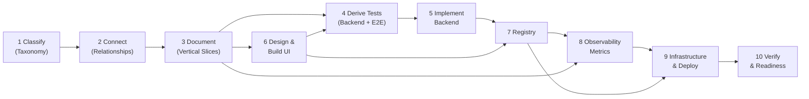
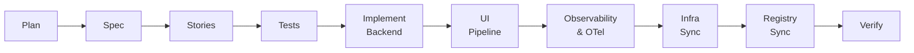
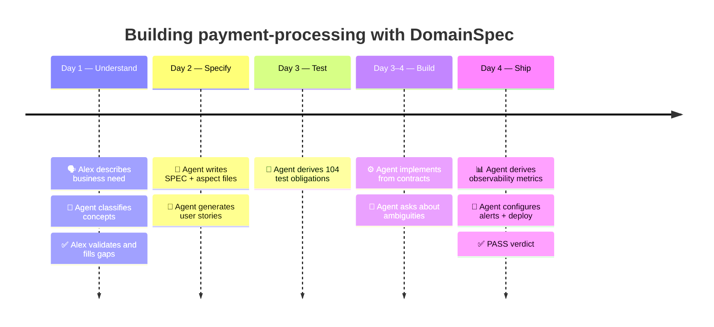
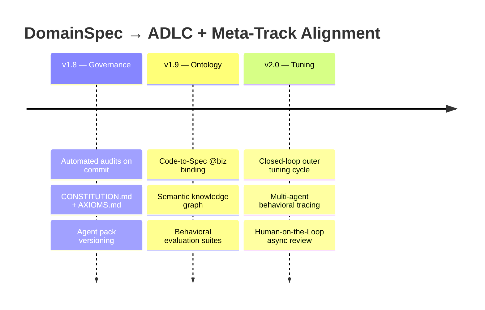

# Domainspec

> Think first, code second. Understand the domain before writing a single line of code.

Most software problems are not caused by bad code — they are caused by building the wrong thing. Misunderstood business rules, missing edge cases, and contradictory behavior between systems all stem from the same root: implementation outrunning understanding.

**DomainSpec** is a specification-first framework for autonomous software delivery. It provides a structured vocabulary (24 meta-types, 26 typed relationships), consistent templates, and an agent-driven pipeline that turns domain documentation into formal specifications, derived tests, backend code, frontend UI, observability, infrastructure, and verification — in that order, with traceability at every step.

The framework is designed to converge with the [Agentic Delivery Lifecycle (ADLC)](https://caseywest.com/the-agentic-manifesto/) — where agents operate under domain governance, enforcement is automated, and production behavior feeds back into continuous tuning. See the [ADLC alignment roadmap](ADLC-ALIGNMENT.md) for the full convergence plan.

---

## Table of Contents

- [The Pipeline at a Glance](#the-pipeline-at-a-glance)
- [Quick Start](#quick-start)
- [Interview-First Discovery](#interview-first-discovery)
- [A Feature from Start to Finish](#a-feature-from-start-to-finish)
- [Stage 1 — Classify Concepts (Taxonomy)](#stage-1--classify-concepts-with-the-taxonomy)
- [Stage 2 — Connect Concepts (Relationships)](#stage-2--connect-concepts-with-relationships)
- [Stage 3 — Document Features (Vertical Slices)](#stage-3--structure-documentation-as-vertical-slices)
- [Stage 4 — Derive Tests](#stage-4--derive-tests-from-documentation)
- [Stage 5 — Implement Backend](#stage-5--implement-backend-from-formal-specifications)
- [Stage 6 — Design & Build UI](#stage-6--design--build-ui)
- [Stage 7 — Maintain the Global Registry](#stage-7--maintain-the-global-registry)
- [Stage 8 — Derive Observability Metrics](#stage-8--derive-observability-metrics)
- [Stage 9 — Infrastructure & Deployment](#stage-9--infrastructure--deployment)
- [Stage 10 — Verify & Readiness](#stage-10--verify--readiness)
- [Copilot Integration](#copilot-integration)
- [Templates](#templates)
- [Examples](#examples)
- [Reference](#reference)
- [Appendix: ADLC Alignment & Meta-Track Bridge](#appendix-adlc-alignment--meta-track-bridge)
- [Appendix: Tuning Loop Architecture](TUNING-LOOP.md)

---

## The Pipeline at a Glance



Each stage depends on the previous. You cannot write meaningful tests without formal specifications, and you cannot implement correctly without tests. DomainSpec makes skipping steps visible and deliberate.

| Stage                | Input                                     | Output                                                  |
| -------------------- | ----------------------------------------- | ------------------------------------------------------- |
| 1. Classify          | Business knowledge                        | Typed concept inventory                                 |
| 2. Connect           | Concept inventory                         | Navigable knowledge graph                               |
| 3. Document          | Knowledge graph                           | Feature vertical slices (SPEC + aspect files + stories) |
| 4. Derive Tests      | Aspect docs + UI-SPEC                     | Backend TEST-SPEC + Playwright E2E scaffold             |
| 5. Implement Backend | TEST-SPEC + aspect docs                   | Production code + passing tests                         |
| 6. Design & Build UI | UI-ARCHITECTURE + aspect docs             | UI-SPEC + frontend pages + E2E tests                    |
| 7. Maintain Registry | All SPEC.md concept tables                | Global registry and glossary synchronization             |
| 8. Observability     | Aspect docs + pillar metadata             | Per-feature observability specs, metric catalog, alerts |
| 9. Infrastructure    | INFRA-ARCHITECTURE + observability + SLOs | IaC, CI/CD, monitoring stack, auto-deploy               |
| 10. Verify           | Backend + UI + observability + infra evidence | PASS / FLAG / BLOCK verdict + pilot readiness report |

---

## Quick Start

### 1. Install

```bash
# Add framework to your project (git submodule or copy)
cp -r domainspec/ your-project/

# Install Copilot agent pack (agents, skills, MCP Playwright)
bash domainspec/copilot/install.sh
```

For full installation details, see [copilot/INSTALL.md](copilot/INSTALL.md).

### 2. Bootstrap docs structure

```
@domainspec-spec-writer domainspec-init
```

Creates `docs/registry.md`, `docs/glossary.md`, `docs/shared/governance-baseline.md`, and the `docs/features/` directory.

### 3. Build a feature — one command

```
@domainspec-planner domainspec-pipeline <feature-name>
```

This single command orchestrates the **entire pipeline** end-to-end:



The planner asks clarifying questions about the business domain, then delegates to specialist agents for each stage — spec writing, story generation, test derivation, backend implementation, UI lifecycle, observability instrumentation, infrastructure sync, registry sync, and verification. It returns a final PASS / FLAG / BLOCK verdict.

Use flags to control scope:

| Flag                     | Effect                                                             |
| ------------------------ | ------------------------------------------------------------------ |
| `--spec-only`            | Stop after SPEC + aspect files + stories — review before building  |
| `--test-only`            | Stop after TEST-SPEC — review test obligations before implementing |
| `--backend-only`         | Implement backend and skip UI pipeline                             |
| `--skip-observability`   | Skip observability spec derivation and OTel instrumentation        |
| `--skip-instrumentation` | Skip OTel code instrumentation (keep observability spec)           |
| `--skip-otel-verify`     | Skip OTel verification (instrument without verifying)              |
| `--skip-infra`           | Skip infrastructure sync                                           |
| `--dry-run`              | Show the execution plan without running any steps                  |

### Running individual stages

Each pipeline stage can also be run independently:

| Stage         | Command                                                         | Agent             |
| ------------- | --------------------------------------------------------------- | ----------------- |
| Spec          | `@domainspec-spec-writer domainspec-spec-feature <feature>`     | spec-writer       |
| Stories       | `@domainspec-story-sync domainspec-sync-user-stories <feature>` | story-sync        |
| Tests         | `@domainspec-test-designer domainspec-generate-tests <feature>` | test-designer     |
| Backend       | `@domainspec-implementer domainspec-implement <feature>`        | implementer       |
| UI            | `@domainspec-ui-architect domainspec-ui-pipeline <feature>`     | ui-architect      |
| Observability | `@domainspec-planner domainspec-instrument-otel <feature>`      | otel-instrumenter |
| OTel Verify   | `@domainspec-planner domainspec-otel-verify <feature>`          | otel-verifier     |
| Infra         | `@domainspec-infra-architect domainspec-infra-deploy <feature>` | infra-architect   |
| Verify        | `@domainspec-verifier domainspec-verify-feature <feature>`      | verifier          |

## Interview-First Discovery

Before drafting a feature SPEC, you can run a guided domain interview in either greenfield or brownfield mode:

```
@domainspec-interviewer domainspec-interview-scope [greenfield|brownfield|auto] [scope]
```

What this adds:

- Repository-aware brownfield discovery (inspect first, then ask focused questions)
- Structured domain baseline for actors, boundaries, workflows, rules, constraints, and success signals
- Falsifiable hypotheses with explicit counterarguments and disconfirming outcomes
- Experiment candidates to validate business direction before implementation planning

Default artifact outputs:

- `docs/PROJECT-OVERVIEW.md`
- `docs/INITIAL-DEFINITIONS.md`
- `docs/HYPOTHESES.md`
- `docs/EXPERIMENT-CANDIDATES.md`

Template sources:

- `templates/project-overview.md`
- `templates/initial-definitions.md`
- `templates/hypotheses.md`
- `templates/experiment-candidates.md`

---

## A Feature from Start to Finish

Alex needs to build payment processing. Here is how DomainSpec guides the process — the agent asks, Alex answers, the agent produces.



<a id="day-1"></a>

**Day 1 — Understand the domain.** Alex runs `@domainspec-planner domainspec-pipeline payment-processing --spec-only`. The agent asks business questions — _"What triggers a payment? What happens on failure — retryable or final?"_ — and from the answers proposes concept classifications: `Payment` (Entity), `PaymentStatus` (State Machine), `ProcessPayment` (Operation), `PaymentGateway` (Interface). Alex validates. The agent maps relationships: `Customer → performs → ProcessPayment → produces → PaymentInitiated → transitions → PaymentStatus`. No code yet — just a navigable domain model.

<a id="day-2"></a>

**Day 2 — Formalize the spec.** The `--spec-only` flag stopped after scaffolding `docs/features/payment-processing/`. The agent walks through each aspect file: _"What validation rules before calling the gateway? How many retries before failure is terminal?"_ It formalizes answers into boolean expressions, a state machine with 9 transitions and 6 invariants, and user stories traceable to concepts. The product owner reviews stories, not code.

<a id="day-3"></a>

**Day 3 — Derive tests.** Alex runs `domainspec-pipeline payment-processing --test-only`. The agent reads every doc table and derives 104 test obligations mechanically: 9 state transitions, 6 rejection tests, 6 invariant checks, 42 rule tests, 14 event tests, 27 API contract tests. Each traces to a specific doc row.

<a id="day-34"></a>

**Day 3–4 — Implement.** Alex runs `domainspec-pipeline payment-processing`. The agent implements each layer against documented contracts. When it hits ambiguity — _"Should rejection reason be free-text or an enum?"_ — it asks instead of guessing. Tests pass on the first meaningful run.

<a id="day-4"></a>

**Day 4 — Ship.** The agent derives observability metrics from the same docs, configures alerts from SLO targets, and generates deployment configs. The pipeline finishes with a verdict: **PASS** — docs complete, tests derived, implementation matches contracts, observability instrumented.

> See the complete [payment-processing example](examples/payment-processing/SPEC.md) for every artifact produced.

---

## Stage 1 — Classify Concepts with the Taxonomy

The first thing to understand is how DomainSpec classifies domain knowledge. Every concept in your system belongs to exactly one of 24 meta-types — 13 for backend domain logic and 11 for UI presentation.

These categories reflect the fundamental questions every system must answer:

| Question                        | Category              | What it contains                                      |
| ------------------------------- | --------------------- | ----------------------------------------------------- |
| What things exist?              | **Structural**        | Entity, Value Object, Enum                            |
| What happens?                   | **Behavioral**        | Operation, Query, Calculation, Rule, Policy, Workflow |
| How do parts communicate?       | **Connective**        | Interface, Event, Mapping                             |
| How do things change over time? | **Lifecycle**         | State Machine                                         |
| What do users see?              | **UI Structural**     | Page, Layout, Component, View Model                   |
| What do users do?               | **UI Behavioral**     | Hook, Form, Action, Guard                             |
| How does UI talk to backend?    | **UI Connective**     | Binding, Adapter                                      |
| How does state look?            | **UI Presentational** | State Indicator                                       |

> See [TAXONOMY.md](TAXONOMY.md) for full definitions, examples, decision guides, and disambiguation tables.

---

## Stage 2 — Connect Concepts with Relationships

Once you have classified concepts, you connect them using 26 typed relationship edges — 12 for the backend domain graph, 8 for intra-UI navigation, and 6 for cross-layer traceability from screen to database. This forms a **knowledge graph** — from any concept, you can follow edges to understand everything it touches.

| Edge           | Connects                    | Answers                                           |
| -------------- | --------------------------- | ------------------------------------------------- |
| `performs`     | Entity → Operation          | What can a User/Admin/System do?                  |
| `produces`     | Operation → Event           | What happens after this operation runs?           |
| `enforces`     | Rule → Operation            | What conditions must hold for this operation?     |
| `calculates`   | Calculation → Operation     | What values does this operation derive?           |
| `transitions`  | Event → State Machine       | What state changes does this event trigger?       |
| `exposes`      | Interface → Operation/Query | What does this API surface?                       |
| `orchestrates` | Workflow → Operation[]      | What steps does this process coordinate?          |
| `applies`      | Policy → Operation          | What strategies govern this operation?            |
| `maps`         | Mapping → Entity/Interface  | What data transformations exist at this boundary? |
| `contains`     | Entity → Value Object       | What value types does this entity embed?          |
| `queries`      | Query → Entity              | What data does this query read?                   |
| `emits`        | Entity → Event              | What events does this entity announce?            |

**Why this matters:** Relationships make your documentation navigable. To understand any feature, follow the chain: Entity → Operation → Rules/Calculations → Events → State Machine. Every connection is explicit and traceable.

> See [RELATIONSHIPS.md](RELATIONSHIPS.md) for navigation patterns and full edge details.

---

## Stage 3 — Structure Documentation as Vertical Slices

With a taxonomy and relationships in hand, you document each feature as a **vertical slice** — a directory containing only the aspect files relevant to that feature. You do not document everything at once; you document what the feature actually needs.

### The feature directory

```
docs/features/{feature-name}/
├── SPEC.md          # Feature index — overview, concept table, aspect links
├── domain.md        # Entities, value objects, enums
├── operations.md    # Operations with rules, calculations, state transitions
├── states.md        # State machines (mermaid diagram + transition tables)
├── interfaces.md    # API contracts (endpoints, module boundaries)
├── events.md        # Domain events (payload, producer, consumers)
├── queries.md       # Read models (input, output shape, auth rules)
├── workflows.md     # Multi-step orchestrations
├── mappings.md      # Data transformations at boundaries
└── observability.md # OTel metric obligations derived from aspect docs
```

**Not every feature needs all aspect files.** A simple read-only feature may only need `SPEC.md`, `domain.md`, and `queries.md`. Only create what the feature genuinely needs.

### SPEC.md is the entry point

Every feature starts with `SPEC.md`. It contains:

1. **Overview** — what the feature does and why it exists (business context, not technical)
2. **Concept table** — every domain concept in the feature with its ID and meta-type; this is the **source of truth** for the global registry
3. **Aspect links** — which files exist for this feature
4. **Cross-feature dependencies** — what this feature depends on and what it produces for others

Starting with SPEC.md forces you to name and classify every concept before detailing them. Once you have a concept table, the structure of the remaining aspect files follows naturally.

### Operations drive most documentation

The `operations.md` file is typically the most detailed. For each operation:

- **Input** — field table with types and requirements
- **Rules** — business constraints with formal boolean expressions (`R1`, `R2`, ...)
- **Calculations** — formulas that derive values used in the operation (`C1`, `C2`, ...)
- **State transition** — which entity moves from which state to which state
- **Postconditions** — what must be true after a successful run
- **Error states** — each failure mode and its result

This level of detail is what enables the next stage: generating tests.

### States are formal

When an entity has a lifecycle (an `OrderStatus`, a `PaymentStatus`, an `AccountStatus`), document it in `states.md` using three complementary formats:

1. **Mermaid diagram** — visual, renderable in any markdown viewer
2. **Transition table** — From / Event / To / Guard / Effect columns, one row per transition
3. **Invalid transitions** — explicit list of which transitions must be rejected
4. **Invariants** — formal expressions that must hold in every reachable state

The combination of diagram and table makes state machines both human-readable and machine-parseable.

**Example — PaymentStatus state machine (excerpt from [examples/payment-processing/states.md](examples/payment-processing/states.md)):**

Transition table:

| From            | Event          | To         | Guard        | Effect                                    |
| --------------- | -------------- | ---------- | ------------ | ----------------------------------------- |
| Created         | ProcessPayment | Processing | R1–R5 pass   | Emit `PaymentInitiated`, call gateway     |
| Processing      | GatewayConfirm | Completed  | —            | Store gatewayRef, emit `PaymentCompleted` |
| Processing      | GatewayReject  | Failed     | —            | Store rejection reason                    |
| FailedRetryable | RetryPayment   | Processing | R9, R10 pass | Increment retryCount, call gateway        |

Invalid transitions:

| From      | Attempted Event | Why Invalid                             |
| --------- | --------------- | --------------------------------------- |
| Completed | RetryPayment    | Already succeeded — nothing to retry    |
| Failed    | any             | Terminal state — no transitions allowed |

Invariants:

| ID  | Invariant                                 | Formal                                                       |
| --- | ----------------------------------------- | ------------------------------------------------------------ |
| I1  | Completed payments have gateway reference | `status == Completed → gatewayRef != null`                   |
| I4  | Terminal states are immutable             | `status ∈ {Failed, Refunded, RefundFailed} → no transitions` |

Notice that every row above is already a complete test specification. The From + Event + Guard columns define the preconditions and trigger. The To column defines the expected outcome. The Why Invalid column defines what must be rejected. Nothing is left to interpret.

> See [examples/payment-processing/states.md](examples/payment-processing/states.md) for the full state machine with 9 transitions, 5 invalid transitions, and 6 invariants.

---

## Stage 4 — Derive Tests from Documentation

The formal structure in the previous stage is not accidental — it exists specifically so tests can be derived from documentation deterministically. The rules are defined in [TEST-PIPELINE.md](TEST-PIPELINE.md).

### Backend test derivation (rules 1–14)

| Doc section                         | What it produces                             |
| ----------------------------------- | -------------------------------------------- |
| Each state machine transition row   | 1 happy-path state transition test           |
| Each listed invalid transition      | 1 rejection test (must be blocked)           |
| Each state machine invariant        | 1 property-based test (holds in every state) |
| Each operation rule                 | 2+ tests — one pass, one per failure mode    |
| Each calculation formula            | 1+ correctness tests + property tests        |
| Each operation postcondition        | 1 assertion test                             |
| Each operation error state          | 1 negative test                              |
| Each API endpoint × response status | 1 contract test                              |
| Each event producer                 | 1 producer test                              |
| Each event consumer                 | 1 consumer test                              |

### UI E2E test derivation (rules 15–20)

When a feature has a `UI-SPEC.md`, six additional test categories are derived:

| Rule | Category          | Source                                                         |
| ---- | ----------------- | -------------------------------------------------------------- |
| 15   | Navigation        | Route table in UI-SPEC → each route produces a navigation test |
| 16   | Journey           | User journeys → multi-step Playwright scenarios                |
| 17   | Form Validation   | Form contracts → validation rule tests per field               |
| 18   | State Reflection  | Component state mapping → UI reflects backend state correctly  |
| 19   | Responsive Layout | Breakpoint table → viewport-specific layout assertions         |
| 20   | Accessibility     | Component list → axe-core checks per page                      |

E2E scaffold convention: `{web-app}/e2e/{feature}/` with `.navigation.spec.ts`, `.journey.spec.ts`, `.forms.spec.ts`, `.states.spec.ts`, `.responsive.spec.ts`.

**The key insight:** tests are not written from scratch — they are read from the documentation. If a test cannot be derived, the docs are incomplete. The [payment-processing example](examples/payment-processing/states.md) produces 100+ test obligations from 9 transitions, 6 invalid transitions, 6 invariants, 20+ rules, and 14 events — all mechanically derived from doc tables.

---

## Stage 5 — Implement Backend from Formal Specifications

With typed documentation and derived tests, implementation has clear contracts. There is nothing to guess or interpret:

- Entities implement the field tables in `domain.md`
- Operations implement the rules, calculations, and postconditions in `operations.md`
- State transitions implement exactly the transition table in `states.md` — no extra transitions, no missing ones
- Events implement exactly the payloads in `events.md`
- APIs implement exactly the request/response shapes in `interfaces.md`

Deviations from the documentation are not implementation details — they are specification gaps. Either the code is wrong, or the documentation must be updated first.

---

## Stage 6 — Design & Build UI

When a feature exposes HTTP endpoints in `interfaces.md`, run the entire UI lifecycle:

```
@domainspec-ui-architect domainspec-ui-pipeline <feature-name>
```

| Flag           | Effect                                         |
| -------------- | ---------------------------------------------- |
| `--spec-only`  | Stop after UI-SPEC.md — review before building |
| `--skip-audit` | Skip 6-pillar visual audit                     |
| `--dry-run`    | Show plan without executing                    |

The pipeline orchestrates five steps automatically:

| Step            | What it does                                                           | Output                               |
| --------------- | ---------------------------------------------------------------------- | ------------------------------------ |
| 1. Architecture | Interactive questions about stack/theme/layout (once per project)      | `docs/UI-ARCHITECTURE.md`            |
| 2. UI-SPEC      | Design contract from SPEC + interfaces + stories                       | `docs/features/{feature}/UI-SPEC.md` |
| 3. E2E Tests    | Playwright scaffolds from UI-SPEC (rules 15–20)                        | `{web-app}/e2e/{feature}/*.spec.ts`  |
| 4. Implement    | Pages + components from UI-SPEC + UI-ARCHITECTURE                      | Frontend code + navigation           |
| 5. Visual Audit | 6-pillar review: layout, typography, color, spacing, interaction, a11y | Pass/fail per pillar                 |

Each step can also run independently — see the [Skills Reference](#skills-reference) for individual commands.

DomainSpec's installer configures the [Playwright MCP server](https://github.com/anthropics/playwright-mcp) for browser-based visual testing. See [copilot/INSTALL.md](copilot/INSTALL.md).

---

## Stage 7 — Maintain the Global Registry

As features accumulate, each `SPEC.md` concept table feeds a global index:

- **`docs/registry.md`** — all concepts indexed by meta-type, with links back to source features
- **`docs/glossary.md`** — domain terms defined precisely in shared language

The registry is the **map of your system** — any new contributor can see everything that exists and how concepts relate across features. The source of truth lives in each feature's `SPEC.md`; the registry reflects it and tooling flags drift.

---

## Stage 8 — Derive Observability Metrics

After a feature is documented and implemented, derive **production observability obligations** from the same docs that generated your tests:

- **Domain Fidelity** — state machine transition counters, invariant monitors, rule violation rates, calculation drift detection (rules O1–O7)
- **Operational Health** — endpoint SLOs, idempotency monitors, event flow lag, query performance (rules O8–O12)
- **Business Effectiveness** — capability KPIs, funnel metrics from STORIES.md (rules O13–O14)
- **Financial Integrity** — mandatory for `pillar: finance` features: transaction reconciliation, duplicate detection, monetary exposure (rules O15–O16)

Each metric traces to a specific doc section using `@source` and `@rule` annotations.

The derivation rules live in [OBSERVABILITY.md](OBSERVABILITY.md). Use the [observability template](templates/observability.md) for each feature.

> **Agent command:** `domainspec-pipeline <feature> --observability` or create `docs/features/<feature>/observability.md` directly from the template.

---

## Stage 9 — Infrastructure & Deployment

Once features have observability specs and the monitoring stack is defined, DomainSpec extends into infrastructure governance. Like UI-ARCHITECTURE.md for the frontend, **INFRA-ARCHITECTURE.md** is a project-wide constitution for how your system runs.

### Automation-first VPS workflow

The premise: **3 manual inputs, everything else automated.** Provide a VPS provider token, a domain name, and a Cloudflare API token. The skill provisions the server, configures DNS, sets up TLS, and deploys your full stack — including monitoring.

> **First time?** Follow the [Infrastructure Setup Guide](INFRA-SETUP.md) to create accounts and configure tokens (~15 min).

```
@domainspec-infra-architect domainspec-infra-architecture
```

The agent detects existing infrastructure, recommends a preset, asks at most 3 questions, and generates:

- **`docs/INFRA-ARCHITECTURE.md`** — infrastructure constitution (stack, networking, environments, scaling roadmap)
- **`docs/slos.md`** — per-feature SLO targets linking to observability specs
- **`infra/`** — Pulumi IaC, Docker Compose, Caddy, Prometheus config, Grafana provisioning
- **`.github/workflows/`** — CI/CD pipelines (build → test → containerize → deploy)

### Graduated presets

| Preset         | Target           | Deploy              | What you get                                           |
| -------------- | ---------------- | ------------------- | ------------------------------------------------------ |
| **Dev**        | Solo dev         | `docker compose up` | Local monitoring stack                                 |
| **Single VPS** | Small team       | `git push main`     | DigitalOcean VPS + auto DNS + TLS + monitoring + CI/CD |
| **Split VPS**  | Staging needed   | `git push main`     | Separate DB + app VPS, Loki logs, promotion gates      |
| **HA**         | Production-grade | `git push main`     | Managed DB, load balancer, replicas, canary deploys    |

Graduation is non-destructive: change the preset, run `pulumi up`, infrastructure converges.

### Connection to observability

```
observability.md → defines WHAT metrics exist (O-rules)
INFRA-ARCHITECTURE.md → defines WHERE metrics flow (Prometheus scrape → Grafana)
slos.md → defines TARGETS (P95 < 200ms, alert if breached)
infra/alerts/*.rules.yml → auto-generated from slos.md thresholds
```

The `domainspec-infra-deploy` skill keeps infrastructure configs in sync — regenerating prometheus.yml and alert rules whenever observability specs or SLO targets change.

> See [templates/infra-architecture.md](templates/infra-architecture.md) for the full constitution template and [templates/slos.md](templates/slos.md) for the SLO template.

---

## Stage 10 — Verify & Readiness

Verification is a distinct final stage. Once registry, observability, and infrastructure sync are complete, run end-to-end verification to produce an explicit release-readiness verdict.

Primary command:

```
@domainspec-verifier domainspec-verify-feature <feature-name>
```

Readiness command:

```
@domainspec-verifier domainspec-pilot-readiness <feature-name>
```

Expected outputs:

- PASS / FLAG / BLOCK verdict with evidence links
- alignment and layering findings (or explicit no-drift result)
- pilot-readiness checklist for rollout

---

## Project Layout

```
your-project/
├── domainspec/           # Framework reference — read only, never edit
├── docs/                 # Your domain documentation — grows feature by feature
│   ├── registry.md
│   ├── glossary.md
│   ├── UI-ARCHITECTURE.md    # Global frontend constitution
│   ├── INFRA-ARCHITECTURE.md # Global infrastructure constitution
│   ├── slos.md               # Service level objectives per feature
│   ├── shared/
│   │   ├── governance-baseline.md # Cross-feature governance defaults (G0)
│   │   └── ...                    # Cross-feature value objects and blueprints
│   └── features/
│       ├── payments/
│       │   ├── SPEC.md
│       │   ├── STORIES.md
│       │   ├── domain.md
│       │   ├── operations.md
│       │   ├── observability.md
│       │   ├── UI-SPEC.md
│       │   └── ...
│       └── orders/
├── infra/                # Infrastructure as Code — grows from INFRA-ARCHITECTURE
│   ├── index.ts          # Pulumi IaC (VPS + DNS + firewall)
│   ├── docker-compose.prod.yml
│   ├── Caddyfile         # Reverse proxy + auto-TLS
│   ├── prometheus.yml    # Auto-generated from observability specs
│   └── alerts/           # Auto-generated from slos.md
├── src/                  # Backend code that grows from docs
├── apps/web/             # Frontend code that grows from UI-SPEC
│   └── e2e/              # Playwright E2E tests per feature
└── tests/                # Backend tests that grow from docs
```

### Concept naming

Concepts use namespaced IDs: **`{feature}.{ConceptName}`**

- `payment.ProcessPayment` — ProcessPayment operation in the payment feature
- `order.CreateOrder` — CreateOrder operation in the order feature
- `shared.Money` — a value object shared across features

Short names within a feature's own files. Full namespace in registry entries and cross-feature references.

### Workflow per feature

1. **Confirm governance baseline** — keep `docs/shared/governance-baseline.md` present before feature work
2. **Write SPEC.md** — name the feature, list all concepts with types, define dependencies
3. **Write STORIES.md** — user stories in classic + BDD format, traceable to concepts
4. **Add aspect files** — only the ones this feature needs (domain, operations, states, interfaces, events, queries, workflows, mappings)
5. **Sync registry** — add concepts to `docs/registry.md`, add terms to `docs/glossary.md`
6. **Generate test obligations** — backend TEST-SPEC from aspect docs; Playwright E2E from UI-SPEC
7. **Implement backend** — write code against the documented contracts and derived tests
8. **Design & implement UI** — generate UI-SPEC, scaffold pages, run E2E tests
9. **Derive observability** — create `observability.md` from aspect docs using OBSERVABILITY.md rules
10. **Infrastructure sync** — update prometheus.yml and alert rules from observability specs + SLOs
11. **Verify** — alignment audit, layering audit, PASS/FLAG/BLOCK verdict

---

## Copilot Integration

DomainSpec ships with a reusable Copilot integration pack that automates the entire pipeline. Install in any repository:

```bash
bash domainspec/copilot/install.sh
```

The installer copies agents, skills, and instructions into `.github/`. Optionally installs Playwright + MCP for E2E tests. See [copilot/INSTALL.md](copilot/INSTALL.md). Use `DOMAINSPEC_SKIP_PLAYWRIGHT=1` to skip Playwright.

### Public Commands

| Command                         | Stage | Purpose                                                                                    |
| ------------------------------- | ----- | ------------------------------------------------------------------------------------------ |
| `domainspec-pipeline`           | 1–10  | **End-to-end** — plan → spec → stories → tests → implement → UI → observe → infra → verify |
| `domainspec-decision-gate`      | 1b    | Resolve and persist blocker-level multi-option decisions before downstream mutations          |
| `domainspec-init`               | Setup | Create `docs/` structure, bootstrap governance baseline, and scaffold first feature skeleton |
| `domainspec-spec-feature`       | 3     | Author or update a feature specification (SPEC + aspects)                                  |
| `domainspec-sync-user-stories`  | 3     | Generate/refresh STORIES.md from aspect docs                                               |
| `domainspec-sync-registry`      | 7     | Sync registry and glossary from all SPEC.md concept tables                                 |
| `domainspec-generate-tests`     | 4     | Derive TEST-SPEC.md from aspect docs (`--ui` for E2E, `--all` for both)                    |
| `domainspec-implement`          | 5     | Implement backend code from documented contracts                                           |
| `domainspec-ui-pipeline`        | 6     | Full UI lifecycle — spec → tests → implement → audit                                       |
| `domainspec-ui-architecture`    | 6     | Create or evolve project-wide UI-ARCHITECTURE.md                                           |
| `domainspec-ui-implement`       | 6     | Implement frontend pages from UI-SPEC + UI-ARCHITECTURE                                    |
| `domainspec-instrument-otel`    | 8     | Instrument backend with OTel metrics from observability specs                              |
| `domainspec-otel-verify`        | 8     | Verify OTel coverage → OBSERVABILITY-REPORT.md                                             |
| `domainspec-infra-architecture` | 9     | Create INFRA-ARCHITECTURE.md + scaffold IaC                                                |
| `domainspec-infra-deploy`       | 9     | Sync prometheus.yml, alerts, and compose from current state                                |
| `domainspec-audit-alignment`    | 5–7   | Alignment report comparing docs vs code                                                    |
| `domainspec-audit-layering`     | 5–7   | Detect domain-logic drift into application layers                                          |
| `domainspec-verify-feature`     | 10    | PASS / FLAG / BLOCK verdict on feature readiness                                           |
| `domainspec-pilot-readiness`    | 10    | Prepare a feature for pilot testing                                                        |
| `domainspec-interview-scope`    | Setup | Capture project context before first feature planning                                      |
| `domainspec-help`               | —     | Show command reference and recommend next step                                             |

### Advanced Commands

| Command                       | Stage  | Purpose                                                                 |
| ----------------------------- | ------ | ----------------------------------------------------------------------- |
| `domainspec-reflect`          | 10     | Summarize implementation outcomes and emit iterative tuning directives  |
| `domainspec-signal-observer`  | Post   | Aggregate signal quality and detect drift during async review windows   |

### Appendix: Internal and Bridge Commands

| Command                       | Scope         | Purpose                                                                 |
| ----------------------------- | ------------- | ----------------------------------------------------------------------- |
| `domainspec-ui-phase-bridge`  | Internal      | Bridge UI execution to GSD phase plans when phase orchestration is used |
| `domainspec-ui-audit-bridge`  | Internal      | Bridge UI evidence into GSD UI audit flow                               |
| `domainspec-plan-phase-bridge` | Internal      | Bridge planner orchestration into GSD plan-phase workflows              |
| `domainspec-execute-phase-bridge` | Internal  | Bridge implementer execution into GSD execute-phase workflows           |

### Agents Reference

Each agent handles a specific concern autonomously:

| Agent                          | Role                                                             |
| ------------------------------ | ---------------------------------------------------------------- |
| `domainspec-planner`           | Converts goals into dependency-ordered plans                     |
| `domainspec-spec-writer`       | Authors/evolves feature specs with research and story coverage   |
| `mars-researcher`        | Investigates implementation decisions via domain navigation      |
| `domainspec-test-designer`     | Derives test specs and Playwright E2E scaffolds from docs        |
| `domainspec-implementer`       | Implements production code and tests from approved artifacts     |
| `domainspec-registry-sync`     | Synchronizes registry and glossary from SPEC concept tables      |
| `domainspec-story-sync`        | Maintains STORIES.md aligned with capability changes             |
| `domainspec-alignment-auditor` | Audits implementation fidelity against DomainSpec docs           |
| `domainspec-layering-auditor`  | Detects domain logic misplaced in application layers             |
| `domainspec-verifier`          | Produces PASS / FLAG / BLOCK feature completion verdicts         |
| `domainspec-ui-architect`      | Defines frontend architecture via interactive questions          |
| `domainspec-infra-architect`   | Defines infrastructure constitution with presets + auto-scaffold |
| `domainspec-otel-instrumenter` | Instruments backend code with OTel metrics                       |
| `domainspec-otel-verifier`     | Audits OTel coverage and generates change requests               |

Agents use a weighted heuristic to choose the most efficient context discovery path before acting — scoring signal quality, search cost, and ambiguity risk across four strategies. For complex features, orchestration delegates to GSD phase planning while DomainSpec retains semantic authority over behavior and acceptance criteria.

---

## Templates

All templates live in [templates/](templates/):

| Template                                                   | Purpose                                               |
| ---------------------------------------------------------- | ----------------------------------------------------- |
| [SPEC.md](templates/SPEC.md)                               | Feature index — overview, concept table, aspect links |
| [STORIES.md](templates/STORIES.md)                         | User stories in classic + BDD format                  |
| [CHANGELOG.md](templates/CHANGELOG.md)                     | Per-feature changelog updates and release notes        |
| [domain.md](templates/domain.md)                           | Entities, value objects, enums                        |
| [operations.md](templates/operations.md)                   | Operations with rules, calculations, transitions      |
| [states.md](templates/states.md)                           | State machines — mermaid + transition tables          |
| [interfaces.md](templates/interfaces.md)                   | API contracts — endpoints, request/response           |
| [events.md](templates/events.md)                           | Domain events — payload, producer, consumers          |
| [queries.md](templates/queries.md)                         | Read models — input, output, auth rules               |
| [workflows.md](templates/workflows.md)                     | Multi-step orchestrations                             |
| [mappings.md](templates/mappings.md)                       | Data transformations at boundaries                    |
| [shared-value-object.md](templates/shared-value-object.md) | Cross-feature value objects                           |
| [governance-baseline.md](templates/governance-baseline.md) | Cross-feature governance defaults                     |
| [ui-architecture.md](templates/ui-architecture.md)         | Frontend architecture constitution                    |
| [ui-spec.md](templates/ui-spec.md)                         | Per-feature UI design contract                        |
| [infra-architecture.md](templates/infra-architecture.md)   | Infrastructure constitution with presets              |
| [slos.md](templates/slos.md)                               | Per-feature SLO targets                               |
| [observability.md](templates/observability.md)             | Per-feature OTel metric obligations                   |
| [OBSERVABILITY-REPORT.md](templates/OBSERVABILITY-REPORT.md) | OTel audit output report template                    |
| [PIPELINE-REPORT.md](templates/PIPELINE-REPORT.md)         | End-to-end pipeline execution report                  |
| [SIGNAL-SCHEMA.md](templates/SIGNAL-SCHEMA.md)             | Signal contract documentation schema                  |
| [agent-runner.md](templates/agent-runner.md)               | Self-hosted agent runner architecture                 |
| [use-case.md](templates/use-case.md)                       | Use-case decomposition and boundaries                 |
| [project-overview.md](templates/project-overview.md)       | Initial project context summary                       |
| [initial-definitions.md](templates/initial-definitions.md) | Initial bounded context and concept definitions       |
| [hypotheses.md](templates/hypotheses.md)                   | Research hypotheses and validation framing            |
| [experiment-candidates.md](templates/experiment-candidates.md) | Candidate experiment backlog and triage           |
| [setup.sh](templates/setup.sh)                             | Setup helper scaffold                                 |

---

## Examples

| Example                                                   | Scope                                                                                   |
| --------------------------------------------------------- | --------------------------------------------------------------------------------------- |
| [payment-processing](examples/payment-processing/SPEC.md) | Full vertical slice — entities, operations, state machine, events, interfaces, mappings |
| [user-account](examples/user-account/)                    | User management with roles, authentication, and lifecycle                               |
| [order-management](examples/order-management/)            | Order creation, fulfillment workflow, and cancellation                                  |
| [inventory-management](examples/inventory-management/)    | Stock tracking, reservations, and replenishment                                         |
| [shared](examples/shared/)                                | Cross-feature value objects (Money, Address, etc.)                                      |

---

## Reference

| File                                     | Contents                                                                     |
| ---------------------------------------- | ---------------------------------------------------------------------------- |
| [TAXONOMY.md](TAXONOMY.md)               | Full 24-type reference (13 backend + 11 UI) with examples and disambiguation |
| [RELATIONSHIPS.md](RELATIONSHIPS.md)     | All 26 typed edge types (12 backend + 8 intra-UI + 6 cross-layer)            |
| [TEST-PIPELINE.md](TEST-PIPELINE.md)     | Complete doc → test derivation rule set (14 backend + 6 UI E2E rules)        |
| [ARCHITECTURE.md](ARCHITECTURE.md)       | Framework architecture and design decisions                                  |
| [OBSERVABILITY.md](OBSERVABILITY.md)     | 16 metric derivation rules across 3 layers + Financial Integrity             |
| [CHANGELOG.md](CHANGELOG.md)             | Versioned record of framework updates (current: v1.8.2)                      |
| [templates/](templates/SPEC.md)          | All aspect templates including ui-spec.md, ready to copy                     |
| [examples/](examples/)                   | 5 reference feature implementations                                          |
| [copilot/README.md](copilot/README.md)   | Copilot agent pack overview                                                  |
| [copilot/INSTALL.md](copilot/INSTALL.md) | Installation guide (includes Playwright MCP setup)                           |
| [tools/](tools/)                         | Framework validation and index generation tools                              |
| [tools/check_docs_sync.sh](tools/check_docs_sync.sh) | Deterministic docs-versus-assets drift guard for maintainers     |

---

## Appendix: ADLC Alignment & Meta-Track Bridge

DomainSpec is converging toward the [Agentic Delivery Lifecycle (ADLC)](https://caseywest.com/the-agentic-manifesto/#agentic-delivery-lifecycle-adlc) and integrating the [Meta-Track Framework](https://github.com/VictorBoscaro/domain-code-mapping) — a 7-layer meta-system for bridging domain vocabulary to code via annotations, orphan detection, and semantic embeddings.

Full analysis, gap inventory (G1–G16), health metrics (M-001–M-006), and 20 tasks: **[ADLC-ALIGNMENT.md](ADLC-ALIGNMENT.md)**

### Summary

| Layer          | Status                | Key gap                                    |
| -------------- | --------------------- | ------------------------------------------ |
| L1 Ontology    | ✅ 24 types, 26 edges | No runtime code-to-doc binding             |
| L3 Governance  | ⚠️ Scattered          | No single constitution or derivation chain |
| L4 Foundations | ⚠️ Implicit           | Axioms not formalized                      |
| L5 Navigation  | ⚠️ File-based         | No queryable concept graph                 |
| L6 Enforcement | ⚠️ Manual             | No pre-commit hooks or orphan blocking     |

### Next versions



---

## License

DomainSpec is licensed under the [Business Source License 1.1](LICENSE).

- **Free for non-commercial use** — evaluation, personal projects, academic research, and contributions.
- **Commercial use requires a license** — selling, SaaS, paid consulting, or incorporating into commercial products.
- **Converts to AGPL 3.0** on April 15, 2031.

For commercial licensing inquiries, contact the author.

© 2026 Vladimir Rondelli. All rights reserved.
