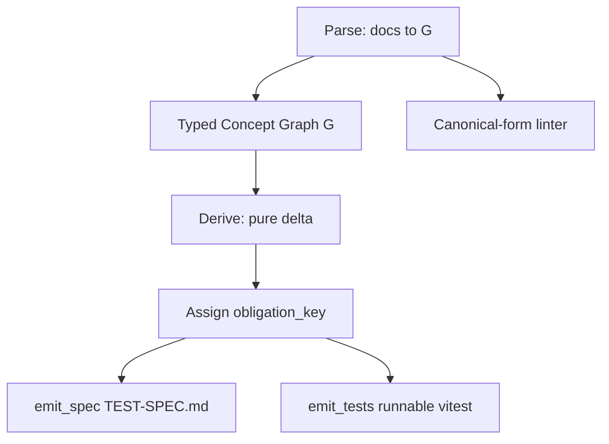

# Deterministic Test-Derivation Engine

## Mission

Replace the LLM-backed `domainspec-test-designer` derivation with a **pure, deterministic engine** that compiles a feature's formal docs into test obligations. Determinism becomes true _by construction_ (same docs → byte-identical obligations), making paper claim C2 provable rather than aspirational, and yielding a shippable product. Language: **TypeScript** (matches the Stryker/vitest mutation target so emitted tests are native).

## Ownership Boundary

- **Owns:** the parse → typed-graph → pure-δ → obligation-key → emit pipeline; the canonical machine-parseable doc schema; the deterministic obligation-ID scheme; `emit_spec` (TEST-SPEC.md) and `emit_tests` (runnable vitest).
- **Does Not Own:** authoring the feature docs themselves (DomainSpec spec authors); the experiments that _validate_ engine output (E1a/E2/E3 research workflow); running mutation testing (Stryker harness, separate); the LLM derivation skill it replaces.

## Capability Map

## Capabilities

| Capability | Outcome                                              | Key Contracts                                                       | Detail                             |
| ---------- | ---------------------------------------------------- | ------------------------------------------------------------------- | ---------------------------------- |
| Parse      | Build typed graph `G` from canonical Markdown tables | `parse(docs) -> G`; strict grammar; `needs_formal` flag             | medium — grammar + column aliasing |
| Derive     | Pure obligation set from `G` and rule set Δ          | `δ(G, Δ) -> Obligation[]`; exact cardinalities                      | high — rule encoding is the core   |
| Identify   | Byte-stable obligation IDs                           | `obligation_key = sha1(source_anchor\|rule_type\|canonical_params)` | low                                |
| Emit       | Render TEST-SPEC.md and runnable tests               | `emit_spec`, `emit_tests`                                           | medium                             |
| Lint       | Enforce canonical doc form as CI gate                | `lint(docs) -> violations[]`                                        | low                                |

## Concept Model

| Concept          | Type        | Key Constraints                                                                                                               |
| ---------------- | ----------- | ----------------------------------------------------------------------------------------------------------------------------- |
| ConceptGraph (G) | Record      | nodes sorted by `source_anchor`; total over a valid doc set                                                                   |
| Node             | Record      | unique `source_anchor`; `type` ∈ NodeType; optional `needs_formal`                                                            |
| NodeType         | Enumeration | Entity, State, Transition, Invariant, Operation, Rule, Calculation, Postcondition, Endpoint, Response, Event, Consumer, Field |
| Edge             | Record      | typed `(from, to, type)`; endpoints must exist in G                                                                           |
| RuleSet (Δ)      | Record      | the TEST-PIPELINE.md derivation rules, encoded as pure functions                                                              |
| Obligation       | Record      | carries `obligation_key`, `rule_type`, `source_anchor`, `canonical_params`                                                    |
| ObligationKey    | Value Type  | `sha1` hex; stable across runs and machines                                                                                   |
| FormalExpr       | Value Type  | parsed AST of a `Formal` cell; classes: EXISTENCE, PRESENCE, RANGE, COUNT_CAP                                                 |

## Concept Index

| Concept       | ID                   | Type       | Source        |
| ------------- | -------------------- | ---------- | ------------- |
| ConceptGraph  | engine.ConceptGraph  | Record     | concept-model |
| Obligation    | engine.Obligation    | Record     | concept-model |
| ObligationKey | engine.ObligationKey | Value Type | concept-model |
| parse         | engine.Parse         | Action     | operations    |
| derive        | engine.Derive        | Action     | operations    |
| emit_spec     | engine.EmitSpec      | Action     | operations    |
| emit_tests    | engine.EmitTests     | Action     | operations    |

## Relationship Map

| From             | Edge     | To                   | Evidence                | Notes                           |
| ---------------- | -------- | -------------------- | ----------------------- | ------------------------------- |
| engine.Parse     | produces | engine.ConceptGraph  | architect receipt §IR   | strict grammar                  |
| engine.Derive    | consumes | engine.ConceptGraph  | architect receipt §δ    | pure total fn                   |
| engine.Derive    | produces | engine.Obligation    | architect receipt §δ    | exact cardinalities             |
| engine.Identify  | stamps   | engine.ObligationKey | architect receipt §IDs  | dissolves Jaccard problem       |
| engine.EmitTests | produces | runnable vitest      | architect receipt §emit | removes E3 implementer confound |

## External Dependencies

| Capability | Depends On                | Via                                      | Why                                   |
| ---------- | ------------------------- | ---------------------------------------- | ------------------------------------- |
| Parse      | poker-team feature docs   | `states/operations/interfaces/events.md` | input corpus (~85% canonical already) |
| Derive     | TEST-PIPELINE.md rule set | rule encoding                            | δ semantics                           |
| Emit       | committed TEST-SPEC.md    | round-trip oracle                        | L0 falsification gate                 |

## Provides To

| Consumer            | Consumes Capability | Via                 | Delivered Value                                               |
| ------------------- | ------------------- | ------------------- | ------------------------------------------------------------- |
| E1a experiment      | Parse/Derive        | obligation_key sets | parser-completeness evidence (C2 determinism by construction) |
| E3 experiment       | Emit                | runnable vitest     | derived suite for mutation testing                            |
| DomainSpec pipeline | full engine         | `emit_spec`         | deterministic replacement for `domainspec-generate-tests`     |

## Scenario Coverage

- Primary scenarios: [WORK-PACK.md](WORK-PACK.md) delivery slices S-ENG-1, S-ENG-2.
- Completion checks: L0 round-trip gate (engine TEST-SPEC ⊇ committed `financial-settlement` obligations, byte-stable across 2 runs).

## Change History

| Date       | Change                                           | Author |
| ---------- | ------------------------------------------------ | ------ |
| 2026-06-12 | Initial spec from refine RESULT.md (define mode) | invoke |
