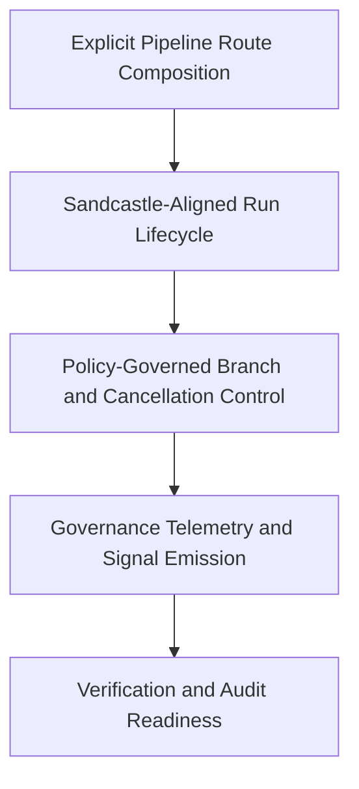

# Agent Execution Orchestrator

## What This Module Owns

Agent Execution Orchestrator owns deterministic composition and execution of DomainSpec lifecycle routes as explicit artifacts, not only dynamic routing decisions. It defines Sandcastle-aligned run semantics for sandbox/worktree lifecycle, branch strategy, bounded retry, cancellation, and resume. It also owns governance-grade telemetry envelopes that map run outcomes to delegation tuning, terminal guard, and signal-observer contracts.

## Module Map

## Capabilities

| Capability                                                                                                     | What                                                                                                            | Key Aspects                                                                                | Detail                                                                                                                                                                                                                 |
| -------------------------------------------------------------------------------------------------------------- | --------------------------------------------------------------------------------------------------------------- | ------------------------------------------------------------------------------------------ | ---------------------------------------------------------------------------------------------------------------------------------------------------------------------------------------------------------------------- |
| [Explicit Pipeline Route Composition](capabilities/explicit-pipeline-route-composition.md)                     | Defines explicit route templates for discovery, spec, stories, tests, implementation, audits, and verify stages | [domain.md](domain.md), [operations.md](operations.md), [interfaces.md](interfaces.md)     | Skill-driven route assembly: operators choose a pipeline goal or stage subset, compose the matching DomainSpec skill chain, and publish one deterministic route artifact with stage contracts and evidence obligations |
| [Sandcastle-Aligned Run Lifecycle](capabilities/sandcastle-aligned-run-lifecycle.md)                           | Executes routes with provider-agnostic contracts and Sandcastle baseline semantics                              | [operations.md](operations.md), [workflows.md](workflows.md), [rules.md](rules.md)         | Sandbox/worktree lease lifecycle, resume model, stage identity continuity, and deterministic terminal outcomes                                                                                                         |
| [Policy-Governed Branch and Cancellation Control](capabilities/policy-governed-branch-cancellation-control.md) | Applies locked branch, retry, and cancellation policies                                                         | [rules.md](rules.md), [workflows.md](workflows.md), [operations.md](operations.md)         | `merge-to-head` default, bounded retry with narrowing, and `latest-run-wins` supersession control                                                                                                                      |
| [Governance Telemetry and Signal Emission](capabilities/governance-telemetry-and-signal-emission.md)           | Emits deterministic telemetry envelopes and governance signals for each stage run                               | [observability.md](observability.md), [interfaces.md](interfaces.md), [rules.md](rules.md) | Delegation tuning parity, terminal guard evidence linkage, and observer-ready governance signal emission                                                                                                               |

### Explicit Pipeline Route Composition

Defines and publishes deterministic route artifacts before runtime execution.

- Full capability detail: [explicit-pipeline-route-composition.md](capabilities/explicit-pipeline-route-composition.md)
- Core concepts: [ExecutionPipeline](domain.md#executionpipeline), [PipelineRouteTemplate](domain.md#pipelineroutetemplate), [StageContract](domain.md#stagecontract)
- Core operation: [AssemblePipelineRoute](operations.md#assemblepipelineroute)

### Sandcastle-Aligned Run Lifecycle

Executes a composed route under Sandcastle baseline semantics with deterministic run-state transitions.

- Full capability detail: [sandcastle-aligned-run-lifecycle.md](capabilities/sandcastle-aligned-run-lifecycle.md)
- Core concepts: [ExecutionRun](domain.md#executionrun), [StageExecution](domain.md#stageexecution), [SessionSnapshot](domain.md#sessionsnapshot)
- Core rule: [RunStateMachine](rules.md#runstatemachine)
- Core operations: [ExecutePipelineRoute](operations.md#executepipelineroute), [ResumeExecutionRun](operations.md#resumeexecutionrun)

### Policy-Governed Branch and Cancellation Control

Encodes branch strategy defaults, bounded retry, and supersession cancellation as enforced policy contracts.

- Full capability detail: [policy-governed-branch-cancellation-control.md](capabilities/policy-governed-branch-cancellation-control.md)
- Core policies: [BranchStrategyPolicy](rules.md#branchstrategypolicy), [RetryPolicy](rules.md#retrypolicy), [CancellationPolicy](rules.md#cancellationpolicy)
- Core operation: [CancelSupersededRun](operations.md#cancelsupersededrun)

### Governance Telemetry and Signal Emission

Maps stage outcomes into deterministic telemetry envelopes and observer-compatible governance signals.

- Full capability detail: [governance-telemetry-and-signal-emission.md](capabilities/governance-telemetry-and-signal-emission.md)
- Core concepts: [TelemetryEnvelope](domain.md#telemetryenvelope), [ExecutionRun](domain.md#executionrun)
- Core mapping: [RunArtifactMapping](observability.md#runartifactmapping)
- Core operation: [EmitGovernanceSignals](operations.md#emitgovernancesignals)
- Core rule: [TelemetryPairRequired](rules.md#telemetrypairrequired)

## Domain Concepts

| Concept                                                  | Type          | Key Constraints                                                                             |
| -------------------------------------------------------- | ------------- | ------------------------------------------------------------------------------------------- |
| [ExecutionPipeline](domain.md#executionpipeline)         | Entity        | Owns ordered route template and versioned capability scope                                  |
| [PipelineRouteTemplate](domain.md#pipelineroutetemplate) | Entity        | Supports full lifecycle or ordered stage-subset selection                                   |
| [ExecutionRun](domain.md#executionrun)                   | Entity        | Must map to one route template and ordered stage execution timeline                         |
| [StageContract](domain.md#stagecontract)                 | Value Object  | Defines stage purpose, required inputs, terminal obligations, and isolation mode            |
| [StageExecution](domain.md#stageexecution)               | Value Object  | One execution record per selected stage with unique `stageRunId`                            |
| [TelemetryEnvelope](domain.md#telemetryenvelope)         | Value Object  | Must include telemetry pair, terminal guard evidence, transcript excerpt, decision snapshot |
| [RunStateMachine](rules.md#runstatemachine)              | State Machine | Terminal state required for every started stage run                                         |

## Concept Registry

| Concept                                                                                         | ID                                                              | Type          | Source                                                                     |
| ----------------------------------------------------------------------------------------------- | --------------------------------------------------------------- | ------------- | -------------------------------------------------------------------------- |
| [ExecutionPipeline](domain.md#executionpipeline)                                                | agent-execution-orchestrator.ExecutionPipeline                  | Entity        | [domain.md](domain.md#executionpipeline)                                   |
| [PipelineRouteTemplate](domain.md#pipelineroutetemplate)                                        | agent-execution-orchestrator.PipelineRouteTemplate              | Entity        | [domain.md](domain.md#pipelineroutetemplate)                               |
| [ExecutionRun](domain.md#executionrun)                                                          | agent-execution-orchestrator.ExecutionRun                       | Entity        | [domain.md](domain.md#executionrun)                                        |
| [StageContract](domain.md#stagecontract)                                                        | agent-execution-orchestrator.StageContract                      | Value Object  | [domain.md](domain.md#stagecontract)                                       |
| [StageExecution](domain.md#stageexecution)                                                      | agent-execution-orchestrator.StageExecution                     | Value Object  | [domain.md](domain.md#stageexecution)                                      |
| [SandboxLease](domain.md#sandboxlease)                                                          | agent-execution-orchestrator.SandboxLease                       | Value Object  | [domain.md](domain.md#sandboxlease)                                        |
| [WorktreeLease](domain.md#worktreelease)                                                        | agent-execution-orchestrator.WorktreeLease                      | Value Object  | [domain.md](domain.md#worktreelease)                                       |
| [SessionSnapshot](domain.md#sessionsnapshot)                                                    | agent-execution-orchestrator.SessionSnapshot                    | Value Object  | [domain.md](domain.md#sessionsnapshot)                                     |
| [TelemetryEnvelope](domain.md#telemetryenvelope)                                                | agent-execution-orchestrator.TelemetryEnvelope                  | Value Object  | [domain.md](domain.md#telemetryenvelope)                                   |
| [StageType](domain.md#stagetype)                                                                | agent-execution-orchestrator.StageType                          | Enum / Type   | [domain.md](domain.md#stagetype)                                           |
| [StageIsolationMode](domain.md#stageisolationmode)                                              | agent-execution-orchestrator.StageIsolationMode                 | Enum / Type   | [domain.md](domain.md#stageisolationmode)                                  |
| [RunState](domain.md#runstate)                                                                  | agent-execution-orchestrator.RunState                           | Enum / Type   | [domain.md](domain.md#runstate)                                            |
| [TerminalOutcome](domain.md#terminaloutcome)                                                    | agent-execution-orchestrator.TerminalOutcome                    | Enum / Type   | [domain.md](domain.md#terminaloutcome)                                     |
| [BranchStrategy](domain.md#branchstrategy)                                                      | agent-execution-orchestrator.BranchStrategy                     | Enum / Type   | [domain.md](domain.md#branchstrategy)                                      |
| [ProviderAdapter](domain.md#provideradapter)                                                    | agent-execution-orchestrator.ProviderAdapter                    | Enum / Type   | [domain.md](domain.md#provideradapter)                                     |
| [GovernanceSignalType](domain.md#governancesignaltype)                                          | agent-execution-orchestrator.GovernanceSignalType               | Enum / Type   | [domain.md](domain.md#governancesignaltype)                                |
| [AssemblePipelineRoute](operations.md#assemblepipelineroute)                                    | agent-execution-orchestrator.AssemblePipelineRoute              | Operation     | [operations.md](operations.md#assemblepipelineroute)                       |
| [ExecutePipelineRoute](operations.md#executepipelineroute)                                      | agent-execution-orchestrator.ExecutePipelineRoute               | Operation     | [operations.md](operations.md#executepipelineroute)                        |
| [ResumeExecutionRun](operations.md#resumeexecutionrun)                                          | agent-execution-orchestrator.ResumeExecutionRun                 | Operation     | [operations.md](operations.md#resumeexecutionrun)                          |
| [CancelSupersededRun](operations.md#cancelsupersededrun)                                        | agent-execution-orchestrator.CancelSupersededRun                | Operation     | [operations.md](operations.md#cancelsupersededrun)                         |
| [EmitGovernanceSignals](operations.md#emitgovernancesignals)                                    | agent-execution-orchestrator.EmitGovernanceSignals              | Operation     | [operations.md](operations.md#emitgovernancesignals)                       |
| [RunStateMachine](rules.md#runstatemachine)                                                     | agent-execution-orchestrator.RunStateMachine                    | State Machine | [rules.md](rules.md#runstatemachine)                                       |
| [BranchStrategyPolicy](rules.md#branchstrategypolicy)                                           | agent-execution-orchestrator.BranchStrategyPolicy               | Policy        | [rules.md](rules.md#branchstrategypolicy)                                  |
| [RetryPolicy](rules.md#retrypolicy)                                                             | agent-execution-orchestrator.RetryPolicy                        | Policy        | [rules.md](rules.md#retrypolicy)                                           |
| [CancellationPolicy](rules.md#cancellationpolicy)                                               | agent-execution-orchestrator.CancellationPolicy                 | Policy        | [rules.md](rules.md#cancellationpolicy)                                    |
| [WatchdogTimeoutRule](rules.md#watchdogtimeoutrule)                                             | agent-execution-orchestrator.WatchdogTimeoutRule                | Rule          | [rules.md](rules.md#watchdogtimeoutrule)                                   |
| [TelemetryPairRequired](rules.md#telemetrypairrequired)                                         | agent-execution-orchestrator.TelemetryPairRequired              | Rule          | [rules.md](rules.md#telemetrypairrequired)                                 |
| [RouteArtifactInterface](interfaces.md#internal-routeartifactinterface)                         | agent-execution-orchestrator.RouteArtifactInterface             | Interface     | [interfaces.md](interfaces.md#internal-routeartifactinterface)             |
| [SandboxProviderInterface](interfaces.md#internal-sandboxproviderinterface)                     | agent-execution-orchestrator.SandboxProviderInterface           | Interface     | [interfaces.md](interfaces.md#internal-sandboxproviderinterface)           |
| [DelegationTelemetryLedgerInterface](interfaces.md#internal-delegationtelemetryledgerinterface) | agent-execution-orchestrator.DelegationTelemetryLedgerInterface | Interface     | [interfaces.md](interfaces.md#internal-delegationtelemetryledgerinterface) |
| [TerminalGuardInterface](interfaces.md#internal-terminalguardinterface)                         | agent-execution-orchestrator.TerminalGuardInterface             | Interface     | [interfaces.md](interfaces.md#internal-terminalguardinterface)             |
| [SignalObserverInterface](interfaces.md#internal-signalobserverinterface)                       | agent-execution-orchestrator.SignalObserverInterface            | Interface     | [interfaces.md](interfaces.md#internal-signalobserverinterface)            |
| [FeatureLifecyclePipelineWorkflow](workflows.md#featurelifecyclepipelineworkflow)               | agent-execution-orchestrator.FeatureLifecyclePipelineWorkflow   | Workflow      | [workflows.md](workflows.md#featurelifecyclepipelineworkflow)              |
| [LatestRunWinsRecoveryWorkflow](workflows.md#latestrunwinsrecoveryworkflow)                     | agent-execution-orchestrator.LatestRunWinsRecoveryWorkflow      | Workflow      | [workflows.md](workflows.md#latestrunwinsrecoveryworkflow)                 |
| [RunArtifactMapping](observability.md#runartifactmapping)                                       | agent-execution-orchestrator.RunArtifactMapping                 | Mapping       | [observability.md](observability.md#runartifactmapping)                    |
| [GovernanceSignalEmission](observability.md#governancesignalemission)                           | agent-execution-orchestrator.GovernanceSignalEmission           | Event         | [observability.md](observability.md#governancesignalemission)              |

## Feature Concept Graph

| From                                                            | Edge         | To                                                    | Evidence                                                  | Notes                                        |
| --------------------------------------------------------------- | ------------ | ----------------------------------------------------- | --------------------------------------------------------- | -------------------------------------------- |
| agent-execution-orchestrator.FeatureLifecyclePipelineWorkflow   | orchestrates | agent-execution-orchestrator.ExecutePipelineRoute     | workflows.md#featurelifecyclepipelineworkflow             | Canonical lifecycle orchestration            |
| agent-execution-orchestrator.FeatureLifecyclePipelineWorkflow   | orchestrates | agent-execution-orchestrator.EmitGovernanceSignals    | workflows.md#featurelifecyclepipelineworkflow             | Emits governance signals at stage boundaries |
| agent-execution-orchestrator.AssemblePipelineRoute              | enforces     | agent-execution-orchestrator.StageContract            | operations.md#assemblepipelineroute                       | Rejects incomplete route templates           |
| agent-execution-orchestrator.PipelineRouteTemplate              | contains     | agent-execution-orchestrator.StageContract            | domain.md#pipelineroutetemplate                           | Ordered contracts define route execution     |
| agent-execution-orchestrator.RunStateMachine                    | enforces     | agent-execution-orchestrator.ExecutePipelineRoute     | rules.md#runstatemachine                                  | Transition guards required                   |
| agent-execution-orchestrator.BranchStrategyPolicy               | applies      | agent-execution-orchestrator.ExecutePipelineRoute     | rules.md#branchstrategypolicy                             | Default is `merge-to-head`                   |
| agent-execution-orchestrator.CancellationPolicy                 | applies      | agent-execution-orchestrator.CancelSupersededRun      | rules.md#cancellationpolicy                               | `latest-run-wins` semantics                  |
| agent-execution-orchestrator.RouteArtifactInterface             | exposes      | agent-execution-orchestrator.AssemblePipelineRoute    | interfaces.md#internal-routeartifactinterface             | Explicit route artifact publishing           |
| agent-execution-orchestrator.SandboxProviderInterface           | exposes      | agent-execution-orchestrator.ExecutePipelineRoute     | interfaces.md#internal-sandboxproviderinterface           | Sandcastle adapter baseline                  |
| agent-execution-orchestrator.DelegationTelemetryLedgerInterface | exposes      | agent-execution-orchestrator.EmitGovernanceSignals    | interfaces.md#internal-delegationtelemetryledgerinterface | Append-only stage telemetry                  |
| agent-execution-orchestrator.RunArtifactMapping                 | maps         | agent-execution-orchestrator.TelemetryEnvelope        | observability.md#runartifactmapping                       | Deterministic envelope mapping               |
| agent-execution-orchestrator.EmitGovernanceSignals              | produces     | agent-execution-orchestrator.GovernanceSignalEmission | operations.md#emitgovernancesignals                       | Emits observer-compatible signal rows        |

## Aspect Docs

| Aspect                            | Contains                                                           | Key Concepts                                                              |
| --------------------------------- | ------------------------------------------------------------------ | ------------------------------------------------------------------------- |
| [Domain](domain.md)               | Entities, value objects, enums                                     | ExecutionPipeline, PipelineRouteTemplate, ExecutionRun                    |
| [Operations](operations.md)       | Route assembly, run execution, cancellation, signal emission       | AssemblePipelineRoute, ExecutePipelineRoute, EmitGovernanceSignals        |
| [Workflows](workflows.md)         | Stage orchestration and recovery flows                             | FeatureLifecyclePipelineWorkflow, LatestRunWinsRecoveryWorkflow           |
| [Rules](rules.md)                 | State machine, policies, invariants, stage contracts               | RunStateMachine, BranchStrategyPolicy, TelemetryPairRequired              |
| [Interfaces](interfaces.md)       | Route artifact, sandbox adapter, telemetry and observer interfaces | RouteArtifactInterface, SandboxProviderInterface, SignalObserverInterface |
| [Observability](observability.md) | Telemetry schema and governance signal mapping                     | RunArtifactMapping, GovernanceSignalEmission                              |

## Cross-Feature Dependencies

| Capability                               | Depends On                                                                                                                     | Via                             | Why                                                    |
| ---------------------------------------- | ------------------------------------------------------------------------------------------------------------------------------ | ------------------------------- | ------------------------------------------------------ |
| Sandcastle-Aligned Run Lifecycle         | [domainspec-gsd-integration.DelegatedExecutionWorkflow](../domainspec-gsd-integration/workflows.md#delegatedexecutionworkflow) | Workflow contract compatibility | Maintains delegated lifecycle interoperability         |
| Governance Telemetry and Signal Emission | [domainspec-gsd-integration.VerifyPhaseBridge](../domainspec-gsd-integration/operations.md#verifyphasebridge)                  | Evidence normalization handoff  | Ensures PASS/FLAG/BLOCK evidence remains deterministic |

## Produces For

| Consumer                                            | Consumes Capability                             | Via                                                                     | What                                                                |
| --------------------------------------------------- | ----------------------------------------------- | ----------------------------------------------------------------------- | ------------------------------------------------------------------- |
| `domainspec-orchestrate`                            | Explicit Pipeline Route Composition             | [RouteArtifactInterface](interfaces.md#internal-routeartifactinterface) | Explicit route manifests for delegated stages                       |
| `domainspec-plan-phase-bridge`                      | Policy-Governed Branch and Cancellation Control | [BranchStrategyPolicy](rules.md#branchstrategypolicy)                   | Locked branch and cancellation semantics                            |
| `domainspec-signal-observer`                        | Governance Telemetry and Signal Emission        | [GovernanceSignalEmission](observability.md#governancesignalemission)   | Observer-ready governance signal rows                               |
| Prompt contexts (`CLAUDE.md`, copilot instructions) | Explicit Pipeline Route Composition             | [PipelineRouteTemplate](domain.md#pipelineroutetemplate)                | Human-readable route artifacts for system-prompt execution contexts |

## Stories

See [STORIES.md](STORIES.md) for capability-scoped user journeys and coverage matrix.

## References

- [WORK-PACK.md](WORK-PACK.md)
- [explicit-pipeline-route-composition.md](capabilities/explicit-pipeline-route-composition.md)
- [sandcastle-aligned-run-lifecycle.md](capabilities/sandcastle-aligned-run-lifecycle.md)
- [policy-governed-branch-cancellation-control.md](capabilities/policy-governed-branch-cancellation-control.md)
- [governance-telemetry-and-signal-emission.md](capabilities/governance-telemetry-and-signal-emission.md)
- [W0.md](work-pack/waves/W0.md)
- [W4.md](work-pack/waves/W4.md)
- [W5.md](work-pack/waves/W5.md)
- [CAP-AEO-C1-PIPELINE-EXECUTION.md](work-pack/capabilities/CAP-AEO-C1-PIPELINE-EXECUTION.md)
- [CAP-AEO-C2-GOVERNANCE-TELEMETRY.md](work-pack/capabilities/CAP-AEO-C2-GOVERNANCE-TELEMETRY.md)
- [PROJECT-OVERVIEW.md](../../interviews/agent-execution-orchestrator/PROJECT-OVERVIEW.md)
- [INITIAL-DEFINITIONS.md](../../interviews/agent-execution-orchestrator/INITIAL-DEFINITIONS.md)
- [PROJECT-DECISIONS.md](../../interviews/agent-execution-orchestrator/PROJECT-DECISIONS.md)
- [HYPOTHESES.md](../../interviews/agent-execution-orchestrator/HYPOTHESES.md)
- [EXPERIMENT-CANDIDATES.md](../../interviews/agent-execution-orchestrator/EXPERIMENT-CANDIDATES.md)
- [TAXONOMY.md](../../../domainspec/TAXONOMY.md)
- [RELATIONSHIPS.md](../../../domainspec/RELATIONSHIPS.md)
- [DELEGATION-TUNING.md](../../signals/DELEGATION-TUNING.md)
- [TERMINAL-GUARD.md](../../../../../docs/signals/TERMINAL-GUARD.md)
