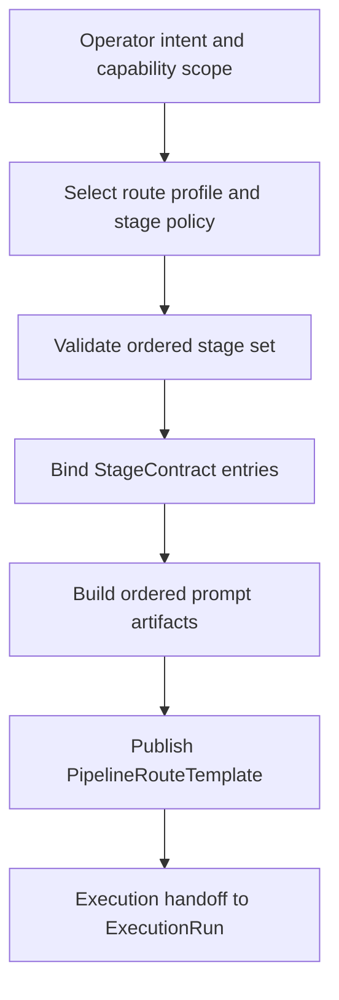

# Explicit Pipeline Route Composition

## Capability Backlink

- [Agent Execution Orchestrator SPEC](../SPEC.md#explicit-pipeline-route-composition)

## Plain-Language Explanation

This capability turns an operator's intent into one explicit, reusable route artifact. Instead of relying on implicit routing behavior, it binds an ordered stage set, stage contracts, and required evidence obligations into a deterministic template that downstream execution can run without reinterpreting intent.

## How It Works

## Inputs

| Input                                  | Source                                                          | Description                                                                                                                                 |
| -------------------------------------- | --------------------------------------------------------------- | ------------------------------------------------------------------------------------------------------------------------------------------- |
| `pipelineId`                           | [AssemblePipelineRoute](../operations.md#assemblepipelineroute) | Target [ExecutionPipeline](../domain.md#executionpipeline) identity for the route update                                                    |
| `template`                             | [AssemblePipelineRoute](../operations.md#assemblepipelineroute) | Candidate [PipelineRouteTemplate](../domain.md#pipelineroutetemplate) including ordered [StageContract](../domain.md#stagecontract) entries |
| `selectionPolicy` and `selectedStages` | [StageSelectionContract](../rules.md#stageselectioncontract)    | Route selection mode (`full-lifecycle` or `stage-subset`) and ordered stage list                                                            |
| `promptBuildInputs`                    | [PromptBuildStepContract](../rules.md#promptbuildstepcontract)  | Stage inputs, required artifacts, stage run IDs, and handoff references used to build prompt artifacts                                      |
| Capability scope and decision evidence | [ArtifactEvidenceMinimum](../rules.md#artifactevidenceminimum)  | Operator decision context that explains why this route was selected                                                                         |

## Outputs

| Output                                                                | Produced By                                                                | Description                                                                |
| --------------------------------------------------------------------- | -------------------------------------------------------------------------- | -------------------------------------------------------------------------- |
| Validated [PipelineRouteTemplate](../domain.md#pipelineroutetemplate) | [AssemblePipelineRoute](../operations.md#assemblepipelineroute)            | Deterministic route template with complete stage contract coverage         |
| Ordered prompt artifact set                                           | [RouteArtifactInterface](../interfaces.md#internal-routeartifactinterface) | Prompt artifacts keyed by stage run identity and deterministic build order |
| Prompt artifact set hash                                              | [PromptArtifactDeterminism](../rules.md#promptartifactdeterminism)         | Reproducibility proof for repeated builds with identical inputs            |
| Route publication reference                                           | [RouteArtifactInterface](../interfaces.md#internal-routeartifactinterface) | Artifact handle that execution and prompt contexts can consume             |

## Concept and Aspect Linkage

| Aspect        | Linked concepts and contracts                                                                                                                                                                      | Why this capability depends on it                                                |
| ------------- | -------------------------------------------------------------------------------------------------------------------------------------------------------------------------------------------------- | -------------------------------------------------------------------------------- |
| SPEC          | [Capabilities](../SPEC.md#capabilities), [Concept Registry](../SPEC.md#concept-registry)                                                                                                           | Keeps route vocabulary and concept IDs canonical                                 |
| Domain        | [ExecutionPipeline](../domain.md#executionpipeline), [PipelineRouteTemplate](../domain.md#pipelineroutetemplate), [StageContract](../domain.md#stagecontract), [StageType](../domain.md#stagetype) | Defines the route structure this capability composes                             |
| Operations    | [AssemblePipelineRoute](../operations.md#assemblepipelineroute)                                                                                                                                    | Governs route validation and template mutation                                   |
| Workflows     | [FeatureLifecyclePipelineWorkflow](../workflows.md#featurelifecyclepipelineworkflow)                                                                                                               | Consumes the explicit route for runtime orchestration                            |
| Rules         | [StageSelectionContract](../rules.md#stageselectioncontract), [PromptBuildStepContract](../rules.md#promptbuildstepcontract), [PromptArtifactDeterminism](../rules.md#promptartifactdeterminism)   | Enforces ordered subset semantics and deterministic prompt build behavior        |
| Interfaces    | [RouteArtifactInterface](../interfaces.md#internal-routeartifactinterface)                                                                                                                         | Publishes the route and prompt artifact outputs to consumers                     |
| Observability | [RunArtifactMapping](../observability.md#runartifactmapping)                                                                                                                                       | Ensures route composition emits the evidence fields execution must later satisfy |

## Architectural Design and Operationalization

### Actors

| Actor                    | Responsibility                                                     |
| ------------------------ | ------------------------------------------------------------------ |
| Operator                 | Declares intent, capability scope, and selected stage policy       |
| Orchestrator runtime     | Validates contracts and assembles one deterministic route artifact |
| Prompt context consumers | Reuse the published route template without re-deriving stage order |

### Operational boundaries

| Boundary                   | In scope                                                               | Out of scope                                             |
| -------------------------- | ---------------------------------------------------------------------- | -------------------------------------------------------- |
| Route composition boundary | Stage ordering, contract completeness, prompt artifact reproducibility | Stage execution lifecycle and terminal state transitions |
| Governance boundary        | Decision evidence linkage and required artifact declarations           | Runtime telemetry append and signal emission mechanics   |

### In-practice usage

- Use this capability first whenever a new lifecycle slice is needed, including `stage-subset` routes.
- Keep route updates deterministic by requiring [StageContract](../domain.md#stagecontract) completeness before publication.
- Hand off only route artifacts that are ready for downstream [ExecutionRun](../domain.md#executionrun) execution semantics and [RunStateMachine](../rules.md#runstatemachine) enforcement.

## Related Work-Pack Artifacts

- [CAP-AEO-C1-PIPELINE-EXECUTION.md](../work-pack/capabilities/CAP-AEO-C1-PIPELINE-EXECUTION.md)
- [W4.md](../work-pack/waves/W4.md)
