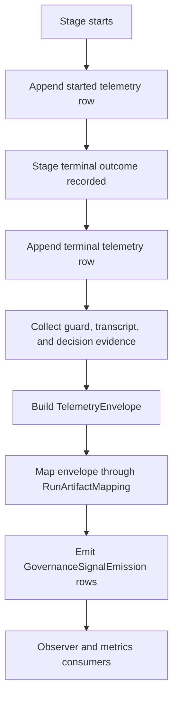

# Governance Telemetry and Signal Emission

## Capability Backlink

- [Agent Execution Orchestrator SPEC](../SPEC.md#governance-telemetry-and-signal-emission)

## Plain-Language Explanation

This capability transforms stage execution evidence into governance-ready telemetry and signal rows. It guarantees started/terminal pairing per stage run, binds terminal-guard and decision evidence into one envelope, and emits observer-compatible signals so governance loops can detect workflow, contract, and evidence gaps.

## How It Works

## Inputs

| Input                                        | Source                                                                                             | Description                                                          |
| -------------------------------------------- | -------------------------------------------------------------------------------------------------- | -------------------------------------------------------------------- |
| `stageRunId`, `stage`, `runId`               | [ExecutionRun](../domain.md#executionrun), [StageExecution](../domain.md#stageexecution)           | Correlation identity for telemetry pairing and signal rows           |
| Started and terminal telemetry refs          | [DelegationTelemetryLedgerInterface](../interfaces.md#internal-delegationtelemetryledgerinterface) | Append-only pointers for required telemetry pairing                  |
| `durationMs`, `suspectedStuck`, `retryCount` | [TelemetryEnvelope](../domain.md#telemetryenvelope)                                                | Lifecycle quality indicators used by governance metrics              |
| Terminal guard evidence refs                 | [TerminalGuardInterface](../interfaces.md#internal-terminalguardinterface)                         | Guard and recovery artifacts that explain runtime hardening behavior |
| Transcript and decision snapshot refs        | [ArtifactEvidenceMinimum](../rules.md#artifactevidenceminimum)                                     | Human-auditable evidence pointers for governance review              |

## Outputs

| Output                                                       | Produced By                                                                          | Description                                                                                |
| ------------------------------------------------------------ | ------------------------------------------------------------------------------------ | ------------------------------------------------------------------------------------------ |
| Complete [TelemetryEnvelope](../domain.md#telemetryenvelope) | [RunArtifactMapping](../observability.md#runartifactmapping)                         | Canonical envelope joining lifecycle fields and evidence references                        |
| Governance signal rows                                       | [EmitGovernanceSignals](../operations.md#emitgovernancesignals)                      | Structured [GovernanceSignalEmission](../observability.md#governancesignalemission) events |
| Coverage and quality metrics                                 | [Metrics Derived From Telemetry](../observability.md#metrics-derived-from-telemetry) | Stuck rate, orphan rate scope, retry resolution, and continuity indicators                 |
| Observer-ready append-only references                        | [SignalObserverInterface](../interfaces.md#internal-signalobserverinterface)         | Evidence-linked rows for asynchronous governance analysis                                  |

## Concept and Aspect Linkage

| Aspect        | Linked concepts and contracts                                                                                                                                                                                                                                    | Why this capability depends on it                                   |
| ------------- | ---------------------------------------------------------------------------------------------------------------------------------------------------------------------------------------------------------------------------------------------------------------- | ------------------------------------------------------------------- |
| SPEC          | [Concept Registry](../SPEC.md#concept-registry), [References](../SPEC.md#references)                                                                                                                                                                             | Keeps telemetry concept IDs and evidence sources canonical          |
| Domain        | [TelemetryEnvelope](../domain.md#telemetryenvelope), [ExecutionRun](../domain.md#executionrun), [GovernanceSignalType](../domain.md#governancesignaltype), [TerminalOutcome](../domain.md#terminaloutcome)                                                       | Defines the payload schema and lifecycle classification vocabulary  |
| Operations    | [EmitGovernanceSignals](../operations.md#emitgovernancesignals), [ExecutePipelineRoute](../operations.md#executepipelineroute)                                                                                                                                   | Produces envelopes and emits governance rows at terminal boundaries |
| Workflows     | [FeatureLifecyclePipelineWorkflow](../workflows.md#featurelifecyclepipelineworkflow), [LatestRunWinsRecoveryWorkflow](../workflows.md#latestrunwinsrecoveryworkflow)                                                                                             | Determines when terminal and recovery signals must be emitted       |
| Rules         | [TelemetryPairRequired](../rules.md#telemetrypairrequired), [ArtifactEvidenceMinimum](../rules.md#artifactevidenceminimum), [OrphanRateScopeEligibility](../rules.md#orphanratescopeeligibility), [TerminalOutcomeRequired](../rules.md#terminaloutcomerequired) | Enforces strict envelope completeness and scoped orphan-rate policy |
| Interfaces    | [DelegationTelemetryLedgerInterface](../interfaces.md#internal-delegationtelemetryledgerinterface), [TerminalGuardInterface](../interfaces.md#internal-terminalguardinterface), [SignalObserverInterface](../interfaces.md#internal-signalobserverinterface)     | Connects telemetry writes, guard evidence, and observer publication |
| Observability | [RunArtifactMapping](../observability.md#runartifactmapping), [GovernanceSignalEmission](../observability.md#governancesignalemission), [Stage Telemetry Coverage Matrix](../observability.md#stage-telemetry-coverage-matrix)                                   | Defines deterministic mapping and required stage-level coverage     |

## Architectural Design and Operationalization

### Actors

| Actor                    | Responsibility                                                                |
| ------------------------ | ----------------------------------------------------------------------------- |
| Runtime telemetry writer | Appends started/terminal rows and envelope pointers                           |
| Guard subsystem          | Supplies nudge/run/recovery evidence refs consumed by envelopes               |
| Signal observer          | Consumes emitted governance rows for asynchronous tuning and governance loops |

### Operational boundaries

| Boundary                   | In scope                                                                 | Out of scope                                           |
| -------------------------- | ------------------------------------------------------------------------ | ------------------------------------------------------ |
| Telemetry boundary         | Pairing guarantees, envelope completeness, append-only references        | Branch strategy selection and stage execution ordering |
| Governance signal boundary | Emission of workflow-gap/contract-gap/evidence-gap/pattern/proposal rows | Human adjudication decisions outside emitted evidence  |

### In-practice usage

- Treat every `stageRunId` as a telemetry contract: one started row, one terminal row, and one complete [TelemetryEnvelope](../domain.md#telemetryenvelope).
- Emit governance signals only after terminal classification so observer analytics align with final stage outcomes.
- Keep orphan-rate analysis policy-scoped via [OrphanRateScopeEligibility](../rules.md#orphanratescopeeligibility) to avoid false positives outside delegated mutation commands.

## Related Work-Pack Artifacts

- [CAP-AEO-C2-GOVERNANCE-TELEMETRY.md](../work-pack/capabilities/CAP-AEO-C2-GOVERNANCE-TELEMETRY.md)
- [W5.md](../work-pack/waves/W5.md)
