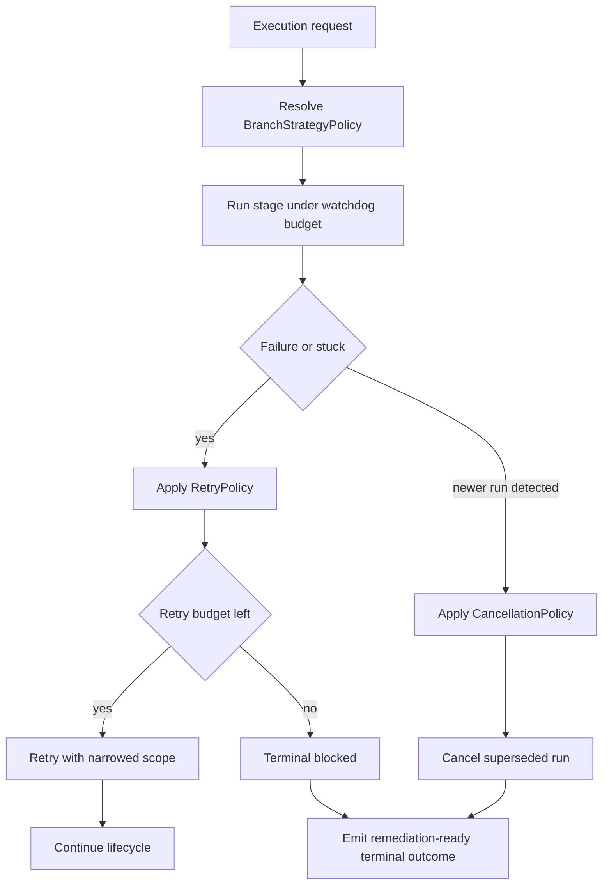

# Policy-Governed Branch Cancellation Control

## Capability Backlink

- [Agent Execution Orchestrator SPEC](../SPEC.md#policy-governed-branch-and-cancellation-control)

## Plain-Language Explanation

This capability applies the feature's locked operational policies while runs are active. It decides branch strategy defaults, enforces bounded retries with narrowed scope, and guarantees latest-run-wins supersession so concurrent or stuck runs cannot drift into ambiguous ownership.

## How It Works

## Inputs

| Input                                         | Source                                                                                   | Description                                                               |
| --------------------------------------------- | ---------------------------------------------------------------------------------------- | ------------------------------------------------------------------------- |
| `branchStrategy` override request             | [ExecutePipelineRoute](../operations.md#executepipelineroute)                            | Optional branch strategy proposal before policy resolution                |
| `executionProfile` and elapsed runtime        | [WatchdogTimeoutRule](../rules.md#watchdogtimeoutrule)                                   | Runtime signals used to detect suspected stuck stages                     |
| `retryCount` and stage failure classification | [RetryPolicy](../rules.md#retrypolicy)                                                   | Inputs for bounded retry decisioning                                      |
| Newer-run detection signal                    | [CancellationPolicy](../rules.md#cancellationpolicy)                                     | Supersession trigger for same route scope                                 |
| Active run and stage identity                 | [ExecutionRun](../domain.md#executionrun), [StageExecution](../domain.md#stageexecution) | Run topology keys required for deterministic cancellation and remediation |

## Outputs

| Output                                                 | Produced By                                                 | Description                                                                    |
| ------------------------------------------------------ | ----------------------------------------------------------- | ------------------------------------------------------------------------------ |
| Resolved [BranchStrategy](../domain.md#branchstrategy) | [BranchStrategyPolicy](../rules.md#branchstrategypolicy)    | Policy-approved branch behavior (`merge-to-head` default)                      |
| Retry transition decision                              | [RetryPolicy](../rules.md#retrypolicy)                      | Either narrowed retry continuation or terminal blocked outcome                 |
| Superseded run cancellation outcome                    | [CancelSupersededRun](../operations.md#cancelsupersededrun) | Deterministic `canceled` terminalization for older run                         |
| Remediation-ready terminal status                      | [RunStateMachine](../rules.md#runstatemachine)              | Policy-aligned blocked/failed/canceled classification for governance follow-up |

## Concept and Aspect Linkage

| Aspect        | Linked concepts and contracts                                                                                                                                                                                                                                  | Why this capability depends on it                                      |
| ------------- | -------------------------------------------------------------------------------------------------------------------------------------------------------------------------------------------------------------------------------------------------------------- | ---------------------------------------------------------------------- |
| SPEC          | [Cross-Feature Dependencies](../SPEC.md#cross-feature-dependencies), [Produces For](../SPEC.md#produces-for)                                                                                                                                                   | Anchors branch/cancellation behavior to downstream bridge consumers    |
| Domain        | [ExecutionRun](../domain.md#executionrun), [StageExecution](../domain.md#stageexecution), [BranchStrategy](../domain.md#branchstrategy), [RunState](../domain.md#runstate), [TerminalOutcome](../domain.md#terminaloutcome)                                    | Provides policy-controlled lifecycle and branch vocabulary             |
| Operations    | [ExecutePipelineRoute](../operations.md#executepipelineroute), [CancelSupersededRun](../operations.md#cancelsupersededrun)                                                                                                                                     | Implements branch resolution, retry handling, and supersession paths   |
| Workflows     | [LatestRunWinsRecoveryWorkflow](../workflows.md#latestrunwinsrecoveryworkflow)                                                                                                                                                                                 | Encodes retry/supersession behavior as deterministic recovery workflow |
| Rules         | [BranchStrategyPolicy](../rules.md#branchstrategypolicy), [RetryPolicy](../rules.md#retrypolicy), [CancellationPolicy](../rules.md#cancellationpolicy), [WatchdogTimeoutRule](../rules.md#watchdogtimeoutrule), [RunStateMachine](../rules.md#runstatemachine) | Formal policy set that constrains operational decisions                |
| Interfaces    | [SandboxProviderInterface](../interfaces.md#internal-sandboxproviderinterface), [DelegationTelemetryLedgerInterface](../interfaces.md#internal-delegationtelemetryledgerinterface)                                                                             | Connects policy decisions to execution and terminal evidence rows      |
| Observability | [GovernanceSignalEmission](../observability.md#governancesignalemission), [Metrics Derived From Telemetry](../observability.md#metrics-derived-from-telemetry)                                                                                                 | Makes retry, stuck, and cancellation outcomes measurable               |

## Architectural Design and Operationalization

### Actors

| Actor                | Responsibility                                                                        |
| -------------------- | ------------------------------------------------------------------------------------- |
| Orchestrator runtime | Evaluates and applies branch, retry, and cancellation policy contracts                |
| Operator             | Initiates runs and receives remediation outcomes when policy gates block continuation |
| Governance observer  | Uses emitted evidence to audit policy compliance and drift risk                       |

### Operational boundaries

| Boundary                | In scope                                                               | Out of scope                                                    |
| ----------------------- | ---------------------------------------------------------------------- | --------------------------------------------------------------- |
| Control-policy boundary | Branch selection, bounded retry, superseded-run cancellation           | Route template composition and capability inventory maintenance |
| Recovery boundary       | Deterministic transition from active to blocked/canceled/failed states | Business-level prioritization beyond route scope ownership      |

### In-practice usage

- Keep default branch behavior stable with [BranchStrategyPolicy](../rules.md#branchstrategypolicy) unless an explicit, valid exception is provided.
- Treat retries as controlled recovery, not open-ended looping, by enforcing [RetryPolicy](../rules.md#retrypolicy) narrowing requirements.
- Apply [CancellationPolicy](../rules.md#cancellationpolicy) whenever overlapping runs compete for the same scope so only the latest run continues.

## Related Work-Pack Artifacts

- [CAP-AEO-C1-PIPELINE-EXECUTION.md](../work-pack/capabilities/CAP-AEO-C1-PIPELINE-EXECUTION.md)
- [W4.md](../work-pack/waves/W4.md)
