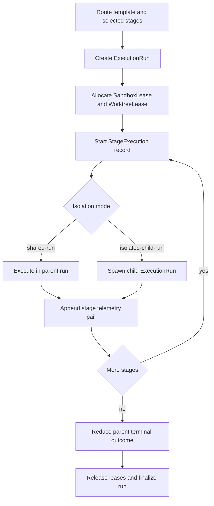

# Sandcastle-Aligned Run Lifecycle

## Capability Backlink

- [Agent Execution Orchestrator SPEC](../SPEC.md#sandcastle-aligned-run-lifecycle)

## Plain-Language Explanation

This capability executes one explicit route from queue to terminal outcome using the Sandcastle baseline. It controls lease allocation, stage execution order, child-run isolation, resume behavior, and terminal outcome reduction so every selected stage run is fully terminalized and traceable.

## How It Works

## Inputs

| Input                                    | Source                                                        | Description                                                                              |
| ---------------------------------------- | ------------------------------------------------------------- | ---------------------------------------------------------------------------------------- |
| `runId`, `pipelineId`, `templateId`      | [ExecutePipelineRoute](../operations.md#executepipelineroute) | Runtime identity for one [ExecutionRun](../domain.md#executionrun) instance              |
| `provider`                               | [ExecutePipelineRoute](../operations.md#executepipelineroute) | [ProviderAdapter](../domain.md#provideradapter) baseline (`sandcastle` for MVP)          |
| `executionProfile`                       | [WatchdogTimeoutRule](../rules.md#watchdogtimeoutrule)        | Timeout and stuck-detection budget selector                                              |
| `stagePromptArtifacts` and `stageInputs` | [ExecutePipelineRoute](../operations.md#executepipelineroute) | Ordered stage payloads with identity and handoff refs                                    |
| `snapshot` (resume path)                 | [ResumeExecutionRun](../operations.md#resumeexecutionrun)     | [SessionSnapshot](../domain.md#sessionsnapshot) used when resuming interrupted execution |

## Outputs

| Output                                                        | Produced By                                                   | Description                                                                                                      |
| ------------------------------------------------------------- | ------------------------------------------------------------- | ---------------------------------------------------------------------------------------------------------------- |
| Ordered [StageExecution](../domain.md#stageexecution) records | [ExecutePipelineRoute](../operations.md#executepipelineroute) | One execution record per selected stage with deterministic order                                                 |
| Parent run terminal state and outcome                         | [ExecutePipelineRoute](../operations.md#executepipelineroute) | [RunState](../domain.md#runstate) and [TerminalOutcome](../domain.md#terminaloutcome) reduced from stage results |
| Child-run reconciliation data                                 | [StageRunTopology](../rules.md#stageruntopology)              | For isolated stages, links parent stage run IDs to child run IDs and outcomes                                    |
| Resume continuation state                                     | [ResumeExecutionRun](../operations.md#resumeexecutionrun)     | Recovered execution context that rejoins deterministic stage flow                                                |

## Concept and Aspect Linkage

| Aspect        | Linked concepts and contracts                                                                                                                                                                                                     | Why this capability depends on it                                  |
| ------------- | --------------------------------------------------------------------------------------------------------------------------------------------------------------------------------------------------------------------------------- | ------------------------------------------------------------------ |
| SPEC          | [Capabilities](../SPEC.md#capabilities), [Feature Concept Graph](../SPEC.md#feature-concept-graph)                                                                                                                                | Anchors lifecycle semantics to canonical feature relationships     |
| Domain        | [ExecutionRun](../domain.md#executionrun), [StageExecution](../domain.md#stageexecution), [SandboxLease](../domain.md#sandboxlease), [WorktreeLease](../domain.md#worktreelease), [SessionSnapshot](../domain.md#sessionsnapshot) | Defines lifecycle state and run-topology objects                   |
| Operations    | [ExecutePipelineRoute](../operations.md#executepipelineroute), [ResumeExecutionRun](../operations.md#resumeexecutionrun)                                                                                                          | Executes, resumes, and terminalizes the route lifecycle            |
| Workflows     | [FeatureLifecyclePipelineWorkflow](../workflows.md#featurelifecyclepipelineworkflow), [LatestRunWinsRecoveryWorkflow](../workflows.md#latestrunwinsrecoveryworkflow)                                                              | Provides normal and recovery lifecycle orchestration paths         |
| Rules         | [RunStateMachine](../rules.md#runstatemachine), [TerminalOutcomeRequired](../rules.md#terminaloutcomerequired), [StageRunTopology](../rules.md#stageruntopology), [WatchdogTimeoutRule](../rules.md#watchdogtimeoutrule)          | Enforces deterministic transitions, topology, and timeout behavior |
| Interfaces    | [SandboxProviderInterface](../interfaces.md#internal-sandboxproviderinterface), [DelegationTelemetryLedgerInterface](../interfaces.md#internal-delegationtelemetryledgerinterface)                                                | Binds provider execution and stage telemetry pairing               |
| Observability | [RunArtifactMapping](../observability.md#runartifactmapping)                                                                                                                                                                      | Maps lifecycle outcomes to evidence-ready telemetry envelopes      |

## Architectural Design and Operationalization

### Actors

| Actor                     | Responsibility                                                      |
| ------------------------- | ------------------------------------------------------------------- |
| Orchestrator runtime      | Drives state transitions and ordered stage execution                |
| Sandbox/worktree provider | Supplies isolated execution resources and child-run hooks           |
| Operator                  | Requests resume/cancel decisions when manual intervention is needed |

### Operational boundaries

| Boundary                     | In scope                                                             | Out of scope                                   |
| ---------------------------- | -------------------------------------------------------------------- | ---------------------------------------------- |
| Lifecycle execution boundary | Lease lifecycle, stage execution order, retry/resume transitions     | Route authoring and capability-scope selection |
| Isolation boundary           | Parent-child run linkage and reconciliation for `isolated-child-run` | Governance signal interpretation policy        |

### In-practice usage

- Use this capability whenever explicit routes transition from planning artifacts into runtime execution.
- Preserve run determinism by binding each stage prompt artifact to one [StageExecution](../domain.md#stageexecution) record and one telemetry pair.
- Enforce [RunStateMachine](../rules.md#runstatemachine) and [TerminalOutcomeRequired](../rules.md#terminaloutcomerequired) so no started stage run remains open.

## Related Work-Pack Artifacts

- [CAP-AEO-C1-PIPELINE-EXECUTION.md](../work-pack/capabilities/CAP-AEO-C1-PIPELINE-EXECUTION.md)
- [W4.md](../work-pack/waves/W4.md)
