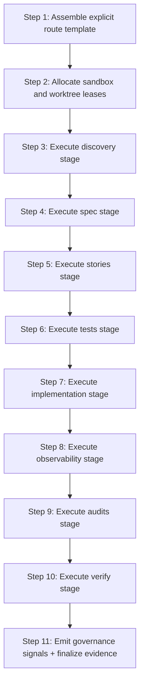
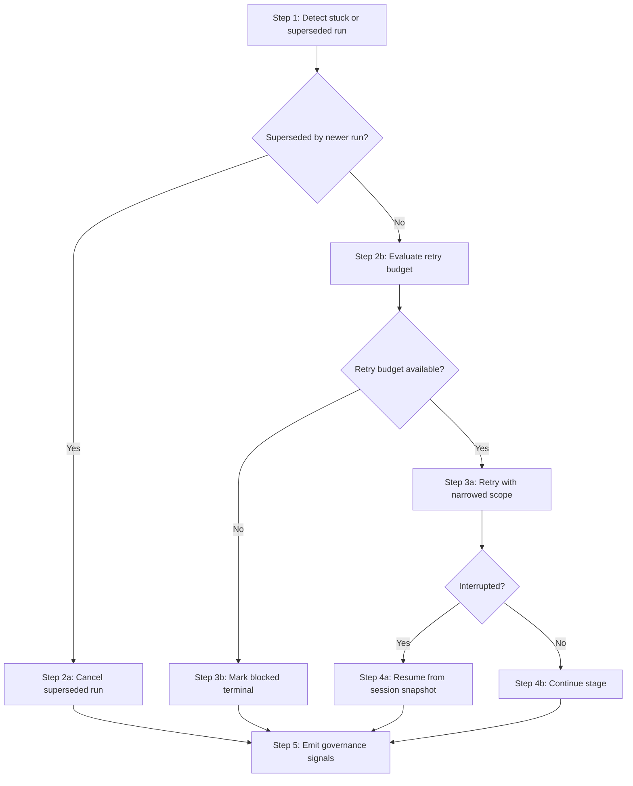

# Workflows: Agent Execution Orchestrator

## Capability Backlinks

- [Explicit Pipeline Route Composition](SPEC.md#explicit-pipeline-route-composition)
- [Sandcastle-Aligned Run Lifecycle](SPEC.md#sandcastle-aligned-run-lifecycle)
- [Policy-Governed Branch and Cancellation Control](SPEC.md#policy-governed-branch-and-cancellation-control)
- [Governance Telemetry and Signal Emission](SPEC.md#governance-telemetry-and-signal-emission)

## FeatureLifecyclePipelineWorkflow

**Type:** Workflow
**Triggers:** Operator starts one explicit [PipelineRouteTemplate](domain.md#pipelineroutetemplate)
**Orchestrates:** [AssemblePipelineRoute](operations.md#assemblepipelineroute), [ExecutePipelineRoute](operations.md#executepipelineroute), [EmitGovernanceSignals](operations.md#emitgovernancesignals)
**Compensation Strategy:** stop-and-flag (terminal `blocked` with remediation)
**Idempotency:** conditional (idempotent for identical route template and unchanged stage inputs)

### Steps

### Step Table

| #   | Step                     | Actor    | Operation                                                    | On Success                 | On Failure                     | Compensation                             |
| --- | ------------------------ | -------- | ------------------------------------------------------------ | -------------------------- | ------------------------------ | ---------------------------------------- |
| 1   | Assemble route artifact  | Operator | [AssemblePipelineRoute](operations.md#assemblepipelineroute) | Route ready                | Return contract error          | Keep prior route version                 |
| 2   | Acquire isolation leases | Runtime  | [ExecutePipelineRoute](operations.md#executepipelineroute)   | Run enters `running`       | Return provider/worktree error | Release partial leases                   |
| 3   | Discovery stage          | Runtime  | [ExecutePipelineRoute](operations.md#executepipelineroute)   | Continue to spec           | Retry or block                 | Emit recovery signal                     |
| 4   | Spec stage               | Runtime  | [ExecutePipelineRoute](operations.md#executepipelineroute)   | Continue to stories        | Retry or block                 | Emit recovery signal                     |
| 5   | Stories stage            | Runtime  | [ExecutePipelineRoute](operations.md#executepipelineroute)   | Continue to tests          | Retry or block                 | Emit recovery signal                     |
| 6   | Tests stage              | Runtime  | [ExecutePipelineRoute](operations.md#executepipelineroute)   | Continue to implementation | Retry or block                 | Emit recovery signal                     |
| 7   | Implementation stage     | Runtime  | [ExecutePipelineRoute](operations.md#executepipelineroute)   | Continue to observability  | Retry or block                 | Emit recovery signal                     |
| 8   | Observability stage      | Runtime  | [ExecutePipelineRoute](operations.md#executepipelineroute)   | Continue to audits         | Retry or block                 | Emit recovery signal                     |
| 9   | Audits stage             | Runtime  | [ExecutePipelineRoute](operations.md#executepipelineroute)   | Continue to verify         | Retry or block                 | Emit recovery signal                     |
| 10  | Verify stage             | Runtime  | [ExecutePipelineRoute](operations.md#executepipelineroute)   | Terminal outcome available | Block/fail terminal            | Emit terminal remediation signal         |
| 11  | Governance emission      | Runtime  | [EmitGovernanceSignals](operations.md#emitgovernancesignals) | Run finalized              | Signal emission error          | Return `blocked` for evidence completion |

### Invariants

| ID     | Invariant                                                                       | Formal                                                             |
| ------ | ------------------------------------------------------------------------------- | ------------------------------------------------------------------ |
| I-WF-1 | Route execution order follows [StageContract](domain.md#stagecontract) sequence | `executeOrder = template.stageContracts.order`                     |
| I-WF-2 | Every executed stage has one started and one terminal telemetry row             | `forall stageRunId, count(started)=1 and count(terminal)=1`        |
| I-WF-3 | Terminal run outcome is explicit                                                | `ExecutionRun.currentState in {completed,blocked,failed,canceled}` |
| I-WF-4 | Evidence envelope finalized before terminal success                             | `terminalOutcome=completed -> envelope.complete=true`              |

---

## LatestRunWinsRecoveryWorkflow

**Type:** Workflow
**Triggers:** Suspected stuck run, retry branch, superseded run, or interrupted run resume request
**Orchestrates:** [ResumeExecutionRun](operations.md#resumeexecutionrun), [CancelSupersededRun](operations.md#cancelsupersededrun), [EmitGovernanceSignals](operations.md#emitgovernancesignals)
**Compensation Strategy:** deterministic cancellation of superseded run + bounded retry for active run
**Idempotency:** yes for repeated cancellation/resume commands on same state snapshot

### Steps

### Step Table

| #   | Step                                 | Actor   | Operation                                                    | On Success                           | On Failure              | Compensation                           |
| --- | ------------------------------------ | ------- | ------------------------------------------------------------ | ------------------------------------ | ----------------------- | -------------------------------------- |
| 1   | Detect recovery trigger              | Runtime | [ExecutePipelineRoute](operations.md#executepipelineroute)   | Recovery branch selected             | Signal contract gap     | Emit `contract-gap`                    |
| 2   | Cancel superseded run                | Runtime | [CancelSupersededRun](operations.md#cancelsupersededrun)     | Superseded run terminal `canceled`   | Missing winner run      | Block and request operator remediation |
| 3   | Retry with narrowed scope            | Runtime | [ExecutePipelineRoute](operations.md#executepipelineroute)   | Stage advances                       | Retry exhausted         | Mark terminal `blocked`                |
| 4   | Resume interrupted run               | Runtime | [ResumeExecutionRun](operations.md#resumeexecutionrun)       | Run returns to `running` or terminal | Snapshot invalid        | Mark terminal `failed`                 |
| 5   | Emit governance and evidence signals | Runtime | [EmitGovernanceSignals](operations.md#emitgovernancesignals) | Recovery evidence finalized          | Signal emission failure | Return terminal `blocked`              |

### Invariants

| ID     | Invariant                                                | Formal                                           |
| ------ | -------------------------------------------------------- | ------------------------------------------------ |
| I-RW-1 | Superseded run never remains active after newer run wins | `newerRunExists -> supersededRun.state=canceled` |
| I-RW-2 | Retry attempts are bounded                               | `retryCount <= retryPolicy.maxRetries`           |
| I-RW-3 | Resume requires complete snapshot                        | `resumeAttempt -> snapshot.complete=true`        |
| I-RW-4 | Recovery path still emits telemetry pair                 | `recoveryStage -> telemetryPairRequired=true`    |
