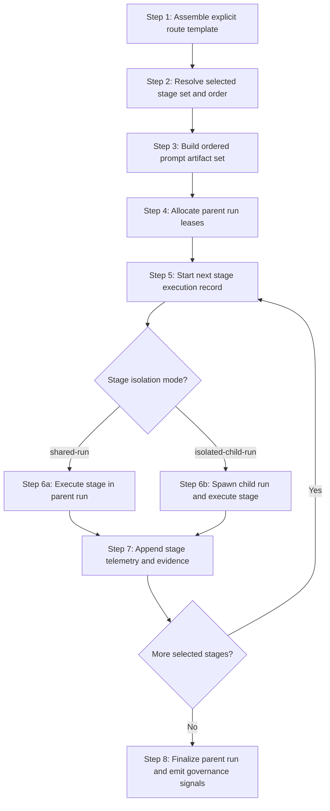
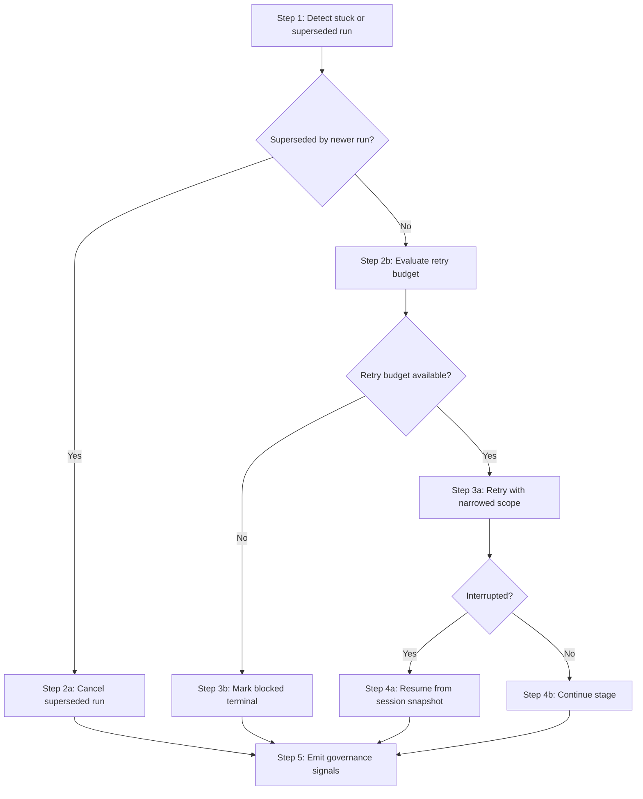

# Workflows: Agent Execution Orchestrator

## Capability Backlinks

- [Explicit Pipeline Route Composition](SPEC.md#explicit-pipeline-route-composition)
- [Sandcastle-Aligned Run Lifecycle](SPEC.md#sandcastle-aligned-run-lifecycle)
- [Policy-Governed Branch and Cancellation Control](SPEC.md#policy-governed-branch-and-cancellation-control)
- [Governance Telemetry and Signal Emission](SPEC.md#governance-telemetry-and-signal-emission)

## FeatureLifecyclePipelineWorkflow

**Type:** Workflow
**Triggers:** Operator starts one explicit [PipelineRouteTemplate](domain.md#pipelineroutetemplate)
**Orchestrates:** [AssemblePipelineRoute](operations.md#assemblepipelineroute), [ExecutePipelineRoute](operations.md#executepipelineroute), [EmitGovernanceSignals](operations.md#emitgovernancesignals)
**Compensation Strategy:** stop-and-flag (terminal `blocked` with remediation)
**Idempotency:** conditional (idempotent for identical route template and unchanged stage inputs)

### Steps

### Step Table

| #   | Step                                 | Actor    | Operation                                                    | On Success                                                            | On Failure                                             | Compensation                             |
| --- | ------------------------------------ | -------- | ------------------------------------------------------------ | --------------------------------------------------------------------- | ------------------------------------------------------ | ---------------------------------------- |
| 1   | Assemble route artifact              | Operator | [AssemblePipelineRoute](operations.md#assemblepipelineroute) | Route ready                                                           | Return contract error                                  | Keep prior route version                 |
| 2   | Resolve selected stage set and order | Runtime  | [AssemblePipelineRoute](operations.md#assemblepipelineroute) | Ordered selected stages available                                     | Invalid stage subset                                   | Return route selection remediation       |
| 3   | Build ordered prompt artifact set    | Runtime  | [AssemblePipelineRoute](operations.md#assemblepipelineroute) | Prompt artifacts keyed by `stageRunId` and ordered by selected stages | Missing stage build inputs or reproducibility mismatch | Return prompt-build remediation          |
| 4   | Acquire parent run leases            | Runtime  | [ExecutePipelineRoute](operations.md#executepipelineroute)   | Parent run enters `running`                                           | Provider/worktree error                                | Release partial leases                   |
| 5   | Start stage execution record         | Runtime  | [ExecutePipelineRoute](operations.md#executepipelineroute)   | Stage run is active                                                   | Stage contract mismatch                                | Mark stage `blocked`                     |
| 6   | Execute stage in chosen run scope    | Runtime  | [ExecutePipelineRoute](operations.md#executepipelineroute)   | Stage reaches terminal outcome                                        | Retry or block                                         | Emit recovery signal                     |
| 7   | Append stage telemetry and evidence  | Runtime  | [ExecutePipelineRoute](operations.md#executepipelineroute)   | Stage envelope complete                                               | Missing telemetry pair                                 | Return `blocked` for evidence completion |
| 8   | Finalize parent run and emit signals | Runtime  | [EmitGovernanceSignals](operations.md#emitgovernancesignals) | Parent run terminal + governance rows ready                           | Signal emission error                                  | Return `blocked` for evidence completion |

### Controlled Single Selected-Stage Scenario (C1-04)

This single selected-stage scenario uses `selectionPolicy=stage-subset` with one selected stage and preserves parent-run/stage-run topology from C1-03.

#### Controlled Inputs

| Field                                | Value                                             |
| ------------------------------------ | ------------------------------------------------- |
| `selectionPolicy`                    | `stage-subset`                                    |
| `selectedStages`                     | `[implementation]`                                |
| `stagePromptArtifacts.length`        | `1`                                               |
| `stagePromptArtifacts[0].stageRunId` | `aeo-c1-04-stage-0001`                            |
| Parent run                           | `aeo-c1-04-parent-0001` with `parentRunId = null` |

#### Terminal Outcome Mapping (Single Stage)

| Stage terminal outcome | Parent run state | Parent terminal outcome |
| ---------------------- | ---------------- | ----------------------- |
| `completed`            | `completed`      | `completed`             |
| `blocked`              | `blocked`        | `blocked`               |
| `failed`               | `failed`         | `failed`                |
| `canceled`             | `canceled`       | `canceled`              |

### Ordered Stage-Subset Chaining Scenario (C1-05)

This stage-subset chain extends C1-04 with one deterministic three-stage sequence and explicit handoff artifact refs between consecutive stages.

#### Controlled Inputs

| Field                               | Value                                                              |
| ----------------------------------- | ------------------------------------------------------------------ |
| `selectionPolicy`                   | `stage-subset`                                                     |
| `selectedStages`                    | `[plan, spec, tests]`                                              |
| `stagePromptArtifacts.length`       | `3`                                                                |
| `stagePromptArtifacts[].stageRunId` | `[aeo-c1-05-plan-0001, aeo-c1-05-spec-0001, aeo-c1-05-tests-0001]` |
| Parent run                          | `aeo-c1-05-parent-0001` with `parentRunId = null`                  |

#### Expected Handoff Artifact References

| Stage pair      | `handoffArtifactRefsByStagePair` key | Expected refs                                                                                                                                                            |
| --------------- | ------------------------------------ | ------------------------------------------------------------------------------------------------------------------------------------------------------------------------ |
| `plan -> spec`  | `plan->spec`                         | `docs/features/agent-execution-orchestrator/workflows.md#featurelifecyclepipelineworkflow`, `docs/features/agent-execution-orchestrator/rules.md#stageselectioncontract` |
| `spec -> tests` | `spec->tests`                        | `docs/features/agent-execution-orchestrator/SPEC.md#concept-registry`, `docs/features/agent-execution-orchestrator/domain.md#stageexecution`                             |

#### Mismatch Behavior

| Condition                                                       | Stage classification                         | Parent run classification |
| --------------------------------------------------------------- | -------------------------------------------- | ------------------------- |
| Missing/unresolved handoff refs for `currentStage -> nextStage` | `blocked` (`STAGE_HANDOFF_INPUT_UNRESOLVED`) | `blocked`                 |
| Consecutive stage `stageRunId` or order mismatch                | `failed` (`STAGE_HANDOFF_TOPOLOGY_MISMATCH`) | `failed`                  |

### Invariants

| ID     | Invariant                                                                                                         | Formal                                                                                                                                                           |
| ------ | ----------------------------------------------------------------------------------------------------------------- | ---------------------------------------------------------------------------------------------------------------------------------------------------------------- |
| I-WF-1 | Route execution order follows selected stage subset constrained by [StageContract](domain.md#stagecontract) order | `executeOrder = selectedStages and selectedStages preserves template.stageContracts.order`                                                                       |
| I-WF-2 | Every executed stage has one started and one terminal telemetry row                                               | `forall stageRunId, count(started)=1 and count(terminal)=1`                                                                                                      |
| I-WF-3 | Terminal run outcome is explicit                                                                                  | `ExecutionRun.currentState in {completed,blocked,failed,canceled}`                                                                                               |
| I-WF-4 | Evidence envelope finalized before terminal success                                                               | `terminalOutcome=completed -> envelope.complete=true`                                                                                                            |
| I-WF-5 | Isolated stage execution preserves parent linkage                                                                 | `stageExecution.isolationMode=isolated-child-run -> childRun.parentRunId = parentRun.runId`                                                                      |
| I-WF-6 | Prompt build order and reproducibility are validated before stage execution                                       | `buildOrder=selectedStages and same(buildInputsA, buildInputsB) -> hash(normalize(promptArtifactsA)) = hash(normalize(promptArtifactsB))`                        |
| I-WF-7 | Every consecutive stage handoff resolves required refs before next stage starts                                   | `forall i in [0..n-2], requiredArtifactRefsByStage[selectedStages[i+1]] subsetOf handoffArtifactRefsByStagePair[selectedStages[i] + "->" + selectedStages[i+1]]` |

---

## LatestRunWinsRecoveryWorkflow

**Type:** Workflow
**Triggers:** Suspected stuck run, retry branch, superseded run, or interrupted run resume request
**Orchestrates:** [ResumeExecutionRun](operations.md#resumeexecutionrun), [CancelSupersededRun](operations.md#cancelsupersededrun), [EmitGovernanceSignals](operations.md#emitgovernancesignals)
**Compensation Strategy:** deterministic cancellation of superseded run + bounded retry for active run
**Idempotency:** yes for repeated cancellation/resume commands on same state snapshot

### Steps

### Step Table

| #   | Step                                 | Actor   | Operation                                                    | On Success                           | On Failure              | Compensation                           |
| --- | ------------------------------------ | ------- | ------------------------------------------------------------ | ------------------------------------ | ----------------------- | -------------------------------------- |
| 1   | Detect recovery trigger              | Runtime | [ExecutePipelineRoute](operations.md#executepipelineroute)   | Recovery branch selected             | Signal contract gap     | Emit `contract-gap`                    |
| 2   | Cancel superseded run                | Runtime | [CancelSupersededRun](operations.md#cancelsupersededrun)     | Superseded run terminal `canceled`   | Missing winner run      | Block and request operator remediation |
| 3   | Retry with narrowed scope            | Runtime | [ExecutePipelineRoute](operations.md#executepipelineroute)   | Stage advances                       | Retry exhausted         | Mark terminal `blocked`                |
| 4   | Resume interrupted run               | Runtime | [ResumeExecutionRun](operations.md#resumeexecutionrun)       | Run returns to `running` or terminal | Snapshot invalid        | Mark terminal `failed`                 |
| 5   | Emit governance and evidence signals | Runtime | [EmitGovernanceSignals](operations.md#emitgovernancesignals) | Recovery evidence finalized          | Signal emission failure | Return terminal `blocked`              |

### Recovery Branch Scenario (C1-06)

This scenario binds recovery behavior for forced failure, supersession, and isolated-stage failure reconciliation.

#### Branch Matrix

| Branch                            | Trigger                                                                                                         | Required behavior                                                                                                                                                     | Required terminal outcome                                             |
| --------------------------------- | --------------------------------------------------------------------------------------------------------------- | --------------------------------------------------------------------------------------------------------------------------------------------------------------------- | --------------------------------------------------------------------- |
| Forced failure with bounded retry | First execution of `aeo-c1-06-ff-impl-0001` fails under watchdog or runtime failure                             | Retry once with narrowed scope (`retryCount` from `0` to `1`); second failure returns deterministic remediation `RETRY_BUDGET_EXHAUSTED`                              | Stage and parent both terminalize as `blocked`                        |
| Supersession (`latest-run-wins`)  | `aeo-c1-06-ss-parent-0002` starts while `aeo-c1-06-ss-parent-0001` is active in same route scope                | Execute [CancelSupersededRun](operations.md#cancelsupersededrun) for older run; preserve winner continuity                                                            | Superseded run terminalizes as `canceled` with terminal telemetry row |
| Isolated-stage child-run failure  | `implementation` stage uses `isolated-child-run` and child run `aeo-c1-06-iso-child-0001` terminalizes `failed` | Reconcile child terminal outcome into parent stage record (`stageRunId=aeo-c1-06-iso-impl-0001`, `childRunId=aeo-c1-06-iso-child-0001`) before parent terminalization | Parent stage and parent run terminalize as `failed`                   |

#### Terminalization Gate

| Checkpoint             | Requirement                                                                                                                                         |
| ---------------------- | --------------------------------------------------------------------------------------------------------------------------------------------------- |
| Stage terminalization  | Every recovery branch stage with a `started` row has exactly one terminal row (`completed`, `blocked`, `failed`, or `canceled`)                     |
| Parent terminalization | Parent run terminal outcome is reduced from branch stage outcomes using [ExecutePipelineRoute](operations.md#executepipelineroute) calculation `C3` |
| Reconciliation order   | For `isolated-child-run`, child terminal outcome is copied into parent stage record before parent terminal row append                               |

### Invariants

| ID     | Invariant                                                                | Formal                                                                                                                                             |
| ------ | ------------------------------------------------------------------------ | -------------------------------------------------------------------------------------------------------------------------------------------------- |
| I-RW-1 | Superseded run never remains active after newer run wins                 | `newerRunExists -> supersededRun.state=canceled`                                                                                                   |
| I-RW-2 | Retry attempts are bounded                                               | `retryCount <= retryPolicy.maxRetries`                                                                                                             |
| I-RW-3 | Resume requires complete snapshot                                        | `resumeAttempt -> snapshot.complete=true`                                                                                                          |
| I-RW-4 | Recovery path still emits telemetry pair                                 | `recoveryStage -> telemetryPairRequired=true`                                                                                                      |
| I-RW-5 | Recovery branches always terminalize started stage runs                  | `forall recoveryStageRunId, started(recoveryStageRunId) -> exists terminal(recoveryStageRunId)`                                                    |
| I-RW-6 | Isolated child-run failures are reconciled before parent terminalization | `stageExecution.isolationMode=isolated-child-run and childRun.terminalOutcome=t -> stageExecution.terminalOutcome=t before parent.terminalOutcome` |
