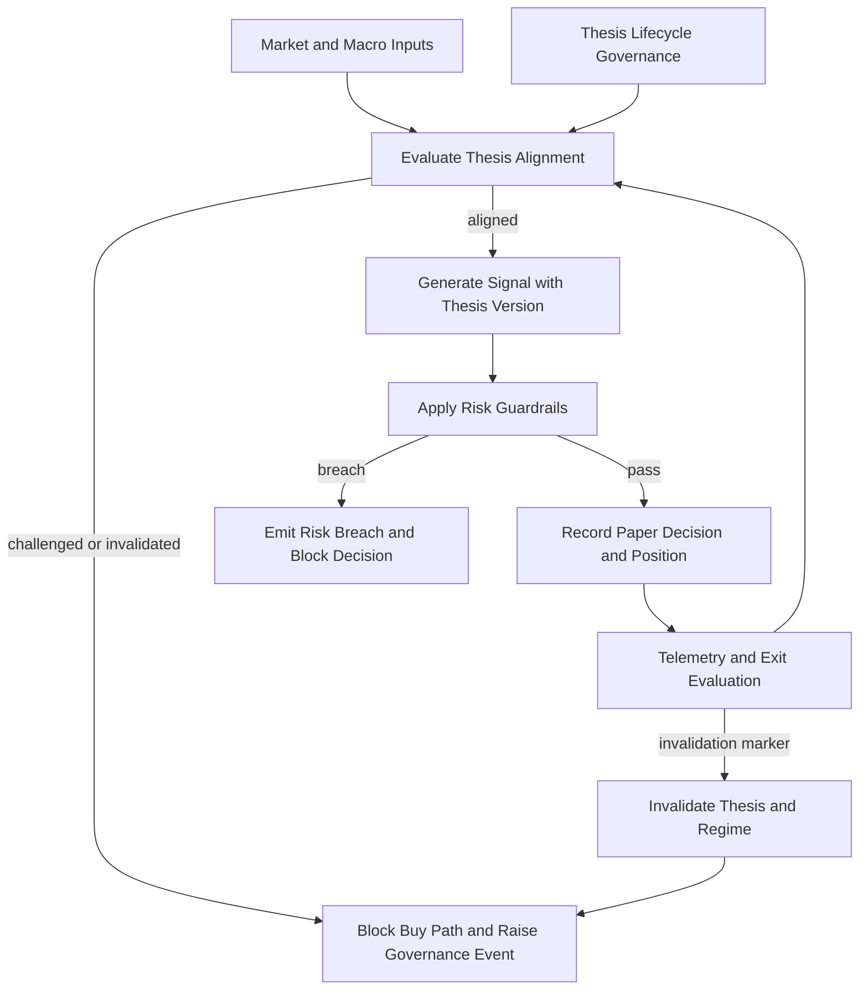
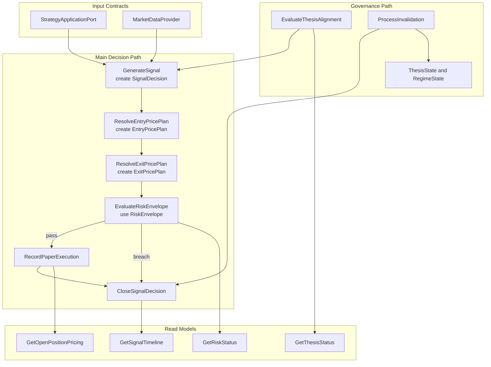

# Commodity Crisis Signal MVP

## What This Module Owns
This module owns thesis-governed signal execution for the commodity-crisis strategy under paper-trading execution.
It models the strategy thesis as a versioned lifecycle contract, gates signal generation through thesis alignment and risk controls, and closes the loop with telemetry-driven challenge and invalidation.
Every emitted signal must be traceable to an active thesis id and thesis version.

## Module Map

## Whole-System Domain Concept Chart (Simplified)

Read this top-to-bottom.
Main decision path stays in the center lane, governance is on the left, and read-model outputs are on the right.

## Capabilities

| Capability | What | Key Aspects | Detail |
|---|---|---|---|
| Thesis Modeling and Governance | Model thesis as versioned domain contract with lifecycle and invalidation semantics | Entity, State machine, Operations, Events | V1 mandatory |
| Signal Generation and Regime Detection | Convert multi-source inputs into deterministic decisions | Operations, Rules, Queries, Events | V1 core |
| Composable Entry and Exit Pricing | Compose entry and exit price plans from modular strategy set under thesis governance | Domain, Operations, Queries, Workflows | V1 mandatory |
| Guardrail Enforcement | Apply margin, stop, and lifecycle constraints before and after signals | Rules, Policies, States | V1 mandatory |
| Telemetry and Exit Control | Track invalidation markers and trigger phased unwind behavior | Queries, Workflows, State transitions | V1 mandatory |

## Pilot Decision Gate (2026-04-23)

Decisions are frozen for the MVP pilot execution cycle and used by this SPEC and [TEST-SPEC.md](TEST-SPEC.md).
Canonical decision artifact: [PILOT-DECISIONS.md](PILOT-DECISIONS.md).

| Decision | Selected Option | Traceability |
|---|---|---|
| Scope | Wave 1 focuses on deterministic domain and backend contract obligations for this feature only. | [Capabilities](#capabilities), [TEST-SPEC.md](TEST-SPEC.md#pilot-must-pass-subset-wave-1) |
| Visibility | Pilot evidence is internal to founder-operator and risk-review workflows. | [Produces For](#produces-for), [GetSignalTimeline](queries.md#getsignaltimeline) |
| Policy strictness | Strict fail-fast and hard-block behavior for risk and telemetry violations. | R3, R6-R10, R19 in [operations.md](operations.md) |
| Rounding | No semantic rounding in domain rules; presentation rounding is evidence-only. | C1-C21 in [operations.md](operations.md) |
| Auth gate | Trusted operator context is required for mutating command flows in pilot execution. | [StrategyCommandPort](interfaces.md#strategycommandport) |
| Dedupe gate | Idempotent duplicate handling for invalidation and close, plus trigger dedupe in hybrid cadence. | R10, R13 in [operations.md](operations.md), [CadenceSelectionPolicy](workflows.md#cadenceselectionpolicy) |
| Audit metadata | Every decision trace includes profileId, thesisId, thesisVersion, decisionId, timestamps, reason code, and strategy evidence. | [SignalDecision](domain.md#signaldecision), [GetSignalTimeline](queries.md#getsignaltimeline) |
| Failure policy | On contract/rule failure, emit explicit error and block progression to execution path. | [SignalCycleWorkflow](workflows.md#signalcycleworkflow), [Error States](operations.md) |
| Decision model | Deterministic rule and threshold model with no discretionary override. | [GenerateSignal](operations.md#generatesignal), [EvaluateThesisAlignment](operations.md#evaluatethesisalignment), [EvaluateRiskEnvelope](operations.md#evaluateriskenvelope) |
| Verification command substitution | Repository uses `npx tsx domainspec/tools/validate-doc-links.ts` and `bash domainspec/tools/check_docs_sync.sh` in place of unavailable `npm run docs:index`. | [PILOT-ROADMAP.md](PILOT-ROADMAP.md#phase-5-verification-and-verdict) |

## Domain Concepts

| Concept | Type | Key Constraints |
|---|---|---|
| [StrategyThesis](domain.md#strategythesis) | Entity | Exactly one active thesis per profile and versioned lifecycle |
| [StrategyProfile](domain.md#strategyprofile) | Entity | Single active profile per validation run |
| [SignalDecision](domain.md#signaldecision) | Entity | Immutable decision record with explicit reason codes |
| [EntryPricePlan](domain.md#entrypriceplan) | Value Object | Entry plan must be composed from configured strategy modules |
| [ExitPricePlan](domain.md#exitpriceplan) | Value Object | Exit plan must include protective stop and take-profit anchors |
| [RiskEnvelope](domain.md#riskenvelope) | Value Object | Margin cap and stop-loss constraints required |
| [RegimeState](states.md#regimestate) | State Machine | Deterministic transitions only |
| [ThesisState](states.md#thesisstate) | State Machine | Explicit activation, challenge, invalidation, and retirement lifecycle |

## Concept Registry

| Concept | ID | Type |
|---|---|---|
| [StrategyThesis](domain.md#strategythesis) | commodity-crisis-signal-mvp.StrategyThesis | Entity |
| [StrategyProfile](domain.md#strategyprofile) | commodity-crisis-signal-mvp.StrategyProfile | Entity |
| [ActivateStrategyThesis](operations.md#activatestrategythesis) | commodity-crisis-signal-mvp.ActivateStrategyThesis | Operation |
| [GenerateSignal](operations.md#generatesignal) | commodity-crisis-signal-mvp.GenerateSignal | Operation |
| [ResolveEntryPricePlan](operations.md#resolveentrypriceplan) | commodity-crisis-signal-mvp.ResolveEntryPricePlan | Operation |
| [ResolveExitPricePlan](operations.md#resolveexitpriceplan) | commodity-crisis-signal-mvp.ResolveExitPricePlan | Operation |
| [EvaluateThesisAlignment](operations.md#evaluatethesisalignment) | commodity-crisis-signal-mvp.EvaluateThesisAlignment | Operation |
| [EvaluateRiskEnvelope](operations.md#evaluateriskenvelope) | commodity-crisis-signal-mvp.EvaluateRiskEnvelope | Operation |
| [ProcessInvalidation](operations.md#processinvalidation) | commodity-crisis-signal-mvp.ProcessInvalidation | Operation |
| [GetSignalTimeline](queries.md#getsignaltimeline) | commodity-crisis-signal-mvp.GetSignalTimeline | Query |
| [GetOpenPositionPricing](queries.md#getopenpositionpricing) | commodity-crisis-signal-mvp.GetOpenPositionPricing | Query |
| [GetThesisStatus](queries.md#getthesisstatus) | commodity-crisis-signal-mvp.GetThesisStatus | Query |
| [StrategyApplicationPort](interfaces.md#external-boundary-strategyapplicationport-transport-agnostic) | commodity-crisis-signal-mvp.StrategyApplicationPort | Interface |
| [ProviderPriorityPolicy](workflows.md#providerprioritypolicy) | commodity-crisis-signal-mvp.ProviderPriorityPolicy | Policy |
| [InvalidationReasonCode](domain.md#invalidationreasoncode) | commodity-crisis-signal-mvp.InvalidationReasonCode | Enum |
| [ThesisActivated](events.md#thesisactivated) | commodity-crisis-signal-mvp.ThesisActivated | Event |
| [SignalGenerated](events.md#signalgenerated) | commodity-crisis-signal-mvp.SignalGenerated | Event |
| [EntryPricePlanResolved](events.md#entrypriceplanresolved) | commodity-crisis-signal-mvp.EntryPricePlanResolved | Event |
| [ExitPricePlanResolved](events.md#exitpriceplanresolved) | commodity-crisis-signal-mvp.ExitPricePlanResolved | Event |
| [RegimeState](states.md#regimestate) | commodity-crisis-signal-mvp.RegimeState | StateMachine |
| [ThesisState](states.md#thesisstate) | commodity-crisis-signal-mvp.ThesisState | StateMachine |

## Aspect Docs

| Aspect | Contains | Key Concepts |
|---|---|---|
| [Domain](domain.md) | Entities, value objects, enums | StrategyThesis, StrategyProfile, SignalDecision, RiskEnvelope |
| [Operations](operations.md) | Mutations, rules, calculations | ActivateStrategyThesis, GenerateSignal, ResolveEntryPricePlan, ResolveExitPricePlan, EvaluateThesisAlignment, EvaluateRiskEnvelope |
| [Interfaces](interfaces.md) | External and internal contracts | StrategyApplicationPort |
| [Queries](queries.md) | Read models | GetSignalTimeline, GetOpenPositionPricing, GetRiskStatus, GetThesisStatus |
| [Mappings](mappings.md) | Data transformations | NarrativeThesisToStrategyThesis, ProviderPayloadToMarketSnapshot |
| [Workflows](workflows.md) | Multi-step orchestrations and policies | ThesisLifecycleWorkflow, SignalCycleWorkflow |
| [States](states.md) | State machines and transitions | RegimeState, ThesisState, SignalDecisionState |
| [Events](events.md) | Domain events and consumers | ThesisActivated, ThesisAlignmentEvaluated, SignalGenerated, EntryPricePlanResolved, ExitPricePlanResolved, RiskBreachDetected |

## Cross-Feature Dependencies

| Capability | Depends On | Via | Why |
|---|---|---|---|
| Signal Generation and Regime Detection | none (initial feature slice) | n/a | Foundation slice for project start |

## Produces For

| Consumer | Consumes Capability | Via | What |
|---|---|---|---|
| Thesis governance review | Thesis Modeling and Governance | Query / Event | Thesis status, alignment trend, and invalidation evidence |
| Validation dashboards and notebooks | Signal Generation and Regime Detection | Query / Event | Time-series decision trace |
| Risk review process | Guardrail Enforcement | Query / Event | Breach and compliance evidence |

## User Stories

Primary acceptance scenarios and BDD coverage live in [STORIES.md](STORIES.md).

Story inventory for this MVP pilot:
- US-4: Thesis lifecycle activation and governance persistence
- US-1: Deterministic signal generation
- US-8: Composable entry and exit pricing
- US-6: Provider fallback determinism
- US-2: Risk envelope blocking
- US-3: Regime invalidation and unwind behavior
- US-5: Signal timeline and thesis provenance visibility
- US-7: Stale or incomplete telemetry rejection

## Story Coverage Matrix

| Capability | Story IDs | Covered Concepts | Notes |
|---|---|---|---|
| Thesis Modeling and Governance | US-4 | commodity-crisis-signal-mvp.StrategyThesis, commodity-crisis-signal-mvp.ActivateStrategyThesis, commodity-crisis-signal-mvp.EvaluateThesisAlignment | Covers activation and 2-cycle challenge or recovery policy |
| Signal Generation and Regime Detection | US-1, US-6 | commodity-crisis-signal-mvp.StrategyProfile, commodity-crisis-signal-mvp.GenerateSignal, commodity-crisis-signal-mvp.StrategyApplicationPort | Covers deterministic scoring and provider fallback behavior |
| Composable Entry and Exit Pricing | US-8 | commodity-crisis-signal-mvp.EntryPricePlan, commodity-crisis-signal-mvp.ExitPricePlan, commodity-crisis-signal-mvp.ResolveEntryPricePlan, commodity-crisis-signal-mvp.ResolveExitPricePlan | Covers module composition and price evidence traceability |
| Guardrail Enforcement | US-2 | commodity-crisis-signal-mvp.RiskEnvelope, commodity-crisis-signal-mvp.EvaluateRiskEnvelope | Covers margin and drawdown blocking |
| Telemetry and Exit Control | US-3, US-5, US-7 | commodity-crisis-signal-mvp.RegimeState, commodity-crisis-signal-mvp.ProcessInvalidation, commodity-crisis-signal-mvp.GetSignalTimeline, commodity-crisis-signal-mvp.GetThesisStatus | Covers invalidation, visibility, and fail-fast error path |

## Change History
See [Changelog](CHANGELOG.md) for a dated record of domain-level changes to this feature.

## References
- [Project Overview](../../PROJECT-OVERVIEW.md)
- [Initial Definitions](../../INITIAL-DEFINITIONS.md)
- [Macro Thesis and Asset Matrix](../../STRATEGY-THESIS.md)
- [Data Provider Options](../../DATA-PROVIDER-OPTIONS.md)
