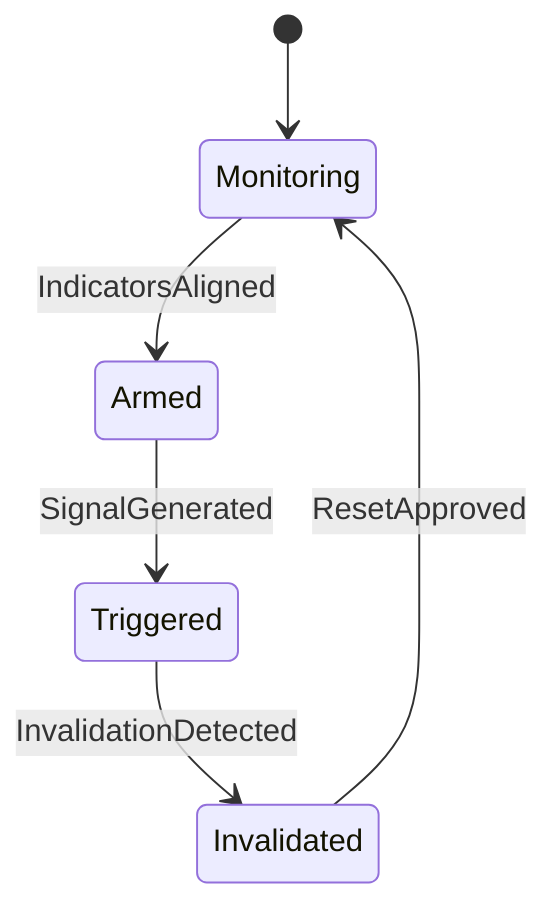
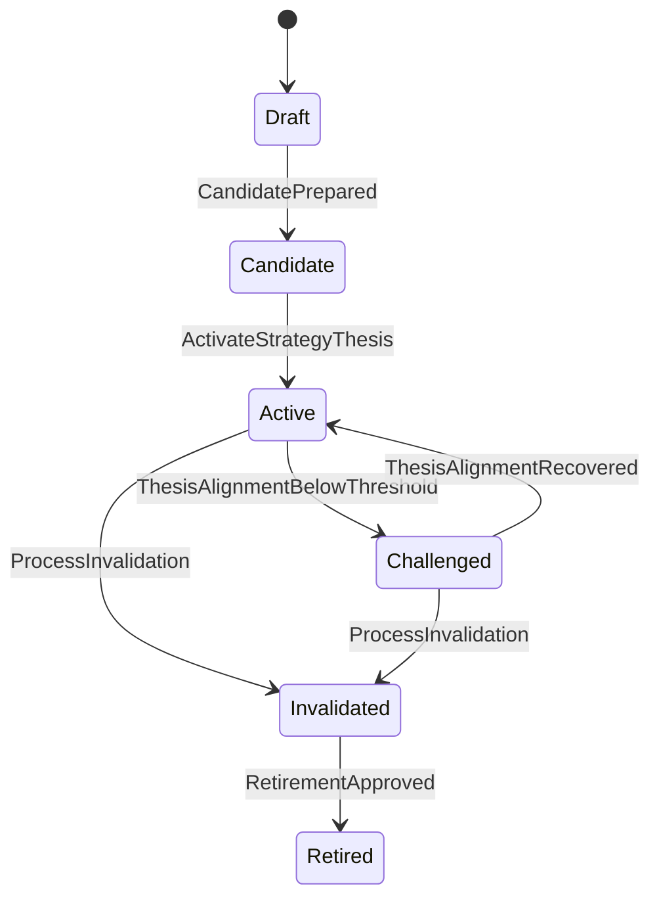
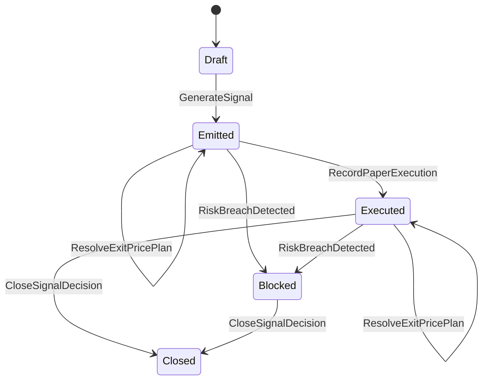

# State Machines: Commodity Crisis Signal MVP

## RegimeState

### Transition Table

| From | Event | To | Guard | Effect |
|------|-------|----|-------|--------|
| Monitoring | IndicatorsAligned | Armed | R1,R2,R3 pass | Enable signal window |
| Armed | SignalGenerated | Triggered | confidenceScore >= minThreshold | Track active thesis window |
| Triggered | InvalidationDetected | Invalidated | R9 pass | Block buy signals and start unwind |
| Invalidated | ResetApproved | Monitoring | cooldownSatisfied and governanceApproval | Resume baseline monitoring |

### Invariants

| ID | Invariant | Formal |
|----|-----------|--------|
| I1 | Invalidated regime cannot emit buy | `regimeState == Invalidated -> emittedSignalType != Buy` |
| I2 | Triggered regime requires active profile | `regimeState == Triggered -> profile.status == Active` |
| I3 | Every transition emits an auditable event | `transitionOccurred -> eventLogged == true` |

---

## ThesisState

### Transition Table

| From | Event | To | Guard | Effect |
|------|-------|----|-------|--------|
| Draft | CandidatePrepared | Candidate | proposition and constraints captured | Thesis version enters candidate pool |
| Candidate | ActivateStrategyThesis | Active | R14,R15,R16 pass | Thesis becomes active for signal generation |
| Active | ThesisAlignmentBelowThreshold | Challenged | R18-R21 pass and alignmentScore < minAlignmentScore for 2 consecutive cycles | Governance pressure is raised |
| Challenged | ThesisAlignmentRecovered | Active | R18,R19,R20,R22 pass and alignmentScore >= minAlignmentScore for 2 consecutive cycles | Thesis returns to active |
| Active | ProcessInvalidation | Invalidated | R9 pass | Thesis is invalidated and buy path is blocked |
| Challenged | ProcessInvalidation | Invalidated | R9 pass | Thesis is invalidated and buy path is blocked |
| Invalidated | RetirementApproved | Retired | governanceApproval | Thesis is archived |

### Invariants

| ID | Invariant | Formal |
|----|-----------|--------|
| I4 | Only one active thesis per profile | `count(thesis where profileId and status == Active) <= 1` |
| I5 | Invalidated thesis cannot return to active directly | `thesisStatus == Invalidated -> nextState != Active` |
| I6 | Every thesis evaluation updates lastEvaluatedAt | `evaluationExecuted -> thesis.lastEvaluatedAt updated` |
| I9 | Challenge state requires persistence evidence | `thesisStatus == Challenged -> consecutiveBelowThresholdCount >= challengeWindowCycles` |
| I10 | Recovery to active requires persistence evidence | `ThesisAlignmentRecovered -> consecutiveRecoveryCount >= recoveryWindowCycles` |

---

## SignalDecisionState

### Transition Table

| From | Event | To | Guard | Effect |
|------|-------|----|-------|--------|
| Draft | GenerateSignal | Emitted | R1-R5 and R17 pass | Persist decision and publish event |
| Emitted | ResolveEntryPricePlan | Emitted | R23-R26 pass | Persist composed entry price plan |
| Emitted | ResolveExitPricePlan | Emitted | R27-R30 pass | Persist composed exit plan |
| Emitted | RiskBreachDetected | Blocked | R6 or R7 fails | Prevent execution |
| Emitted | RecordPaperExecution | Executed | R11,R12,R31,R32 pass | Record simulated entry fill |
| Executed | ResolveExitPricePlan | Executed | R27-R30 pass | Refresh exit plan against latest data |
| Executed | RiskBreachDetected | Blocked | R6 or R7 fails | Escalate risk lockout while preserving closure path |
| Executed | CloseSignalDecision | Closed | R13,R33,R34,R35 pass | Persist exit fill and close lifecycle |
| Blocked | CloseSignalDecision | Closed | R13,R33,R34 pass | Terminal closure |

### Invariants

| ID | Invariant | Formal |
|----|-----------|--------|
| I7 | Closed decisions are immutable | `decisionStatus == Closed -> no further transitions` |
| I8 | Blocked decisions cannot transition back to active execution states | `decisionStatus == Blocked -> nextState notIn {Emitted, Executed}` |
| I11 | Executed decisions must store entry execution price | `decisionStatus == Executed -> executedEntryPrice > 0` |
| I12 | Closed executed decisions must store exit execution price | `previousState == Executed and decisionStatus == Closed -> executedExitPrice > 0` |
