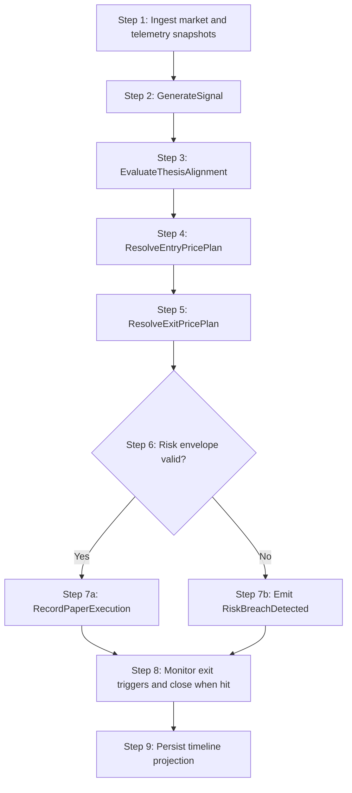
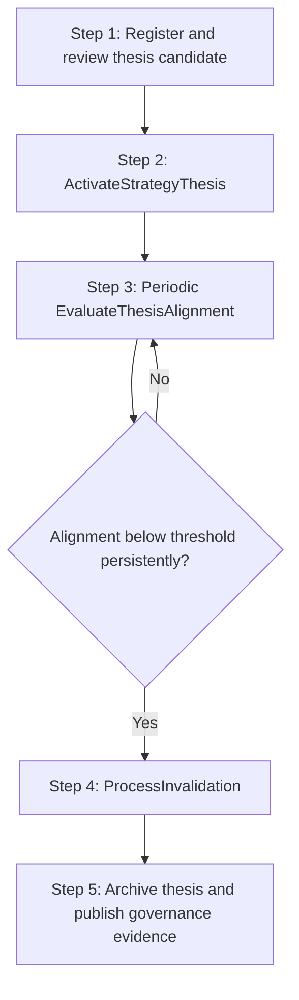

# Workflows: Commodity Crisis Signal MVP

## SignalCycleWorkflow

**Type:** Workflow
**Triggers:** Configured schedule (daily/intraday) or event-driven signal
**Orchestrates:** [GenerateSignal](operations.md#generatesignal), [EvaluateThesisAlignment](operations.md#evaluatethesisalignment), [ResolveEntryPricePlan](operations.md#resolveentrypriceplan), [ResolveExitPricePlan](operations.md#resolveexitpriceplan), [EvaluateRiskEnvelope](operations.md#evaluateriskenvelope), [RecordPaperExecution](operations.md#recordpaperexecution), [CloseSignalDecision](operations.md#closesignaldecision)
**Compensation Strategy:** notify-only
**Idempotency:** yes (safe to re-run per profile and trigger window)

### Steps



### Step Table

| # | Step | Actor | Operation | On Success | On Failure | Compensation |
| --- | ---- | ----- | --------- | ---------- | ---------- | ------------ |
| 1 | Collect snapshots | Data provider adapter | n/a | Go to step 2 | Retry with backoff and apply fallback source priority | — |
| 2 | Generate deterministic signal | Signal engine | [GenerateSignal](operations.md#generatesignal) | Go to step 3 | Emit generation error event | — |
| 3 | Evaluate thesis alignment | Signal engine | [EvaluateThesisAlignment](operations.md#evaluatethesisalignment) | Go to step 4 | Mark thesis evaluation failure and halt buy-path | — |
| 4 | Resolve entry plan | Pricing strategy engine | [ResolveEntryPricePlan](operations.md#resolveentrypriceplan) | Go to step 5 | Mark decision non-executable with strategy resolution error | — |
| 5 | Resolve exit plan | Pricing strategy engine | [ResolveExitPricePlan](operations.md#resolveexitpriceplan) | Go to step 6 | Mark decision non-executable with strategy resolution error | — |
| 6 | Enforce risk envelope | Risk engine | [EvaluateRiskEnvelope](operations.md#evaluateriskenvelope) | Go to step 7 | Block decision and emit breach | — |
| 7 | Record paper execution | Paper adapter | [RecordPaperExecution](operations.md#recordpaperexecution) | Go to step 8 | Skip execution if blocked | [CloseSignalDecision](operations.md#closesignaldecision) |
| 8 | Close when exit trigger hits | Exit controller | [CloseSignalDecision](operations.md#closesignaldecision) | Go to step 9 | Keep position open and continue monitoring | — |

### Invariants

| ID | Invariant | Formal |
| --- | --------- | ------ |
| W1 | Every emitted signal has a matching risk evaluation | `decision.status == Emitted -> riskEvaluationExists(decision.id)` |
| W2 | Blocked signals do not reach paper execution | `decision.status == Blocked -> noPaperPositionCreated(decision.id)` |
| W3 | Every emitted signal has a thesis alignment record | `decision.status == Emitted -> thesisEvaluationExists(decision.thesisId, decision.generatedAt)` |
| W4 | Executed signals must carry composed entry and exit plans | `decision.status == Executed -> decision.entryPricePlan exists and decision.exitPricePlan exists` |

---

## ProviderPriorityPolicy

**Type:** Policy
**Applies To:** SignalCycleWorkflow step 1
**Purpose:** Keep deterministic source precedence under Option D architecture.

### Priority Table

| Data Leg | Primary Source | Fallback Source | Escalation Rule |
| -------- | -------------- | --------------- | --------------- |
| B3 symbols and futures proxies | broker-native paper feed/export | brapi Pro | If primary misses 2 consecutive cycles, route B3 reads to fallback and emit source_degraded signal |
| US symbols | Twelve Data | none in V1 | If source freshness violates window, reject generation with stale_data |
| Macro baseline (Brent, FX, Henry Hub) | Twelve Data | public macro proxy set | Fallback allowed only when freshness window remains within policy |
| Shipping/geopolitical proxies | public proxy stack | manual event tagging | Missing proxy component blocks thesis alignment path |

---

## ThesisLifecycleWorkflow

**Type:** Workflow
**Triggers:** New thesis proposal, scheduled thesis review, or invalidation event
**Orchestrates:** [ActivateStrategyThesis](operations.md#activatestrategythesis), [EvaluateThesisAlignment](operations.md#evaluatethesisalignment), [ProcessInvalidation](operations.md#processinvalidation)
**Compensation Strategy:** notify-only
**Idempotency:** yes (state transitions are guarded)

### Steps



### Step Table

| # | Step | Actor | Operation | On Success | On Failure | Compensation |
| --- | ---- | ----- | --------- | ---------- | ---------- | ------------ |
| 1 | Candidate intake | Founder-operator | n/a | Go to step 2 | Request missing thesis fields | — |
| 2 | Activate thesis | Founder-operator | [ActivateStrategyThesis](operations.md#activatestrategythesis) | Go to step 3 | Keep candidate status and report guard failure | — |
| 3 | Evaluate alignment | Signal engine | [EvaluateThesisAlignment](operations.md#evaluatethesisalignment) | Continue monitoring | Raise challenged thesis status | — |
| 4 | Invalidate thesis | Telemetry processor | [ProcessInvalidation](operations.md#processinvalidation) | Go to step 5 | Keep challenged state with operator alert | — |
| 5 | Retire thesis record | Governance review | n/a | Archive complete | Re-open governance checklist | — |

---

## CadenceSelectionPolicy

**Type:** Policy
**Applies To:** SignalCycleWorkflow step 2
**Trigger Conditions:** Scheduler tick or event trigger

### Decision Table

| Condition | Selected Behavior | Notes |
| --------- | ----------------- | ----- |
| cadenceMode == Daily | Run at configured EOD timestamp | One run per trading day |
| cadenceMode == Intraday | Run every intradayIntervalMinutes | Fixed interval schedule |
| cadenceMode == EventDriven | Run only on qualifying event | No periodic run |
| cadenceMode == Hybrid | Run daily + intraday + event-driven | Merge and deduplicate by trigger key |

### Formula (if applicable)

```
nextRunAt = min(nextDailyRun, nextIntradayRun, nextEventTrigger)
```

### Configuration Parameters

| Parameter | Type | Default | Description |
| --------- | ---- | ------- | ----------- |
| intradayIntervalMinutes | integer | 60 | Intraday schedule granularity |
| minConfidenceThreshold | number | 0.55 | Minimum confidence for triggered state |
| freshnessWindowMinutes | integer | 5 | Max age for market and telemetry snapshots |
| challengeWindowCycles | integer | 2 | Consecutive below-threshold evaluations required for challenged transition |
| recoveryWindowCycles | integer | 2 | Consecutive recovery evaluations required for active recovery |
