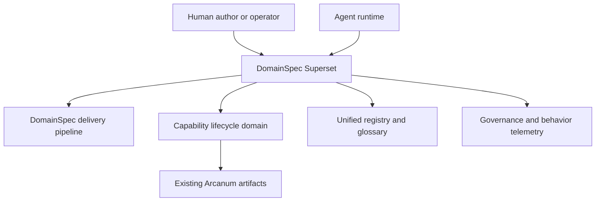
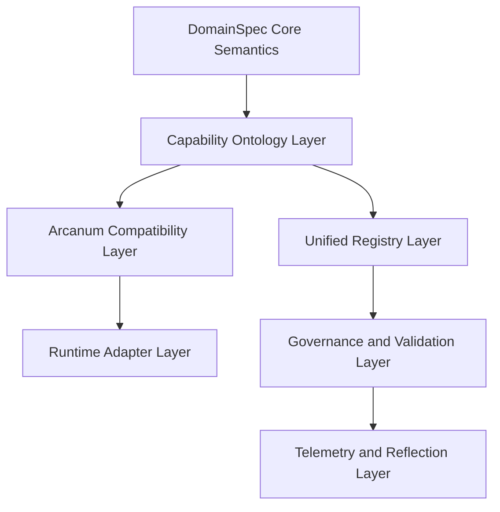
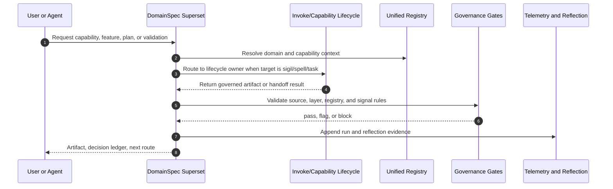

# DomainSpec Arcanum Superset Architecture

This architecture defines how DomainSpec can become a superset of Arcanum without erasing Arcanum's lifecycle model. The target shape is not a folder merge. It is a layered product architecture where DomainSpec owns domain semantics, traceability, delivery governance, and cross-project reuse, while Arcanum becomes the governed capability-lifecycle family inside that larger substrate.

## Architecture Intent

DomainSpec should generalize from a specification-first delivery framework into a domain-governed agent operating system. Arcanum's sigils, spells, observability, experiment harness, and lifecycle routes should be represented as first-class DomainSpec concepts, relationships, feature packs, and governance signals.

The resulting system must preserve Arcanum's strengths: capability boundaries, lifecycle authority, observability, validation, and reflection. DomainSpec adds the broader source-of-truth chain from business/domain intent to specification, tests, implementation, deployment, observability, and reusable agent/runtime distribution.

## Scope Boundary

Owned behavior:

- Model Arcanum capability artifacts as DomainSpec-governed feature/capability concepts.
- Map Arcanum lifecycle stages into DomainSpec pipeline stages and governance gates.
- Define a compatibility layer so existing Arcanum sigils and spells can continue to run while being indexed, validated, and distributed through DomainSpec.
- Establish a migration path from separate Arcanum and DomainSpec repositories toward a single supersystem.

Explicit exclusions:

- No immediate rewrite of Arcanum sigils, spells, or registries.
- No automatic promotion of Arcanum concepts into global DomainSpec definitions without governance evidence.
- No replacement of Arcanum lifecycle owners by DomainSpec orchestration shortcuts.

Neighboring systems:

- `implementation/domainspec/` remains the semantic and delivery-governance authority.
- `arcanum/` remains the source evidence for existing capability lifecycle behavior.
- Runtime adapters under `.codex`, `.github`, `.claude`, and `.arcanum` remain compatibility surfaces until unified distribution is planned.

## Source Contracts

| Contract ID | Source                                       | Required | Notes                                           |
| ----------- | -------------------------------------------- | -------- | ----------------------------------------------- |
| SC-001      | `implementation/domainspec/README.md`        | yes      | DomainSpec identity and pipeline source.        |
| SC-002      | `implementation/domainspec/TAXONOMY.md`      | yes      | Canonical concept type vocabulary.              |
| SC-003      | `implementation/domainspec/RELATIONSHIPS.md` | yes      | Canonical typed relationship vocabulary.        |
| SC-004      | `implementation/domainspec/CONSTITUTION.md`  | yes      | Governance rules and gates.                     |
| SC-005      | `implementation/domainspec/AUTHORITY-MAP.md` | yes      | Source-of-truth precedence.                     |
| SC-006      | `arcanum/README.md`                          | yes      | Arcanum identity and capability model.          |
| SC-007      | `arcanum/framework/CYBERALCHEMY-METHOD.md`   | yes      | Arcanum method and lifecycle philosophy.        |
| SC-008      | `arcanum/registry/SIGILS.md`                 | yes      | Sigil inventory and tier model.                 |
| SC-009      | `arcanum/registry/SPELLS.md`                 | yes      | Spell composition inventory.                    |
| SC-010      | `arcanum/spells/invoke/README.md`            | yes      | Invoke lifecycle authority and output contract. |

## Design Goals and Non-Goals

| Type     | Item                                                                               | Why                                                                                                      |
| -------- | ---------------------------------------------------------------------------------- | -------------------------------------------------------------------------------------------------------- |
| Goal     | Treat Arcanum as a DomainSpec-governed capability domain.                          | Keeps Arcanum reusable while giving it stronger domain traceability.                                     |
| Goal     | Preserve lifecycle authority boundaries.                                           | Invoke, Spellcraft, Sigil Development, and Task Session should not collapse into one vague orchestrator. |
| Goal     | Add typed graph representation for capabilities, runs, validation, and reflection. | Enables registry sync, drift detection, and cross-project retrieval.                                     |
| Goal     | Provide a migration bridge before consolidation.                                   | Existing Arcanum users should not lose command/runtime compatibility.                                    |
| Non-goal | Rewrite all sigils into DomainSpec skills in one wave.                             | That would destroy validation evidence and create avoidable churn.                                       |
| Non-goal | Make DomainSpec a prompt library.                                                  | DomainSpec remains a source-of-truth and delivery-governance framework.                                  |
| Non-goal | Promote local Arcanum vocabulary globally by default.                              | DomainSpec glossary promotion remains evidence gated.                                                    |

## View 1: Context View

| Actor or System           | Relationship to Feature                                                               | Contract Source        |
| ------------------------- | ------------------------------------------------------------------------------------- | ---------------------- |
| Human author/operator     | Requests domain delivery, capability creation, planning, validation, and maintenance. | SC-001, SC-007         |
| Agent runtime             | Executes DomainSpec and Arcanum-compatible commands.                                  | SC-006, SC-010         |
| DomainSpec pipeline       | Supplies spec, tests, implementation, observability, infra, and verification gates.   | SC-001, SC-004         |
| Arcanum capability model  | Supplies sigils, spells, tiers, lifecycle owners, validation, and reflection.         | SC-006, SC-008, SC-009 |
| Unified registry/glossary | Makes capability and domain concepts discoverable.                                    | SC-002, SC-003, SC-005 |

## View 2: High-Level Structure View

| Component                       | Primary Contracts                      | Responsibility                                                                                                            |
| ------------------------------- | -------------------------------------- | ------------------------------------------------------------------------------------------------------------------------- |
| DomainSpec Core Semantics       | SC-001, SC-002, SC-003, SC-004, SC-005 | Own meta-types, relationships, authority precedence, and pipeline rules.                                                  |
| Capability Ontology Layer       | SC-006, SC-007, SC-008, SC-009         | Represent capability, sigil, spell, run, validation, observation, reflection, and lifecycle route as DomainSpec concepts. |
| Arcanum Compatibility Layer     | SC-006, SC-010                         | Keep existing Arcanum command behavior available while adding DomainSpec indexing and governance wrappers.                |
| Unified Registry Layer          | SC-002, SC-003, SC-008, SC-009         | Bridge DomainSpec registry/glossary entries with Arcanum sigil/spell registries.                                          |
| Governance and Validation Layer | SC-004, SC-010                         | Enforce no-silent-promotion, lifecycle ownership, signal schema, and validation evidence.                                 |
| Telemetry and Reflection Layer  | SC-004, SC-006, SC-007                 | Convert run evidence into governance signals, reflection triggers, and maintenance routes.                                |

## View 3: Low-Level Components View

| Component                   | Owns                                                                                                      | Consumes                                                     | Collaboration Rule                                                                                         |
| --------------------------- | --------------------------------------------------------------------------------------------------------- | ------------------------------------------------------------ | ---------------------------------------------------------------------------------------------------------- |
| Capability Concept Schema   | `Capability`, `Sigil`, `Spell`, `LifecycleOwner`, `RuntimeAdapter`, `ValidationExperiment`, `ObservedRun` | DomainSpec taxonomy, Arcanum registries                      | Adds local candidate concepts first; global promotion requires registry governance.                        |
| Capability Relationship Map | `composes`, `invokes`, `validates`, `observes`, `reflects-on`, `routes-to`, `adapts-runtime`              | DomainSpec relationships                                     | Reuse existing edges when semantically correct; add new candidate edges only with examples and validators. |
| Arcanum Importer            | Registry and file inventory records                                                                       | `arcanum/registry`, `arcanum/*/SKILL.md`, `arcanum/spells/*` | Read-only in L0/L1; no upstream Arcanum mutation.                                                          |
| Runtime Bridge              | Command aliases and adapter metadata                                                                      | `.codex`, `.github`, `.claude`, `.arcanum`                   | Compatibility first; consolidation only after observed parity.                                             |
| Governance Gate Set         | Validation and promotion checks                                                                           | DomainSpec constitution, Invoke gates                        | Blocking gates protect lifecycle ownership and source-of-truth precedence.                                 |
| Superset Workbench          | Future UI and agent orchestration surface                                                                 | Registry, glossary, telemetry, plan state                    | UI is deferred until data contracts and registry bridge are stable.                                        |

## View 4: Workflow Process View

| Flow                         | Happy Path                                                                             | Failure or Compensation                                             | Contract Source        |
| ---------------------------- | -------------------------------------------------------------------------------------- | ------------------------------------------------------------------- | ---------------------- |
| Arcanum inventory ingestion  | Registry entries become candidate DomainSpec capability records.                       | Unknown or invalid metadata is flagged, not promoted.               | SC-005, SC-008, SC-009 |
| Capability lifecycle routing | DomainSpec detects sigil/spell/task target and routes to the Arcanum lifecycle owner.  | Missing owner or contradictory route blocks implementation handoff. | SC-007, SC-010         |
| Compatibility invocation     | Existing command adapters continue to resolve while DomainSpec records trace metadata. | Adapter mismatch creates a compatibility gap and fallback route.    | SC-006, SC-010         |
| Governance validation        | Superset artifacts pass source, glossary, relationship, and signal gates.              | High/critical violations block promotion.                           | SC-004                 |
| Reflection loop              | Run signals create maintenance recommendations.                                        | Missing deterministic telemetry records an observability gap.       | SC-004, SC-007         |

## View 5: Decision Flow View

| Decision Point        | Options or Branches                                                              | Selection Rule                                                                               | Outcome                                                                                  |
| --------------------- | -------------------------------------------------------------------------------- | -------------------------------------------------------------------------------------------- | ---------------------------------------------------------------------------------------- |
| Superset form         | Merge repos, wrap Arcanum, or model Arcanum as capability domain                 | Select model-as-domain because it preserves authority and enables gradual migration.         | DomainSpec becomes superset substrate; Arcanum remains source evidence during migration. |
| Vocabulary promotion  | Reuse DomainSpec types, add candidate types, or promote global types immediately | Reuse first; candidate second; global only after examples, validators, and authority update. | Avoids glossary/ontology pollution.                                                      |
| Runtime consolidation | Replace adapters now or run compatibility bridge                                 | Bridge first until parity and telemetry prove safe consolidation.                            | Low-risk migration.                                                                      |
| Lifecycle authority   | DomainSpec orchestrator owns all steps or routes to Arcanum owners               | Route to owning lifecycle capability.                                                        | Preserves Invoke, Spellcraft, Sigil Development, and Task Session boundaries.            |
| Plan complexity       | Low, medium, high                                                                | Cross-system ontology, runtime bridge, governance, and migration make this medium.           | Split planning may be introduced after L0 if scope expands.                              |

## View 6: Dependency Interface View

| Dependency or Interface               | Direction                      | Contract       | Boundary Rule                                                                             |
| ------------------------------------- | ------------------------------ | -------------- | ----------------------------------------------------------------------------------------- |
| DomainSpec taxonomy and relationships | internal                       | SC-002, SC-003 | Superset terms must map to typed concepts and edges.                                      |
| DomainSpec governance scripts         | internal                       | SC-004         | New checks must be deterministic before becoming required gates.                          |
| Arcanum registries                    | inbound source                 | SC-008, SC-009 | Read as source evidence; do not mutate in design/plan phases.                             |
| Arcanum command surface               | inbound/outbound compatibility | SC-006, SC-010 | Keep adapter behavior stable until parity evidence exists.                                |
| Observability stores                  | internal/outbound              | SC-004, SC-007 | Emit both DomainSpec governance signals and Arcanum invocation evidence where applicable. |
| Future consumer repositories          | outbound distribution          | SC-001, SC-006 | Export a coherent pack with compatibility guarantees and install docs.                    |

## Capability Ontology Mapping

| Arcanum Concept                           | DomainSpec Representation                                   | Notes                                                                        |
| ----------------------------------------- | ----------------------------------------------------------- | ---------------------------------------------------------------------------- |
| Sigil                                     | Capability entity plus executable skill/interface contract  | Tier becomes enum/type; trigger and output contract become rules/interfaces. |
| Spell                                     | Workflow that orchestrates capability operations            | Shared state and phase gates map to workflow, policy, and rule concepts.     |
| Formulae/Transmutation/Arcana             | Capability tier enum/type                                   | Retain Arcanum names as local vocabulary until global promotion.             |
| Invoke                                    | Workflow and policy bundle for define/design/plan authoring | Should remain lifecycle router, not be absorbed into generic planning.       |
| Spellcraft/Sigil Development/Task Session | Lifecycle owner operations/workflows                        | DomainSpec may invoke them but should not claim their lifecycle authority.   |
| Observed Invocation Loop                  | Observability workflow                                      | Maps cleanly to DomainSpec signal and telemetry concepts.                    |
| Experiment Harness                        | Validation experiment workflow                              | Connects to tests, verification, and readiness gates.                        |

## Constraints

| Constraint                                                                   | Source         | Impact                                                                           |
| ---------------------------------------------------------------------------- | -------------- | -------------------------------------------------------------------------------- |
| DomainSpec artifacts are semantic source of truth for governance behavior.   | SC-004         | Superset governance must be defined in DomainSpec before runtime enforcement.    |
| Arcanum lifecycle owners remain authoritative for sigil/spell/task mutation. | SC-006, SC-010 | DomainSpec routes and records; it does not silently execute lifecycle mutations. |
| Signal schema must stay canonical.                                           | SC-004         | Telemetry unification must use validators before promotion.                      |
| Candidate terms are not global definitions.                                  | SC-005, SC-010 | Capability vocabulary starts as local feature glossary/registry entries.         |

## Dependency And Interface Rules

| Rule ID | Rule                                                                                                                      | Applies To          | Enforcement                 |
| ------- | ------------------------------------------------------------------------------------------------------------------------- | ------------------- | --------------------------- |
| R-001   | Every imported Arcanum capability must have a DomainSpec record with source path, lifecycle owner, and validation status. | Capability importer | Registry validation report. |
| R-002   | Runtime adapters must declare whether they are canonical, compatibility, or deprecated.                                   | Runtime bridge      | Adapter inventory check.    |
| R-003   | Any new DomainSpec relationship created for Arcanum must include examples and inverse/usage guidance.                     | Capability ontology | Relationship validation.    |
| R-004   | No Arcanum registry entry may be promoted into DomainSpec's canonical registry without source evidence and approval.      | Unified registry    | Governance gate.            |
| R-005   | Implementation tasks must keep `arcanum/` source edits separate from `implementation/domainspec/` governance edits.       | Work-pack execution | Write-scope review.         |

## Data and Evidence Artifacts

| Artifact                      | Produced By             | Used For                               | Contract Source |
| ----------------------------- | ----------------------- | -------------------------------------- | --------------- |
| Capability inventory snapshot | Arcanum importer        | Registry bridge and migration planning | SC-008, SC-009  |
| Capability ontology map       | DomainSpec feature pack | Concept and relationship validation    | SC-002, SC-003  |
| Runtime adapter inventory     | Runtime bridge          | Compatibility and install planning     | SC-006          |
| Governance gap report         | Governance gate set     | Block/flag decisions                   | SC-004          |
| Observed run crosswalk        | Telemetry layer         | Reflection and maintenance routing     | SC-007          |

## Extension Points

| Extension Point      | Allowed Variation                                                         | Guardrail                                                           |
| -------------------- | ------------------------------------------------------------------------- | ------------------------------------------------------------------- |
| Capability tiers     | Add local tiers for DomainSpec-specific capability families.              | Must not rename Arcanum tiers in compatibility mode.                |
| Runtime adapters     | Add adapters for Codex, Claude, GitHub Copilot, or future runtimes.       | Adapter metadata must name canonical source and telemetry behavior. |
| Registry exporters   | Export Arcanum-compatible, DomainSpec-native, and consumer-project views. | One source-of-truth map; multiple generated views.                  |
| Validation harnesses | Add examples, fixtures, or conformance tests per capability family.       | Results must be inspectable and linked to source contracts.         |

## Trade-offs and Guardrails

| Trade-off                                                  | Benefit                                                 | Cost                                               | Guardrail                                                   |
| ---------------------------------------------------------- | ------------------------------------------------------- | -------------------------------------------------- | ----------------------------------------------------------- |
| Model Arcanum as a DomainSpec domain before migration      | Preserves behavior and creates traceable understanding. | Slower than a folder-level consolidation.          | L0 importer and map must be useful before mutation.         |
| Keep compatibility adapters                                | Reduces disruption.                                     | Maintains duplicated runtime surfaces temporarily. | Adapter inventory and deprecation plan required.            |
| Add candidate ontology before canonical vocabulary changes | Avoids premature global semantics.                      | Requires more local mapping work.                  | Promotion gates and examples.                               |
| Use DomainSpec pipeline for capability work                | End-to-end traceability.                                | More governance than simple prompt editing.        | Layered implementation and skip rules for docs-only slices. |

## Decision Log

| Decision ID | Decision                                                                                           | Options Considered                          | Reason                                                                             |
| ----------- | -------------------------------------------------------------------------------------------------- | ------------------------------------------- | ---------------------------------------------------------------------------------- |
| D-001       | DomainSpec becomes the superset substrate; Arcanum becomes a governed capability domain within it. | Folder merge, wrapper-only, model-as-domain | Model-as-domain preserves authority and supports migration.                        |
| D-002       | Use a compatibility bridge before consolidation.                                                   | Immediate replacement, bridge, no migration | Bridge creates observable parity and rollback safety.                              |
| D-003       | Treat plan as medium complexity.                                                                   | Low, medium, high                           | Cross-system ontology, governance, runtime, and migration touch multiple surfaces. |

## Risks

| Risk ID | Risk                                                   | Mitigation                                                              | Owner           |
| ------- | ------------------------------------------------------ | ----------------------------------------------------------------------- | --------------- |
| RK-001  | Superset language becomes too abstract to execute.     | L0 requires concrete importer, map, and validation output.              | domainspec-core |
| RK-002  | Arcanum lifecycle authority is accidentally flattened. | Route sigil/spell/task mutation through owning lifecycle capabilities.  | domainspec-core |
| RK-003  | Registry duplication creates drift.                    | Generate compatibility views from one bridge map.                       | domainspec-core |
| RK-004  | Governance slows first proof.                          | Use docs-only L0 with deterministic validation before runtime mutation. | domainspec-core |

## Downstream Planning Notes

- Implementation-plan inputs: this architecture, DomainSpec taxonomy/relationships, Arcanum registries, Invoke contract.
- Test implications: importer fixture tests, registry crosswalk validation, relationship validation, adapter inventory checks.
- Observability implications: crosswalk between DomainSpec governance signals and Arcanum invocation telemetry.
- Documentation implications: add a feature `SPEC.md`, capability ontology map, migration guide, and compatibility policy after L0.

## Design Transport Notes

Carry this design into a medium-complexity work-pack with L0 docs-only inventory and ontology proof, L1 compatibility bridge, L2 governance and observability gates, and L3 packaging/distribution. Do not execute source mutations in `arcanum/` until the L0 map and L1 compatibility design are reviewed.

## Gate Result

- Status: flag
- Reason: The architecture is usable for planning, but approved define outputs and a dedicated feature `SPEC.md` do not yet exist.
- Required follow-up: Create `SPEC.md` and candidate glossary/ontology map before mutation-capable implementation.
