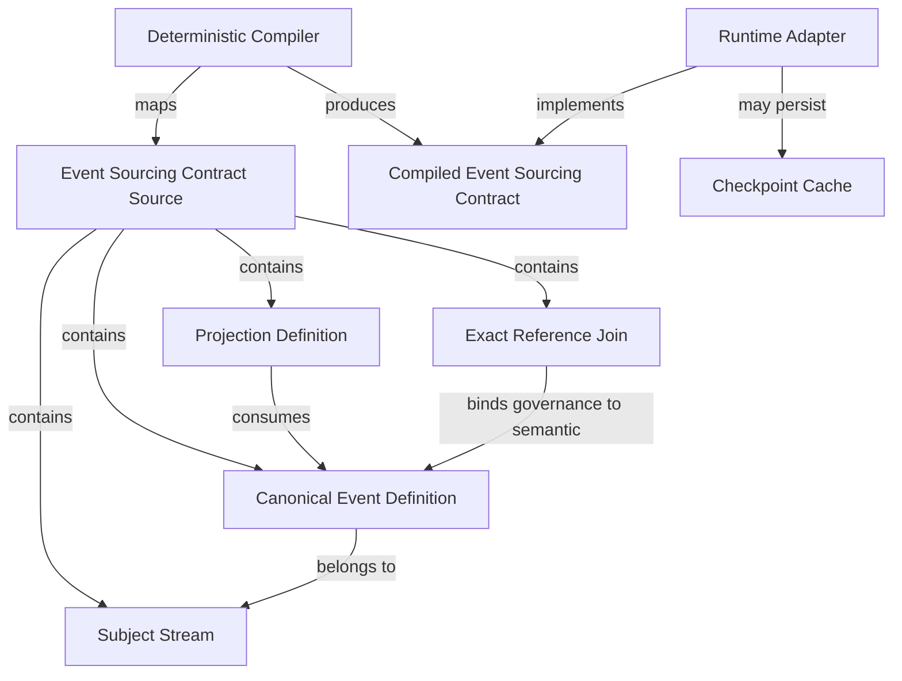

# Event Sourcing Contract

## What This Module Owns

This feature owns a declarative source model and deterministic compiler for event-sourced state contracts. It describes streams for entity, relation, and process subjects; complete-resulting-state event definitions; rebuildable projections; and the obligations a downstream runtime must satisfy.

It does not own an event store, message broker, aggregate framework, HTTP API, checkpoint database, or production conformance claim.

## Source Contract

An `EventSourcingContractSource` contains:

- a fixed source schema version;
- a non-empty contract identifier;
- one or more uniquely identified streams;
- one or more uniquely typed events;
- zero or more uniquely identified projections;
- zero or more uniquely identified exact-reference joins from governance events
  to semantic events.

Every event references a declared stream and payload schema. Every stream has at least one event. Every projection consumes one or more declared event types without duplicates. Every join binds one governance event to one or more semantic events and fails closed unless exact event identity, digest, and commit position agree.

## Fixed Version-One Semantics

| Concern                | Value                                                         |
| ---------------------- | ------------------------------------------------------------- |
| Stream subject         | `entity`, `relation`, or `process`                            |
| Stream family          | `semantic` or `governance`                                    |
| Stream identity        | `subject-kind-and-id`                                         |
| Concurrency            | `expected-stream-version`                                     |
| Stream ordering        | `stream-position`                                             |
| Global ordering        | `commit-position`                                             |
| Event state payload    | `complete-resulting-state`                                    |
| Projection key         | `stream-subject`                                              |
| Projection consistency | `global-commit-position-cut`                                  |
| Projection recovery    | `latest-valid-checkpoint-plus-tail`                           |
| Projection rebuild     | Required                                                      |
| Governance join        | `exact-event-identity-digest-commit-position` and fail closed |

## Compiler Contract

Compilation is a pure operation. It validates the full topology before returning a result, sorts streams by `streamId`, events by `eventType`, projections by `projectionId`, joins by `joinId`, and every set-like event input list lexicographically. It derives each stream's sorted event-type inventory and emits a fixed ordered list of runtime obligations.

Canonical serialization recursively sorts object keys. Array order is semantic, so the compiler normalizes every set-like array before serialization. The application use case hashes only those canonical bytes through an injected `ContentDigestPort`.

## Failure Contract

The compiler throws a typed `EventSourcingContractError` with one of these codes:

- `SOURCE_SCHEMA_VERSION_INVALID`
- `CONTRACT_ID_EMPTY`
- `STREAMS_EMPTY`
- `EVENTS_EMPTY`
- `STREAM_ID_EMPTY`
- `EVENT_TYPE_EMPTY`
- `PROJECTION_ID_EMPTY`
- `DUPLICATE_STREAM_ID`
- `DUPLICATE_EVENT_TYPE`
- `DUPLICATE_PROJECTION_ID`
- `DUPLICATE_JOIN_ID`
- `STREAM_FAMILY_INVALID`
- `STREAM_IDENTITY_RULE_INVALID`
- `STREAM_CONCURRENCY_INVALID`
- `EVENT_STREAM_UNKNOWN`
- `STREAM_WITHOUT_EVENTS`
- `PAYLOAD_SCHEMA_REF_EMPTY`
- `STATE_SEMANTICS_INVALID`
- `PROJECTION_EVENTS_EMPTY`
- `PROJECTION_EVENT_DUPLICATE`
- `PROJECTION_EVENT_UNKNOWN`
- `PROJECTION_KEY_INVALID`
- `PROJECTION_CONSISTENCY_INVALID`
- `PROJECTION_CHECKPOINT_POLICY_INVALID`
- `PROJECTION_REBUILD_REQUIRED`
- `JOIN_ID_EMPTY`
- `JOIN_GOVERNANCE_EVENT_UNKNOWN`
- `JOIN_GOVERNANCE_STREAM_REQUIRED`
- `JOIN_SEMANTIC_EVENTS_EMPTY`
- `JOIN_SEMANTIC_EVENT_DUPLICATE`
- `JOIN_SEMANTIC_EVENT_UNKNOWN`
- `JOIN_SEMANTIC_STREAM_REQUIRED`
- `JOIN_REFERENCE_SEMANTICS_INVALID`
- `JOIN_FAIL_CLOSED_REQUIRED`

Failures do not return a partial compiled contract.

## Runtime Obligation Boundary

The compiler emits obligation identifiers, not runtime effects. A downstream adapter must separately prove atomic append, optimistic concurrency, stable positions, unique event identity, one stream per subject, semantic/governance separation, exact cross-stream joins, graph-consistent cuts, replayable projections, validated checkpoints, and fail-closed retained-history behavior.

## Acceptance Criteria

1. Equivalent source permutations produce byte-identical canonical JSON.
2. Repeated compilation produces the same canonical JSON and SHA-256 digest.
3. Compilation does not mutate source arrays or objects.
4. Invalid topology fails with the expected typed code.
5. Domain code has no infrastructure dependency.
6. The backend test and type-check commands pass.

## Feature Concept Graph

## Detail Documents

- [architecture.md](architecture.md)
- [glossary.md](glossary.md)
- [domain.md](domain.md)
- [operations.md](operations.md)
- [events.md](events.md)
- [TASKS.md](TASKS.md)
