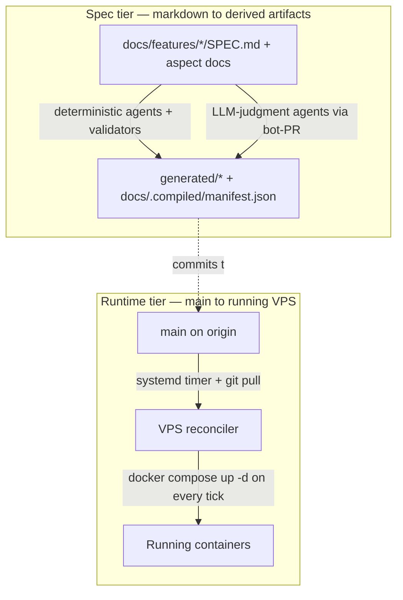
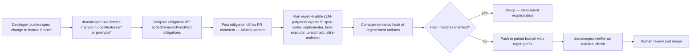
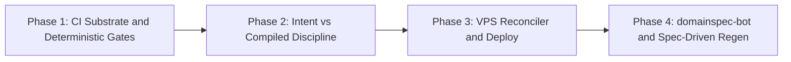

# Discovery: GitOps Adoption for DomainSpec

## Objective

Phase 1 end state: a `.github/workflows/` substrate exists, the five deterministic agents and nine `tools/` validators run as required CI checks on every PR, the drift-correction commit (named in §1) has landed, and `domainspec-verifier`'s BLOCK verdict is a binding merge-gate per an explicit governance edit. v1 end state (Phases 1–3 shipped): the intent-vs-compiled discipline is enforced via `docs/.compiled/manifest.json`, secrets live in SOPS, and a minimal Compose-on-VPS reconciler converges `main` to running containers via systemd + `git pull` + `docker compose up -d`. v2 (Phase 4) defers the spec-as-CRD-with-LLM-reconciler problem — semantic-hash idempotency and obligation-diff blast-radius scoping — to dedicated R&D.

## 1. Business Context

### Why now

DomainSpec has reached a point where its documentation describes a fully-governed, self-reconciling, signal-emitting system, but none of that machinery is actually running. `TUNING-LOOP.md` line 426 claims `.github/workflows/domainspec-tuning.yml` is deployed and `ADLC-ALIGNMENT.md` G4 marks it `✅`; the file does not exist and never has (zero commits in repo history, per `repo-assessment.md §CI/CD State Today`). `INFRA-SETUP.md:484` instructs the user `git push main # CI/CD deploys automatically` with nothing on disk to make that work. Every governance claim the framework makes is currently unverified by definition. This is the trigger: the documentation-vs-reality drift is itself the failure mode DomainSpec was built to detect, and it is now visible at the framework's own root. (SYNTHESIS §3, fact 1; repo-assessment §Brownfield item 10)

### What's broken

Each item below is anchored to a specific path discovered in the repo assessment. Where applicable, the corresponding ADLC gap (G-number) is named.

- **No CI substrate exists.** `/Users/victorboscaro/domainspec/.github/workflows/` does not exist; `git log --oneline --all -- '.github/workflows/*'` returns zero commits. (repo-assessment §CI/CD State Today; closes structural part of **G4**)
- **The pre-commit hook is dead code.** `.githooks/pre-commit` (13 lines, prettier-only) exists, but `git config core.hooksPath` is empty and `.git/hooks/` contains only `*.sample` files. The hook runs on no machine. (repo-assessment §CI/CD State Today)
- **Nine validators in `tools/` have zero callers.** `tools/analyze-signals.ts`, `tools/validate-signals.ts`, `tools/validate-orphans.ts`, `tools/validate-doc-links.ts`, `tools/validate-governance-chain.ts`, `tools/validate-tuning-report.ts`, `tools/detect-signals.ts`, `tools/generate-meta-health.ts`, `tools/prune-governance.ts` exist (~2,476 LoC across `tools/`) and none are invoked by anything. (repo-assessment §CI/CD State Today; closes parts of **G11**, **G13**, **G14**, **G15**, **G16**)
- **Five deterministic agents are uninvoked.** `copilot/agents/domainspec-verifier.agent.md` (50 lines), `domainspec-alignment-auditor.agent.md` (51), `domainspec-layering-auditor.agent.md` (41), `domainspec-otel-verifier.agent.md` (155), `domainspec-registry-sync.agent.md` (47) classify as deterministic per `repo-assessment §Agents → Controller Classification`. None run on push, PR, or schedule.
- **The signal stream has no producer and no directory.** `docs/signals/` does not exist. `docs/signals/pipeline-signals.jsonl` is referenced by Pipeline Step 10 (`README.md`), `TUNING-LOOP.md`, and the `domainspec-emit-signals` skill; nothing emits to it. (repo-assessment §Governance Machinery; closes **G2**, **G7**, **G8**)
- **Documentation falsely claims `.github/workflows/domainspec-tuning.yml` ships.** `TUNING-LOOP.md:73` and `ADLC-ALIGNMENT.md` G4 row both lie about disk reality. (repo-assessment §Brownfield item 10)
- **Infra is planning prose, not code.** `infra/` directory does not exist. `plan/infra/INF-01..INF-04` are markdown plans. No `Dockerfile`, no `docker-compose.yml` outside `node_modules/`, no `Pulumi.yaml`, no `prometheus.yml`, no `Caddyfile`. (repo-assessment §Infra/Deploy State Today)
- **Three unused secrets are referenced with no consumer.** `INFRA-SETUP.md` names `VPS_PROVIDER_TOKEN`, `CLOUDFLARE_API_TOKEN`, `PULUMI_ACCESS_TOKEN`. Nothing in the repo reads them. The cleanup window for installing SOPS is open *now*, before they are ever set. (SYNTHESIS §1, fact 6; A §Secrets Management)
- **The `copilot/` ↔ `.github/` overlay drifts silently.** `copilot/install.sh` copies from `copilot/agents/`, `copilot/skills/` to `.github/agents/` (33 files), `.github/skills/` (~90 dirs), `.github/get-shit-done/`, and writes `.github/gsd-file-manifest.json` (23,392 bytes). No checksum, no `--check` mode, no CI verifies the overlay matches its source. The current branch's diff (`copilot/agents/domainspec-orchestrator.agent.md` modified, `copilot/agents/domainspec-task-executor.agent.md` added) confirms editors do touch the source pack with no automation refresh. (SYNTHESIS §2, divergence 5; repo-assessment §Brownfield item 1; closes **G10**)
- **The only existing derived bucket has no regenerator.** `docs/features/payment-processing/_categorical/{L1,L2,delta}.json` and `extraction.log.md` are committed; the extracting tool is not in `tools/`. Drift cannot be detected because re-derivation is impossible from this repo. (repo-assessment §Brownfield item 4)
- **The payment-processing pack is evidence-trimmed below template.** `docs/features/payment-processing/SPEC.md` is 62 lines vs. `templates/SPEC.md` and `examples/payment-processing/SPEC.md`; no `TEST-SPEC.md`, no `STORIES.md`, no `observability.md`, no `ALIGNMENT-REPORT.md`. The pipeline either never ran end-to-end here or its outputs were deleted. Either way, the SPEC is no longer evidence-backed. (repo-assessment §Brownfield item 5)
- **LLM compilation is not bit-idempotent and the framework does not yet model that.** Even at `temperature=0`, GPU dynamic batching produces different logits across runs ([Thinking Machines](https://thinkingmachines.ai/blog/defeating-nondeterminism-in-llm-inference/), [LLM-42](https://arxiv.org/abs/2601.17768)). DomainSpec's nine LLM-judgment agents will produce semantically-equivalent-but-byte-different artifacts on every regen. Nothing in the repo yet declares the artifact-layer invariant (semantic hash) that would make reconciliation tractable. (SYNTHESIS §3, fact 3; B §LLM-as-compiler)

### What stays the same

The following are **explicitly out of scope for this discovery**. None will be touched, replaced, or migrated in the work that follows from here.

- **No Kubernetes adoption.** Deploy target remains single-VPS Docker Compose per `INFRA-SETUP.md` presets. ArgoCD, Flux, Argo Rollouts, Flagger, Crossplane, and Kratix are referenced as *patterns*, not adopted as runtime dependencies. (SYNTHESIS §2, divergence 2; SYNTHESIS §3, fact 4; A §Non-Kubernetes GitOps)
- **No runtime canary / progressive delivery.** Per Researcher A: "canaries without analysis are theater." DomainSpec does not yet have an SLO catalogue or analysis runner; runtime traffic-splitting is deferred. Spec-level blast-radius scoping is in scope (see §Open Questions). (SYNTHESIS §2, divergence 3; A §Reconciliation & Progressive Delivery)
- **No LLM-as-reconciler regenerating on every spec change.** The nine LLM-judgment agents stay interactive in Phase 1. Bot-PR regen for them is Phase 4 and explicitly requires the semantic-hash idempotency layer to be designed first. (SYNTHESIS §5, Q1; B §Open problems)
- **No obligation-diff blast-radius computation.** This is the dbt `state:modified+` analog for DomainSpec specs; no public framework solves it for LLM-derived artifacts. Deferred to v2. (SYNTHESIS §6, OUT for v1; B §Progressive delivery for spec changes)
- **No external secrets vault.** SOPS+age is sufficient until rotation requirements appear. ESO, HashiCorp Vault, AWS Secrets Manager are deferred. (SYNTHESIS §6, OUT for v1; A §Secrets Management)
- **No multi-agent merge-conflict resolution.** No public prior art; deferred. (B §Open problems, item 7)
- **No reconciliation rollback semantics for spec changes.** Open problem in the literature; deferred. (B §Open problems, item 6)
- **Existing root governance docs stay authoritative as written.** `AUTHORITY-MAP.md`, `AXIOMS.md`, `CONSTITUTION.md`, `TAXONOMY.md`, `RELATIONSHIPS.md`, `ARCHITECTURE.md`, `OBSERVABILITY.md`, `TEST-PIPELINE.md`, `DRIFT-CONVERGENCE.md`, `GOVERNANCE-ATTENUATION.md`, `TUNING-LOOP.md`, `ADLC-ALIGNMENT.md`, `PHASED-PLAN.md`, `CHANGELOG.md`, `README.md`. Authority for editing these files remains with their canonical owners per `AUTHORITY-MAP.md`. The only edits to these files in scope are the **drift-correction edits**, enumerated exhaustively as: (1) the `ADLC-ALIGNMENT.md` G4 row (uncheck until the workflow ships), (2) `TUNING-LOOP.md:73` (the line listing `.github/workflows/domainspec-tuning.yml` as deployed), and (3) `TUNING-LOOP.md:426` (the line repeating the same false claim). These three edits land as the **first commit of Phase 1, after this discovery is approved** — not as part of the discovery commit itself.
- **The `implementation/app-frontend/` 845-file Node.js subtree.** Authority chain is unclear (repo-assessment §Brownfield item 6); not in this discovery's scope. Reconciler will not deploy it.
- **The `vault/` knowledge corpus.** Mixed human/agent emissions; out of scope for GitOps wiring. (repo-assessment §Brownfield item 8)

---

## 2. Core Concepts

These are the abstractions the work introduces. Each names a thing that does not exist in the repo today.

### 2.1 Intent vs. compiled-artifact split (enforced)

The repo *names* this split (`AUTHORITY-MAP.md`, `ARCHITECTURE.md` "generated from docs") but does not enforce it. The new abstraction: every machine-derived file lives under a recognizable derived-tree (`generated/` or per-feature `_categorical/`), carries a `@source-hash` annotation pointing back to its generating intent, and is enumerated in a single manifest (`docs/.compiled/manifest.json`) that records `(file, source_hash, prompt_hash, model_version)`. This is the dbt-`manifest.json` pattern (B §Spec-as-code precedents) adapted for DomainSpec's LLM-derived case. CI fails on staleness — any compiled file whose recorded source hash differs from its current source hash blocks merge until either (a) the regen bot has produced an updated artifact or (b) the human has explicitly re-aligned the source. **Why this design over alternatives:** the two-repo (state repo) topology was rejected because cross-repo PR coordination breaks bisect; gitignored-and-rebuilt was rejected because losing Git as audit trail for derived behavior is incompatible with DomainSpec's governance posture (B §Intent vs. compiled-artifact split, table).

### 2.2 Two-tier reconciliation

Researchers A and B disagreed on what "the reconciler" *is* for DomainSpec. They were answering different questions; this discovery adopts both answers as a layered model.

The **spec tier** reconciler is `domainspec-pipeline` itself, formalized — its job is to converge `generated/` to whatever `docs/features/*` declares. Idempotency lives at the *artifact* layer (semantic hash match) because LLMs are not byte-idempotent at the *agent* layer (SYNTHESIS §3, fact 3). The **runtime tier** reconciler is a systemd timer + `git-sync` + `docker compose up -d` loop on the VPS — Researcher A's recommendation, ~30 lines of config, zero new dependencies, satisfies all four OpenGitOps principles (A §Non-K8s GitOps, Option 4). Pulumi (CLI in CI) handles cloud resources (DNS, VPS provisioning) where declarative IaC pays off most.

### 2.3 Bot-PR pattern for non-deterministic regen

Machine-generated changes are proposed as pull requests, never pushed to `main` directly. This is the Renovate / Dependabot / Atlantis pattern (B §Bot-PR pattern). Concretely, a `domainspec-bot` GitHub App (or Action) watches `docs/features/*` and `prompts/*` for changes; when a feature branch modifies a spec, the bot regenerates affected artifacts on a paired branch (or pushes commits to the same branch with a `[regen]` prefix), opens/updates a PR with a structured "obligation diff" comment ("derived obligations changed: TX-105 added, TX-042 removed"), and uses `domainspec-verifier` as a required check. **Why this design:** direct-to-main from an LLM is the failure mode the entire bot-PR ecosystem evolved to prevent. Three production exemplars (Renovate, Dependabot, Atlantis) and zero counter-examples. The bot never owns `main`; it owns its branch.

### 2.4 Verifier as admission gate

Today `domainspec-verifier` runs as the Stage-10 finale of an interactive pipeline run. The new abstraction: promote PASS / FLAG / BLOCK from a finale verdict to a **required CI check** that runs at every artifact-mutation boundary, mapping cleanly onto the K8s `Allow` / `Warn` / `Deny` admission semantics (B §Verifier as admission webhook). FLAG is non-blocking but tracked (Kyverno policy-report semantic). BLOCK fails the required check and disables merge. Each verification policy becomes a structured rule (analogous to a Kyverno policy CR) so the policies themselves are versioned, diffable, and testable. The Coding_Karma three-layer defense (CI catches at PR time, admission blocks bad configs, runtime drift detection) maps onto: alignment-auditor at PR time, verifier as admission, OTel `O15`/`O16` financial-integrity rules as runtime drift detection ([Coding_Karma](https://medium.com/@codingkarma/building-a-gitops-drift-detection-auto-remediation-pipeline-with-argocd-github-actions-and-f72545c63fdf)).

**Authority delegation (named explicitly).** Promoting BLOCK to merge-gate is a governance change, not a CI wiring change. Per `AUTHORITY-MAP.md`, `domainspec-verifier` is a deterministic decision agent whose verdict is currently advisory; merge-gate authority over `main` is not granted by CI configuration alone. This change is consistent with `GOVERNANCE-ATTENUATION.md` §System 3 (continuous L6 enforcement) but requires an explicit edit to `CONSTITUTION.md` (or the equivalent governance doc) declaring that CI may enforce `domainspec-verifier`'s BLOCK verdict as a binding merge-gate. **That governance edit is in scope for Phase 1**, alongside the workflow files themselves. Without it, Phase 1 is a CI wiring exercise that silently ratifies an authority escalation.

### 2.5 Deterministic-first sequencing

The Phase 1 / Phase 4 split is deliberate (SYNTHESIS §5, Q1). Wiring the five deterministic agents and nine `tools/` validators into CI is **low-risk, immediate-value** work — it closes the structural part of **G4**, **G11**, **G13**, **G14**, **G15**, **G16** without solving the LLM reconciliation problem. The harder work (semantic-hash idempotency, regen-on-spec-change, obligation diff) is deferred to Phase 4 and accepted as DomainSpec-original work because no off-the-shelf framework solves it as of May 2026 (SYNTHESIS §3, fact 5; B §Summary).

---

## 3. Repo Topology Change

The proposed structural change introduces three new top-level concerns and reorganizes the derived-artifact surface.

**New on disk:**

- `generated/` — sole location for derived artifacts. Subdivided by source feature: `generated/features/<feature>/{tests,observability,infra-deltas,registry}/`. Every file under `generated/` carries a `# @source-hash: <sha256-of-source-spec>` header (or equivalent for non-text artifacts).
- `docs/.compiled/manifest.json` — the dbt-style manifest mapping every file in `generated/` (and the existing `_categorical/` buckets) to `(source_path, source_hash, prompt_hash, model_version, generated_at)`.
- `docs/signals/` — directory for `pipeline-signals.jsonl` (append-only) and `TUNING-REPORT.md` (regenerated by `domainspec-reflect`). Currently absent (repo-assessment §Governance Machinery).
- `infra/` — concrete IaC (Pulumi project, `docker-compose.yml`, `prometheus.yml`, `Caddyfile`, `alerts/`). Today only `plan/infra/` exists as planning prose (repo-assessment §Infra/Deploy State Today).

**Stays in `docs/`:** all hand-authored intent — `docs/features/<feature>/{SPEC,domain,operations,states,interfaces,events,queries,workflows,mappings}.md`, `docs/registry.md`, `docs/glossary.md`. The `_categorical/` subdirectory pattern is preserved (it is the cleanest existing intent/derived boundary in the repo) but is enrolled in `docs/.compiled/manifest.json` and gains the missing regenerator script.

**Two derived subtrees live under `docs/` alongside hand-authored content:** `docs/.compiled/` (the manifest) and `docs/signals/` (the append-only signal stream + tuning report). They are kept under `docs/` rather than `generated/` because (a) `docs/.compiled/manifest.json` is the *index of* `generated/` and belongs adjacent to the intent it indexes, and (b) `docs/signals/` is referenced verbatim by `README.md`, `TUNING-LOOP.md`, and the `domainspec-emit-signals` skill, so renaming would require a cross-doc edit larger than the consistency win. The `.compiled` dotfile prefix and the signal-stream naming distinguish them visually from `docs/features/*` hand-authored content.

**Out of `.github/`:** the duplicated `copilot/` overlay (`.github/agents/`, `.github/skills/`, `.github/get-shit-done/`, `.github/gsd-file-manifest.json`) is reclassified as **derived from `copilot/`** — it stays where it is for tooling-compatibility reasons but gains a `tools/check-overlay-sync.sh` validator and a CI required check that diffs source against overlay. The `.github/gsd-file-manifest.json` becomes a verified manifest, not just a committed artifact (SYNTHESIS §5, Q3; closes **G10**).

---

## 4. CI Substrate

There is no `.github/workflows/` directory today. Phase 1 introduces it. The minimum substrate is four workflows plus pre-commit wiring.

- **`pr-validate.yml`** — runs on every pull request to `main`. Fans out to: `domainspec-verifier` (PASS/FLAG/BLOCK), `domainspec-alignment-auditor`, `domainspec-layering-auditor`, `domainspec-otel-verifier`, `domainspec-registry-sync` (drift check, not write), plus the nine `tools/validate-*` and `tools/detect-signals`/`tools/analyze-signals` scripts. BLOCK from any verifier or any non-zero exit from any validator fails the required check.
- **`overlay-sync.yml`** — runs on PR + push to `main`. Executes `tools/check-overlay-sync.sh` (new) which diffs `copilot/agents/`, `copilot/skills/` against `.github/agents/`, `.github/skills/`, and validates `.github/gsd-file-manifest.json` against on-disk reality. Mismatch fails the check.
- **`tuning.yml`** — runs on a schedule (every 6h) and on push to `main`. Reads `docs/signals/pipeline-signals.jsonl`, invokes `tools/analyze-signals.ts`, runs the `domainspec-reflect` skill, opens a PR with a regenerated `docs/signals/TUNING-REPORT.md` if the diff is non-trivial. **This is the workflow `TUNING-LOOP.md:73` and `ADLC-ALIGNMENT.md` G4 already claim ships** — the false claim is corrected by making the claim true, not by editing the docs to match a missing file.
- **`deploy.yml`** — runs on push to `main` after `pr-validate.yml` passes. Invokes Pulumi (CLI) to apply cloud-resource diffs (DNS, VPS provisioning). The actual container deploy is **pulled** by the VPS reconciler (see §6), not pushed by this workflow — this distinction is what makes the system GitOps and not "CI/CD with extra steps" (A §Core Principles, litmus test).

**Pre-commit wiring:** `git config core.hooksPath .githooks` is set in a one-time `tools/install-hooks.sh` (and run from a documented `make bootstrap`). The existing `.githooks/pre-commit` is extended with `gitleaks` for secret scanning (A §Failure Modes, item 3) and the link-validation step from `tools/validate-doc-links.ts`. The same `gitleaks` step runs in `pr-validate.yml` so the pre-commit hook is a developer convenience, not a security boundary.

---

## 5. Deterministic Regen Pipeline

The five deterministic agents and nine validators wire to triggers as follows. None require new agent capability; they require triggers.

| Agent / validator | Trigger | Workflow | Failure semantic |
|---|---|---|---|
| `domainspec-verifier` | PR opened/updated | `pr-validate.yml` | BLOCK fails required check; FLAG annotates PR comment |
| `domainspec-alignment-auditor` | PR opened/updated | `pr-validate.yml` | non-empty `ALIGNMENT-REPORT.md` violations fail check |
| `domainspec-layering-auditor` | PR opened/updated | `pr-validate.yml` | layering rule violation fails check |
| `domainspec-otel-verifier` | PR opened/updated when `**/observability.md` or `src/**` changes | `pr-validate.yml` | coverage gap fails check |
| `domainspec-registry-sync` | PR opened/updated, **drift check only** | `pr-validate.yml` | drift between `docs/registry.md` and SPEC concept tables fails check; the *write* version runs in Phase 4 bot-PR mode (via paired bot-PR per §6, never direct push to `main`) |
| `tools/analyze-signals.ts` | scheduled + on push | `tuning.yml` | threshold breach opens proposal Issue (existing `TUNING-LOOP.md` semantics) |
| `tools/validate-signals.ts` | PR | `pr-validate.yml` | malformed signal blocks merge |
| `tools/validate-orphans.ts` | PR | `pr-validate.yml` | orphan concept blocks merge |
| `tools/validate-doc-links.ts` | PR + pre-commit | `pr-validate.yml` + `.githooks/pre-commit` | broken link blocks merge |
| `tools/validate-governance-chain.ts` | PR | `pr-validate.yml` | broken L4→L3→L6 chain blocks merge (closes **G16**) |
| `tools/validate-tuning-report.ts` | PR when `docs/signals/TUNING-REPORT.md` changes | `pr-validate.yml` | malformed report blocks merge |
| `tools/detect-signals.ts` | scheduled | `tuning.yml` | non-blocking, emits to `pipeline-signals.jsonl` |
| `tools/generate-meta-health.ts` | scheduled | `tuning.yml` | regenerates `META-HEALTH.md` (closes **G15**) |
| `tools/prune-governance.ts` | scheduled (weekly) | `tuning.yml` | opens cleanup PR if pruning is non-trivial |

This wiring is **the entire substance of Phase 1**. There is no new agent code required — every component named above already exists in the repo and is described above with its line-counts. Phase 1 is 100% wiring.

---

## 6. Bot-PR Pipeline (`domainspec-bot`)

This is the Phase 4 component. It exists in the discovery to bound the deferred scope precisely.

The semantic hash is the Phase-4-specific invention: hash the *structural shape* of generated artifacts (sorted YAML of test obligation IDs, AST of generated TypeScript), not raw bytes (B §LLM-as-compiler, "Compile-and-cache"). This is what makes LLM regeneration tractable as a reconciliation loop despite floating-point non-determinism. **This is the place DomainSpec writes the playbook** — no public framework solves spec-as-CRD-with-LLM-reconciler-and-admission-gating end-to-end as of May 2026 (SYNTHESIS §3, fact 5; B §Open problems).

The nine LLM-judgment agents per `repo-assessment §Agents → Controller Classification` split into two sub-groups for the bot-PR pattern:

- **Regen-eligible (5)** — these produce committable artifacts and ride the bot-PR path: `domainspec-spec-writer`, `domainspec-implementer`, `domainspec-task-executor`, `domainspec-ui-architect`, `domainspec-infra-architect` (one-time). The bot operates on these.
- **Interactive-only (4)** — these do NOT produce regen artifacts and are excluded from the bot-PR pattern: `domainspec-orchestrator` (interactive routing), `domainspec-interviewer` (human-driven discovery), `domainspec-planner` (discussion-style decomposition), `mars-researcher` (external research). They stay interactive in Phase 4 as in Phase 1.

The three "mixed/derivable" agents (`domainspec-story-sync`, `domainspec-test-designer`, `domainspec-otel-instrumenter`) are Phase 4 candidates for promotion to deterministic if their derivation rules can be extracted from `TEST-PIPELINE.md` and `OBSERVABILITY.md` into code; until then they ride the bot-PR path alongside the regen-eligible five.

---

## 7. Runtime Reconciler (Compose-on-VPS)

Researcher A's recommendation, adopted verbatim because it is grounded in the actual deploy target (single-VPS Docker Compose per `INFRA-SETUP.md` presets):

- **systemd timer** runs `git pull --ff-only` on `/opt/domainspec` every 60 seconds (the OpenGitOps "pulled automatically" principle).
- **systemd path-watcher** unit fires on `infra/docker-compose.yml` change and runs `docker compose up -d`.
- **Same `docker compose up -d` runs on every timer tick regardless** — this is the cheap drift correction, since Compose is idempotent. A manual `docker stop foo` is reverted within 60 seconds (the OpenGitOps "continuously reconciled" principle, plus `auto-heal: true` semantic from A §Reconciliation).

Total on-disk footprint: a minimal systemd config (estimated at roughly 30 lines, not yet measured against a working unit) plus a `Pulumi.yaml` for cloud resources. Konta and Komodo are explicitly **not** adopted in v1 because A flags them MEDIUM confidence on bus-factor (SYNTHESIS §2, divergence 4); promote to Konta only if the simple loop proves insufficient. This is also the layer where the false `INFRA-SETUP.md:484` claim becomes true — `git push main` actually deploys when this loop runs.

---

## 8. Secrets

SOPS with `age` keys, committed to git. Zero external infrastructure dependencies. `age` keys for the maintainer set are committed to a per-developer file under `secrets/keys/`; the SOPS-encrypted blob `infra/secrets.enc.yaml` holds `VPS_PROVIDER_TOKEN`, `CLOUDFLARE_API_TOKEN`, `PULUMI_ACCESS_TOKEN`, and `GH_PAT_AGENT`. CI decrypts at `deploy.yml` runtime using a single `SOPS_AGE_KEY` GitHub secret. Pre-commit `gitleaks` ensures no plaintext secret lands. **Why now and not later:** `INFRA-SETUP.md` already names three secrets with no consumers — the cleanup window is open before the secrets exist on disk anywhere. Adopting SOPS *after* a single plaintext secret has been committed costs a key rotation; adopting it *before* costs nothing (SYNTHESIS §1, fact 6; A §Secrets Management). **Rotation-requirement detection** is the responsibility of `domainspec-reflect` consuming `agent-cost` and `governance-gap` signals from `docs/signals/pipeline-signals.jsonl`; no rotation tooling is built until that signal fires.

---

## 9. Phased Delivery

- **Phase 1 — CI substrate & deterministic gates.** First commit: the drift-correction PR enumerated in §1 (edits to `ADLC-ALIGNMENT.md` G4, `TUNING-LOOP.md:73`, `TUNING-LOOP.md:426`). Then: create `.github/workflows/{pr-validate,overlay-sync,tuning,deploy}.yml`. Wire the five deterministic agents and nine validators per §5. Configure `core.hooksPath` and add `gitleaks` to the pre-commit hook and CI. Land the governance edit to `CONSTITUTION.md` (or the equivalent) declaring that CI may enforce `domainspec-verifier`'s BLOCK verdict as a binding merge-gate (per §2.4). Correct the documentation-vs-reality drift by *making the claim true*, not by editing the docs further. Closes structural part of **G4**, **G11**, **G13**, **G14**, **G15**, **G16**.
- **Phase 2 — Intent/compiled discipline.** Introduce `generated/` tree and `docs/.compiled/manifest.json` with `(source_hash, prompt_hash, model_version)` per artifact. Mark every existing derived file with `@source-hash`. Add `tools/check-overlay-sync.sh` for the `copilot/` ↔ `.github/` boundary. Adopt SOPS+age. Ship `docs/signals/pipeline-signals.jsonl` emission via the `domainspec-emit-signals` skill. Closes **G7**, **G10**.
- **Phase 3 — VPS reconciler & deploy.** Stand up Pulumi project for cloud resources (DNS, VPS provisioning). Deploy systemd timer + git-sync + compose loop on the VPS. Prove `git push main → deploy` actually works end-to-end. Add `infra/{docker-compose.yml,prometheus.yml,Caddyfile,alerts/}` that `INFRA-SETUP.md` already promises. **What the compose file actually orchestrates in v1:** the OTel collector + Prometheus + Caddy stack from `INFRA-SETUP.md` (the observability and ingress substrate). No application containers ship in v1 — the `implementation/app-frontend/` subtree is explicitly out of scope per §1, and no other deployable service exists in the repo today.
- **Phase 4 — `domainspec-bot` & spec-driven regen.** Paired bot-PR pattern for the nine LLM-judgment agents. Obligation-diff PR comments. Verifier-as-admission on every regen. Semantic-hash idempotency for derived artifacts. **This is where DomainSpec writes the playbook because no off-the-shelf tool solves spec-as-CRD-with-LLM-reconciler-and-admission-gating as of May 2026** (SYNTHESIS §3, fact 5).

The phases are sequenced for risk reduction: Phase 1 is zero new code (pure wiring of existing components), Phase 2 introduces one new validator and one new manifest format, Phase 3 introduces a minimal systemd config and a Pulumi project, Phase 4 is the genuine R&D work. A team can ship Phases 1–3 in ordinary engineering time; Phase 4 needs design iteration.

---

## 10. Open Questions

Each question carries a recommended default. The recommendations track SYNTHESIS §5 unless the discovery surfaces a reason to diverge.

### Q1. Is `domainspec-pipeline` itself the reconciler, or only a CLI tool with deterministic validators wired into CI?

**Recommended default: BOTH, in two phases.** Phase 1 wires the five deterministic agents + nine validators as required CI checks. Phase 4 introduces `domainspec-bot` running the full LLM pipeline on spec changes via paired PR. **Rationale:** Researcher B is honest that LLM reconcilers are not idempotent without infra-layer fixes (SYNTHESIS §3, fact 3); deterministic-first sequencing buys time to design the semantic-hash idempotency layer without blocking value delivery. (SYNTHESIS §5, Q1)

### Q2. Single-VPS reconciler choice — Konta vs systemd+git-sync vs Pulumi Automation API?

**Recommended default: systemd + git-sync + `docker compose up -d` on every tick, with Pulumi (CLI in CI) for cloud resources.** **Rationale:** Researcher A makes the two-layer split case explicitly; minimal systemd config; zero new dependencies; satisfies all four OpenGitOps principles; avoids Konta's MEDIUM bus-factor risk. Promote to Konta only if the simple loop proves insufficient. (SYNTHESIS §5, Q2; SYNTHESIS §2, divergence 4)

### Q3. `copilot/` ↔ `.github/` overlay — fix as part of GitOps adoption or scope it out?

**Recommended default: IN SCOPE for Phase 1.** Add `tools/check-overlay-sync.sh` that diffs `copilot/agents/*` and `copilot/skills/*` against `.github/agents/*` and `.github/skills/*` and validates `.github/gsd-file-manifest.json` against on-disk reality. Block PRs on mismatch. **Rationale:** repo-assessment flags this MEDIUM-HIGH risk (SYNTHESIS §2, divergence 5); it is the closest existing analog to the "intent vs. compiled" enforcement story, so solving it builds the muscle for the harder Phase 4 case (spec → derived code). (SYNTHESIS §5, Q3)

### Q4. What is the "same" invariant for LLM-regenerated artifacts — bit equality, structural equality (AST), behavioral equality (tests pass), or semantic equality (business meaning)?

**Recommended default: structural equality at the `generated/` tree, with behavioral equality (test suite) as the gate before merge.** Bit equality is impossible (SYNTHESIS §3, fact 3). Structural (sorted YAML of test obligation IDs, AST of generated TypeScript) is achievable and is what `docs/.compiled/manifest.json` will hash. Behavioral (regen → run tests → compare pass-set) is the secondary gate that catches structural-equivalence-but-behavioral-divergence. Semantic is deferred — no public framework solves it. **Rationale:** Researcher B is explicit this is open (B §Open problems, item 1); structural+behavioral is the pragmatic intersection of "tractable" and "trustworthy."

### Q5. Where should `generated/` live — top-level or per-feature `_categorical/`-style?

**Recommended default: top-level `generated/`, mirroring feature paths.** Per-feature `_categorical/` is preserved for the existing payment-processing artifacts (zero migration cost) but new derived buckets land in `generated/features/<feature>/...`. **Rationale:** keeps the human-authored `docs/features/<feature>/` tree visually clean, matches the dbt convention (target/compiled directory), and makes the staleness-check CI target a single subtree. The `_categorical/` precedent is grandfathered, not extended. **Sunset trigger:** migrate `docs/features/payment-processing/_categorical/` to `generated/features/payment-processing/categorical/` once the missing regenerator script lands in `tools/` (Phase 2 scope per §9). After migration the `_categorical/` convention is retired.

### Q6. Should the four-workflow split (`pr-validate`, `overlay-sync`, `tuning`, `deploy`) collapse into one composite workflow?

**Recommended default: keep them split.** **Rationale:** distinct trigger surfaces (PR vs. push vs. schedule vs. main-only-after-pr-passes), distinct failure semantics, and easier to reason about which workflow the CI badge on the README reflects. A monolithic workflow conflates concerns and makes selective re-runs harder.

### Q7. Does `docs/.compiled/manifest.json` get committed, or is it CI-generated and gitignored?

**Recommended default: committed.** **Rationale:** the manifest is itself a derived artifact, but committing it is what makes "did anything regenerate?" a reviewable diff. dbt commits its manifest by default for the same reason (B §Spec-as-code precedents). The cost is one more file in PR diffs; the benefit is auditability and offline diff.

### Q8. What happens when `docs/signals/pipeline-signals.jsonl` grows unbounded?

**Recommended default: append-only file with monthly rotation handled by `tools/prune-governance.ts` (already exists).** **Rationale:** the existing pruner is the right home; rotation policy lives next to the prune logic. JSONL append-only is correct because audit trails should not be retroactively edited.

### Q9. Should the regen bot in Phase 4 push to the same branch (Atlantis style) or open a paired PR (Renovate style)?

**Recommended default: same branch with `[regen]` commit prefix and bot signature.** **Rationale:** Atlantis precedent; avoids doubling PR count; single review surface for human reviewer (intent diff + compiled diff together); easier bisect. The Renovate paired-PR pattern is preferred when bot work is independent of human work, which is not the DomainSpec case (regen is *triggered by* the human's spec edit on the same branch). (B §Bot-PR pattern; B §Intent vs. compiled-artifact split)

### Q10. Should the false `ADLC-ALIGNMENT.md` G4 ✅ be unchecked immediately or left until Phase 1 ships the workflow?

**Recommended default: the drift-correction PR is the *first commit of Phase 1*, opened immediately after this discovery is approved.** That PR enumerates and edits all three target lines explicitly: (1) the `ADLC-ALIGNMENT.md` G4 row (uncheck), (2) `TUNING-LOOP.md:73` (correct the false claim), and (3) `TUNING-LOOP.md:426` (correct the duplicate false claim). Authority for editing those files stays with their canonical owners per `AUTHORITY-MAP.md` — the PR is reviewed by the same humans who own the docs. **Rationale:** the lie is itself the bug DomainSpec is built to catch; correcting it as Phase 1's opening move (rather than as a side-effect of merging the discovery) keeps the discovery commit free of edits to top-tier authority artifacts and makes the correction reviewable on its own terms. (repo-assessment §Brownfield item 10; SYNTHESIS §3, fact 1)

---

## Cross-references

- Synthesis: `/Users/victorboscaro/domainspec/docs/features/gitops-assessment/research/SYNTHESIS.md`
- Researcher A (foundations): `/Users/victorboscaro/domainspec/docs/features/gitops-assessment/research/research-a-foundations.md`
- Researcher B (agentic / spec-driven): `/Users/victorboscaro/domainspec/docs/features/gitops-assessment/research/research-b-agentic-spec-driven.md`
- Repo assessment: `/Users/victorboscaro/domainspec/docs/features/gitops-assessment/research/repo-assessment.md`
- ADLC gap inventory referenced throughout: `/Users/victorboscaro/domainspec/ADLC-ALIGNMENT.md` (G2, G4, G5, G6, G7, G8, G10, G11, G13, G14, G15, G16)
- Drift-correction targets: `/Users/victorboscaro/domainspec/TUNING-LOOP.md:73`, `/Users/victorboscaro/domainspec/ADLC-ALIGNMENT.md` G4 row, `/Users/victorboscaro/domainspec/INFRA-SETUP.md:484`
