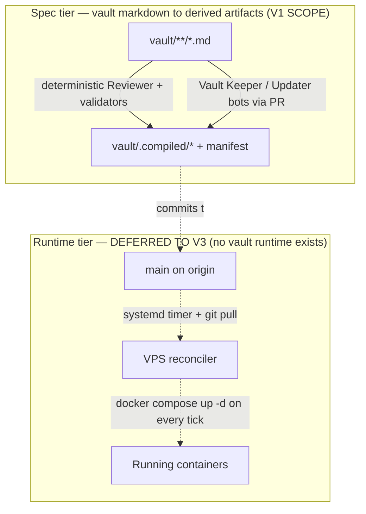
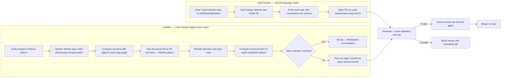
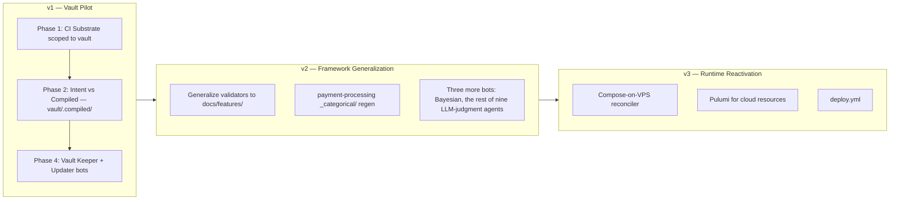

# Discovery: GitOps Adoption for DomainSpec — Vault as v1 Target

## Objective

v1 implements the GitOps loop on `/vault/` only — frontmatter validators, edge resolvers, the contradicts surfacer, and the deterministic Reviewer + Bayesian regenerators land as CI gates against vault markdown, with the Vault Keeper and Updater bots wired as the first two of five LLM-judgment agents the vault's own architecture already names. v2 generalizes the patterns proven on the vault to other features (`payment-processing` `_categorical/` regen, `domainspec-gsd-integration`, generic markdown). v3 reactivates the runtime-reconciler scope (Compose-on-VPS, Pulumi for cloud resources, deploy.yml) when a hosted DomainSpec service ships — the vault has no runtime to reconcile, so Phase 3 is explicitly deferred until that condition holds.

## 1. Business Context

### Why now

DomainSpec has reached a point where its documentation describes a fully-governed, self-reconciling, signal-emitting system, but none of that machinery is actually running. `TUNING-LOOP.md` line 426 claims `.github/workflows/domainspec-tuning.yml` is deployed and `ADLC-ALIGNMENT.md` G4 marks it `✅`; the file does not exist and never has (zero commits in repo history, per `repo-assessment.md §CI/CD State Today`). `INFRA-SETUP.md:484` instructs the user `git push main # CI/CD deploys automatically` with nothing on disk to make that work. Every governance claim the framework makes is currently unverified by definition. (SYNTHESIS §3, fact 1; repo-assessment §Brownfield item 10)

**The vault is the smallest blast-radius pilot to fix this.** `vault/ontology-architecture-draft.md` is itself `status: active` and describes a 5-agent system (Vault Keeper, Updater, Reviewer, Bayesian, Information Keeper), a Postgres `ontology_events` audit ledger, two trust gates, and a paired-PR pattern — none of which exists in code. The vault is right now drifting from its own spec, which is exactly the failure mode GitOps detects. Unlike a generic framework rollout, the vault is a constrained corpus of markdown with an explicit ontology already designed-as-GitOps in vocabulary: every required label is enumerable, every edge type is enumerable (14 in `vault/ontology-conventions.md` Appendix C), and every status transition has named entry/exit criteria (`vault/confidence-levels.md`). Implementing GitOps against this surface first proves the patterns on a domain whose spec is already shaped for them, before the framework-generic version is extracted.

### What's broken

The vault-specific items are the v1 target. The framework-wide items remain true and are addressed as a side-effect of the vault pilot — the CI substrate the vault needs (workflows, validators, hooks) is the same substrate the framework needs.

**Vault-specific (v1 scope):**

- **The five named agents are uninvoked.** `vault/ontology-architecture-draft.md` (lines 60–67, 126–131) describes Vault Keeper, Updater, Reviewer, Bayesian, and Information Keeper with explicit responsibilities; none exist in `copilot/agents/` or anywhere on disk. The vault's own architectural spec is fiction.
- **Frontmatter validator does not run on commit.** `vault/ontology-conventions.md §Required Frontmatter` (lines 51–67) specifies seven required labels (`tags`, `node_type`, `is_session`, `layer`, `nature`, `status`, `version`) with enumerated value sets in Appendix B. Nothing validates that any vault file actually carries them or uses values from the catalog.
- **Edge resolver does not exist.** `vault/ontology-conventions.md` Appendix C enumerates 14 edge types (`resolves`, `derives-from`, `implements`, `validates`, `exemplifies`, `refines`, `contextualizes`, `depends-on`, `alternative-to`, `contradicts`, `questions`, `updates`, `supersedes`, `deprecates`) declared in each document's `## Connections` section. No tool checks that referenced documents resolve to real files, that edge types are from the catalog, or that bidirectional pairs are mutually declared.
- **Status promotion/demotion is unautomated.** `vault/confidence-levels.md` defines a 5-level lifecycle (`draft` → `exploratory` → `active` → `consolidated` → `evergreen`) with explicit entry and exit criteria per level (e.g., `consolidated` requires "version ≥ 1.0, no open contradictions, referenced by at least 2 lower-level documents"). No checker enforces these criteria when a PR proposes a status bump, and no surfacer flags documents whose actual edge graph violates their declared status.
- **Heuristic 9 (`Update Edges When Files Move`) is human-enforced.** `vault/agent-navigation.md` Heuristic 9 instructs agents to update inbound links on file rename. Nothing in CI catches the human or agent who forgets; broken vault links accumulate silently.
- **Heuristic 6 (`contradicts` blocks promotion) has no surfacer.** `vault/agent-navigation.md` Heuristic 6 marks `contradicts` edges as high-priority tensions that must be resolved before acting on either node. No tool lists open `contradicts` edges, no PR check blocks status promotion when a `contradicts` edge from the candidate is unresolved.
- **The `ontology_events` SQL ledger does not exist.** `vault/ontology-architecture-draft.md §3` ("Event Sourcing", lines 138–141) specifies an immutable Postgres ledger of every vault mutation. No table, no insert path, no consumer.
- **`vault/backlog/` is empty.** No intake mechanism: the Vault Keeper's "natural language → drafted ADR" pipeline has no inbox, no proposal lifecycle, no triage queue.
- **The vault's "auto-merge if Reviewer passes" gate (`ontology-architecture-draft.md §2`) has no admission webhook.** The deterministic Reviewer is named as the boundary that distinguishes auto-mergeable spec/draft changes from human-required evergreen/consolidated changes; without the Reviewer running as a required check, the boundary is descriptive, not enforced.

**Framework-wide (remains true; vault pilot fixes them as a side-effect):**

- **No CI substrate exists.** `/Users/victorboscaro/domainspec/.github/workflows/` does not exist; `git log --oneline --all -- '.github/workflows/*'` returns zero commits. (repo-assessment §CI/CD State Today; closes structural part of **G4**)
- **The pre-commit hook is dead code.** `.githooks/pre-commit` (13 lines, prettier-only) exists, but `git config core.hooksPath` is empty and `.git/hooks/` contains only `*.sample` files. The hook runs on no machine. (repo-assessment §CI/CD State Today)
- **Nine validators in `tools/` have zero callers.** `tools/analyze-signals.ts`, `tools/validate-signals.ts`, `tools/validate-orphans.ts`, `tools/validate-doc-links.ts`, `tools/validate-governance-chain.ts`, `tools/validate-tuning-report.ts`, `tools/detect-signals.ts`, `tools/generate-meta-health.ts`, `tools/prune-governance.ts` exist (~2,476 LoC across `tools/`) and none are invoked by anything. (repo-assessment §CI/CD State Today; closes parts of **G11**, **G13**, **G14**, **G15**, **G16**)
- **Five deterministic agents are uninvoked.** `copilot/agents/domainspec-verifier.agent.md` (50 lines), `domainspec-alignment-auditor.agent.md` (51), `domainspec-layering-auditor.agent.md` (41), `domainspec-otel-verifier.agent.md` (155), `domainspec-registry-sync.agent.md` (47) classify as deterministic per `repo-assessment §Agents → Controller Classification`. None run on push, PR, or schedule.
- **The signal stream has no producer and no directory.** `docs/signals/` does not exist. `docs/signals/pipeline-signals.jsonl` is referenced by Pipeline Step 10 (`README.md`), `TUNING-LOOP.md`, and the `domainspec-emit-signals` skill; nothing emits to it. (repo-assessment §Governance Machinery; closes **G2**, **G7**, **G8**)
- **Documentation falsely claims `.github/workflows/domainspec-tuning.yml` ships.** `TUNING-LOOP.md:73` and `ADLC-ALIGNMENT.md` G4 row both lie about disk reality. (repo-assessment §Brownfield item 10)
- **Infra is planning prose, not code.** `infra/` directory does not exist. `plan/infra/INF-01..INF-04` are markdown plans. No `Dockerfile`, no `docker-compose.yml` outside `node_modules/`, no `Pulumi.yaml`, no `prometheus.yml`, no `Caddyfile`. (repo-assessment §Infra/Deploy State Today)
- **Three unused secrets are referenced with no consumer.** `INFRA-SETUP.md` names `VPS_PROVIDER_TOKEN`, `CLOUDFLARE_API_TOKEN`, `PULUMI_ACCESS_TOKEN`. Nothing in the repo reads them. The cleanup window for installing SOPS is open *now*, before they are ever set. (SYNTHESIS §1, fact 6; A §Secrets Management)
- **The `copilot/` ↔ `.github/` overlay drifts silently.** `copilot/install.sh` copies from `copilot/agents/`, `copilot/skills/` to `.github/agents/` (33 files), `.github/skills/` (~90 dirs), `.github/get-shit-done/`, and writes `.github/gsd-file-manifest.json` (23,392 bytes). No checksum, no `--check` mode, no CI verifies the overlay matches its source. The current branch's diff (`copilot/agents/domainspec-orchestrator.agent.md` modified, `copilot/agents/domainspec-task-executor.agent.md` added) confirms editors do touch the source pack with no automation refresh. (SYNTHESIS §2, divergence 5; repo-assessment §Brownfield item 1; closes **G10**)
- **The only existing derived bucket has no regenerator.** `docs/features/payment-processing/_categorical/{L1,L2,delta}.json` and `extraction.log.md` are committed; the extracting tool is not in `tools/`. Drift cannot be detected because re-derivation is impossible from this repo. (repo-assessment §Brownfield item 4)
- **The payment-processing pack is evidence-trimmed below template.** `docs/features/payment-processing/SPEC.md` is 62 lines vs. `templates/SPEC.md` and `examples/payment-processing/SPEC.md`; no `TEST-SPEC.md`, no `STORIES.md`, no `observability.md`, no `ALIGNMENT-REPORT.md`. The pipeline either never ran end-to-end here or its outputs were deleted. Either way, the SPEC is no longer evidence-backed. (repo-assessment §Brownfield item 5)
- **LLM compilation is not bit-idempotent and the framework does not yet model that.** Even at `temperature=0`, GPU dynamic batching produces different logits across runs ([Thinking Machines](https://thinkingmachines.ai/blog/defeating-nondeterminism-in-llm-inference/), [LLM-42](https://arxiv.org/abs/2601.17768)). DomainSpec's nine LLM-judgment agents will produce semantically-equivalent-but-byte-different artifacts on every regen. Nothing in the repo yet declares the artifact-layer invariant (semantic hash) that would make reconciliation tractable. (SYNTHESIS §3, fact 3; B §LLM-as-compiler)

### What stays the same

The following are **explicitly out of scope for the vault pilot (v1)**. Items marked v2/v3 list the condition under which they re-enter scope.

**Out of scope for the vault pilot specifically:**

- **Information Keeper / RAG / embedding pipeline.** `vault/ontology-architecture-draft.md §4` ("Graph-Dropping RAG") is a *read* layer over the vault graph. v1 ships only the *write* layer (intake, validation, regen, audit ledger). Embeddings, contextual chunking, and the LLM router for entry-node selection are deferred — they consume a clean graph, so they are blocked on v1 anyway.
- **Generalizing validators to non-vault markdown.** The frontmatter validator, edge resolver, contradicts surfacer, and status-promotion checker run against `vault/**/*.md` only in v1. Pointing them at `docs/features/**/*.md` or arbitrary repo markdown is a v2 extraction, after the patterns prove out on the smaller corpus.
- **`docs/features/payment-processing/_categorical/` regen.** The missing regenerator script for `_categorical/{L1,L2,delta}.json` is real and is enrolled in `docs/.compiled/manifest.json` for staleness tracking only in v2 — v1 does not write that script.
- **VPS / runtime reconciler.** The vault has no runtime to reconcile. There is no service to deploy, no container image to converge, no `docker compose up -d` loop to run. Phase 3 (systemd timer, Pulumi for cloud resources, `deploy.yml`, Compose-on-VPS) is wholesale deferred to v3, conditional on a hosted DomainSpec service shipping that has runtime state to reconcile.
- **Framework extraction.** v1 does not ship a generic "DomainSpec GitOps adapter." Patterns are extracted *after* the vault pilot proves them — vault implementations of the validator, edge resolver, and bot-PR pattern become the seed for the v2 generalization, not the other way around.

**Stays out of scope across v1/v2/v3 unless a new discovery reopens them:**

- **No Kubernetes adoption.** Deploy target remains single-VPS Docker Compose per `INFRA-SETUP.md` presets. ArgoCD, Flux, Argo Rollouts, Flagger, Crossplane, and Kratix are referenced as *patterns*, not adopted as runtime dependencies. (SYNTHESIS §2, divergence 2; SYNTHESIS §3, fact 4; A §Non-Kubernetes GitOps)
- **No runtime canary / progressive delivery.** Per Researcher A: "canaries without analysis are theater." DomainSpec does not yet have an SLO catalogue or analysis runner; runtime traffic-splitting is deferred. Spec-level blast-radius scoping is in scope (see §Open Questions). (SYNTHESIS §2, divergence 3; A §Reconciliation & Progressive Delivery)
- **No LLM-as-reconciler regenerating on every spec change.** The nine LLM-judgment agents stay interactive in Phase 1. Bot-PR regen for them is Phase 4 and explicitly requires the semantic-hash idempotency layer to be designed first. (SYNTHESIS §5, Q1; B §Open problems)
- **No obligation-diff blast-radius computation.** This is the dbt `state:modified+` analog for DomainSpec specs; no public framework solves it for LLM-derived artifacts. Deferred to v2. (SYNTHESIS §6, OUT for v1; B §Progressive delivery for spec changes)
- **No external secrets vault.** SOPS+age is sufficient until rotation requirements appear. ESO, HashiCorp Vault, AWS Secrets Manager are deferred. (SYNTHESIS §6, OUT for v1; A §Secrets Management)
- **No multi-agent merge-conflict resolution.** No public prior art; deferred. (B §Open problems, item 7)
- **No reconciliation rollback semantics for spec changes.** Open problem in the literature; deferred. (B §Open problems, item 6)
- **Existing root governance docs stay authoritative as written.** `AUTHORITY-MAP.md`, `AXIOMS.md`, `CONSTITUTION.md`, `TAXONOMY.md`, `RELATIONSHIPS.md`, `ARCHITECTURE.md`, `OBSERVABILITY.md`, `TEST-PIPELINE.md`, `DRIFT-CONVERGENCE.md`, `GOVERNANCE-ATTENUATION.md`, `TUNING-LOOP.md`, `ADLC-ALIGNMENT.md`, `PHASED-PLAN.md`, `CHANGELOG.md`, `README.md`. Authority for editing these files remains with their canonical owners per `AUTHORITY-MAP.md`. The only edits to these files in scope are the **drift-correction edits**, enumerated exhaustively as: (1) the `ADLC-ALIGNMENT.md` G4 row (uncheck until the workflow ships), (2) `TUNING-LOOP.md:73` (the line listing `.github/workflows/domainspec-tuning.yml` as deployed), and (3) `TUNING-LOOP.md:426` (the line repeating the same false claim). These three edits land as the **first commit of Phase 1, after this discovery is approved** — not as part of the discovery commit itself.
- **The `implementation/app-frontend/` 845-file Node.js subtree.** Authority chain is unclear (repo-assessment §Brownfield item 6); not in this discovery's scope. Reconciler will not deploy it.
- ~~**The `vault/` knowledge corpus.** Mixed human/agent emissions; out of scope for GitOps wiring. (repo-assessment §Brownfield item 8)~~ — *citation now stale.* The vault is the v1 GitOps target per the v0.3.0 pivot. The "mixed human/agent emissions" property is precisely why it is the right pilot: the trust gates and bot/human separation are already designed for it in `vault/ontology-architecture-draft.md §2`.

---

## 2. Core Concepts

These are the abstractions the work introduces. Each names a thing that does not exist in the repo today. **For the vault pilot, each concept maps 1:1 onto a vault construct already named in `vault/ontology-architecture-draft.md`, `vault/ontology-conventions.md`, or `vault/agent-navigation.md`** — the vault was designed-as-GitOps in vocabulary; v1 turns the vocabulary into running CI.

| Concept | Vault construct it implements |
|---|---|
| Intent layer | `vault/**/*.md` (hand-edited markdown, the human-authored graph) |
| Compiled tree | `vault/.compiled/` — derived edge graph, surfaced `contradicts` set, status-promotion log, `ontology_events` ledger |
| Bot-PR pattern | **Vault Keeper** (intake from natural language → drafted ADR per `ontology-architecture-draft.md §2.1`) and **Updater** (regen on intent change per `ontology-architecture-draft.md §2.2`) |
| Verifier-as-admission | **Reviewer** (deterministic cross-check, `ontology-architecture-draft.md §2.3`) + frontmatter validator + edge resolver + `contradicts` surfacer + status-promotion checker |
| Two-tier reconciler | **Spec tier only** in v1 — vault has no runtime, so the runtime tier is wholesale deferred to v3 |

### 2.1 Intent vs. compiled-artifact split (enforced)

The repo *names* this split (`AUTHORITY-MAP.md`, `ARCHITECTURE.md` "generated from docs") but does not enforce it. **For v1, the abstraction is scoped to the vault:** `vault/**/*.md` is intent (hand-edited), `vault/.compiled/` is the compiled tree (the resolved edge graph, the surfaced contradicts set, the status-eligibility log, the file-backed `ontology_events` ledger). Each compiled file carries a `# @source-hash` header (or equivalent for JSON artifacts) pointing back to the vault paths it derives from, and `vault/.compiled/manifest.json` enumerates `(file, source_paths[], source_hashes[], generator_version, generated_at)`. This is the dbt-`manifest.json` pattern (B §Spec-as-code precedents) adapted for the vault's structural-graph case. CI fails on staleness — any compiled file whose recorded source hash differs from its current source hash blocks merge until either (a) the Updater bot has produced an updated artifact or (b) the human has explicitly re-aligned the source. **Why this design over alternatives:** the two-repo (state repo) topology was rejected because cross-repo PR coordination breaks bisect; gitignored-and-rebuilt was rejected because losing Git as audit trail for derived behavior is incompatible with DomainSpec's governance posture (B §Intent vs. compiled-artifact split, table). v2 generalizes the pattern to a framework-wide `docs/.compiled/manifest.json` indexing a `generated/` tree.

### 2.2 Two-tier reconciliation — spec tier only in v1

Researchers A and B disagreed on what "the reconciler" *is* for DomainSpec. They were answering different questions; this discovery adopts both answers as a layered model. **For v1 (vault pilot), only the spec tier ships.** The vault is markdown — there is no container to deploy, no systemd unit to converge, no `docker compose up -d` to run. The runtime tier diagram is preserved below for v3 design continuity.

The **spec tier** reconciler in v1 is the set of deterministic vault validators (frontmatter, edge resolver, contradicts surfacer, status-promotion checker) plus the Vault Keeper and Updater bots that propose changes via PR. Its job is to converge `vault/.compiled/` to whatever `vault/**/*.md` declares. Idempotency lives at the *artifact* layer (structural hash of the derived edge graph and surfaced contradicts set) because LLM-driven bots are not byte-idempotent at the *agent* layer (SYNTHESIS §3, fact 3). The **runtime tier** is preserved as a v3 reactivation point: when a hosted DomainSpec service ships, the systemd-timer + `git-sync` + `docker compose up -d` design from Researcher A (A §Non-K8s GitOps, Option 4) becomes live and Pulumi (CLI in CI) handles cloud resources at that point. Until then, this tier is design intent without a deployment target.

### 2.3 Bot-PR pattern for non-deterministic regen

Machine-generated changes are proposed as pull requests, never pushed to `main` directly. This is the Renovate / Dependabot / Atlantis pattern (B §Bot-PR pattern). Concretely, a `domainspec-bot` GitHub App (or Action) watches `docs/features/*` and `prompts/*` for changes; when a feature branch modifies a spec, the bot regenerates affected artifacts on a paired branch (or pushes commits to the same branch with a `[regen]` prefix), opens/updates a PR with a structured "obligation diff" comment ("derived obligations changed: TX-105 added, TX-042 removed"), and uses `domainspec-verifier` as a required check. **Why this design:** direct-to-main from an LLM is the failure mode the entire bot-PR ecosystem evolved to prevent. Three production exemplars (Renovate, Dependabot, Atlantis) and zero counter-examples. The bot never owns `main`; it owns its branch.

### 2.4 Verifier as admission gate

Today `domainspec-verifier` runs as the Stage-10 finale of an interactive pipeline run. The new abstraction: promote PASS / FLAG / BLOCK from a finale verdict to a **required CI check** that runs at every artifact-mutation boundary, mapping cleanly onto the K8s `Allow` / `Warn` / `Deny` admission semantics (B §Verifier as admission webhook). FLAG is non-blocking but tracked (Kyverno policy-report semantic). BLOCK fails the required check and disables merge. Each verification policy becomes a structured rule (analogous to a Kyverno policy CR) so the policies themselves are versioned, diffable, and testable. The Coding_Karma three-layer defense (CI catches at PR time, admission blocks bad configs, runtime drift detection) maps onto: alignment-auditor at PR time, verifier as admission, OTel `O15`/`O16` financial-integrity rules as runtime drift detection ([Coding_Karma](https://medium.com/@codingkarma/building-a-gitops-drift-detection-auto-remediation-pipeline-with-argocd-github-actions-and-f72545c63fdf)).

**Authority delegation (named explicitly).** Promoting BLOCK to merge-gate is a governance change, not a CI wiring change. Per `AUTHORITY-MAP.md`, `domainspec-verifier` is a deterministic decision agent whose verdict is currently advisory; merge-gate authority over `main` is not granted by CI configuration alone. This change is consistent with `GOVERNANCE-ATTENUATION.md` §System 3 (continuous L6 enforcement) but requires an explicit edit to `CONSTITUTION.md` (or the equivalent governance doc) declaring that CI may enforce `domainspec-verifier`'s BLOCK verdict as a binding merge-gate. **That governance edit is in scope for Phase 1**, alongside the workflow files themselves. Without it, Phase 1 is a CI wiring exercise that silently ratifies an authority escalation.

### 2.5 Deterministic-first sequencing

The Phase 1 / Phase 4 split is deliberate (SYNTHESIS §5, Q1) and maps cleanly onto the vault pilot. The **deterministic vault gates** (frontmatter validator, edge resolver, contradicts surfacer, status-promotion checker, Reviewer cross-check) are pure mechanical checks against `vault/ontology-conventions.md` and `vault/confidence-levels.md`; they ship in Phase 1 with no LLM dependency. The **LLM-judgment vault bots** (Vault Keeper for natural-language intake, Updater for spec regen on code change) ship in Phase 4 and inherit the bot-PR pattern. Wiring the five framework-wide deterministic agents and nine `tools/` validators into CI happens as a side-effect of standing up the same `.github/workflows/` substrate the vault pilot needs — it closes the structural part of **G4**, **G11**, **G13**, **G14**, **G15**, **G16** at zero marginal cost. The harder LLM-reconciler work (semantic-hash idempotency, regen-on-spec-change, obligation diff) is accepted as DomainSpec-original work because no off-the-shelf framework solves it as of May 2026 (SYNTHESIS §3, fact 5; B §Summary).

---

## 3. Repo Topology Change (v1 — vault scope)

The v1 topology change is small because the vault corpus is small. v2 introduces the framework-wide `generated/` and `docs/.compiled/` paths described in v0.2.0; those are explicitly out of v1 scope.

**New on disk in v1:**

- `vault/.compiled/` — the vault's compiled tree (per Q5/Q11 locality decision). Contains: `edges.json` (resolved edge graph from all `## Connections` sections), `contradicts.json` (surfaced `contradicts` set per Heuristic 6), `status-eligibility.json` (per-document promotion/demotion checker output against `vault/confidence-levels.md` criteria), `events.jsonl` (file-backed `ontology_events` ledger; v3 promotes this to Postgres per `vault/ontology-architecture-draft.md §3`), and `manifest.json` mapping each compiled file to `(source_paths[], source_hashes[], generator_version, generated_at)`.
- `vault/backlog/intake/` — Vault Keeper inbox (v1 Phase 4). Plaintext drops from chat or close-session emissions land here for the Vault Keeper to convert into drafted vault nodes.
- `docs/signals/` — directory for `pipeline-signals.jsonl` (append-only) and `TUNING-REPORT.md`. Currently absent. v1 emits vault-validator signals into this file via the `domainspec-emit-signals` skill (the file format is framework-wide; only the vault-scoped emissions ship in v1).
- `tools/validate-vault-frontmatter.ts`, `tools/validate-vault-edges.ts`, `tools/surface-vault-contradicts.ts`, `tools/check-vault-status-promotion.ts`, `tools/check-vault-broken-links.ts` — the deterministic vault validators (new code; ~5 scripts).

**Stays the same in v1:** all hand-authored intent — `vault/**/*.md`, `docs/features/<feature>/{SPEC,domain,operations,...}.md`, `docs/registry.md`, `docs/glossary.md`. None of these are touched by the bots in v1; only Vault Keeper writes draft nodes under `vault/`, and only Updater rewrites existing vault `spec` nodes. Other DomainSpec markdown is untouched.

**Deferred to v2:** the framework-wide `generated/features/<feature>/{tests,observability,infra-deltas,registry}/` tree, the centralized `docs/.compiled/manifest.json`, the `_categorical/` regenerator and migration. None of these ship in v1.

**Deferred to v3:** the `infra/` IaC tree (`Pulumi.yaml`, `docker-compose.yml`, `prometheus.yml`, `Caddyfile`, `alerts/`). The vault has no runtime; this tree only exists when a hosted DomainSpec service ships.

**Out of `.github/` (in scope for v1 substrate, side-effect win):** the duplicated `copilot/` overlay (`.github/agents/`, `.github/skills/`, `.github/get-shit-done/`, `.github/gsd-file-manifest.json`) is reclassified as **derived from `copilot/`** — it stays where it is for tooling-compatibility reasons but gains a `tools/check-overlay-sync.sh` validator and a CI required check that diffs source against overlay. The `.github/gsd-file-manifest.json` becomes a verified manifest. (SYNTHESIS §5, Q3; closes **G10**) This ships with the v1 substrate per Q3.

---

## 4. CI Substrate (v1 — vault pilot's CI workflows)

There is no `.github/workflows/` directory today. v1 Phase 1 introduces it, scoped to the vault pilot. The minimum substrate is **three** workflows plus pre-commit wiring (no `deploy.yml` — that is v3 per §7).

- **`pr-validate.yml`** — runs on every pull request to `main`. For PRs touching `vault/**/*.md`, fans out to the new vault validators (frontmatter, edges, contradicts, status promotion, broken links) **and** the framework-wide deterministic agents and `tools/validate-*` scripts that ride along as a side-effect of the same substrate (`domainspec-verifier`, `domainspec-alignment-auditor`, `domainspec-layering-auditor`, `domainspec-otel-verifier`, `domainspec-registry-sync` drift check, plus `tools/validate-signals.ts`, `validate-orphans.ts`, `validate-doc-links.ts`, `validate-governance-chain.ts`, `validate-tuning-report.ts`). BLOCK from any verifier or any non-zero exit from any validator fails the required check.
- **`overlay-sync.yml`** — runs on PR + push to `main`. Executes `tools/check-overlay-sync.sh` (new) which diffs `copilot/agents/`, `copilot/skills/` against `.github/agents/`, `.github/skills/`, and validates `.github/gsd-file-manifest.json` against on-disk reality. Mismatch fails the check. (Side-effect of v1 substrate per Q3; closes **G10**.)
- **`tuning.yml`** — runs on a schedule (every 6h) and on push to `main`. Reads `docs/signals/pipeline-signals.jsonl`, invokes `tools/analyze-signals.ts`, runs the `domainspec-reflect` skill, opens a PR with a regenerated `docs/signals/TUNING-REPORT.md` if the diff is non-trivial. **This is the workflow `TUNING-LOOP.md:73` and `ADLC-ALIGNMENT.md` G4 already claim ships** — the false claim is corrected by making the claim true. v1 emissions are vault-validator signals only; framework-wide emissions land in v2.

**Bot orchestration in v1 Phase 4:** the Vault Keeper and Updater run as GitHub Actions triggered respectively by (a) new files under `vault/backlog/intake/` and (b) commits touching repo paths that vault `spec` nodes claim to describe. Both bots open PRs and never push to `main`; the Reviewer (the validator suite from `pr-validate.yml`) is their required check.

**No `deploy.yml` in v1.** Per §7 and Q2, the vault has no runtime to reconcile. `deploy.yml` reactivates in v3 alongside the Pulumi project and the systemd-timer Compose loop on the VPS. The OpenGitOps "pulled-by-the-cluster" distinction (A §Core Principles, litmus test) preserves its meaning — it just has no cluster to apply to in v1.

**Pre-commit wiring:** `git config core.hooksPath .githooks` is set in a one-time `tools/install-hooks.sh` (and run from a documented `make bootstrap`). The existing `.githooks/pre-commit` is extended with `gitleaks` for secret scanning (A §Failure Modes, item 3), the link-validation step from `tools/validate-doc-links.ts`, and the vault-frontmatter check (`tools/validate-vault-frontmatter.ts`) for fast local feedback. The same checks run in `pr-validate.yml` so the pre-commit hook is a developer convenience, not a security boundary.

---

## 5. Deterministic Regen Pipeline (Reviewer = vault validators + framework-wide validators)

The vault-specific validators (new code, ~5 scripts) plus the existing framework-wide deterministic agents and `tools/validate-*` scripts wire to triggers as follows. The vault validators collectively *are* the Reviewer described in `vault/ontology-architecture-draft.md §2.3`.

| Agent / validator | Trigger | Workflow | Failure semantic |
|---|---|---|---|
| **`tools/validate-vault-frontmatter.ts`** *(new, v1)* | PR touching `vault/**/*.md` + pre-commit | `pr-validate.yml` + `.githooks/pre-commit` | missing required label or value not in `vault/ontology-conventions.md` Appendix B catalog blocks merge |
| **`tools/validate-vault-edges.ts`** *(new, v1)* | PR touching `vault/**/*.md` | `pr-validate.yml` | edge type not in Appendix C catalog, target file does not resolve, or bidirectional-pair declaration mismatch blocks merge |
| **`tools/surface-vault-contradicts.ts`** *(new, v1)* | PR touching `vault/**/*.md` | `pr-validate.yml` | open `contradicts` edge from candidate node blocks status promotion (Heuristic 6); does NOT block other PRs but annotates them with the open contradiction count |
| **`tools/check-vault-status-promotion.ts`** *(new, v1)* | PR that changes `status` field of any `vault/**/*.md` | `pr-validate.yml` | `status` change that violates entry/exit criteria from `vault/confidence-levels.md` blocks merge |
| **`tools/check-vault-broken-links.ts`** *(new, v1)* | PR + push to `main` | `pr-validate.yml` | broken inbound link to a renamed/deleted vault file blocks merge (Heuristic 9) |
| `domainspec-verifier` | PR opened/updated | `pr-validate.yml` | BLOCK fails required check; FLAG annotates PR comment |
| `domainspec-alignment-auditor` | PR opened/updated | `pr-validate.yml` | non-empty `ALIGNMENT-REPORT.md` violations fail check |
| `domainspec-layering-auditor` | PR opened/updated | `pr-validate.yml` | layering rule violation fails check |
| `domainspec-otel-verifier` | PR opened/updated when `**/observability.md` or `src/**` changes | `pr-validate.yml` | coverage gap fails check |
| `domainspec-registry-sync` | PR opened/updated, **drift check only** | `pr-validate.yml` | drift between `docs/registry.md` and SPEC concept tables fails check; the *write* version runs in v2 bot-PR mode |
| `tools/analyze-signals.ts` | scheduled + on push | `tuning.yml` | threshold breach opens proposal Issue |
| `tools/validate-signals.ts` | PR | `pr-validate.yml` | malformed signal blocks merge |
| `tools/validate-orphans.ts` | PR | `pr-validate.yml` | orphan concept blocks merge |
| `tools/validate-doc-links.ts` | PR + pre-commit | `pr-validate.yml` + `.githooks/pre-commit` | broken link blocks merge |
| `tools/validate-governance-chain.ts` | PR | `pr-validate.yml` | broken L4→L3→L6 chain blocks merge (closes **G16**) |
| `tools/validate-tuning-report.ts` | PR when `docs/signals/TUNING-REPORT.md` changes | `pr-validate.yml` | malformed report blocks merge |
| `tools/detect-signals.ts` | scheduled | `tuning.yml` | non-blocking, emits to `pipeline-signals.jsonl` |
| `tools/generate-meta-health.ts` | scheduled | `tuning.yml` | regenerates `META-HEALTH.md` (closes **G15**) |
| `tools/prune-governance.ts` | scheduled (weekly) | `tuning.yml` | opens cleanup PR if pruning is non-trivial |

The five new vault validators are the only new code in v1 Phase 1; the rest is wiring of components that already exist in the repo. The framework-wide validators ride along because the substrate is shared, closing the structural part of **G4**, **G11**, **G13**, **G14**, **G15**, **G16** at zero marginal cost.

---

## 6. Bot-PR Pipeline (Vault Keeper + Updater in v1)

This is the v1 Phase 4 component, scoped to the first two of the five named vault agents. It exists in the discovery to bound the LLM-bot scope precisely.

The structural hash is the v1-Phase-4-specific invention applied to the vault: hash the resolved edge graph, the surfaced contradicts set, and the status-eligibility log — not raw markdown bytes. This is what makes LLM-driven vault edits tractable as a reconciliation loop despite the underlying bots being non-deterministic at the byte level (B §LLM-as-compiler, "Compile-and-cache"). The vault is the smallest possible test bed for this pattern because its compiled artifacts are pure structure (a graph), not derived code or test obligations.

The trust-gate split from `vault/ontology-architecture-draft.md §2` maps directly onto the Reviewer outcome:

- **Auto-mergeable (after Reviewer passes):** changes to `status: draft` or `status: exploratory` vault nodes, and Updater PRs against `status: active` `spec` nodes that the Reviewer confirms exactly match the code diff that triggered them. These are the Application Level changes from `ontology-architecture-draft.md §2`.
- **Human-required (Reviewer pass is necessary but not sufficient):** any `status` promotion that crosses into `consolidated` or `evergreen`, any change touching a `node_type: axiom` or `node_type: constitution`, and any PR with open `contradicts` edges from the candidate. These are the Foundational Level changes from `ontology-architecture-draft.md §2`.

**This is the place DomainSpec writes the playbook for the vault** — no public framework solves natural-language-intake-to-knowledge-graph-with-deterministic-admission-gating as of May 2026 (SYNTHESIS §3, fact 5; B §Open problems). The vault pilot proves the pattern; v2 generalizes it.

**Vault pilot bot order (v1).** Phase 4 in v1 ships the first two of the five named vault agents from `vault/ontology-architecture-draft.md §2`:

1. **Vault Keeper** — intake bot. Watches a designated inbox (chat transcript drop, `vault/backlog/intake/`, or close-session emissions) and converts natural-language statements ("we decided to use Polars") into a drafted vault node with the schema `vault/ontology-conventions.md` requires. Opens the PR with `status: draft` and the appropriate `node_type` (typically `discovery` or `premise`). Never merges itself.
2. **Updater** — regen bot. Watches the codebase for changes that invalidate vault `spec` nodes (e.g., schema migration, route added, dependency removed) and opens a PR rewriting the affected spec. The deterministic Reviewer cross-checks the diff against the actual code change before the PR is merge-eligible.

The Bayesian (status-promotion proposer), the Reviewer (deterministic cross-check, already wired in Phase 1 as the validator suite), and the Information Keeper (read-layer / RAG) are explicitly out of v1 scope per §1. The framework-wide nine LLM-judgment agents (`domainspec-spec-writer`, `domainspec-implementer`, `domainspec-task-executor`, `domainspec-ui-architect`, `domainspec-infra-architect`, plus the four interactive-only agents) are **v2 work** — extracted from the patterns the Vault Keeper and Updater prove out, not built in parallel.

The three "mixed/derivable" agents (`domainspec-story-sync`, `domainspec-test-designer`, `domainspec-otel-instrumenter`) remain v2/v3 candidates for promotion to deterministic; they are out of the vault pilot.

---

## 7. Runtime Reconciler — DEPRIORITIZED for v1 (vault has no runtime)

The vault is markdown. There is no container to start, no service to deploy, no `docker compose up -d` to converge. The runtime tier described in v0.2.0 (systemd timer + git-sync + Compose loop on a VPS, Pulumi for cloud resources) is wholesale deferred to **v3** and reactivates when a hosted DomainSpec service ships that has runtime state to reconcile. The original Researcher A recommendation (single-VPS Compose loop, ~30-line systemd config, Pulumi CLI in CI for DNS/VPS provisioning) remains the design intent for v3 — no part of it is rejected, only paused. The corresponding fixes for the false `INFRA-SETUP.md:484` claim and the missing `infra/` tree are also v3 — they are fictions about a runtime that does not yet exist; correcting them by *building the runtime* belongs in the same phase that needs it. Until then, the v1 drift-correction PR (per §1, Q10) handles only the `TUNING-LOOP.md` and `ADLC-ALIGNMENT.md` G4 lies, which are about CI machinery the vault pilot actually ships.

---

## 8. Secrets

SOPS with `age` keys, committed to git. Zero external infrastructure dependencies. v1 needs only **one** secret on disk: `GH_PAT_AGENT` for the Vault Keeper and Updater bots to open PRs (v1 Phase 4). The other three secrets named by `INFRA-SETUP.md` (`VPS_PROVIDER_TOKEN`, `CLOUDFLARE_API_TOKEN`, `PULUMI_ACCESS_TOKEN`) are v3 — they only exist when the runtime ships. SOPS is still adopted in v1 Phase 2 because `GH_PAT_AGENT` lands in the same Phase, and standing up the encryption layout once (per-developer `age` keys under `secrets/keys/`, encrypted blob at `vault/secrets.enc.yaml`, single `SOPS_AGE_KEY` GitHub secret for CI decryption) is cheaper than retrofitting it later. Pre-commit `gitleaks` ensures no plaintext secret lands. **Why now and not later:** the cleanup window is open before the v3 secrets exist on disk anywhere. Adopting SOPS *after* a single plaintext secret has been committed costs a key rotation; adopting it *before* costs nothing (SYNTHESIS §1, fact 6; A §Secrets Management). **Rotation-requirement detection** is the responsibility of `domainspec-reflect` consuming `agent-cost` and `governance-gap` signals from `docs/signals/pipeline-signals.jsonl`; no rotation tooling is built until that signal fires.

---

## 9. Phased Delivery

**v1 — Vault pilot (the only v1 phases that ship):**

- **Phase 1 — CI substrate scoped to vault.** First commit: the drift-correction PR for the CI-machinery lies (`ADLC-ALIGNMENT.md` G4 row, `TUNING-LOOP.md:73`, `TUNING-LOOP.md:426`). Then: create `.github/workflows/{pr-validate,overlay-sync,tuning}.yml` with required checks scoped to `vault/**/*.md` paths (and the framework-wide `tools/validate-*` scripts as a side-effect, since the substrate is the same). The deterministic vault validators ship as new `tools/validate-vault-*.ts` scripts: frontmatter validator (against `vault/ontology-conventions.md` Appendix B), edge resolver (against Appendix C), `contradicts` surfacer (Heuristic 6), status-promotion checker (against `vault/confidence-levels.md` entry/exit criteria), Heuristic 9 broken-link checker. Configure `core.hooksPath` and add `gitleaks` to the pre-commit hook and CI. Land the governance edit to `CONSTITUTION.md` declaring CI may enforce `domainspec-verifier`'s BLOCK verdict as a binding merge-gate (per §2.4). Closes structural part of **G4**, **G11**, **G13**, **G14**, **G15**, **G16** at zero marginal cost.
- **Phase 2 — Intent vs compiled (vault tree).** `vault/.compiled/` is the first compiled tree. Deterministic regenerators (run by the Reviewer pipeline) produce: (a) the resolved edge graph, (b) the surfaced `contradicts` set, (c) the status-promotion eligibility log, (d) the `ontology_events` ledger entries (file-backed in v1, Postgres-backed in v3). Each artifact carries the `# @source-hash` header pattern; staleness is enforced by the same dbt-style manifest the framework will use later (`vault/.compiled/manifest.json`). Adopt SOPS+age for the future `GH_PAT_AGENT` the bots will need. Ship `docs/signals/pipeline-signals.jsonl` emission scoped to vault-validator runs via the `domainspec-emit-signals` skill. Closes **G7**, **G10** for the vault subtree.
- **Phase 3 — DEPRIORITIZED for v1.** Per §7: the vault has no runtime to reconcile. This phase reactivates as v3 when a hosted DomainSpec service ships. No infra is built, no `deploy.yml` is added, no `infra/` tree is created in v1.
- **Phase 4 — Vault bot-PR pipeline.** Implement the **Vault Keeper** (intake from natural language → drafted vault node PR) and **Updater** (regen on intent change with the deterministic Reviewer cross-checking the diff against code). Both ride the same-branch `[regen]` Atlantis pattern (Q9). The Reviewer is already the validator suite from Phase 1, now wired as the required check on bot PRs. Obligation-diff PR comments map to vault-specific diffs: "added `derives-from` to `axiom-X`", "demoted `status: consolidated → active` due to new `contradicts` edge". Semantic-hash idempotency operates over the structural edge graph in `vault/.compiled/`. **This is where DomainSpec writes the vault-pilot playbook** — the patterns proven here become the v2 generalization seed.

**v2 — Framework generalization (extracted *from* the vault implementation, not parallel to it):**

- Generalize the frontmatter validator, edge resolver, contradicts surfacer, and status-promotion checker from `vault/**/*.md` to `docs/features/**/*.md` and arbitrary repo markdown.
- Ship the missing `_categorical/` regenerator for `docs/features/payment-processing/` and migrate to `generated/features/payment-processing/categorical/` per Q5.
- Implement the Bayesian (status-promotion proposer per `vault/ontology-architecture-draft.md §1`) and the remaining LLM-judgment agents (`domainspec-spec-writer`, `domainspec-implementer`, `domainspec-task-executor`, `domainspec-ui-architect`, `domainspec-infra-architect`) as bot-PR participants using the same harness the Vault Keeper and Updater proved.
- `domainspec-gsd-integration` rides this generalization because GSD's plans, phases, and audits are markdown the validator suite already understands.

**v3 — Runtime reactivation (conditional on a hosted service shipping):**

- Stand up the Pulumi project for cloud resources (DNS, VPS provisioning).
- Deploy the systemd-timer + git-sync + Compose loop on the VPS exactly as Researcher A originally recommended.
- Add `infra/{docker-compose.yml,prometheus.yml,Caddyfile,alerts/}` and `deploy.yml`. Information Keeper / RAG layer can ship alongside this since it is also a runtime concern.
- The `INFRA-SETUP.md:484` lie becomes true at this point.

The phases are sequenced for risk reduction: v1 Phase 1 is mostly wiring of existing components plus five new vault-specific validator scripts, v1 Phase 2 introduces the `vault/.compiled/` tree and manifest format, v1 Phase 4 is the genuine LLM-bot R&D scoped to the smallest possible corpus. A team can ship v1 in ordinary engineering time on a constrained surface; v2 and v3 inherit the proven patterns.

---

## 10. Open Questions

Each question carries a recommended default. The recommendations track SYNTHESIS §5 unless the discovery surfaces a reason to diverge.

### Q1. For the vault pilot, is the Reviewer the reconciler, or only the deterministic admission gate behind the Vault Keeper / Updater bots?

**Recommended default: BOTH, in two phases.** v1 Phase 1 ships the Reviewer as the deterministic validator suite (frontmatter, edges, contradicts, status promotion) — that *is* the reconciler for hand-edited vault changes. v1 Phase 4 adds the Vault Keeper and Updater as the LLM-judgment bots whose proposed changes the same Reviewer admits. **Rationale:** Researcher B is honest that LLM reconcilers are not idempotent without infra-layer fixes (SYNTHESIS §3, fact 3); shipping deterministic checks first against the small vault corpus buys time to design the structural-hash idempotency layer over the vault edge graph without blocking value delivery. (SYNTHESIS §5, Q1, vault-scoped)

### Q2. Vault runtime reconciler choice — Konta vs systemd+git-sync vs Pulumi Automation API?

**Recommended default: NONE in v1.** The vault has no runtime to reconcile. The original recommendation (systemd + git-sync + `docker compose up -d`, Pulumi for cloud resources) is preserved as the **v3 design** that activates when a hosted DomainSpec service ships. **Rationale:** picking a runtime reconciler for a corpus of markdown is a category error; the deferral in §7 is the load-bearing decision. (SYNTHESIS §5, Q2 reframed; SYNTHESIS §2, divergence 4)

### Q3. `copilot/` ↔ `.github/` overlay — fix as part of the vault pilot or scope it out?

**Recommended default: IN SCOPE for v1 Phase 1 as a side-effect of the substrate.** The vault pilot needs `.github/workflows/` to exist; the overlay-sync workflow (`tools/check-overlay-sync.sh`) ships in the same PR because the marginal cost is one workflow file and the closure of **G10** is real. The overlay validator is also the closest existing analog to the vault edge resolver (both check that two on-disk trees agree about what they declare), so it builds the muscle for the harder vault case. **Rationale:** repo-assessment flags this MEDIUM-HIGH risk (SYNTHESIS §2, divergence 5); fixing it inside the substrate PR is cheaper than a separate phase. (SYNTHESIS §5, Q3)

### Q4. What is the "same" invariant for LLM-regenerated vault artifacts — bit, structural, behavioral, or semantic equality?

**Recommended default: structural equality at the `vault/.compiled/` tree.** Bit equality is impossible (SYNTHESIS §3, fact 3). Behavioral equality (test suite) does not apply to a markdown corpus — there are no tests to run. Structural is the canonical pick: hash the resolved edge graph (sorted adjacency list), the surfaced contradicts set, and the status-promotion eligibility log. The vault has no "generated TypeScript AST" to hash; the edge graph *is* the structural artifact. Semantic is deferred — no public framework solves it. **Rationale:** Researcher B is explicit this is open (B §Open problems, item 1); structural over the vault edge graph is the pragmatic intersection of tractable and trustworthy for v1. The behavioral-equality proposal returns in v2 once the validators point at `docs/features/**` where derived TypeScript and YAML obligations actually exist.

### Q5. Where do v2 derived buckets live — top-level `generated/` or per-feature `_categorical/`-style?

**Recommended default (carried from v0.2.0, applies in v2): top-level `generated/`, mirroring feature paths.** v1 does not ship `generated/` at all — only `vault/.compiled/`. Per-feature `_categorical/` is preserved for the existing payment-processing artifacts (zero migration cost) but new derived buckets land in `generated/features/<feature>/...` when v2 generalizes the validators. **Rationale:** keeps the human-authored `docs/features/<feature>/` tree visually clean, matches the dbt convention, and makes the staleness-check CI target a single subtree. **Sunset trigger (v2):** migrate `docs/features/payment-processing/_categorical/` to `generated/features/payment-processing/categorical/` once the missing regenerator script lands. After migration the `_categorical/` convention is retired. The vault's own `vault/.compiled/` location is settled by Q11.

### Q6. Should the workflow split (`pr-validate`, `overlay-sync`, `tuning`) collapse into one composite workflow?

**Recommended default: keep them split.** **Rationale:** distinct trigger surfaces (PR vs. push vs. schedule), distinct failure semantics, and easier to reason about which workflow the CI badge reflects. The v1 vault pilot ships only these three (no `deploy.yml` — that is v3 per §7). A monolithic workflow conflates concerns and makes selective re-runs harder.

### Q7. Does `vault/.compiled/manifest.json` get committed, or is it CI-generated and gitignored?

**Recommended default: committed.** **Rationale:** the manifest is itself a derived artifact, but committing it is what makes "did anything regenerate?" a reviewable diff. dbt commits its manifest by default for the same reason (B §Spec-as-code precedents). For the vault pilot specifically, committing the resolved edge graph also gives reviewers a human-readable view of "what edges exist after resolution" without running the resolver locally.

### Q8. What happens when `docs/signals/pipeline-signals.jsonl` grows unbounded under vault-validator emission?

**Recommended default: append-only file with monthly rotation handled by `tools/prune-governance.ts` (already exists).** **Rationale:** vault-validator runs are frequent (every PR touching `vault/**/*.md`) but each emission is small. The existing pruner is the right home; rotation policy lives next to the prune logic. JSONL append-only is correct because audit trails — including the vault's `ontology_events` lineage — should not be retroactively edited.

### Q9. Should the Vault Keeper / Updater bots in v1 Phase 4 push to the same branch (Atlantis style) or open paired PRs (Renovate style)?

**Recommended default: same branch with `[regen]` commit prefix and bot signature.** **Rationale:** the Updater regen is *triggered by* a code or intent change on a feature branch — the human's diff and the bot's diff belong on the same review surface. The Vault Keeper intake case is different (it has no human-authored partner diff), so the Vault Keeper opens a fresh branch named `vault-keeper/<topic-slug>` with a single bot commit. (B §Bot-PR pattern; vault-scoped)

### Q10. Should the false `ADLC-ALIGNMENT.md` G4 ✅ be unchecked immediately or left until v1 Phase 1 ships the workflow?

**Recommended default: the drift-correction PR is the *first commit of v1 Phase 1*, opened immediately after this discovery is approved.** That PR enumerates and edits all three target lines explicitly: (1) the `ADLC-ALIGNMENT.md` G4 row (uncheck), (2) `TUNING-LOOP.md:73` (correct the false claim), and (3) `TUNING-LOOP.md:426` (correct the duplicate false claim). The `INFRA-SETUP.md:484` line is **not** in this PR — it lies about a runtime that v1 does not build, and gets corrected in v3 when the runtime ships (per §7). Authority for editing those files stays with their canonical owners per `AUTHORITY-MAP.md`. **Rationale:** the lies about CI machinery are bugs the vault pilot's substrate immediately fixes; the lie about runtime is fictional about a v3 capability and should not be silently "corrected" by deletion. (repo-assessment §Brownfield item 10; SYNTHESIS §3, fact 1)

### Q11. Where does the vault's compiled tree live — `vault/.compiled/` (locality) or `docs/.compiled/vault/` (centralized)?

**Recommended default: `vault/.compiled/`.** **Rationale:** locality. The compiled tree should live adjacent to the intent it indexes so that (a) an agent reasoning about the vault sees both layers in one subtree clone, (b) the path resolver in the edge validator does not need to translate `vault/foo.md` → `docs/.compiled/vault/foo.json` to find the resolved edges, and (c) the future `ontology_events` ledger (file-backed in v1) sits naturally at `vault/.compiled/events.jsonl`. The centralized `docs/.compiled/` location is reserved for v2 when multiple framework-wide compiled trees emerge and benefit from a shared registry. (Restates Q5 with the locality reasoning made explicit; both questions resolve to the same answer.)

---

## Cross-references

- Synthesis: `/Users/victorboscaro/domainspec/docs/features/gitops-assessment/research/SYNTHESIS.md`
- Researcher A (foundations): `/Users/victorboscaro/domainspec/docs/features/gitops-assessment/research/research-a-foundations.md`
- Researcher B (agentic / spec-driven): `/Users/victorboscaro/domainspec/docs/features/gitops-assessment/research/research-b-agentic-spec-driven.md`
- Repo assessment: `/Users/victorboscaro/domainspec/docs/features/gitops-assessment/research/repo-assessment.md`
- ADLC gap inventory referenced throughout: `/Users/victorboscaro/domainspec/ADLC-ALIGNMENT.md` (G2, G4, G5, G6, G7, G8, G10, G11, G13, G14, G15, G16)
- Drift-correction targets: `/Users/victorboscaro/domainspec/TUNING-LOOP.md:73`, `/Users/victorboscaro/domainspec/ADLC-ALIGNMENT.md` G4 row, `/Users/victorboscaro/domainspec/INFRA-SETUP.md:484`
