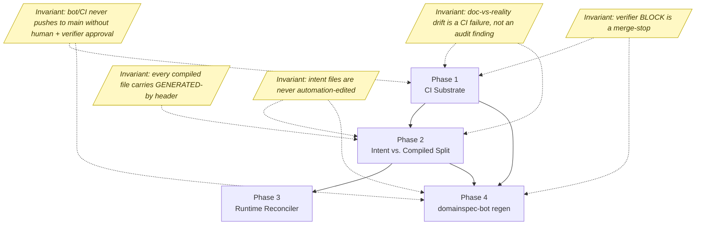
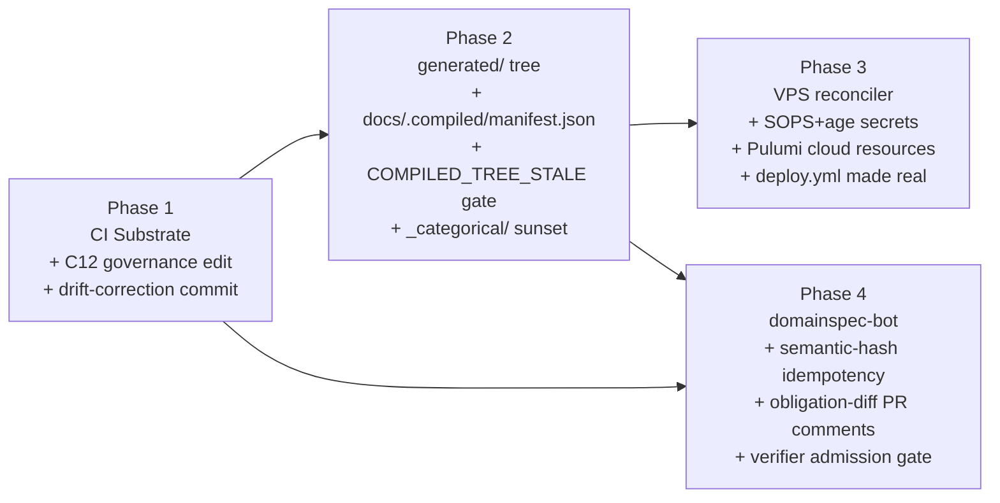

# Feature: gitops-assessment

## What This Module Owns

This feature owns the GitOps adoption path for DomainSpec — the conversion from agent-invocation-time enforcement to continuous, evidence-backed reconciliation. It spans four sequenced phases: wiring the missing CI substrate, enforcing the intent-vs-compiled-artifact split, standing up a runtime reconciler on the deploy target, and introducing a regen bot for the LLM-judgment agents. The boundary is explicitly governance-and-infrastructure: it never owns domain content, only the machinery that keeps domain content honest.

## Module Map

## Capabilities

| Capability | What | Phase | Detail |
|---|---|---|---|
| CI Substrate | Wire up the missing `.github/workflows/` plumbing, `core.hooksPath`, the four-workflow split, and the `CONSTITUTION.md` C12 governance edit that delegates merge-gate authority to `domainspec-verifier` BLOCK | Phase 1 | [phase-1-ci-substrate.md](specs/phase-1-ci-substrate.md) |
| Intent vs. Compiled Split | Carve hand-edited intent from machine-derived compiled output via `generated/` + `docs/.compiled/manifest.json`, sunset `_categorical/`, gate via `COMPILED_TREE_STALE` staleness check | Phase 2 | [phase-2-intent-compiled-split.md](specs/phase-2-intent-compiled-split.md) |
| Runtime Reconciler | Continuous VPS reconciliation via systemd timer + `git pull --ff-only` + `docker compose up -d`, with SOPS+age secrets, Pulumi for cloud resources, and a real `deploy.yml` | Phase 3 | [phase-3-runtime-reconciler.md](specs/phase-3-runtime-reconciler.md) |
| domainspec-bot | LLM-judgment regen via the bot-PR pattern, semantic-hash idempotency on derived artifacts, obligation-diff PR comments, verifier admission gate, paired branch per `(agent, feature, input-hash)` | Phase 4 | [phase-4-domainspec-bot.md](specs/phase-4-domainspec-bot.md) |

## Concept Registry

Every named concept introduced across the four phase specs. Source of truth for downstream registry sync.

| Concept | ID | Type | Defined In |
|---|---|---|---|
| Constitution rule C12 (verifier BLOCK as merge-gate) | gitops.C12 | Governance Rule | [phase-1](specs/phase-1-ci-substrate.md) |
| Drift-correction first commit | gitops.DriftCorrectionCommit | Governance Action | [phase-1](specs/phase-1-ci-substrate.md) |
| `.github/workflows/pr-validate.yml` | gitops.PrValidateWorkflow | CI Workflow | [phase-1](specs/phase-1-ci-substrate.md) |
| `.github/workflows/overlay-sync.yml` | gitops.OverlaySyncWorkflow | CI Workflow | [phase-1](specs/phase-1-ci-substrate.md) |
| `.github/workflows/domainspec-tuning.yml` | gitops.TuningWorkflow | CI Workflow | [phase-1](specs/phase-1-ci-substrate.md) |
| `.github/workflows/deploy.yml` | gitops.DeployWorkflow | CI Workflow | [phase-1](specs/phase-1-ci-substrate.md) (stub) → [phase-3](specs/phase-3-runtime-reconciler.md) (real) |
| `.github/workflows/compiled-tree-staleness.yml` | gitops.CompiledTreeStalenessWorkflow | CI Workflow | [phase-2](specs/phase-2-intent-compiled-split.md) |
| `tools/install-hooks.sh` | gitops.InstallHooks | Bootstrap Script | [phase-1](specs/phase-1-ci-substrate.md) |
| `tools/check-overlay-sync.sh` | gitops.CheckOverlaySync | Validator | [phase-1](specs/phase-1-ci-substrate.md) |
| `tools/extract-categorical.ts` | gitops.ExtractCategorical | Regenerator | [phase-2](specs/phase-2-intent-compiled-split.md) |
| `tools/inject-generated-header.ts` | gitops.InjectGeneratedHeader | Post-processor | [phase-2](specs/phase-2-intent-compiled-split.md) |
| `tools/validate-generated-headers.ts` | gitops.ValidateGeneratedHeaders | Validator | [phase-2](specs/phase-2-intent-compiled-split.md) |
| `tools/validate-manifest-completeness.ts` | gitops.ValidateManifestCompleteness | Validator | [phase-2](specs/phase-2-intent-compiled-split.md) |
| `tools/build-compiled-manifest.ts` | gitops.BuildCompiledManifest | Manifest Builder | [phase-2](specs/phase-2-intent-compiled-split.md) |
| `tools/migrate-categorical-paths.sh` | gitops.MigrateCategoricalPaths | One-shot Migration | [phase-2](specs/phase-2-intent-compiled-split.md) |
| `tools/validate-no-grandfathered-paths.ts` | gitops.ValidateNoGrandfatheredPaths | Validator | [phase-2](specs/phase-2-intent-compiled-split.md) |
| `generated/` tree | gitops.GeneratedTree | Compiled Artifact Root | [phase-2](specs/phase-2-intent-compiled-split.md) |
| `docs/.compiled/manifest.json` | gitops.CompiledManifest | Compiled Artifact Index | [phase-2](specs/phase-2-intent-compiled-split.md) |
| GENERATED-by header convention | gitops.GeneratedHeader | Artifact Convention | [phase-2](specs/phase-2-intent-compiled-split.md) |
| `@source-hash` annotation | gitops.SourceHash | Traceability Annotation | [phase-2](specs/phase-2-intent-compiled-split.md) |
| `COMPILED_TREE_STALE` failure tag | gitops.CompiledTreeStaleTag | CI Failure Contract | [phase-2](specs/phase-2-intent-compiled-split.md) |
| `_categorical/` sunset trigger | gitops.CategoricalSunset | Migration Event | [phase-2](specs/phase-2-intent-compiled-split.md) |
| `docs/signals/pipeline-signals.jsonl` | gitops.SignalStream | Append-only Signal Stream | [phase-1](specs/phase-1-ci-substrate.md), [phase-2](specs/phase-2-intent-compiled-split.md) |
| `docs/signals/TUNING-REPORT.md` | gitops.TuningReport | Derived Report | [phase-1](specs/phase-1-ci-substrate.md) |
| `docs/META-HEALTH.md` | gitops.MetaHealth | Derived Report | [phase-1](specs/phase-1-ci-substrate.md), [phase-2](specs/phase-2-intent-compiled-split.md) |
| `infra/Pulumi.yaml` | gitops.PulumiProject | IaC Project Descriptor | [phase-3](specs/phase-3-runtime-reconciler.md) |
| `infra/Pulumi.prod.yaml` | gitops.PulumiProdStack | IaC Stack Config | [phase-3](specs/phase-3-runtime-reconciler.md) |
| `infra/index.ts` | gitops.PulumiProgram | IaC Program | [phase-3](specs/phase-3-runtime-reconciler.md) |
| `infra/cloud-init.yaml` | gitops.CloudInit | Droplet Bootstrap | [phase-3](specs/phase-3-runtime-reconciler.md) |
| `infra/docker-compose.yml` | gitops.RuntimeCompose | Compose Manifest | [phase-3](specs/phase-3-runtime-reconciler.md) |
| `infra/Caddyfile` | gitops.Caddyfile | Reverse Proxy + TLS | [phase-3](specs/phase-3-runtime-reconciler.md) |
| `infra/prometheus.yml` | gitops.PrometheusConfig | Scrape Config | [phase-3](specs/phase-3-runtime-reconciler.md) |
| `infra/alerts/` | gitops.AlertRules | Alert Rules Directory | [phase-3](specs/phase-3-runtime-reconciler.md) |
| `infra/secrets.enc.yaml` | gitops.EncryptedSecrets | SOPS Encrypted Blob | [phase-3](specs/phase-3-runtime-reconciler.md) |
| `infra/.sops.yaml` | gitops.SopsRules | SOPS Recipient Rules | [phase-3](specs/phase-3-runtime-reconciler.md) |
| `secrets/keys/*.pub` | gitops.MaintainerAgeKeys | Public Age Key Set | [phase-3](specs/phase-3-runtime-reconciler.md) |
| `infra/reconciler/reconciler.timer` | gitops.ReconcilerTimer | systemd Timer | [phase-3](specs/phase-3-runtime-reconciler.md) |
| `infra/reconciler/reconciler.service` | gitops.ReconcilerService | systemd Oneshot Service | [phase-3](specs/phase-3-runtime-reconciler.md) |
| `infra/reconciler/reconciler-path.path` | gitops.ReconcilerPathWatcher | systemd Path Watcher | [phase-3](specs/phase-3-runtime-reconciler.md) |
| `infra/reconciler/reconcile.sh` | gitops.ReconcileScript | Reconciliation Loop Body | [phase-3](specs/phase-3-runtime-reconciler.md) |
| `/opt/domainspec` clone path | gitops.DropletRepoClone | Filesystem Convention | [phase-3](specs/phase-3-runtime-reconciler.md) |
| `deploy` user on droplet | gitops.DeployUser | Service Account | [phase-3](specs/phase-3-runtime-reconciler.md) |
| `SOPS_AGE_KEY` GitHub Actions secret | gitops.SopsAgeCiKey | CI Decrypt Key | [phase-3](specs/phase-3-runtime-reconciler.md) |
| Droplet age keypair | gitops.DropletAgeKey | Decryption Identity | [phase-3](specs/phase-3-runtime-reconciler.md) |
| `docs/runbooks/vps-bootstrap.md` | gitops.VpsBootstrapRunbook | Runbook | [phase-3](specs/phase-3-runtime-reconciler.md) |
| `docs/runbooks/secret-rotation.md` | gitops.SecretRotationRunbook | Runbook (placeholder) | [phase-3](specs/phase-3-runtime-reconciler.md) |
| `domainspec-bot` GitHub identity | gitops.RegenBot | Automation Identity | [phase-4](specs/phase-4-domainspec-bot.md) |
| `bot/<agent>/<feature>/<input-hash>` branch convention | gitops.BotBranchConvention | Branch Naming Rule | [phase-4](specs/phase-4-domainspec-bot.md) |
| `[bot-regen]` PR title prefix | gitops.BotPrTitlePrefix | PR Convention | [phase-4](specs/phase-4-domainspec-bot.md) |
| `bot-regen` label | gitops.BotRegenLabel | PR Label | [phase-4](specs/phase-4-domainspec-bot.md) |
| `agent:<agent>` label | gitops.BotAgentLabel | PR Label | [phase-4](specs/phase-4-domainspec-bot.md) |
| `feature:<feature>` label | gitops.BotFeatureLabel | PR Label | [phase-4](specs/phase-4-domainspec-bot.md) |
| `blocked` / `needs-clarification` / `superseded` / `non-substantive-regen` / `orphan-story` / `needs-infra-decision` labels | gitops.BotConditionalLabels | PR Labels | [phase-4](specs/phase-4-domainspec-bot.md) |
| Obligation diff PR comment | gitops.ObligationDiff | PR Comment Convention | [phase-4](specs/phase-4-domainspec-bot.md) |
| Input hash | gitops.InputHash | Idempotency Key | [phase-4](specs/phase-4-domainspec-bot.md) |
| Semantic hash | gitops.SemanticHash | Structural-Equality Hash | [phase-4](specs/phase-4-domainspec-bot.md) |
| `sha256-v1` hash algorithm version | gitops.HashAlgorithmVersion | Versioned Algorithm Tag | [phase-4](specs/phase-4-domainspec-bot.md) |
| `bot-write-scope` PR check | gitops.BotWriteScopeCheck | CI Check | [phase-4](specs/phase-4-domainspec-bot.md) |
| Stale PR supersession protocol | gitops.SupersessionProtocol | PR Lifecycle Rule | [phase-4](specs/phase-4-domainspec-bot.md) |
| Five regen-eligible LLM-judgment agents (`spec-writer`, `implementer`, `task-executor`, `ui-architect`, `infra-architect`) | gitops.RegenEligibleAgents | Agent Set | [phase-4](specs/phase-4-domainspec-bot.md) |
| Four interactive-only LLM-judgment agents (`orchestrator`, `interviewer`, `planner`, `mars-researcher`) | gitops.InteractiveOnlyAgents | Agent Set | [phase-4](specs/phase-4-domainspec-bot.md) |

## Cross-Cutting Invariants

These guarantees hold across **every** phase that ships. The discovery hard-coded each one; each phase spec enforces a specific subset.

| # | Invariant | Enforced By |
|---|---|---|
| I1 | Bot or CI **never** pushes directly to `main` without human review and `domainspec-verifier` PASS or FLAG | [phase-1](specs/phase-1-ci-substrate.md) (workflow `AUTHORITY:` comments + branch protection); [phase-2](specs/phase-2-intent-compiled-split.md) (CT-7 `permissions: contents: read` on staleness job); [phase-4](specs/phase-4-domainspec-bot.md) (acceptance §3, authority §1 + §3) |
| I2 | Every file under the compiled tree carries the GENERATED-by header in the syntactically-correct form for its file type | [phase-2](specs/phase-2-intent-compiled-split.md) (`tools/validate-generated-headers.ts`, CT-5) |
| I3 | `domainspec-verifier` BLOCK is a binding merge-stop, not advisory | [phase-1](specs/phase-1-ci-substrate.md) (C12 in `CONSTITUTION.md` + `pr-validate.yml` required check); [phase-4](specs/phase-4-domainspec-bot.md) (auto-draft on BLOCK + acceptance §5) |
| I4 | Intent files (`docs/features/<feature>/{SPEC,domain,operations,states,interfaces,events,queries,workflows,mappings,STORIES}.md`, root governance docs) are **never** edited by an automation | [phase-2](specs/phase-2-intent-compiled-split.md) (compiled tree lives only under `generated/` + `docs/.compiled/`); [phase-4](specs/phase-4-domainspec-bot.md) (`bot-write-scope` CI check, acceptance §4, authority §2) |
| I5 | Drift between docs and reality is a failed CI check at PR or push time, not a discovery at audit time | [phase-1](specs/phase-1-ci-substrate.md) (drift-correction commit + `overlay-sync.yml`); [phase-2](specs/phase-2-intent-compiled-split.md) (`COMPILED_TREE_STALE` gate); [phase-3](specs/phase-3-runtime-reconciler.md) (60s reconciler tick reverts click-ops within one cycle) |
| I6 | Every derived artifact is traceable to its `(source_path, source_hash, prompt_hash, model_version, generated_at)` via `docs/.compiled/manifest.json` | [phase-2](specs/phase-2-intent-compiled-split.md) (CT-6); [phase-4](specs/phase-4-domainspec-bot.md) (acceptance §7 — manifest updated atomically with each derived artifact) |
| I7 | Plaintext secrets never reach git | [phase-1](specs/phase-1-ci-substrate.md) (`gitleaks` in pre-commit + `pr-validate.yml`); [phase-3](specs/phase-3-runtime-reconciler.md) (SOPS+age + acceptance §5) |

## Authority Map (gitops-feature local)

This map covers only artifacts introduced by this feature. Repository-wide authority remains with the canonical owners declared in `/Users/victorboscaro/domainspec/AUTHORITY-MAP.md`.

| Artifact | Owner | Mutable by |
|---|---|---|
| `.github/workflows/*.yml` | repo maintainer | human PR (Phase 1 author + canonical owner review) |
| `tools/check-overlay-sync.sh`, `tools/extract-categorical.ts`, `tools/inject-generated-header.ts`, other Phase 1/2 validators | tooling maintainer | human PR |
| `generated/**` | the named regenerator for that subtree (see [Phase 2 §Deterministic regen pipeline table](specs/phase-2-intent-compiled-split.md#deterministic-regen-pipeline)) | CI staleness gate (read-only diff) + local re-run by `make regen` (Phase 2); never written by `compiled-tree-staleness.yml` to the PR branch |
| `docs/.compiled/manifest.json` | `tools/build-compiled-manifest.ts` | regenerator output, committed in the same PR as the artifacts it indexes |
| `docs/signals/pipeline-signals.jsonl` | `domainspec-emit-signals` skill (append-only); rotated by `tools/prune-governance.ts` weekly | append-only by any pipeline run; rotation by scheduled `tuning.yml` |
| `docs/signals/TUNING-REPORT.md` | `domainspec-reflect` skill | bot-opened PR via `tuning.yml`, never direct push |
| `docs/META-HEALTH.md` | `tools/generate-meta-health.ts` | scheduled `tuning.yml`; if changed in a PR's diff, the PR author must include the regen |
| `infra/**` (IaC, compose, Caddyfile, prometheus, alerts, reconciler unit files, runbooks) | infra maintainer | human PR |
| `infra/secrets.enc.yaml` | maintainer set declared in `infra/.sops.yaml` | human edit + re-encrypt + commit; rotation **detected** by `domainspec-reflect`, **executed** by human |
| `secrets/keys/*.pub` | each maintainer owns their own pubkey file | human PR (added when a new maintainer joins) |
| `.github/agents/`, `.github/skills/`, `.github/get-shit-done/`, `.github/gsd-file-manifest.json` | `copilot/install.sh` (deterministic regenerator) | regenerator output; CI `overlay-sync.yml` enforces source-overlay parity |
| `CONSTITUTION.md` C12 row + Derivation Chain item 7 | `CONSTITUTION.md` canonical owner per `AUTHORITY-MAP.md` | human PR; lands as part of Phase 1 governance commit |
| Drift-correction edits to `ADLC-ALIGNMENT.md` G4 row, `TUNING-LOOP.md:73`, `TUNING-LOOP.md:426` | canonical doc owners per `AUTHORITY-MAP.md` | human PR; lands as the **first commit of Phase 1**, separate from the workflow PR |
| Bot-opened PRs against `generated/**` and `docs/.compiled/manifest.json` | `domainspec-bot` (writes) | feature owner per `AUTHORITY-MAP.md` reviews + verifier PASS/FLAG; merge by human |
| `bot/*` branches | `domainspec-bot` | bot may force-push (rebase loop, capped 3 attempts/PR/hour); `main` denies bot push |

## Phase Dependency Graph

Phase 3 and Phase 4 can run in parallel once Phase 2 has merged: Phase 3 owns the runtime tier and Phase 4 owns the spec tier of the two-tier reconciliation model from [DISCOVERY §2.2](DISCOVERY.md#22-two-tier-reconciliation). They share no on-disk surface.

## Acceptance Criteria (feature-level)

Highest-leverage criteria from each phase. Each rolled up to a single bullet; full criterion lists live in the linked spec.

- **After Phase 1:** the four-workflow split exists on disk, every workflow declares its `AUTHORITY:` posture, the C12 rule is in `CONSTITUTION.md`, and the drift-correction commit landed **before** any `.github/workflows/` commit. ([Phase 1 §Acceptance criteria, items 1–14](specs/phase-1-ci-substrate.md#acceptance-criteria))
- **After Phase 2:** `compiled-tree-staleness.yml` fails on intent edits without a paired regen, `_categorical/` is gone from `docs/features/**`, every file under `generated/` carries the GENERATED-by header, and the staleness job runs with `permissions: contents: read`. ([Phase 2 §Acceptance criteria CT-1 through CT-10](specs/phase-2-intent-compiled-split.md#acceptance-criteria))
- **After Phase 3:** `git push main` to the infra repo causes the droplet to converge within 90 seconds; a manual `docker stop` is reverted within 60 seconds; `nmap` shows only ports 22, 80, 443 open; no plaintext secret reaches git. ([Phase 3 §Acceptance criteria, items 1–9](specs/phase-3-runtime-reconciler.md#acceptance-criteria))
- **After Phase 4:** at most one open bot PR per `(agent, feature)` pair at any observation time; zero bot-authored direct commits to `main`; zero bot writes to excluded paths; zero merges with a verifier BLOCK at merge time. ([Phase 4 §Acceptance criteria, items 1–10](specs/phase-4-domainspec-bot.md#acceptance-criteria))

## Out of Scope (feature-level)

Aggregated and de-duplicated from [DISCOVERY §1 "What stays the same"](DISCOVERY.md#what-stays-the-same) and the four phase specs' Out-of-scope sections.

- **No Kubernetes adoption.** Single-VPS Docker Compose remains the deploy target. ArgoCD, Flux, Argo Rollouts, Flagger, Crossplane, Kratix referenced as patterns only.
- **No runtime canary or progressive delivery.** Blue/green is "by absence" — `docker compose up -d` recreates services in place. Weighted DNS, traffic splitting, Argo Rollouts are deferred.
- **No external secrets vault.** SOPS+age suffices until rotation requirements appear. ESO, HashiCorp Vault, AWS Secrets Manager deferred.
- **No multi-agent merge-conflict resolution.** No public prior art; deferred (Researcher B open problem 7).
- **No reconciliation rollback semantics for spec changes.** Open problem in the literature; recovery is `git revert` on `main`.
- **No obligation-diff blast-radius computation.** The dbt `state:modified+` analog for LLM-derived artifacts; deferred to v2.
- **No application containers in v1.** The v1 compose file ships only OTel collector + Prometheus + Caddy. The `implementation/app-frontend/` subtree is explicitly out of scope.
- **No cross-feature spec coupling detection.** Phase 4 bot treats each feature independently.
- **No LLM bot self-tuning, model-version bumps, or per-PR token budget enforcement.** Human governance decisions surfaced through `domainspec-reflect`.
- **No automated secret rotation tooling.** `domainspec-reflect` *detects* rotation need; humans *execute* it. The runbook ships empty until first triggered.
- **Existing root governance docs stay authoritative as written.** `AUTHORITY-MAP.md`, `AXIOMS.md`, `CONSTITUTION.md`, `TAXONOMY.md`, `RELATIONSHIPS.md`, `ARCHITECTURE.md`, `OBSERVABILITY.md`, `TEST-PIPELINE.md`, `DRIFT-CONVERGENCE.md`, `GOVERNANCE-ATTENUATION.md`, `TUNING-LOOP.md`, `ADLC-ALIGNMENT.md`, `PHASED-PLAN.md`, `CHANGELOG.md`, `README.md`. Only the enumerated drift-correction edits and the C12 governance edit are in scope.
- **The `implementation/app-frontend/` 845-file Node.js subtree.** Authority chain unclear; reconciler will not deploy it.
- **The `vault/` knowledge corpus.** Mixed human/agent emissions; out of scope for GitOps wiring.
- **The Phase 2 sibling specs** (`phase-2-sops-secrets.md`, `phase-2-signal-emission.md`) are tracked separately to keep each spec ≤ 700 lines; not duplicated here.

## Open Items (feature-level)

Highest-priority open items from each phase, de-duplicated and given a recommendation. Phase-local items remain in the linked specs.

- **Drift-correction revert (Phase 1 OI-1).** After `domainspec-tuning.yml` lands, the "NOT YET DEPLOYED" annotations in `TUNING-LOOP.md:73` and `:426` themselves become false. *Recommendation:* a follow-up commit (gated on Phase 1 acceptance §14) restores the original wording. Track explicitly so the second-order drift does not become permanent.
- **`pr-validate.yml` parallelism (Phase 1 OI-4).** *Recommendation:* parallel by default with `verifier` as a fail-fast gate. Decision recorded in the workflow's `AUTHORITY:` comment block.
- **`docs/.compiled/manifest.json` split threshold (Phase 2 OI-2).** *Recommendation:* one file until the repo has ≥ 10 features OR the manifest exceeds 500 KB; track the threshold via a signal emitted from `tools/build-compiled-manifest.ts`.
- **JSON `$generated` key collision risk (Phase 2 OI-3).** *Recommendation:* verify against current readers (none on disk today) before locking the format; fall back to a `<file>.gen.json` sidecar per the binary-file convention if a future consumer rejects `$`-keys.
- **Path-watcher `reconciler-path.path` (Phase 3 OI-1).** *Recommendation:* keep, but make it the easiest unit to remove if it causes flapping. Re-evaluate after one month with metrics.
- **Hotfix faster than the timer cadence (Phase 3 OI-5).** *Recommendation:* `sudo systemctl start reconciler.service` is the only supported "force a tick now" path. Do not build a webhook in v1 (would breach the 80/443/22 firewall posture).
- **Bot identity surface (Phase 4 OI-1).** *Recommendation:* GitHub App (per-installation tokens, fine-scoped). Fall back to a bot account only if App installation is unavailable in the deploy environment.
- **Semantic-hash algorithm coverage (Phase 4 OI-3).** *Recommendation:* ship Phase 4 with hash algorithms defined for YAML, TypeScript, and Markdown-with-frontmatter; other types fall back to byte-equality with a `semantic-hash:fallback` label, surfacing the gap as a `spec-gap` signal.
- **Self-review loop when spec author is feature owner (Phase 4 OI-4).** *Recommendation:* bot escalates one level up the authority chain. Encode the chain explicitly in `AUTHORITY-MAP.md` during Phase 1.
- **Manifest-write race between concurrent bot PRs (Phase 4 OI-6).** *Recommendation:* bot rebases other open bot PRs for the same feature when one merges; capped at 3 attempts per PR per hour to prevent thrashing.

## See Also

- [DISCOVERY.md](DISCOVERY.md)
- [Round-1 review](review/REVIEW-ROUND-1.md)
- [Round-2 review](review/REVIEW-ROUND-2.md)
- Research: [foundations](research/research-a-foundations.md), [agentic edge](research/research-b-agentic-spec-driven.md), [repo assessment](research/repo-assessment.md), [synthesis](research/SYNTHESIS.md)
