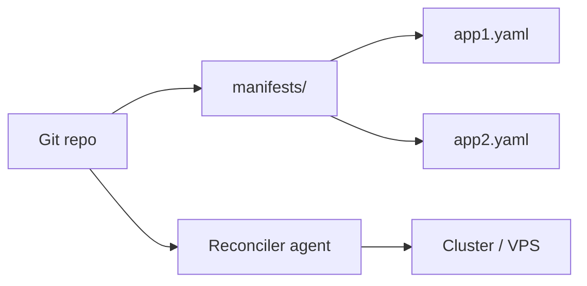
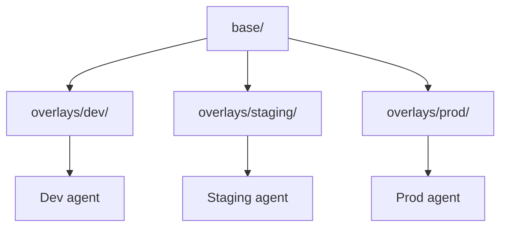
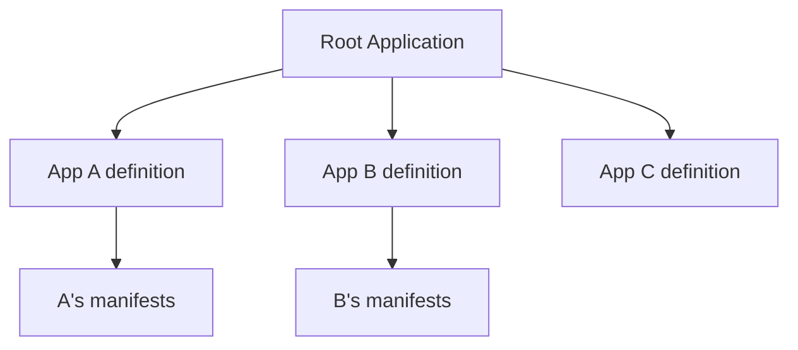

# Research A — GitOps Foundations and Established Practice

**Researcher:** Researcher A
**Date:** 2026-05-02
**Scope:** Foundations only. Tooling, patterns, secrets, non-K8s GitOps, failure modes.
**Out of scope:** GitOps for AI/agent systems (Researcher B).

---

## Summary

GitOps in 2026 is no longer a niche philosophy — it's the default operating model for Kubernetes-shaped workloads, with the [2025 CNCF End User Survey reporting 60% of clusters delivered via ArgoCD and 97% of respondents using it in production](https://dev.to/mechcloud_academy/the-gitops-standard-in-2026-a-comparative-research-analysis-of-argocd-and-fluxcd-46d8). The [OpenGitOps project under CNCF](https://opengitops.dev/) has consolidated the discourse around four crisp principles (declarative, versioned & immutable, pulled, continuously reconciled), which gives any team a defensible bar to evaluate "are we actually doing GitOps, or just CI-with-extra-steps?". For a spec-first project like DomainSpec, those four principles map cleanly onto our existing instincts: specs ARE the declarative source of truth, git ALREADY enforces versioning, and the missing pieces are pull-based agents and continuous reconciliation.

The tooling landscape has bifurcated. On Kubernetes, ArgoCD vs. Flux is a real choice but no longer an existential one — both are mature, both implement the OpenGitOps principles, and the deciding factor is operator preference (UI-heavy multi-tenant control plane → ArgoCD; lightweight controller-per-concern, native Helm semantics → Flux). Off Kubernetes, the picture is murkier. The CNCF lineage assumed a control loop running inside a cluster, and dragging that assumption onto a single VPS or a Docker Compose host requires deliberate substitution: either a lightweight Compose-aware reconciler ([Konta](https://github.com/talyguryn/konta), [Portainer](https://www.portainer.io/gitops-automation), Komodo), an Ansible-pull cron, or systemd + `git-sync`. None of these are CNCF-blessed, but the principles still apply.

The biggest opinionated takeaway for DomainSpec: **the four principles matter more than the tool**. Pick the lightest reconciler that gives you all four — declarative state in git, versioned commits, agent pulls (not CI pushes) the desired state, and the agent continuously detects and corrects drift. Anything heavier is overhead; anything lighter is push-based CI cosplaying as GitOps.

Secondary takeaway: **plan for secrets and drift on day one, not day three hundred**. The two things that kill GitOps adoptions are secret sprawl (people checking plaintext into git "just for now") and click-ops relapse (someone SSHs into the VPS to fix a thing and never updates the repo). Both are cultural, but tooling can make the right path the easy path: SOPS for encrypted-at-rest secrets in git, and a reconciler with `auto-heal: true` so manual edits get reverted within minutes.

---

## Core Principles

The [CNCF GitOps Working Group's OpenGitOps v1.0 spec](https://github.com/open-gitops/documents/blob/v0.1.0/PRINCIPLES.md) defines four principles. Any system that doesn't implement all four is not GitOps.

1. **Declarative.** The desired state of a system managed by GitOps must be expressed declaratively — what, not how. Imperative scripts that mutate state are excluded by definition. ([OpenGitOps Principles](https://github.com/open-gitops/documents/blob/v0.1.0/PRINCIPLES.md))
2. **Versioned and Immutable.** Desired state is stored in a way that enforces immutability and versioning, with a complete history. Git is the canonical implementation, but the principle is broader — any append-only versioned store qualifies. ([OpenGitOps 1.0 announcement](https://opengitops.dev/blog/1.0-announcement/))
3. **Pulled Automatically.** Software agents pull desired state from the source. This is the principle that distinguishes GitOps from "CI/CD with a git trigger" — a CI job that runs `kubectl apply` on push is push-based and is **not GitOps**. ([OpenGitOps Glossary](https://github.com/open-gitops/documents/blob/main/GLOSSARY.md))
4. **Continuously Reconciled.** The agent is continuously aware of both desired and actual state, detects drift, and attempts to correct it. Reconciliation is not a one-shot deploy; it's a forever-loop. ([OpenGitOps Principles](https://github.com/open-gitops/documents/blob/v0.1.0/PRINCIPLES.md))

A useful litmus test: **if you turn off your CI pipeline, does deployment still work when someone merges a PR?** If yes, you have GitOps. If no, you have push-based CI/CD with extra YAML.

> **Recommended for DomainSpec:** Adopt all four principles verbatim as the project's deployment constitution. The pull + reconcile pair is non-negotiable — without it, our spec-first discipline collapses back into "push-based CI that happens to read markdown."

---

## Tooling Landscape

| Tool | Type | Best Fit | Skip If |
|------|------|----------|---------|
| **[ArgoCD](https://argo-cd.readthedocs.io/)** | K8s GitOps controller + UI | Multi-cluster, multi-team, RBAC-heavy, you want a graphical wall-of-apps | You're single-node or run < 5 services |
| **[Flux](https://fluxcd.io/)** | K8s GitOps controllers (no UI) | Everything-as-code, native Helm semantics, image automation, lightweight footprint | You need a UI for non-engineers |
| **[Pulumi Kubernetes Operator](https://github.com/pulumi/pulumi-kubernetes-operator)** | Programmatic IaC operator | You want IaC in TypeScript/Python/Go reconciled like a K8s resource | YAML is sufficient and you don't need loops/conditionals |
| **[Kustomize](https://kustomize.io/)** | YAML overlay engine | Per-environment patches without templating | You need conditionals or loops (use Helm) |
| **[Helm](https://helm.sh/)** | K8s package manager | Reusable charts, complex templating, third-party app distribution | You author all your own manifests and don't need packaging |
| **[Argo Rollouts](https://argoproj.github.io/rollouts/)** | Progressive delivery controller | Canary/blue-green with metric analysis, paired with ArgoCD | You don't need automated rollback or canaries |
| **[Flagger](https://flagger.app/)** | Progressive delivery controller | Canary/blue-green via service mesh, paired with Flux | You're not using a service mesh |
| **[Konta](https://github.com/talyguryn/konta)** | Docker Compose GitOps agent | Single VPS, low-resource, Compose-only | You need orchestration across multiple hosts |
| **[Portainer](https://www.portainer.io/gitops-automation)** | Container management + GitOps | Mixed Docker/Swarm/K8s, want a UI | You want pure CLI/IaC |
| **[Komodo](https://komo.do/)** | Multi-host container reconciler | Several VPS hosts running Compose | Single host (overkill) |

**ArgoCD vs. Flux, the short version** ([2026 comparison](https://oneuptime.com/blog/post/2026-02-26-argocd-vs-fluxcd-2026/view)): ArgoCD is a centralized control plane with a UI, sophisticated RBAC, and roughly 2x the resource footprint of Flux during sync. Flux is a set of specialized controllers (source, kustomize, helm, notification, image-automation) with native Helm SDK integration and tighter image automation. Both fully implement OpenGitOps.

> **Recommended for DomainSpec:** Skip ArgoCD/Flux for now — we're not on Kubernetes. Evaluate **Konta** or a hand-rolled **systemd + `git-sync` + `docker compose up -d`** loop for our VPS targets. Reserve Pulumi (via Automation API, not the K8s operator) for the cloud-resource layer (DNS, object storage, managed Postgres) where declarative IaC pays off most.

---

## Repo Topology Patterns

Four patterns dominate, with very different cost/benefit profiles. ([ArgoCD repo structure best practices, 2026](https://oneuptime.com/blog/post/2026-02-26-argocd-best-practices-repository-structure/view))

### 1. Monorepo (single repo, single environment)

**Best for:** Small teams, single environment, getting started.
**Tradeoff:** Doesn't scale to multi-env without overlays.

### 2. Environment Overlay (Kustomize/Helm-values)

**Best for:** Multi-env with shared base manifests. Each env is its own ArgoCD Application, pinned to a different git path or branch so a dev change can't accidentally reach prod ([ArgoCD multi-env structure](https://oneuptime.com/blog/post/2026-02-26-argocd-git-repo-structure-multi-environment/view)).
**Tradeoff:** "Where did this final value come from?" debugging gets hard with stacked overlays.

### 3. App-of-Apps (hierarchical)

**Best for:** Onboarding many services. New service = one YAML file in the root, not ten ([Codefresh app-of-apps guide](https://codefresh.io/blog/how-to-structure-your-argo-cd-repositories-using-application-sets/)). [ArgoCD ApplicationSets](https://argo-cd.readthedocs.io/en/stable/operator-manual/cluster-bootstrapping/) are the modern, generator-driven evolution.
**Tradeoff:** Adds indirection; debugging requires walking the hierarchy.

### 4. Promotion-via-PR (env branches or env directories)

Code flows: `dev/` directory or branch → PR → `staging/` → PR → `prod/`. Each promotion is an auditable git event.

**Best for:** Regulated environments needing approval gates per env.
**Tradeoff:** PR fatigue; encourages "rubber stamp" merges if not gated by tests.

> **Recommended for DomainSpec:** Start with **monorepo + environment overlay** (Kustomize-style directory layout, even if we're not on K8s — the pattern works for Compose files too). Add **app-of-apps** once we have ≥ 3 deployable services. Avoid promotion-via-branch — branches drift; use directory-based promotion in a single `main` branch.

---

## Reconciliation & Progressive Delivery

Reconciliation has three knobs that matter:

1. **Sync interval.** Default for ArgoCD is 3 minutes, Flux is 1 minute. Aggressive intervals (< 1 min) [blow through GitHub's 5,000 requests/hour API limit and pressure the K8s API server](https://oneuptime.com/blog/post/2026-02-26-gitops-anti-patterns/view).
2. **Drift detection.** The reconciler diffs desired vs. actual on every sync. This is automatic in ArgoCD/Flux.
3. **Auto-heal / self-heal.** When drift is detected, does the agent overwrite live state? [If `auto-heal: true`, manual `kubectl edit` gets reverted within minutes; if `false`, drift persists and "nobody knows what is actually running"](https://oneuptime.com/blog/post/2026-02-26-gitops-anti-patterns/view).

**Progressive delivery** ([Argo Rollouts docs](https://argo-rollouts.readthedocs.io/)) layers safe-deploy strategies on top of reconciliation:

- **Canary.** Route N% of traffic to the new version, watch metrics, promote or rollback.
- **Blue/Green.** Deploy v2 alongside v1, switch traffic atomically, keep v1 warm for fast rollback.
- **Analysis runs.** Query Prometheus/Datadog/CloudWatch during rollout; auto-abort on metric regression.

[Argo Rollouts replaces the standard `Deployment` resource with a custom `Rollout` CRD](https://argo-rollouts.readthedocs.io/en/stable/concepts/), giving fine control over the rollout strategy. [Flagger keeps standard `Deployment` resources and manages traffic via service mesh](https://flagger.app/) (Istio, Linkerd, etc.). ArgoCD users → Argo Rollouts. Flux users → Flagger. ([Buoyant comparison](https://www.buoyant.io/blog/flagger-vs-argo-rollouts-for-progressive-delivery-on-linkerd))

> **Recommended for DomainSpec:** Set sync interval to **60–120 seconds** with **`auto-heal: true`**. Skip progressive delivery entirely until we have automated metrics + an SLO to gate against — canaries without analysis are theater.

---

## Secrets Management

Plaintext secrets in git is the cardinal sin of GitOps. Three established patterns, each with sharp tradeoffs ([Red Hat secrets-with-GitOps guide](https://www.redhat.com/en/blog/a-guide-to-secrets-management-with-gitops-and-kubernetes), [Infisical 2026 open-source secrets roundup](https://infisical.com/blog/open-source-secrets-management-devops)):

| Tool | Where secrets live | GitOps fit | External deps | Best for |
|------|--------------------|------------|---------------|----------|
| **[Sealed Secrets](https://sealed-secrets.netlify.app/)** | Encrypted blobs in git, decrypted by in-cluster controller | High — secrets ARE in git | None (controller only) | K8s-only, simple, single cluster |
| **[SOPS](https://github.com/getsops/sops)** | Encrypted YAML/JSON in git, decrypted at apply time (age/PGP/KMS) | High — encryption per-value, diffs stay readable | Optional KMS | Polyglot, Flux native, homelabs to SMB prod |
| **[External Secrets Operator](https://external-secrets.io/)** | Plaintext in external vault (Vault, AWS SM, GCP SM, Azure KV); synced to K8s Secrets | Medium — secrets are NOT in git | Yes — a vault | Enterprise, rotation, multi-provider |

[For homelab and SMB production, SOPS is the most elegant solution: simple, no external infra, integrates natively with Flux and any CI](https://www.bordencastle.com/security/gitops/devops/2026/02/13/sops-secrets-management-gitops.html). [For enterprise, ESO is the industry-standard pattern for syncing from external vaults](https://shivanium.medium.com/managing-secrets-in-kubernetes-sealed-secrets-vs-external-secrets-operator-vs-csi-driver-52dd298e983a).

> **Recommended for DomainSpec:** Use **SOPS with `age` keys** committed to git. Zero external dependencies, readable diffs, works identically on K8s, Compose, and bare metal. Reserve ESO + a vault for when we have real rotation requirements (i.e., not yet).

---

## Non-Kubernetes GitOps (the part that matters most for DomainSpec)

DomainSpec targets VPS + Docker Compose, not Kubernetes. The CNCF GitOps lineage assumes a Kubernetes control loop, so applying GitOps off-K8s requires substituting that control loop with something equivalent. Five viable approaches:

### Option 1: Lightweight Compose reconciler (Konta, ConOps, Portainer)

[**Konta**](https://github.com/talyguryn/konta) is purpose-built for "GitOps for Docker Compose on low-resource VPS" — runs in 512MB RAM, polls a git repo, reconciles `docker compose up -d` on changes. [**ConOps**](https://dev.to/anuraggupta/managing-docker-composes-via-gitops-conops-54be) does similar reconciliation and brings stopped containers back up. [**Portainer's GitOps mode**](https://www.portainer.io/gitops-automation) checks repos at intervals and redeploys stacks on drift, with a UI for non-engineers.

**Pros:** True GitOps semantics on Compose. Pull-based, reconciled, drift-detecting.
**Cons:** Smaller ecosystems than ArgoCD/Flux. Konta is single-maintainer territory; bus factor matters.

### Option 2: Pulumi Automation API as a controller

[Pulumi's Automation API](https://www.pulumi.com/automation/) lets you embed Pulumi as an SDK and drive infrastructure from your own program. [The Pulumi Kubernetes Operator runs Pulumi stacks as K8s resources](https://github.com/pulumi/pulumi-kubernetes-operator), but the Automation API can be wrapped in **any** long-running process — a systemd service, a cron job, a small Go daemon — to give you "Pulumi as a reconciliation loop" off K8s.

**Pros:** Real programming language for IaC (TypeScript/Python/Go). Handles cloud resources (DNS, S3, managed DBs) AND Compose hosts in one model.
**Cons:** You build the controller yourself. State stored in Pulumi Cloud or S3.

### Option 3: Ansible-pull (the OG GitOps for VMs)

`ansible-pull` clones a git repo on each target host and runs the playbook locally on a cron schedule. [Ansible is widely paired with GitOps for the imperative-action layer that K8s controllers can't reach](https://spacelift.io/blog/gitops-tools).

**Pros:** Mature, ubiquitous, no new tooling. Works on any Linux VPS.
**Cons:** Imperative model fights the "declarative" principle. Idempotency is the playbook author's responsibility, not the tool's.

### Option 4: systemd + git-sync + docker compose

The minimalist pattern: a systemd timer runs `git pull` every N seconds, and a path-watcher unit triggers `docker compose up -d` when files change. ~30 lines of config, zero dependencies beyond git and systemd.

**Pros:** Inspectable, debuggable, no magic. Maps directly onto OpenGitOps principles (declarative compose files, versioned in git, pulled by timer, reconciled by `compose up -d` which is idempotent).
**Cons:** No drift detection beyond "is the desired file applied?" — a manual `docker stop` won't be reverted unless you also run `compose up -d` periodically. Easy fix: run it on every timer tick.

### Option 5: Terraform Cloud / Spacelift / Scalr

[Spacelift uses GitOps to automate CI/CD for infrastructure components and supports Terraform, OpenTofu, Pulumi, Kubernetes, Ansible, and more](https://spacelift.io/blog/gitops-tools). These are SaaS GitOps-for-IaC platforms.

**Pros:** Managed control plane, RBAC, policy-as-code.
**Cons:** SaaS dependency, cost, overkill for a small project.

### Comparison

| Approach | LOE to set up | Reconciliation | Auto-heal | Fit for single VPS |
|----------|---------------|----------------|-----------|---------------------|
| Konta / Portainer | Low | Yes | Yes | Excellent |
| Pulumi Automation API | Medium-High | DIY | DIY | Good (for cloud + VPS combined) |
| Ansible-pull | Low-Medium | Cron-based | Idempotent playbooks | Good |
| systemd + git-sync | Very Low | Timer-based | Partial (need re-apply on tick) | Excellent |
| Spacelift / TF Cloud | Low (SaaS) | Yes | Yes | Overkill |

> **Recommended for DomainSpec:** **Two-layer split.** Use **Pulumi (Automation API or CLI in CI)** for cloud resources (DNS, object storage, the VPS itself, managed DBs). On the VPS, use **systemd + git-sync + `docker compose up -d` on every tick** as the reconciliation loop — it's ~30 lines, zero new dependencies, and satisfies all four OpenGitOps principles. Promote to Konta only if/when we outgrow the simple loop.

---

## Failure Modes & Anti-Patterns

The literature converges on a small set of repeat offenders ([OneUptime 2026 anti-patterns](https://oneuptime.com/blog/post/2026-02-26-gitops-anti-patterns/view), [Codefresh top-30 ArgoCD anti-patterns](https://codefresh.io/blog/argo-cd-anti-patterns-for-gitops/), [Pulumi GitOps lessons](https://www.pulumi.com/blog/gitops-best-practices-i-wish-i-had-known-before/)):

1. **Click-ops relapse.** The hardest part of GitOps isn't installing the tool — it's getting the team to stop SSHing in and editing files directly. Every manual change creates drift the reconciler will overwrite, leading to lost work and confusion. **Fix:** Enable `auto-heal`, lock down SSH/kubectl write access, make the git path the *easy* path.
2. **Config drift (the silent killer).** When `auto-heal` is off and someone edits live state, the cluster diverges from git and nobody notices until the next deploy fails mysteriously. **Fix:** Always enable `auto-heal`, alert on drift events, audit drift weekly.
3. **Secret sprawl.** Secrets get checked in plaintext "just for now," scattered across repos, or duplicated between envs. **Fix:** Pick ONE secrets pattern (we recommend SOPS), enforce via pre-commit hook + CI scan (`gitleaks`, `trufflehog`).
4. **Reconciliation storms.** Sync interval set too aggressively (< 1 min) hammers the git provider's API and the K8s/host API server. ArgoCD with 30-second intervals has [blown through GitHub's 5,000 req/hr authenticated limit](https://oneuptime.com/blog/post/2026-02-26-gitops-anti-patterns/view). **Fix:** 60–180 second intervals; use webhooks for instant sync on push.
5. **Reconciliation loops with mutating controllers.** Istio, cert-manager, Crossplane legitimately mutate resources after creation. Auto-healing those mutations creates infinite reconcile/revert loops. **Fix:** Use ArgoCD's `ignoreDifferences` or Flux's `--prune` exclusions.
6. **Config sprawl from layered templating.** Helm-of-Helm-of-Kustomize stacks make "where did this value come from?" un-debuggable. Final values only resolve inside the GitOps engine. **Fix:** Cap templating at two layers; always commit a rendered example for diff review.
7. **Monorepo chaos.** One repo with 200 services and no namespacing → merge conflicts, broken CI, blast radius across all services. **Fix:** Either tight directory ownership (CODEOWNERS) or split to per-team repos.
8. **PR rubber-stamping.** GitOps makes git the audit log, but if reviews are perfunctory the audit log is fiction. **Fix:** Required reviewers per env, automated policy checks (OPA, Conftest, Kyverno), no self-merges to prod paths.
9. **Treating GitOps as a deploy tool, not an operating model.** Using ArgoCD only for initial deploys then editing live = worst of both worlds (overhead of GitOps, none of the benefits). **Fix:** Commit to git-as-truth or don't bother.

> **Recommended for DomainSpec:** Bake **drift detection and `auto-heal: true` into the reconciler from day one**, not as a "we'll add it later" item. Add a **`gitleaks` pre-commit hook + CI step** to catch plaintext secrets before they land. Accept that click-ops relapse is the real adoption risk — make the git path the path of least resistance, and consider revoking SSH-write access to prod once the reconciler is trusted.

---

## Sources

### Primary (CNCF / official project docs)

- [OpenGitOps — Home](https://opengitops.dev/)
- [OpenGitOps PRINCIPLES.md (v0.1.0)](https://github.com/open-gitops/documents/blob/v0.1.0/PRINCIPLES.md)
- [OpenGitOps GLOSSARY.md](https://github.com/open-gitops/documents/blob/main/GLOSSARY.md)
- [OpenGitOps 1.0 announcement](https://opengitops.dev/blog/1.0-announcement/)
- [CNCF: GitOps in 2025 — From Old-School Updates to the Modern Way](https://www.cncf.io/blog/2025/06/09/gitops-in-2025-from-old-school-updates-to-the-modern-way/)
- [CNCF: OpenGitOps project page](https://www.cncf.io/projects/opengitops/)
- [Argo CD docs — Cluster Bootstrapping (App-of-Apps)](https://argo-cd.readthedocs.io/en/stable/operator-manual/cluster-bootstrapping/)
- [Argo CD docs (root)](https://argo-cd.readthedocs.io/)
- [Flux CD docs](https://fluxcd.io/)
- [Argo Rollouts docs](https://argo-rollouts.readthedocs.io/)
- [Argo Rollouts concepts](https://argo-rollouts.readthedocs.io/en/stable/concepts/)
- [Flagger](https://flagger.app/)
- [Pulumi Automation API](https://www.pulumi.com/automation/)
- [Pulumi Kubernetes Operator](https://github.com/pulumi/pulumi-kubernetes-operator)
- [Pulumi: Beyond YAML in Kubernetes — The 2026 Automation Era](https://www.pulumi.com/blog/beyond-yaml-kubernetes-2026-automation-era/)
- [Pulumi: GitOps Best Practices I Wish I Had Known Before](https://www.pulumi.com/blog/gitops-best-practices-i-wish-i-had-known-before/)
- [Sealed Secrets](https://sealed-secrets.netlify.app/)
- [SOPS (getsops)](https://github.com/getsops/sops)
- [External Secrets Operator](https://external-secrets.io/)
- [Red Hat: A Guide to Secrets Management with GitOps and Kubernetes](https://www.redhat.com/en/blog/a-guide-to-secrets-management-with-gitops-and-kubernetes)

### Secondary (verified industry / 2026)

- [ArgoCD vs FluxCD: Which GitOps Tool Should You Use in 2026? (DEV/MechCloud)](https://dev.to/mechcloud_academy/the-gitops-standard-in-2026-a-comparative-research-analysis-of-argocd-and-fluxcd-46d8)
- [ArgoCD vs FluxCD in 2026 (OneUptime)](https://oneuptime.com/blog/post/2026-02-26-argocd-vs-fluxcd-2026/view)
- [ArgoCD Best Practices for Repository Structure (OneUptime, 2026)](https://oneuptime.com/blog/post/2026-02-26-argocd-best-practices-repository-structure/view)
- [How to Structure Git Repos for Multi-Environment with ArgoCD (OneUptime, 2026)](https://oneuptime.com/blog/post/2026-02-26-argocd-git-repo-structure-multi-environment/view)
- [Codefresh: Structuring Argo CD Repositories with ApplicationSets](https://codefresh.io/blog/how-to-structure-your-argo-cd-repositories-using-application-sets/)
- [Codefresh: Top 30 ArgoCD Anti-Patterns](https://codefresh.io/blog/argo-cd-anti-patterns-for-gitops/)
- [GitOps Anti-Patterns (OneUptime, 2026)](https://oneuptime.com/blog/post/2026-02-26-gitops-anti-patterns/view)
- [Configuration Drift Detection in GitOps (OneUptime, 2026)](https://oneuptime.com/blog/post/2026-02-26-configuration-drift-detection-gitops/view)
- [SOPS: The Elegantly Simple Way to Store Secrets in Git (BordenCastle, 2026)](https://www.bordencastle.com/security/gitops/devops/2026/02/13/sops-secrets-management-gitops.html)
- [Secrets Management in 2026: Vault vs Secrets Manager vs SOPS (Unixy)](https://unixy.io/blog/secrets-management-2026/)
- [Open Source Secrets Management for DevOps in 2026 (Infisical)](https://infisical.com/blog/open-source-secrets-management-devops)
- [Sealed Secrets vs ESO vs CSI Driver (Shiv Rathore / Medium)](https://shivanium.medium.com/managing-secrets-in-kubernetes-sealed-secrets-vs-external-secrets-operator-vs-csi-driver-52dd298e983a)
- [Buoyant: Flagger vs Argo Rollouts vs Service Meshes](https://www.buoyant.io/blog/flagger-vs-argo-rollouts-for-progressive-delivery-on-linkerd)
- [Top 8 GitOps Tools in 2026 (Spacelift)](https://spacelift.io/blog/gitops-tools)
- [Northflank: 8 best GitOps tools for platform engineers in 2026](https://northflank.com/blog/gitops-tools)
- [Konta — GitOps for Docker Compose on low-resource VPS (GitHub)](https://github.com/talyguryn/konta)
- [Konta on Product Hunt](https://www.producthunt.com/products/konta)
- [Portainer GitOps Automation](https://www.portainer.io/gitops-automation)
- [Managing Docker Composes via GitOps — ConOps (DEV)](https://dev.to/anuraggupta/managing-docker-composes-via-gitops-conops-54be)
- [Atlassian: What Is GitOps?](https://www.atlassian.com/git/tutorials/gitops)
- [Platform Engineering: GitOps architecture, patterns and anti-patterns](https://platformengineering.org/blog/gitops-architecture-patterns-and-anti-patterns)

---

**Confidence:** HIGH on principles, tooling comparison, secrets, and failure modes (multiple authoritative sources, all aligned). MEDIUM on non-K8s reconciler ecosystem (Konta and similar tools have small communities — bus-factor risk noted). MEDIUM on the "promotion-via-PR" pattern (less canonical literature than the others).
