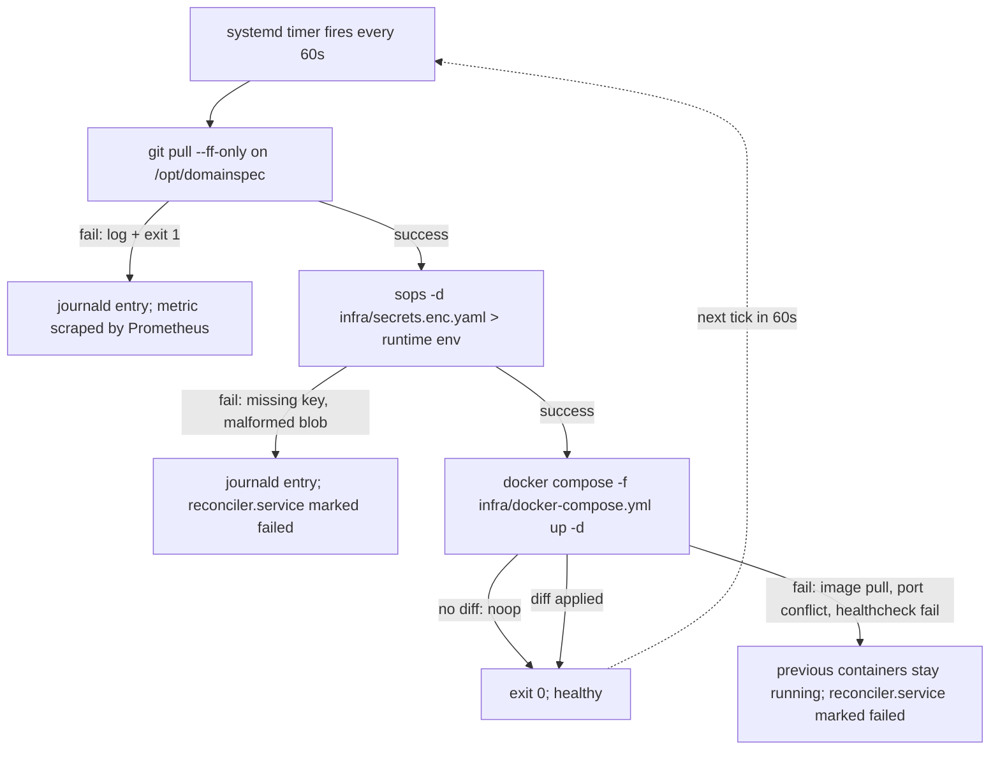

# Phase 3 — Runtime Reconciler (VPS)

## Scope

Phase 3 stands up the runtime tier of the two-tier reconciliation model from
DISCOVERY §2.2. Its job is to make the false claim at `INFRA-SETUP.md:484`
(`git push main # CI/CD deploys automatically`) literally true: an unattended
VPS pulls `main` from origin on a fixed cadence and converges its running
container set to whatever the repo declares. No SSH-based deploy step exists
after Phase 3 ships; humans push to `main`, the VPS pulls.

The deliverables are the contents of `infra/` that DISCOVERY §1 explicitly
flags as missing today — concrete IaC for cloud resources (Pulumi for DNS and
droplet provisioning), a Compose file for the observability and ingress
substrate, a Caddyfile for TLS and reverse proxy, and the systemd
timer + `git pull` + `docker compose up -d` reconciler unit that runs on the
droplet. No application containers are shipped in v1 — per DISCOVERY §9 the
v1 compose file orchestrates the OTel collector + Prometheus + Caddy stack
only, because the only candidate application subtree
(`implementation/app-frontend/`) is explicitly out of scope per DISCOVERY §1.

## Deploy target

### Compose target name (per N6)

The discovery chose **`infra/docker-compose.yml`** (no `.prod` suffix, no
environment-specific filename). DISCOVERY §9 Phase 3 specifies verbatim:

> "Add `infra/{docker-compose.yml,prometheus.yml,Caddyfile,alerts/}` that
> `INFRA-SETUP.md` already promises."

This rules out the alternative names that the spec template hinted at
(`docker-compose.prod.yml`, `compose.prod.yaml`). Rationale for the
unqualified name: in v1 there is exactly one runtime tier (the VPS) and
exactly one deploy target. Introducing a `prod` suffix would imply the
existence of `docker-compose.dev.yml` or `docker-compose.staging.yml`, which
the Single-VPS preset (`INFRA-SETUP.md` table) does not have. The Split-VPS
and HA presets are explicitly future work; when they land they will
introduce their own filenames or compose overrides at that time, not
retroactively rename the v1 file.

The local-dev compose loop referenced by `INFRA-SETUP.md` (`docker compose
up` for the Dev preset) is a separate concern owned by the developer's
machine, not by the runtime reconciler. It is not produced by Phase 3.

### VPS provider assumption

**Default: DigitalOcean.** `INFRA-SETUP.md` Step 1 names DigitalOcean as the
primary provider (with Hetzner and Vultr called out as alternatives whose
"token setup is similar"). DISCOVERY §1 takes `INFRA-SETUP.md` presets as
authoritative for deploy target. Pulumi droplet resource type
(`@pulumi/digitalocean.Droplet`) is what the IaC code targets in v1.
Switching providers is a Pulumi-side resource swap; it does not change the
reconciler architecture on the droplet.

### Domain / TLS expectations

- DNS records managed by Pulumi via `@pulumi/cloudflare` against the zone
  the operator configured per `INFRA-SETUP.md` Step 2.
- TLS terminated by Caddy on the droplet using its built-in ACME client
  (Let's Encrypt). No cert-manager, no manual certs, no Cloudflare Origin
  cert in v1.
- Inbound ports on the droplet firewall: 80, 443, 22 only (per the
  infra-architect constraint).
- All other ports (Prometheus 9090, OTel collector 4317/4318, etc.) bind to
  the docker bridge network only and are never exposed to 0.0.0.0.

## Reconciler architecture

The reconciler implements DISCOVERY §7 verbatim — Researcher A's
recommendation, adopted because it is grounded in the actual Single-VPS
deploy target and satisfies all four OpenGitOps principles with zero new
runtime dependencies (the droplet already has `git`, `systemd`, and
`docker`).

Components on the droplet:

1. **A clone of the infra repo** at `/opt/domainspec`, owned by a `deploy`
   user with no shell login outside the reconciler, and with read-only
   access to the encrypted SOPS blob.
2. **`reconciler.timer`** — a systemd timer firing every 60 seconds. The
   60s cadence is the floor recommended by DISCOVERY §7 for the
   "continuously reconciled" OpenGitOps principle; tune up (longer
   interval) if the droplet shows pull-induced load, never down (shorter)
   in v1.
3. **`reconciler.service`** — a oneshot service that runs `reconcile.sh`.
4. **`reconcile.sh`** — `git pull --ff-only`, then `sops -d` the encrypted
   env, then `docker compose -f infra/docker-compose.yml up -d`. The
   `up -d` runs on every tick, not only on diff detection — Compose is
   idempotent on no-change, and running it unconditionally is what
   produces the cheap drift correction (a manual `docker stop` is
   reverted on the next tick).
5. **`reconciler-path.path`** — an optional systemd path-watcher unit
   that fires `reconciler.service` immediately when
   `infra/docker-compose.yml` changes on disk. This is a latency
   optimization on top of the timer, not a replacement for it. If the
   path-watcher's complexity is judged not worth the seconds of latency
   it saves, it is the first thing to drop from the v1 scope.

The path-watcher is intentionally not in the diagram above because its only
job is to short-circuit the 60s wait when a `git pull` has just landed
changes; the reconciliation loop is identical.

## Files to deliver

| Path                                       | Purpose                                                                                                                          | Generated from                                                                                |
| ------------------------------------------ | -------------------------------------------------------------------------------------------------------------------------------- | --------------------------------------------------------------------------------------------- |
| `infra/Pulumi.yaml`                        | Pulumi project descriptor (project name, runtime: nodejs)                                                                        | hand-authored once                                                                            |
| `infra/Pulumi.prod.yaml`                   | Stack config: region, droplet size, domain name (non-secret values only)                                                         | hand-authored; values from operator                                                           |
| `infra/index.ts`                           | Pulumi program: DigitalOcean droplet + Cloudflare DNS A record + DO firewall (allow 80/443/22) + SSH key registration            | hand-authored; reads stack config                                                             |
| `infra/cloud-init.yaml`                    | Droplet bootstrap: install docker + git + sops + age; create `deploy` user; clone repo; install systemd units; enable the timer  | hand-authored template; rendered by Pulumi with the repo URL and the public age key           |
| `infra/docker-compose.yml`                 | Runtime container set for v1 = OTel collector + Prometheus + Caddy (no app containers per DISCOVERY §9)                          | hand-authored; networks/volumes derived from the three services' image requirements           |
| `infra/Caddyfile`                          | Reverse proxy + automatic TLS via Let's Encrypt; exposes Grafana (if added) and ACME challenge endpoint                          | hand-authored; domain name read from environment via `{$DOMAIN}` directive                    |
| `infra/prometheus.yml`                     | Scrape config for whatever the OTel collector exposes plus the reconciler's own metrics (scrape job for node-exporter if added)  | partially auto-generated by `domainspec-infra-deploy` from `docs/features/*/observability.md` per the infra-architect agent contract |
| `infra/alerts/`                            | Prometheus alert rules directory; v1 ships the reconciler-health rule and the disk-full rule only                                | partially auto-generated from `docs/slos.md` per infra-architect agent contract               |
| `infra/secrets.enc.yaml`                   | SOPS+age encrypted blob holding `VPS_PROVIDER_TOKEN`, `CLOUDFLARE_API_TOKEN`, `PULUMI_ACCESS_TOKEN`, `GH_PAT_AGENT`              | hand-authored plaintext, encrypted by `sops -e -i` before commit; decrypted on droplet at run time |
| `infra/.sops.yaml`                         | SOPS rules file: maps file globs to recipient age public keys                                                                    | hand-authored once; updated when a new maintainer key is added                                |
| `secrets/keys/*.pub`                       | Per-maintainer age public keys (committed)                                                                                       | hand-authored; one file per maintainer                                                        |
| `infra/reconciler/reconciler.timer`        | systemd timer; `OnUnitActiveSec=60s`; persistent across reboot                                                                   | hand-authored                                                                                 |
| `infra/reconciler/reconciler.service`      | systemd oneshot service; `ExecStart=/opt/domainspec/infra/reconciler/reconcile.sh`; runs as `deploy` user                        | hand-authored                                                                                 |
| `infra/reconciler/reconciler-path.path`    | systemd path-watcher; fires on `infra/docker-compose.yml` change; optional latency optimization (see §Reconciler architecture)   | hand-authored                                                                                 |
| `infra/reconciler/reconcile.sh`            | The actual reconciliation loop body: `git pull`, `sops -d`, `docker compose up -d`, log to journald, exit non-zero on failure   | hand-authored                                                                                 |
| `.github/workflows/deploy.yml`             | On push to `main` after `pr-validate.yml` passes: `pulumi up` for cloud resources only; container deploy is pulled by the VPS    | per DISCOVERY §4; produced in Phase 1, **extended** in Phase 3 to actually call `pulumi up`   |

### Honest LOC budget for the systemd + shell pieces (per N4)

DISCOVERY §7 states verbatim: "Total on-disk footprint: a minimal systemd
config (estimated at roughly 30 lines, not yet measured against a working
unit) plus a `Pulumi.yaml` for cloud resources." The "~30 lines" was a
hedge, not a measured number. The realistic counts below are still
estimates because no unit has been written and tested yet on a real droplet,
but they enumerate what each section covers so the estimate is auditable
rather than promotional.

- **`reconciler.timer`** — 8–12 lines: `[Unit]` description; `[Timer]`
  with `OnBootSec`, `OnUnitActiveSec=60s`, `Persistent=true`,
  `Unit=reconciler.service`; `[Install]` `WantedBy=timers.target`.
- **`reconciler.service`** — 10–14 lines: `[Unit]` with description and
  `After=network-online.target docker.service`; `[Service]` with `Type=oneshot`,
  `User=deploy`, `WorkingDirectory=/opt/domainspec`, `ExecStart`,
  `StandardOutput=journal`, `StandardError=journal`, `Environment=` for
  `SOPS_AGE_KEY_FILE`. No `[Install]` (it is fired by the timer).
- **`reconciler-path.path`** — 8–10 lines: `[Unit]`; `[Path]` with
  `PathChanged=/opt/domainspec/infra/docker-compose.yml`; `[Install]`.
  Drop entirely if the timer alone is judged sufficient.
- **`reconcile.sh`** — 30–60 lines once the failure paths are honest:
  `set -euo pipefail`, lockfile to prevent overlapping runs (the timer can
  fire while a previous tick is still pulling), `git pull --ff-only` with
  branch sanity check (refuse to run if HEAD is detached), `sops -d` to a
  shell-source-able env file in a tmpfs path, `docker compose pull`
  (separate from `up -d` so failures here don't touch running containers),
  `docker compose up -d --remove-orphans`, structured log line on success
  (timestamp, commit SHA, duration) and on each failure class. The
  20-extra-lines spread over the "~30" budget is the lockfile + the
  failure-class branches; cutting them would re-enable the click-ops
  failure modes the reconciler exists to prevent.

**Total realistic estimate: 55–95 lines of systemd config + shell**, not
30. The discovery's "roughly 30" understates the production-quality
version by a factor of two. Phase 3 ships the production-quality version,
not the demo version. The Pulumi TypeScript program adds another
~80–150 LOC depending on whether Cloudflare DNS is included in the same
program (recommended) or a separate stack.

## Reconciliation contract

These are the runtime-tier guarantees the v1 reconciler offers. The
spec-tier reconciliation contract (semantic-hash idempotency, regen-on-spec
change) is **explicitly Phase 4 / out of scope here** — this section is
strictly the systemd loop on the droplet.

- **Pull cadence.** `OnUnitActiveSec=60s`. `Persistent=true` so a missed
  tick (droplet asleep, network out) catches up on the next available
  trigger rather than silently being skipped.
- **Drift detection.** None, in the strict sense — there is no diff
  computation between desired and actual state. Instead, drift correction
  is unconditional re-application: every tick runs
  `docker compose up -d` regardless of whether the repo changed.
  Compose is idempotent on no-change (no container is recreated unless
  its image, env, or compose definition changed). This is the
  deliberately-cheap design from DISCOVERY §7 — drift detection is the
  expensive part of GitOps, and Compose's idempotency lets v1 skip it
  entirely. The cost is that drift is invisible (you cannot ask the
  reconciler "what changed?"); the benefit is that no diff engine has to
  be written or maintained.
- **Auto-heal.** A manual `docker stop <container>` or
  `docker rm <container>` is reverted within one timer cycle (≤ 60s). A
  manual edit to a file inside `/opt/domainspec` survives until the next
  `git pull --ff-only` overwrites it (which happens on the same tick).
  Manual edits that produce a non-fast-forward state cause `git pull` to
  fail and the reconciler.service to enter `failed` — this is intentional
  (the operator must decide whether the local edit or the upstream commit
  is correct).
- **Failure handling.**
  - `git pull` fails (network, non-FF, auth) → `reconciler.service` exits
    non-zero, journald carries the error, the previous successful state
    remains running. The systemd unit is `failed` until the next tick
    succeeds; a Prometheus alert fires after N consecutive failures
    (rule lives in `infra/alerts/`).
  - `sops -d` fails (key missing, blob corrupt) → same as above; no
    container restart is attempted with stale or missing secrets.
  - `docker compose pull` fails (registry down, image gone) →
    `reconciler.service` exits non-zero; running containers are not
    touched.
  - `docker compose up -d` fails partway (one service starts, one fails
    healthcheck) → Compose's own behavior applies; the reconciler does
    not attempt a rollback. The next tick re-runs `up -d`, which is the
    only "rollback" mechanism v1 offers. **Explicit non-goal:**
    application-level rollback semantics are out of scope per DISCOVERY
    §1 ("No reconciliation rollback semantics for spec changes").
- **Concurrency.** A `flock` on `/run/lock/domainspec-reconciler.lock` in
  `reconcile.sh` ensures overlapping ticks no-op. If the lock is held for
  more than 5 minutes (a stuck pull or a stuck `up -d`), an alert fires.

## Secrets management (SOPS + age)

DISCOVERY §8 specifies SOPS+age, committed to git, no external vault. The
v1 wiring on disk:

- **Encrypted blob.** `infra/secrets.enc.yaml` — a SOPS-encrypted YAML map
  holding `VPS_PROVIDER_TOKEN`, `CLOUDFLARE_API_TOKEN`,
  `PULUMI_ACCESS_TOKEN`, `GH_PAT_AGENT`. Plaintext values live nowhere on
  disk that is committed.
- **Recipient keys.** `secrets/keys/*.pub` — per-maintainer public age keys,
  one file per maintainer, committed. The corresponding **private** keys
  live on each maintainer's laptop (and never enter the repo); the droplet
  has its own private key written to `/etc/sops/age/keys.txt` by the
  cloud-init bootstrap.
- **SOPS rules.** `infra/.sops.yaml` declares which recipients can decrypt
  which file globs; v1 ships one rule that says "all maintainer pubkeys
  plus the droplet pubkey can decrypt `infra/secrets.enc.yaml`".
- **Decrypt step in reconciler.** `reconcile.sh` calls
  `SOPS_AGE_KEY_FILE=/etc/sops/age/keys.txt sops -d
  infra/secrets.enc.yaml > /run/domainspec/secrets.env` (tmpfs path,
  `chmod 600`, owned by `deploy`), then sources it into the
  `docker compose` invocation's environment, then deletes the file. The
  decrypted file never lands on the persistent disk.
- **CI decrypt.** `.github/workflows/deploy.yml` calls `sops -d` using a
  single `SOPS_AGE_KEY` GitHub Actions secret containing the CI's own
  age private key (which is a separate recipient added to
  `infra/.sops.yaml`), so revoking CI's key does not require rotating
  every secret.
- **Pre-commit guard.** `gitleaks` in `.githooks/pre-commit` (added in
  Phase 1 per DISCOVERY §4) and again in `pr-validate.yml` ensures no
  plaintext secret slips in.

### Rotation owner (per N3 / DISCOVERY §10 Q2 reference)

DISCOVERY §8 names the rotation owner explicitly. Quoted verbatim:

> "**Rotation-requirement detection** is the responsibility of
> `domainspec-reflect` consuming `agent-cost` and `governance-gap` signals
> from `docs/signals/pipeline-signals.jsonl`; no rotation tooling is built
> until that signal fires."

What this means concretely for Phase 3:

- The owner of "decide a rotation is needed" is the `domainspec-reflect`
  skill, not a human runbook and not a calendar reminder. Rotation is
  signal-driven, not time-driven.
- The owner of "execute a rotation when one is decided" is the human
  maintainer who edits `infra/secrets.enc.yaml` and re-encrypts. Phase 3
  ships **no** automated rotation tooling — that is the explicit
  "no rotation tooling is built until that signal fires" clause from §8.
- The first rotation, whenever it is triggered, is the place the runbook
  is written. v1 ships the empty placeholder (`docs/runbooks/secret-rotation.md`
  with a one-line "see DISCOVERY §8" pointer); the playbook is filled in
  the first time it is needed.

The acceptance criterion below ("rotation by [named owner] in <N> commands")
is therefore weaker than the spec template implied — the named owner is a
skill that does not yet have a rotation-execution mode, so the acceptance
criterion measures **the manual rotation steps a human follows when
`domainspec-reflect` flags rotation as needed**, not an automated flow.

### Bootstrap: how the first key gets onto the VPS

This is the manual step that GitOps cannot bootstrap itself out of (the
classic chicken-and-egg of "the machine that pulls the secrets needs the
key to decrypt the secrets, but the key cannot be in the secrets").

Phase 3's chosen bootstrap path:

1. Maintainer generates the droplet's age keypair locally:
   `age-keygen -o droplet.key`. The public key goes into
   `secrets/keys/droplet.pub` and is committed; `infra/.sops.yaml` is
   updated to add the new recipient; `infra/secrets.enc.yaml` is
   re-encrypted with `sops updatekeys`.
2. Maintainer pastes the **private** key contents into a one-time
   Pulumi config secret: `pulumi config set --secret droplet_age_key
   "$(cat droplet.key)"`. The private key never enters git.
3. Pulumi's `cloud-init.yaml` template writes the private key to
   `/etc/sops/age/keys.txt` on the droplet during first boot, with mode
   `0600` and owner `root` (the `deploy` user reads it via a sudoers
   rule, not via filesystem ownership).
4. Maintainer shreds the local `droplet.key` file.

This is documented in `docs/runbooks/vps-bootstrap.md` (delivered as part
of Phase 3) as a single procedure. After this one-time step, no human ever
SSHes to the droplet again; the reconciler owns it.

## Acceptance criteria

Each criterion is independently checkable.

1. **GitOps loop is real.** Starting from a clean main checkout on the
   maintainer's laptop, the sequence (a) edit `infra/docker-compose.yml`
   to add a label or change a published port, (b) commit and push to
   `main`, (c) wait at most 90 seconds (60s timer + 30s pull/up margin)
   produces the changed configuration on `docker inspect <container>` on
   the droplet, with no SSH commands run by the maintainer between (b)
   and (c).
2. **Click-ops drift is reverted.** SSH to the droplet (the only
   permitted SSH outside bootstrap, and only for verification), run
   `docker stop <one of the running containers>`, exit. Within 60 seconds
   the container is running again with the same image digest.
3. **Manual file edits are reverted.** SSH to the droplet, run
   `echo BAD >> /opt/domainspec/infra/Caddyfile`, exit. Within 60 seconds
   either (a) the file matches `main` again (clean overwrite via FF
   pull), or (b) the reconciler is in `failed` state with a journald
   entry explaining the conflict — i.e. the drift is never silent.
4. **Secret rotation runbook is exercised.** The maintainer can rotate a
   token following `docs/runbooks/secret-rotation.md` in **≤ 6 commands
   on their local machine** plus a single `git push`, with no SSH to the
   droplet. The "named owner" is `domainspec-reflect` for *detecting*
   that rotation is needed (per DISCOVERY §8) and the human maintainer
   for *executing* it; the runbook covers the human side.
5. **No plaintext secret reaches git.** `git log -p --all -S 'dop_v1'`
   and `gitleaks detect --no-git --source .` both return empty. The
   pre-commit hook and the `pr-validate.yml` `gitleaks` step both block
   a deliberately-introduced plaintext secret in a smoke-test PR.
6. **Failure is observable.** A deliberately-broken commit (invalid
   compose YAML) merged to `main` produces a `failed` state on
   `reconciler.service` within 90s, a Prometheus alert within the alert
   rule's `for:` window, and **no** disruption to the previously-running
   containers (they keep serving the old configuration).
7. **Lock prevents overlap.** `kill -STOP` on a running `reconcile.sh`
   process for two minutes does not produce a second concurrent run on
   the next two timer ticks; the lock acquisition fails cleanly and
   `reconciler.service` exits with a "lock held" log line.
8. **DNS and TLS are end-to-end.** `curl -sI https://<configured-domain>/`
   from any external host returns a 200 (or the configured Caddy
   landing-page status) with a valid Let's Encrypt certificate; this
   resolves through the Cloudflare-managed A record that Pulumi created.
9. **Firewall is closed.** `nmap -p- <droplet-ip>` from outside the VPC
   shows only ports 22, 80, 443 open. Prometheus (9090) and the OTel
   collector (4317/4318) are not reachable from the public internet.

## Out of scope

- **Kubernetes.** Per DISCOVERY §1 ("No Kubernetes adoption"). No
  kubelet, no kubectl, no Helm, no kustomize. The deploy target is
  Compose on a single droplet.
- **Progressive delivery / canary / traffic splitting.** Per DISCOVERY §1
  ("No runtime canary / progressive delivery"). The reconciler does
  blue/green by absence — `docker compose up -d` recreates the changed
  service in place. Argo Rollouts, Flagger, weighted DNS, etc. are
  deferred.
- **Spec-tier reconciliation, including LLM-judgment regen.** Per
  DISCOVERY §1 ("No LLM-as-reconciler regenerating on every spec
  change") and §9 (Phase 4). The runtime reconciler does not invoke any
  LLM agent; it pulls bytes and runs Compose.
- **Obligation-diff blast-radius computation.** Per DISCOVERY §1 (v2 R&D).
- **External secrets vault** (HashiCorp Vault, AWS Secrets Manager, ESO).
  Per DISCOVERY §1 ("No external secrets vault").
- **Multi-droplet / split-VPS / HA topologies.** v1 is single-droplet
  per `INFRA-SETUP.md` Single VPS preset. The Split-VPS and HA presets
  in that table are future phases, not Phase 3.
- **Application containers.** Per DISCOVERY §9: "No application
  containers ship in v1 — the `implementation/app-frontend/` subtree is
  explicitly out of scope per §1, and no other deployable service exists
  in the repo today." The v1 compose file ships only OTel collector +
  Prometheus + Caddy.
- **Automated rotation tooling.** Per DISCOVERY §8 ("no rotation tooling
  is built until that signal fires"). The runbook ships empty until
  `domainspec-reflect` first flags a rotation need.
- **Rollback to a prior commit on bad deploy.** Per DISCOVERY §1
  ("No reconciliation rollback semantics for spec changes"). The
  recovery procedure in v1 is `git revert` on `main` — the next tick
  reconciles to the reverted state.

## Open items

- **Path-watcher unit (`reconciler-path.path`) — keep or drop?**
  *Recommendation:* keep, but make it the easiest thing to remove if it
  causes flapping. The latency win (seconds vs. up-to-60s) is real for
  the maintainer-debugging case; the operational cost is one extra
  systemd unit. Re-evaluate after one month of running with metrics.

- **Where the v1 `infra/alerts/` rules come from.**
  *Recommendation:* ship two hand-authored rules in v1 — `reconciler-failed-3x`
  (3 consecutive `reconciler.service` failures = page) and
  `disk-above-85pct` (well-known nuisance failure for unattended
  droplets). Defer the auto-generation-from-`docs/slos.md` flow described
  in the infra-architect agent contract until `docs/slos.md` actually
  exists with content (Phase 2 / Phase 3 boundary). v1 ships the two
  rules manually rather than scaffolding an empty generator.

- **CI's age key — single key for all environments, or per-stack?**
  *Recommendation:* single CI age key in v1, rotated when CI is
  rotated. Per-stack keys are a Split-VPS / HA concern; over-engineering
  for Single VPS.

- **Where the runtime reconciler's own metrics go.**
  *Recommendation:* the reconciler emits structured journald lines (already
  required) plus a tiny textfile-collector file (commit SHA, last-success
  timestamp, last-duration, last-failure-class) under
  `/var/lib/node_exporter/textfile_collector/` if node-exporter is added.
  If node-exporter is not in v1 (it is not in the explicit DISCOVERY §9
  list), drop the textfile collector and rely on journald + a simple
  `journalctl -u reconciler.service`-based exporter. Pick one before
  Phase 3 ships; do not ship both.

- **What happens when the maintainer needs to deploy a hotfix faster than
  the timer cadence?**
  *Recommendation:* document `sudo systemctl start reconciler.service` as
  the supported "force a tick now" path, available only to a maintainer
  who already has SSH (i.e. the bootstrap operator). Do not build a
  webhook for it in v1; webhooks introduce an inbound-from-internet
  surface that the firewall posture (only 80/443/22 open) deliberately
  excludes.

- **Repo URL the droplet pulls from — public HTTPS or SSH deploy key?**
  *Recommendation:* SSH deploy key, with the private key written by
  cloud-init alongside the age key. Public HTTPS works only while the
  repo is public; SSH works regardless and is one fewer failure mode if
  the repo is ever made private. The deploy key is read-only on the repo
  side (no push), enforced in the GitHub UI.
