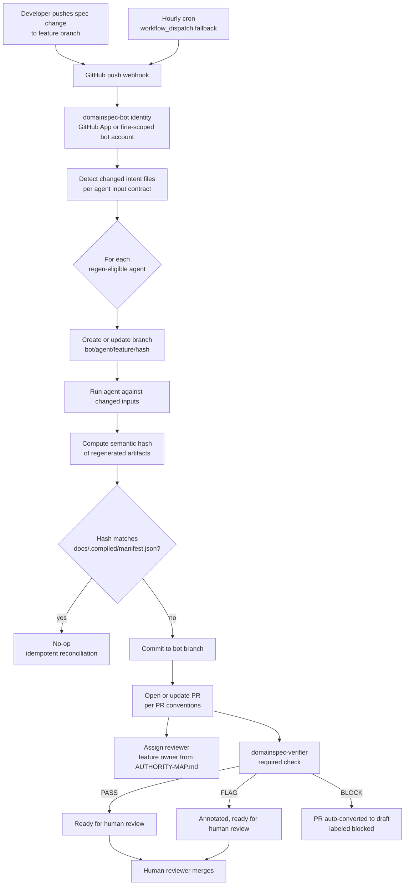

# Phase 4 — `domainspec-bot` & Spec-Driven Regen

## Scope

Per discovery §9 Phase 4: introduce `domainspec-bot` as the regen driver for the
five regen-eligible LLM-judgment agents. The bot watches `docs/features/*` and
`prompts/*`, regenerates affected derived artifacts, opens or updates a paired
pull request per agent, posts a structured obligation diff, and uses
`domainspec-verifier` as a required admission check. The bot never pushes to
`main` and never edits human-owned intent files.

In scope for Phase 4:

1. The `domainspec-bot` GitHub identity (App or fine-scoped PAT-backed bot
   account), its trigger surface (push to non-`main` branches modifying
   `docs/features/*` or `prompts/*`, plus a manual `workflow_dispatch`
   re-trigger).
2. Per-agent paired-PR pipeline for the five regen-eligible LLM-judgment agents
   named in §6 of the discovery.
3. Semantic-hash idempotency for derived artifacts (the structural-equality
   invariant from discovery Q4 — sorted YAML of obligation IDs, AST of
   generated TypeScript), recorded against `docs/.compiled/manifest.json` from
   Phase 2.
4. Obligation-diff PR comments (added / removed / modified obligation IDs)
   following the Atlantis precedent.
5. Verifier-as-admission gating: `domainspec-verifier` BLOCK fails the required
   check; FLAG annotates without blocking; PASS is necessary but not sufficient
   (human review still required).
6. PR conventions (branch naming, title format, body template, labels, stale
   PR supersession).
7. Authority guarantees explicitly enumerated below.

Explicitly **not** in scope (deferred per discovery §1 "What stays the same"):

- Multi-agent merge-conflict resolution (no public prior art — Researcher B
  open problem item 7).
- Reconciliation rollback semantics for spec changes (Researcher B open
  problem item 6).
- Cross-feature spec coupling detection (the `state:modified+` analog).
- Promotion of the three "mixed/derivable" agents (`domainspec-story-sync`,
  `domainspec-test-designer`, `domainspec-otel-instrumenter`) to deterministic
  — they ride the bot-PR path in Phase 4 alongside the regen-eligible five
  but are otherwise out of scope for this spec's contract.

## The five regen-eligible LLM-judgment agents

Per discovery §6, the five regen-eligible agents that participate in the bot
pipeline. Each row defines the trigger contract: what the bot watches, what it
emits, and how ambiguity is handled.

| Agent | Inputs (intent files watched) | Outputs (PR contents) | Trigger (what change in intent fires regen) | Ambiguity strategy |
|---|---|---|---|---|
| `domainspec-spec-writer` | `docs/features/<feature>/SPEC.md`, `docs/features/<feature>/{domain,operations,states,interfaces,events,queries,workflows,mappings}.md`, `docs/glossary.md`, `docs/registry.md` | Updated aspect docs in `docs/features/<feature>/` (NEVER overwrites `SPEC.md` itself — that file is human-owned), updated `docs/glossary.md` and `docs/registry.md` entries | Any change to `SPEC.md` concept tables, or to an aspect file's frontmatter (status, version) | If the SPEC concept table introduces an unresolved concept ID (no source-of-truth link), bot opens PR labeled `needs-clarification` and stops regen for downstream agents until resolved |
| `domainspec-implementer` | `docs/features/<feature>/{SPEC,operations,states,events,workflows}.md`, `generated/features/<feature>/tests/` | `generated/features/<feature>/code/` (implementation scaffolds), updated implementation files traceable to operations | Any change to operations, states, or workflows that adds/removes/modifies an obligation ID | If two operations declare conflicting state transitions, bot posts obligation-diff comment with `CONFLICT:` prefix and refuses to push code; human resolves via SPEC edit |
| `domainspec-task-executor` | `docs/features/<feature>/STORIES.md`, `generated/features/<feature>/tests/`, `generated/features/<feature>/code/` | `generated/features/<feature>/tasks/` (task decomposition artifacts), updated task-status records | Any change to STORIES or to the upstream code/tests bundle | If a story has no traceable obligation ID, bot opens PR labeled `orphan-story`; existing tasks for the orphan story are preserved (not deleted) until resolution |
| `domainspec-ui-architect` | `docs/features/<feature>/{interfaces,STORIES}.md`, `docs/UI-ARCHITECTURE.md`, `docs/features/<feature>/UI-SPEC.md` (if present) | `generated/features/<feature>/ui/` (component contracts, page contracts, route declarations) | Any change to `interfaces.md`, `STORIES.md`, or the project-level `UI-ARCHITECTURE.md` | If `UI-ARCHITECTURE.md` does not exist, bot skips this agent and emits a `spec-gap` signal recommending `domainspec-ui-architecture` be run interactively first |
| `domainspec-infra-architect` | `docs/features/<feature>/observability.md`, `docs/INFRA-ARCHITECTURE.md`, `docs/features/<feature>/SPEC.md` (for new feature scaffolds) | `generated/features/<feature>/infra-deltas/` (observability config deltas, alert deltas, compose deltas) | Change to `observability.md`, or to `INFRA-ARCHITECTURE.md`, or new feature directory created | If a feature declares an OTel signal not present in the project preset, bot posts obligation-diff with `INFRA-ESCALATION:` prefix and labels PR `needs-infra-decision` |

Two cross-cutting rules apply to every agent in this table:

- **Input watching is path-scoped.** A change to `docs/features/feature-A/`
  never triggers regen for `feature-B`. A change to a project-level intent
  file (e.g., `docs/UI-ARCHITECTURE.md`) triggers regen for every feature that
  declares a dependency on it via SPEC frontmatter `depends_on`.
- **Output paths are agent-owned.** No two agents write to the same path under
  `generated/`. This makes per-agent PRs independently reviewable and bisectable.

## The four interactive-only agents

Per discovery §6, four LLM-judgment agents do **not** participate in the bot
pipeline. They remain interactive in Phase 4 exactly as in Phase 1.

| Agent | Why excluded from bot pipeline |
|---|---|
| `domainspec-orchestrator` | Pure routing layer over natural-language intent. Has no committable artifact output — it dispatches to other agents. There is nothing for the bot to regenerate. |
| `domainspec-interviewer` | Human-driven discovery dialogue. Output (`DISCOVERY.md`) is co-authored with a human in the loop; regenerating it from changed inputs would erase the dialogue trace that gives discovery its evidentiary value. |
| `domainspec-planner` | Discussion-style decomposition agent. Output (`PLAN.md`) is a negotiated artifact, not a derivation. Bot regen would produce plans that no human agreed to. |
| `mars-researcher` | External-research agent that fetches and synthesizes web sources. Non-deterministic by source freshness, not by LLM sampling — re-running it changes what *the world* says, not what *the spec* says. Re-trigger is a deliberate human act. |

These agents may still be invoked manually or via `domainspec-orchestrator` in
Phase 4. Their exclusion is from automated regen, not from the framework.

## Bot architecture



Architecture notes:

- **Trigger surface.** Push events on non-`main` branches modifying watched
  paths are the primary trigger. An hourly cron is the safety net for missed
  webhooks and for agents whose inputs include scheduled-data sources.
  `workflow_dispatch` allows a human to re-trigger a specific agent on a
  specific feature branch.
- **Bot identity.** A GitHub App is preferred over a PAT-backed bot account
  because it can carry per-repository fine-scoped permissions and per-PR
  installation tokens (no long-lived credential). The bot identity is granted
  exactly two repository permissions: `pull_requests: write` and `contents:
  write` (limited to bot-prefixed branches via branch protection — see
  Authority guarantees below).
- **Reviewer assignment.** The default reviewer is the feature owner declared
  in `AUTHORITY-MAP.md` for the affected `docs/features/<feature>/`. If the
  PR spans multiple features, every affected owner is added.
- **Verifier admission gate.** `domainspec-verifier` runs as a required check
  on every bot PR (same configuration as Phase 1's `pr-validate.yml` for
  human PRs — see §2.4 of the discovery).

## PR conventions

### Branch naming

`bot/<agent>/<feature>/<input-hash-prefix>`

- `<agent>` is the short agent name without the `domainspec-` prefix
  (`spec-writer`, `implementer`, `task-executor`, `ui-architect`,
  `infra-architect`).
- `<feature>` is the feature directory name under `docs/features/`.
- `<input-hash-prefix>` is the first 8 hex chars of the SHA-256 of the
  concatenated, sorted, normalized contents of all input files for that agent
  (the same hash recorded in `docs/.compiled/manifest.json` per Phase 2).

Examples:

- `bot/spec-writer/payment-processing/a1b2c3d4`
- `bot/implementer/payment-processing/9f8e7d6c`

### PR title format

`[bot-regen] <agent> · <feature> · <short-input-hash>`

Example: `[bot-regen] spec-writer · payment-processing · a1b2c3d4`

The `[bot-regen]` prefix makes bot PRs trivially filterable in the GitHub PR
list and in CI dashboards.

### PR body template

```markdown
## Regen rationale

Triggered by changes to:
- <relative path to changed intent file 1> (commit <sha>)
- <relative path to changed intent file 2> (commit <sha>)

## Input hash

`<full SHA-256 of normalized agent inputs>`

Recorded in `docs/.compiled/manifest.json` under
`generated/features/<feature>/<agent-output-subtree>/`.

## Obligation diff

| Change | Obligation ID | Description |
|---|---|---|
| ADDED | TX-105 | <one-line summary> |
| REMOVED | TX-042 | <one-line summary> |
| MODIFIED | TX-077 | <one-line summary of what changed> |

## Traceability

- Source SPEC: `docs/features/<feature>/SPEC.md` @ commit `<sha>`
- Source aspect docs:
  - `docs/features/<feature>/operations.md` @ commit `<sha>`
  - `docs/features/<feature>/states.md` @ commit `<sha>`
- Generating agent: `<agent>` (version `<agent-version-from-frontmatter>`)
- Prompt hash: `<sha-256 of prompt>`
- Model version: `<model-id>`

## Bot reasoning summary

<2-5 sentence narrative the agent emits explaining what it changed and why,
captured for human auditability per discovery §2.3>

## Verifier verdict

Pending. Required check: `domainspec-verifier`.

---

This PR was opened by `domainspec-bot`. The bot does not merge its own PRs.
Merging requires (a) `domainspec-verifier` PASS or FLAG and (b) at least one
human review approval from a feature owner per `AUTHORITY-MAP.md`.
```

### Labels

Every bot PR carries at minimum:

- `bot-regen` — distinguishes bot PRs from human PRs across the repo.
- `agent:<agent>` — e.g., `agent:spec-writer`, `agent:implementer`.
- `feature:<feature>` — e.g., `feature:payment-processing`.

Conditional labels:

- `blocked` — added when verifier returns BLOCK; PR is auto-converted to draft.
- `needs-clarification` — added when an input contains an unresolved concept
  ID or other ambiguity surfaced by the agent's ambiguity strategy.
- `superseded` — added when a newer bot PR for the same `(agent, feature)`
  pair opens; the older PR is closed.

### Stale PR supersession

If a newer bot PR for the same `(agent, feature)` pair opens (because the
input hash changed), the bot:

1. Adds the `superseded` label to the older PR.
2. Posts a comment on the older PR linking the newer PR.
3. Closes the older PR (does not delete the branch — preserves audit trail).
4. Inherits any human review comments from the older PR by quoting them in
   the newer PR's first bot comment.

This guarantees the open-PR-per-agent-per-feature invariant in the acceptance
criteria below.

## Authority guarantees

Per discovery §2.3 (bot-PR pattern) and §2.4 (verifier as admission gate):

1. **Bot NEVER pushes to `main`.** Branch protection on `main` denies push
   from the `domainspec-bot` identity. This is enforced at the GitHub level,
   not just by convention.
2. **Bot NEVER edits human-owned intent files.** The bot's write scope is
   restricted to (a) branches matching the `bot/*` glob and (b) paths under
   `generated/`, `docs/.compiled/`, and the per-agent output paths declared
   in the regen-eligible agents table above. Specifically excluded: every
   file under `docs/features/<feature>/` that is not in `generated/`,
   including `SPEC.md`, all aspect docs, and `STORIES.md`. Enforcement: a
   `pr-validate.yml` job named `bot-write-scope` rejects bot PRs that touch
   excluded paths.
3. **Bot PR cannot self-merge.** Branch protection on `main` requires (a)
   verifier PASS or FLAG (BLOCK is a hard fail), (b) at least one human
   review approval from a CODEOWNER, and (c) all required checks green.
   The `domainspec-bot` identity is excluded from the CODEOWNER set, so its
   approval does not count toward the required-review threshold even if it
   self-approves.
4. **BLOCK auto-drafts the PR.** If `domainspec-verifier` returns BLOCK on a
   bot PR, a `pr-validate.yml` post-step converts the PR to draft and adds
   the `blocked` label. This prevents the PR from appearing in the
   ready-for-review queue and avoids wasting reviewer attention on artifacts
   the verifier has rejected.
5. **Authority delegation is governance-edited, not CI-edited.** Per
   discovery §2.4, BLOCK as a binding merge-gate requires an explicit edit to
   `CONSTITUTION.md` (landed in Phase 1). Phase 4 inherits that authority
   delegation; it does not re-grant it.

## Non-determinism handling

Per discovery §2.3 and Researcher B's analysis of LLM non-determinism (cited
in §1 "What's broken"), the bot must handle the case where re-running the
same agent on the same inputs produces byte-different but
semantically-equivalent output.

- **Input-hash caching.** Before running an agent, the bot computes the input
  hash and consults `docs/.compiled/manifest.json` plus the open-PR table for
  the matching `(agent, feature, input-hash)` triple. If a prior bot PR with
  the same input hash exists and was either (a) approved and merged or (b)
  is currently open and has already received verifier PASS, the bot does
  **not** re-open the agent. This is the "no-op idempotent reconciliation"
  branch in the architecture diagram.
- **Semantic idempotency fallback.** If the input hash differs but the
  *output* semantic hash matches the most recently merged manifest entry for
  that `(agent, feature)` pair, the bot tags the PR with a
  `non-substantive-regen` label and a comment explaining that the input
  changed but the derived behavior did not (e.g., a comment-only edit to a
  spec). Reviewers may merge the manifest update without a full review of
  the derived artifacts.
- **Bot reasoning recorded in PR body.** The "Bot reasoning summary" section
  of the PR body template captures the agent's narrative explanation of what
  it changed and why. This is the human-auditability requirement from
  discovery §2.3 — every regen carries a "why" that a human can read and
  challenge, even when the underlying LLM output is non-deterministic.
- **Hash algorithms are versioned.** The `docs/.compiled/manifest.json`
  schema records the hash algorithm version (`sha256-v1`). When the
  algorithm changes, every entry is migrated in a single dedicated PR; the
  bot does not silently mix hash versions.

## Acceptance criteria

Each criterion is objectively checkable by running a script against the live
GitHub repo state and the on-disk manifest.

1. **Open-PR uniqueness per agent per feature.** After Phase 4 ships, for
   any given `(agent, feature)` pair, the count of open PRs labeled
   `bot-regen, agent:<agent>, feature:<feature>` is at most 1 at any
   observation time (excluding a 5-minute window during supersession).
   Checkable via `gh pr list --label "bot-regen" --label "agent:..." --label
   "feature:..." --state open | wc -l`.
2. **Regen latency.** A SPEC.md change in feature X that lands on a non-
   `main` branch causes `domainspec-bot` to open or update at most one PR
   per regen-eligible agent within 10 minutes of the push event (cron
   safety-net interval). Checkable via the timestamp delta between the
   triggering commit and the bot PR's `created_at` or `updated_at`.
3. **No bot-authored merges to main.** The Git log on `main` contains zero
   commits whose `committer` or `author` matches the `domainspec-bot`
   identity directly (bot commits land on `main` only via squash/merge of a
   human-approved PR, in which case the merge commit is authored by the
   human merger). Checkable via `git log main --author="domainspec-bot"
   --pretty=format:%H | wc -l` returning 0.
4. **No bot writes to excluded paths.** Across all bot PRs ever opened, zero
   PRs modify any path in the bot's excluded-path set (every file under
   `docs/features/<feature>/` outside `generated/`, plus `CONSTITUTION.md`,
   `AUTHORITY-MAP.md`, `AXIOMS.md`, `TAXONOMY.md`, `RELATIONSHIPS.md`,
   `ARCHITECTURE.md`, `OBSERVABILITY.md`, `TEST-PIPELINE.md`,
   `DRIFT-CONVERGENCE.md`, `GOVERNANCE-ATTENUATION.md`, `TUNING-LOOP.md`,
   `ADLC-ALIGNMENT.md`, `PHASED-PLAN.md`). Checkable via the
   `bot-write-scope` CI job's historical pass-rate of 100%.
5. **Verifier admission is binding.** Across all bot PRs ever merged, zero
   were merged with `domainspec-verifier` returning BLOCK at the time of
   merge. Checkable via the GitHub Checks API on each merged bot PR.
6. **Human approval is mandatory.** Across all bot PRs ever merged, every
   merged PR has at least one `APPROVED` review from a non-bot CODEOWNER
   account. Checkable via the GitHub Reviews API.
7. **Manifest is updated atomically with derived artifacts.** Every bot PR
   that modifies any file under `generated/` also modifies
   `docs/.compiled/manifest.json` in the same commit. Checkable via
   `git show <commit-sha> --name-only` on each bot commit.
8. **No-op detection works.** When the bot is re-triggered with no input
   change (same input hash as the most-recently-merged manifest entry), it
   does not open a new PR. Checkable by running `workflow_dispatch` on a
   feature with no spec changes and observing zero new PRs in the next
   10 minutes.
9. **Non-substantive regens are labeled.** Every PR where the input hash
   differs from the prior merged entry but the output semantic hash matches
   carries the `non-substantive-regen` label. Checkable by sampling N
   recent bot PRs and cross-referencing manifest entries with PR labels.
10. **Stale supersession works.** When two bot PRs for the same `(agent,
    feature)` pair coexist briefly during supersession, the older PR
    transitions to `closed` with the `superseded` label within 5 minutes
    of the newer PR's creation. Checkable via PR state transition timestamps.

## Open questions resolved here

This spec embodies discovery §10 Q1 and Q3. Restated with the recommended
defaults and the embodiment:

### Q1 — Is `domainspec-pipeline` the reconciler, or only a CLI tool with deterministic validators?

**Recommended default in discovery: BOTH, in two phases.** Phase 1 wires
deterministic validators as required CI checks; Phase 4 introduces
`domainspec-bot` running the LLM pipeline on spec changes via paired PR.

**Embodiment in this spec:** the bot architecture, branch-naming convention,
PR conventions, and authority guarantees all describe the Phase 4 half of
the answer. The bot *is* the spec-tier reconciler for the regen-eligible
agents, with semantic-hash idempotency as the per-artifact convergence
invariant. The deterministic Phase 1 reconciler is a prerequisite (declared
in `depends_on`); this spec does not re-derive its contract.

### Q3 — `copilot/` ↔ `.github/` overlay drift detection: in scope for Phase 1 or out?

**Recommended default in discovery: IN SCOPE for Phase 1**, via
`tools/check-overlay-sync.sh` as a required CI check.

**Embodiment in this spec:** out of scope for Phase 4. The overlay drift
detector is declared as a Phase 1 / Phase 2 concern in the discovery, and
this spec inherits it via `depends_on`. The bot does not regenerate the
`.github/` overlay (that overlay is regenerated by `copilot/install.sh`,
which is itself a deterministic regenerator and does not need bot-PR wiring).

## Out of scope

- **Multi-agent merge conflict resolution.** Genuinely deferred — Researcher
  B (open problems item 7) flagged this as having no public prior art. When
  two bot PRs for different agents on the same feature both modify
  overlapping files under `generated/features/<feature>/`, this spec does not
  define automated reconciliation. The default behavior is: each PR is
  reviewed independently; whichever merges first triggers a re-regen of the
  other (input hash will have changed because the merged PR's manifest
  update is now part of the input set for the next agent).
- **Spec rollback semantics.** Deferred — Researcher B (open problems item
  6) flagged rollback for spec changes as an open problem. If a merged spec
  change is reverted on `main`, the bot will detect the new input state on
  the next push and regenerate accordingly, but there is no
  "rollback-aware" path that restores the prior derived state without
  re-running the agents.
- **Cross-feature spec coupling detection.** Deferred — the `state:modified+`
  analog (dbt's downstream-impact computation) is named in discovery §1 as
  out of scope for v1. The bot treats each feature's regen independently.
  Cross-feature impact, when it exists, is surfaced only through human
  review of multiple simultaneous bot PRs.
- **Bot self-tuning / agent-version bumps.** The bot does not decide when to
  upgrade the LLM model version or the agent prompt version. Those are
  human governance decisions surfaced through `domainspec-reflect` and
  enacted via dedicated PRs to the agent definition files.
- **Webhook delivery guarantees.** The bot relies on GitHub's at-least-once
  webhook delivery plus an hourly cron safety net. True exactly-once
  delivery semantics are not in scope; the input-hash-cache is the
  defense against duplicate processing.
- **Cost accounting and per-PR budget enforcement.** `agent-cost` signal
  emission is in Phase 1's scope (per `domainspec-emit-signals`); bot-PR
  cost tracking inherits that machinery but does not add per-PR token
  budgets or auto-cancellation in Phase 4.

## Open items

Each item carries a recommendation for resolution during execution. None
block landing this spec as a working blueprint.

### OI-1. GitHub App vs. fine-scoped bot account

**Question:** which identity surface should `domainspec-bot` use?

**Recommendation:** GitHub App. Per-installation tokens are short-lived and
fine-scoped, eliminating the long-lived-PAT failure mode. The setup cost is
one-time (App registration, private-key management via SOPS per Phase 2).
Fall back to a bot account with a fine-scoped PAT only if App installation
permissions are unavailable in the deploy environment.

### OI-2. Where does the bot run?

**Question:** GitHub Actions, self-hosted runner (per the `agent-runner`
template added in CHANGELOG 1.8.1), or a separate VPS-hosted service?

**Recommendation:** self-hosted runner, reusing the `agent-runner` template
that already exists for Copilot CLI. Cost-tracked via the `agent-cost`
signal. Promote to a dedicated service only if regen volume exceeds the
runner's queue depth.

### OI-3. Semantic-hash algorithm definition per output type

**Question:** discovery §6 names sorted-YAML-of-obligation-IDs and
AST-of-generated-TypeScript as the structural-equality invariants, but does
not exhaustively define the algorithm for every output type produced by the
five regen-eligible agents (e.g., what is the structural hash for a
generated Caddyfile, or for a Pulumi program?).

**Recommendation:** ship Phase 4 with hash algorithms defined for the three
most common output types (YAML, TypeScript, Markdown with frontmatter).
Other types fall back to byte-equality with a `semantic-hash:fallback`
label, surfacing the gap as a `spec-gap` signal for `domainspec-reflect`
to escalate.

### OI-4. Reviewer rotation when feature owner is the spec author

**Question:** when the human who pushed the spec change *is* the feature
owner, the bot will assign the PR back to the same human, creating a
self-review loop that defeats the human-approval acceptance criterion.

**Recommendation:** if the spec author equals the feature owner, the bot
escalates reviewer assignment one level up the authority chain (the
"section owner" per `AUTHORITY-MAP.md`, or the maintainer if no section
owner is declared). Encode the chain explicitly in `AUTHORITY-MAP.md`
during Phase 1.

### OI-5. Behavior on agent failure vs. agent BLOCK

**Question:** if a regen-eligible agent crashes mid-run (vs. completing and
producing output that the verifier later BLOCKs), how should the bot
respond?

**Recommendation:** distinguish in PR conventions. Agent crash → no PR is
opened, and a `governance-gap` signal is emitted with the agent name and
crash trace. Agent completes + verifier BLOCKs → PR opens in draft with
the `blocked` label per the existing flow. This keeps the agent-failure
case visible to human operators without polluting the PR list with
crash artifacts.

### OI-6. Manifest-write race between concurrent bot PRs

**Question:** if two bot PRs for different agents on the same feature both
write to `docs/.compiled/manifest.json`, and both pass verifier, the
second to merge will need a rebase (manifest is one file).

**Recommendation:** the bot watches `main` for merges of bot PRs; when a
merge lands, the bot rebases every other open bot PR for the same feature,
re-runs the affected agents if input hashes changed post-rebase, and
force-pushes to the bot branch (force-push is allowed on `bot/*` branches
but not on `main`). Cap the rebase loop at 3 attempts per PR per hour to
prevent thrashing.

### OI-7. Migration path for existing `_categorical/` artifacts

**Question:** discovery §10 Q5 names the `_categorical/` sunset trigger
(migrate once the regenerator script lands in `tools/` in Phase 2). Should
the bot in Phase 4 own that migration or assume it has already happened?

**Recommendation:** assume Phase 2 completed the migration. If
`_categorical/` directories still exist when Phase 4 ships, the bot emits a
`spec-gap` signal naming the path and refuses to regen artifacts whose
inputs touch the `_categorical/` tree. This forces the migration to
complete before bot regen activates for affected features.
