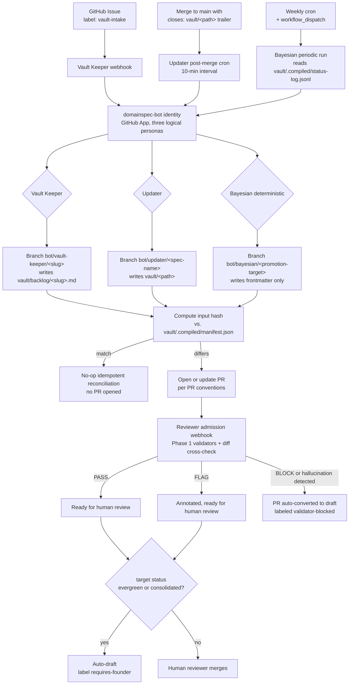

# Phase 4 — `domainspec-bot` & Vault Agent Pipeline

## Scope

Phase 4 ships the bot-PR pipeline for the vault's three writing agents (Vault
Keeper, Updater, and the Bayesian deterministic core) and wires the Reviewer
as the admission webhook on every bot-opened PR. The Information Keeper is
out of scope (it is a read layer — Graph-Dropping RAG — and produces no PRs).
The framework-generic 5-LLM-agent bot pipeline (`domainspec-spec-writer`,
`domainspec-implementer`, `domainspec-task-executor`, `domainspec-ui-architect`,
`domainspec-infra-architect`) is the same pattern applied at a different layer
and is **deferred to v2**. By restricting v1 to the vault's four named agents,
this phase pilots the bot-PR pattern against the canonical design in
`vault/ontology-architecture-draft.md` before generalizing it to the framework.

In scope for Phase 4:

1. The `domainspec-bot` GitHub identity (App or fine-scoped PAT-backed bot
   account), running three logical bot personas mapped onto the vault's
   writing agents (Vault Keeper, Updater, Bayesian-deterministic).
2. The Reviewer admission webhook running as a required check on every
   bot-opened PR, reusing Phase 1's deterministic validators (vault frontmatter
   schema, edge-type catalog, status-lifecycle rules) and adding a PR-diff vs.
   git-diff cross-check for hallucination detection.
3. Trigger surfaces:
   - Vault Keeper: GitHub Issue with label `vault-intake` (recommended in
     OI-1 below); fires the intake webhook.
   - Updater: post-merge cron on `main` that scans new commit messages for
     `closes: vault/<path>` references.
   - Bayesian (deterministic): weekly cron plus on-demand `workflow_dispatch`
     reading `vault/.compiled/status-log.jsonl`.
4. Semantic-hash idempotency for vault edits, recorded against
   `vault/.compiled/manifest.json` (the Phase 2 manifest extended for vault
   regenerators) — the bot consults the manifest before opening a PR to avoid
   re-proposing identical edits.
5. Reviewer admission gating: BLOCK fails the required check (PR auto-drafts);
   FLAG annotates without blocking; PASS is necessary but not sufficient (human
   review still required, per the trust-gate rules in
   `vault/ontology-architecture-draft.md` §2).
6. PR conventions (branch naming, title format, body template, labels, stale
   PR supersession), vault-scoped per the section below.
7. Authority guarantees explicitly enumerated below — including the new
   vault-specific guards (no edits to `evergreen`/`consolidated` files;
   no edits under `vault/axiom/` or `vault/constitution/`).

Explicitly **not** in scope:

- **Information Keeper** — deferred indefinitely. It is the read layer
  (Graph-Dropping RAG over `vault/.compiled/`); it does not open PRs and is
  therefore not a GitOps concern.
- **Bayesian predictive ML** — deferred to v2. Only the deterministic
  status-promotion checker (Phase 2 entry/exit criteria from
  `vault/confidence-levels.md`) ships in v1.
- **Updater AST/grep-based code-watching** — v1 ships only the explicit
  `closes: vault/<path>` commit-trailer mechanism. Inferring affected vault
  specs from arbitrary code diffs is deferred to v2.
- **Framework-generic 5-LLM-agent bot pipeline** (`spec-writer`,
  `implementer`, `task-executor`, `ui-architect`, `infra-architect`) — same
  pattern, different layer; deferred to v2.
- **Multi-agent merge-conflict resolution** — no public prior art (Researcher
  B open problem item 7); deferred.
- **Reconciliation rollback semantics for vault edits** — Researcher B open
  problem item 6; deferred.
- **Cross-vault-node coupling detection** (the `state:modified+` analog) —
  the bot treats each vault node's regen independently.

## The vault's writing agents (v1 bot-PR pipeline)

Per `vault/ontology-architecture-draft.md` §1, the vault defines five named
agents. Three of them write (Vault Keeper, Updater, Bayesian); one is purely a
verifier (Reviewer); one is purely a reader (Information Keeper). Phase 4 ships
the three writing agents as bot-PR producers and the Reviewer as the admission
webhook on every bot PR.

| Vault agent | GitOps role | v1 status | What ships in v1 |
|---|---|---|---|
| **Vault Keeper** | LLM-judgment intake bot — drafts ADRs/premises from natural language input, opens PRs against `vault/backlog/` or `vault/premise/` | SHIPS in v1 | Bot account, intake webhook, PR template |
| **Updater** | LLM-judgment regen bot — watches code changes, opens PRs to update affected vault specs | SHIPS in v1 (limited scope: watches for explicit `closes: vault/<path>` references in commit messages — full code-watching is v2) | Bot account, post-merge cron, PR template |
| **Reviewer** | Deterministic admission webhook — verifies bot-opened PRs against actual git diffs and against the vault frontmatter / edge-type schema from Phase 1 | SHIPS in v1 | Required check on bot-PRs; reuses Phase 1's validators |
| **Bayesian** | Mostly deterministic in v1 — runs the status-promotion checker derived from Phase 2 against `vault/confidence-levels.md` entry/exit criteria; opens PRs proposing promotions/demotions for human review | PARTIAL in v1 (only deterministic checker; predictive ML deferred to v2) | PR proposer reading `vault/.compiled/status-log.jsonl` |
| **Information Keeper** | Read layer (Graph-Dropping RAG) — query, not write | OUT of v1 (deferred indefinitely; not a GitOps concern) | nothing |

### Per-agent trigger contract (v1)

For each shipping writing agent, the row below defines what the bot watches,
what the PR contains, when it fires, and how ambiguity is handled.

| Agent | Inputs (intent files watched) | Outputs (PR contents + target paths) | Trigger | Ambiguity strategy |
|---|---|---|---|---|
| **Vault Keeper** | Natural-language intake: GitHub Issues labeled `vault-intake` (v2: `/vault` Slack command) | New file under `vault/backlog/<slug>.md` (or `vault/premise/<slug>.md` only when the intake explicitly states the node is a working premise), populated to the schema in `vault/ontology-conventions.md` — required frontmatter: `node_type`, `layer`, `nature`, `status: draft`, `version: 0.1.0`, `last_updated`, plus `veracidade`/`convicção` if `node_type ∈ {axiom, premise, discovery, audit}` | Issue opened or commented with the `vault-intake` label | If intake is missing a clear `node_type` or `layer`, bot opens the PR with `status: draft` plus the `needs-clarification` label and a comment listing missing fields; PR stays draft until a human fills them in |
| **Updater** | Commits merged to `main` whose message contains a `closes: vault/<path>` trailer; the referenced vault file becomes the regen target | Updated file at `vault/<path>` with edits scoped to the change (e.g., new field documented in a spec, new edge in the `## Connections` section); manifest entry updated in `vault/.compiled/manifest.json` | Post-merge cron on `main` (every 10 min) detecting new `closes: vault/<path>` trailers since the last cron run | If the referenced `vault/<path>` does not exist, bot opens an issue (no PR) labeled `vault-target-missing` and emits a `spec-gap` signal; if the target file has `status: evergreen` or `status: consolidated`, bot does NOT edit the file directly — see Authority guarantees below |
| **Bayesian (deterministic)** | `vault/.compiled/status-log.jsonl` (the per-node lifecycle event stream produced by Phase 2) plus the entry/exit criteria from `vault/confidence-levels.md` | Frontmatter-only edit to one vault file per PR: bumping `status` (e.g., `active` → `consolidated`) or proposing a downgrade (e.g., `consolidated` → `active` with a `contradicts` edge); manifest entry updated | Weekly cron (`workflow_dispatch` available on demand) | If the status-log entry indicates entry criteria are satisfied for promotion AND no `contradicts` edges are open, bot opens the promotion PR; if entry criteria are partially satisfied, bot opens a draft PR labeled `partial-promotion-evidence` and lists the unmet criteria in the PR body |

Three cross-cutting rules apply to every agent in this table:

- **Input watching is vault-path-scoped.** A vault intake for `vault/backlog/`
  never triggers an Updater regen for `vault/spec/`. The Bayesian operates
  per-file (one PR per node per cycle).
- **Output paths are agent-owned.** Vault Keeper writes only under
  `vault/backlog/` (or `vault/premise/` per the rule above). Updater writes
  only under `vault/spec/` (and other writable subtrees explicitly listed in
  the manifest). Bayesian writes only frontmatter blocks of existing files.
  No two agents write to the same path in the same PR.
- **Reviewer is on the path of every bot PR.** No bot PR is mergeable without
  a Reviewer PASS or FLAG verdict. Reviewer reuses Phase 1's deterministic
  validators (frontmatter schema, edge catalog from
  `vault/ontology-conventions.md` Appendix C, status entry/exit rules from
  `vault/confidence-levels.md`) and adds a PR-diff vs. git-diff cross-check to
  catch hallucinated edits (markdown that claims a code change which is not
  actually present in the referenced commit).

### Information Keeper — out of v1

The Information Keeper is the consumption layer (Graph-Dropping RAG). It
reads the vault and the SQL `ontology_events` ledger to answer team
questions; it never opens PRs and never writes. With no committable output,
it has no place in the bot-PR pipeline and is deferred indefinitely as a
GitOps concern (it is built independently as a query service).

### Framework-generic interactive agents — deferred to v2

The DomainSpec framework defines a parallel set of interactive agents
(`domainspec-orchestrator`, `domainspec-interviewer`, `domainspec-planner`,
`mars-researcher`) that the vault has no analogues for. They remain
interactive in Phase 4 and are explicitly **deferred to v2** for any bot
pipeline participation: orchestrator is pure routing with no committable
artifact; interviewer is human-driven dialogue whose trace is the value;
planner is negotiated decomposition (no bot regen); mars-researcher is
externally-non-deterministic by source freshness. Exclusion is structural,
not prohibitive — these agents may still be invoked manually.

## Bot architecture



Architecture notes:

- **Three personas, one identity.** Vault Keeper, Updater, and Bayesian
  (deterministic) all run under the same `domainspec-bot` GitHub App identity
  but on disjoint trigger surfaces and disjoint output paths.
- **Bot identity.** A GitHub App is preferred over a PAT-backed bot account
  for short-lived per-installation tokens. The identity is granted exactly
  two repository permissions: `pull_requests: write` and `contents: write`
  (limited to `bot/*` branches via branch protection — see Authority
  guarantees).
- **Reviewer assignment.** The default reviewer is the vault-node owner
  declared in `AUTHORITY-MAP.md` for the affected `vault/<path>`; falls
  back to the `vault/` CODEOWNER. PRs touching `vault/axiom/` or
  `vault/constitution/` are blocked outright by `bot-write-scope` and never
  reach this step.
- **Reviewer admission gate.** The Reviewer webhook runs as a required
  check on every bot PR. It executes Phase 1's validators (vault frontmatter
  schema, edge-type catalog, status entry/exit rules) and adds a PR-diff
  vs. git-diff cross-check: when a PR claims an edit referencing a code
  change, the referenced commit's diff must contain that change.
  Hallucination detection failure is a BLOCK.

## PR conventions

### Branch naming

Vault-scoped per persona:

- Vault Keeper: `bot/vault-keeper/<slug>` — `<slug>` is the kebab-cased title
  derived from the intake Issue.
- Updater: `bot/updater/<spec-name>` — `<spec-name>` is the path-segment of
  the targeted file under `vault/` with `/` replaced by `-` (e.g.,
  `bot/updater/spec-liquidacao` for `vault/spec/liquidacao.md`).
- Bayesian: `bot/bayesian/<promotion-target>` — `<promotion-target>` is the
  same path-segment scheme as Updater plus a `-promote` or `-demote` suffix.

Each branch name additionally embeds the first 8 hex chars of the SHA-256
input hash as a trailing `-<hash>` segment (e.g.,
`bot/updater/spec-liquidacao-a1b2c3d4`); this is the same hash recorded in
`vault/.compiled/manifest.json`.

Examples:

- `bot/vault-keeper/use-polars-for-pipeline-a1b2c3d4`
- `bot/updater/spec-liquidacao-9f8e7d6c`
- `bot/bayesian/spec-aquisicao-promote-c0ffee01`

### PR title format

`[vault-bot] <agent> · <target>`

- `<agent>` is one of `vault-keeper`, `updater`, `bayesian`.
- `<target>` is the vault path being created or edited (e.g.,
  `vault/backlog/use-polars-for-pipeline.md`).

Example: `[vault-bot] updater · vault/spec/liquidacao.md`

The `[vault-bot]` prefix makes bot PRs trivially filterable in the GitHub PR
list and in CI dashboards.

### PR body template

```markdown
## Regen rationale

<For Vault Keeper: link to the `vault-intake` Issue and quote the natural-language input.>
<For Updater: list the merged commits whose `closes: vault/<path>` trailer
triggered this regen, with SHAs.>
<For Bayesian: cite the `vault/.compiled/status-log.jsonl` entries and the
specific entry/exit criteria from `vault/confidence-levels.md` that fired.>

## Input hash

`<full SHA-256 of normalized agent inputs>`

Recorded in `vault/.compiled/manifest.json` under the per-agent subtree.

## Vault node context

- **Affected node:** `vault/<path>`
- **Current status:** `<status from frontmatter, or "new" for Vault Keeper>`
- **Proposed status:** `<status the PR sets — usually unchanged except for Bayesian>`
- **Open `contradicts` edges:** `<list paths or "none">`
- **Affected edges (added / removed / modified):**

| Change | Edge type | Target |
|---|---|---|
| ADDED | `derives-from` | `vault/<path>` |
| REMOVED | `contradicts` | `vault/<path>` |

## Traceability

- Affected vault file: `vault/<path>`
- Generating agent: `<vault-keeper | updater | bayesian>` (version
  `<agent-version>`)
- Prompt hash: `<sha-256 of prompt>` (Vault Keeper / Updater only — Bayesian
  v1 is deterministic and has no prompt)
- Model version: `<model-id>` (Vault Keeper / Updater only)

## Bot reasoning summary

<2-5 sentence narrative the agent emits explaining what it changed and why,
captured for human auditability. Bayesian v1 emits a deterministic summary
of which entry/exit criteria fired.>

## Reviewer verdict

Pending. Required check: `vault-reviewer`.

---

This PR was opened by `domainspec-bot` (vault pilot). The bot does not merge
its own PRs. Merging requires (a) `vault-reviewer` PASS or FLAG and (b) at
least one human review approval from the vault-node owner per
`AUTHORITY-MAP.md`. PRs targeting files with `status: evergreen` or
`status: consolidated` require founder approval per
`vault/ontology-architecture-draft.md` §2.
```

### Labels

Every bot PR carries at minimum:

- `bot-regen` — preserved from the framework-generic pattern; distinguishes
  bot PRs from human PRs across the repo.
- `vault-bot` — vault-pilot scope marker.
- `agent:<name>` — one of `agent:vault-keeper`, `agent:updater`,
  `agent:bayesian`.
- `vault-target:<file>` — the affected vault path (e.g.,
  `vault-target:vault/spec/liquidacao.md`).

Conditional labels:

- `validator-blocked` — added when Reviewer returns BLOCK; PR is
  auto-converted to draft.
- `requires-founder` — added when the PR targets a file with `status:
  evergreen` or `status: consolidated`; PR is auto-converted to draft.
- `needs-clarification` — added when Vault Keeper intake is missing
  `node_type` or `layer`.
- `vault-target-missing` — applied to the issue (not a PR) when an Updater
  trailer references a non-existent `vault/<path>`.
- `partial-promotion-evidence` — added by Bayesian when entry criteria are
  partially satisfied for a promotion.
- `non-substantive-regen` — added when the input hash differs but the
  semantic hash matches the most-recently-merged manifest entry.
- `superseded` — added when a newer bot PR for the same
  `(agent, vault-target)` pair opens; the older PR is closed.

### Stale PR supersession

If a newer bot PR for the same `(agent, vault-target)` pair opens (because
the input hash changed), the bot:

1. Adds the `superseded` label to the older PR.
2. Posts a comment on the older PR linking the newer PR.
3. Closes the older PR (does not delete the branch — preserves audit trail).
4. Inherits any human review comments from the older PR by quoting them in
   the newer PR's first bot comment.

This guarantees the open-PR-per-agent-per-vault-target invariant in the
acceptance criteria below.

## Authority guarantees

Per discovery §2.3 (bot-PR pattern), §2.4 (verifier as admission gate), and
the trust gates declared in `vault/ontology-architecture-draft.md` §2:

1. **Bot NEVER pushes to `main`.** Branch protection on `main` denies push
   from the `domainspec-bot` identity. This is enforced at the GitHub level,
   not just by convention.
2. **Bot NEVER edits human-owned intent files.** The bot's write scope is
   restricted to (a) branches matching the `bot/*` glob and (b) paths under
   `vault/backlog/`, `vault/premise/`, `vault/spec/`, and
   `vault/.compiled/`. Specifically excluded: every other vault subtree
   (notably `vault/axiom/` and `vault/constitution/` — see guarantee 6
   below), plus every file under `docs/features/<feature>/` that is not in
   `generated/`. Enforcement: a `pr-validate.yml` job named
   `bot-write-scope` rejects bot PRs that touch excluded paths.
3. **Bot PR cannot self-merge.** Branch protection on `main` requires (a)
   Reviewer PASS or FLAG (BLOCK is a hard fail), (b) at least one human
   review approval from a CODEOWNER, and (c) all required checks green.
   The `domainspec-bot` identity is excluded from the CODEOWNER set, so its
   approval does not count toward the required-review threshold even if it
   self-approves.
4. **BLOCK auto-drafts the PR.** If the Reviewer returns BLOCK on a bot PR,
   a `pr-validate.yml` post-step converts the PR to draft and adds the
   `validator-blocked` label. This prevents the PR from appearing in the
   ready-for-review queue and avoids wasting reviewer attention on
   artifacts the Reviewer has rejected.
5. **Authority delegation is governance-edited, not CI-edited.** Per
   discovery §2.4, BLOCK as a binding merge-gate requires an explicit edit
   to `CONSTITUTION.md` (landed in Phase 1). Phase 4 inherits that
   authority delegation; it does not re-grant it.
6. **Vault bots NEVER edit `evergreen` or `consolidated` files directly.**
   Per `vault/ontology-architecture-draft.md` §2, foundational-level changes
   require explicit human-founder approval. When a bot regen would target a
   vault file whose frontmatter declares `status: evergreen` or
   `status: consolidated`, the bot does NOT propose a content edit. Instead,
   it may only propose a `contradicts` edge added to a separate (lower-status)
   companion node for human review. The PR is auto-drafted and labeled
   `requires-founder`. Enforcement: the same `bot-write-scope` job inspects
   target-file frontmatter before allowing the diff.
7. **Vault bots NEVER edit `vault/axiom/*` or `vault/constitution/*`.** These
   subtrees are founder-only territory regardless of the file's `status`
   field. A bot PR touching any path under `vault/axiom/` or
   `vault/constitution/` is rejected outright by `bot-write-scope` (PR is not
   even opened — the bot fails to push the branch).
8. **Vault Keeper PRs land only in `vault/backlog/` first.** Promotion of a
   backlog item to `vault/premise/`, `vault/spec/`, or higher requires a
   subsequent **human** PR. The Vault Keeper does not create files outside
   `vault/backlog/` except in the narrow case allowed by its row in the
   trigger-contract table (intake explicitly states the node is a working
   premise). Enforcement: `bot-write-scope` rejects Vault Keeper PRs that
   create files outside the allowed prefixes for that persona.

## Non-determinism handling

Per discovery §2.3 and Researcher B's analysis of LLM non-determinism (cited
in §1 "What's broken"), the bot must handle the case where re-running the
same agent on the same inputs produces byte-different but
semantically-equivalent output. Vault scoping reduces uncertainty (the four
named agents have narrow, well-typed write-scopes) but does not eliminate the
underlying LLM idempotency problem.

- **Input-hash caching, vault-scoped.** Before running Vault Keeper or
  Updater, the bot computes the input hash and consults the manifest
  (`vault/.compiled/manifest.json`, extended in Phase 2 to track per-vault-
  agent hashes) plus the open-PR table for the matching
  `(agent, vault-target, input-hash)` triple. If a prior bot PR with the
  same input hash exists and was either (a) approved and merged or (b) is
  currently open and has already received Reviewer PASS, the bot does
  **not** re-open the agent. This is the "no-op idempotent reconciliation"
  branch in the architecture diagram. Bayesian (deterministic) consults the
  same manifest to skip cycles where the status-log hash is unchanged.
- **Semantic idempotency fallback.** If the input hash differs but the
  *output* semantic hash matches the most recently merged manifest entry
  for that `(agent, vault-target)` pair, the bot tags the PR with a
  `non-substantive-regen` label and a comment explaining that the input
  changed but the proposed vault edit did not (e.g., a whitespace-only
  trailer in a `closes:` reference). Reviewers may merge the manifest update
  without a full review.
- **Bot reasoning recorded in PR body.** The "Bot reasoning summary" section
  of the PR body template captures the agent's narrative explanation of
  what it changed and why. This is the human-auditability requirement from
  discovery §2.3 — every regen carries a "why" a human can read and
  challenge, even when the underlying LLM output is non-deterministic.
  Bayesian's v1 narrative is a deterministic enumeration of the entry/exit
  criteria from `vault/confidence-levels.md` that fired.
- **Hash algorithms are versioned.** The `vault/.compiled/manifest.json`
  schema records the hash algorithm version (`sha256-v1`). When the
  algorithm changes, every entry is migrated in a single dedicated PR; the
  bot does not silently mix hash versions.

## Acceptance criteria

Each criterion is objectively checkable by running a script against the live
GitHub repo state and the on-disk vault manifest.

1. **Vault Keeper opens at most one PR per intake.** After Phase 4 ships, a
   GitHub Issue carrying the `vault-intake` label causes the Vault Keeper to
   open at most one PR against `vault/backlog/` per intake event. Checkable
   via `gh pr list --label "agent:vault-keeper" --search "issue-id:<id>"`
   returning at most 1 result.
2. **Updater opens at most one PR per `closes:` reference.** A code commit
   merged to `main` containing `closes: vault/<path>` causes the Updater to
   open at most one PR proposing an edit to `vault/<path>`. Checkable via
   `gh pr list --label "agent:updater" --label "vault-target:vault/<path>"
   --state open` returning at most 1 result per unique `(commit, path)`
   pair.
3. **Bayesian opens at most one promotion PR per file per cycle.** A
   `vault/.compiled/status-log.jsonl` entry whose entry criteria are
   satisfied causes the Bayesian to open at most one promotion or demotion
   PR per file per weekly cycle. Checkable via `gh pr list --label
   "agent:bayesian" --label "vault-target:<path>"` filtered to the cycle
   window.
4. **No bot can merge any PR.** Across all bot PRs ever merged, every
   merged PR has both (a) Reviewer PASS or FLAG at the time of merge and
   (b) at least one `APPROVED` review from a non-bot CODEOWNER. Verified
   by branch protection on `main` requiring human approval AND Reviewer
   PASS. Checkable via the GitHub Checks and Reviews APIs.
5. **Bot PRs targeting `evergreen` or `consolidated` files are auto-drafted.**
   When a bot PR proposes editing a vault file whose frontmatter declares
   `status: evergreen` or `status: consolidated`, the PR is auto-converted
   to draft and labeled `requires-founder` within 60 seconds of opening.
   Checkable via PR state transitions and label history.
6. **Bot PRs failing Phase 1 validators are auto-drafted.** When a bot PR
   for a vault edit fails any Phase 1 validator (frontmatter schema,
   edge-type catalog, status entry/exit rules, hallucination cross-check),
   the PR is auto-converted to draft and labeled `validator-blocked`.
   Checkable via the GitHub Checks API on each bot PR.
7. **Open-PR uniqueness per `(agent, vault-target)` pair.** For any given
   `(agent, vault-target)` pair, the count of open PRs labeled
   `vault-bot, agent:<agent>, vault-target:<file>` is at most 1 at any
   observation time (excluding a 5-minute window during supersession).
   Checkable via `gh pr list --label "vault-bot" --label "agent:..."
   --label "vault-target:..." --state open | wc -l`.
8. **No bot-authored merges to `main`.** The Git log on `main` contains
   zero commits whose `committer` or `author` matches the `domainspec-bot`
   identity directly. Checkable via `git log main --author="domainspec-bot"
   --pretty=format:%H | wc -l` returning 0.
9. **No bot writes to forbidden paths.** Across all bot PRs ever opened,
   zero PRs modify any path under `vault/axiom/` or `vault/constitution/`,
   and zero Vault Keeper PRs create files outside `vault/backlog/` (or the
   narrowly-allowed `vault/premise/` case). Checkable via the
   `bot-write-scope` CI job's historical pass-rate of 100%.
10. **Manifest is updated atomically with vault edits.** Every bot PR that
    modifies any file under `vault/` (excluding `vault/.compiled/`) also
    modifies `vault/.compiled/manifest.json` in the same commit. Checkable
    via `git show <commit-sha> --name-only` on each bot commit.
11. **No-op detection works.** When the bot is re-triggered with no input
    change (same input hash as the most-recently-merged manifest entry),
    it does not open a new PR. Checkable by running `workflow_dispatch`
    on a vault target with no upstream change and observing zero new PRs.
12. **Stale supersession works.** When two bot PRs for the same
    `(agent, vault-target)` pair coexist briefly during supersession, the
    older PR transitions to `closed` with the `superseded` label within
    5 minutes of the newer PR's creation. Checkable via PR state
    transition timestamps.

## Open questions resolved here

This spec embodies discovery §10 Q1 and Q3, restated in vault terms with
the recommended defaults and the embodiment.

### Q1 — Is `domainspec-pipeline` the reconciler, or only a CLI tool with deterministic validators?

**Recommended default in discovery: BOTH, in two phases.** Phase 1 wires
deterministic validators as required CI checks; Phase 4 introduces
`domainspec-bot` running the LLM pipeline on spec changes via paired PR.

**Embodiment in this spec (vault-scoped):** the bot architecture,
branch-naming convention, PR conventions, and authority guarantees all
describe the Phase 4 half of the answer, **applied to the vault's named
agents** (Vault Keeper, Updater, Bayesian-deterministic) with the Reviewer
as the admission webhook. The bot *is* the vault-tier reconciler for the
three writing agents, with semantic-hash idempotency against
`vault/.compiled/manifest.json` as the per-artifact convergence invariant.
The deterministic Phase 1 reconciler (validating vault frontmatter, edges,
and status lifecycle) is a prerequisite (declared in `depends_on`). The
framework-generic reconciler (the same pattern over `docs/features/`) is
v2; this spec does not re-derive its contract.

### Q3 — `copilot/` ↔ `.github/` overlay drift detection: in scope for Phase 1 or out?

**Recommended default in discovery: IN SCOPE for Phase 1**, via
`tools/check-overlay-sync.sh` as a required CI check.

**Embodiment in this spec:** out of scope for Phase 4. The overlay drift
detector is declared as a Phase 1 / Phase 2 concern in the discovery and
inherited via `depends_on`. The bot does not regenerate the `.github/`
overlay (that overlay is regenerated by `copilot/install.sh`, which is
itself a deterministic regenerator and does not need bot-PR wiring).

## Out of scope

- **Information Keeper.** Deferred indefinitely — it is the read layer
  (Graph-Dropping RAG over `vault/.compiled/`) and produces no PRs.
- **Bayesian's predictive ML.** Deferred to v2. Only the deterministic
  status-promotion checker (Phase 2 entry/exit criteria from
  `vault/confidence-levels.md`) ships in v1.
- **Framework-generic 5-LLM-agent bot pipeline** (`spec-writer`,
  `implementer`, `task-executor`, `ui-architect`, `infra-architect`).
  Deferred to v2 — same pattern as v1, applied at the framework layer
  rather than the vault layer.
- **Multi-agent merge conflict resolution.** Deferred — Researcher B (open
  problems item 7) flagged this as having no public prior art. When two bot
  PRs for different agents on the same vault target both modify overlapping
  files, this spec does not define automated reconciliation. The default
  behavior is: each PR is reviewed independently; whichever merges first
  triggers a re-regen of the other (input hash will have changed because
  the merged PR's manifest update is now part of the input set).
- **Vault rollback semantics.** Deferred — Researcher B (open problems
  item 6) flagged rollback for spec changes as an open problem. If a
  merged vault edit is reverted on `main`, the bot will detect the new
  input state on the next cron and regenerate accordingly, but there is no
  "rollback-aware" path that restores the prior derived state without
  re-running the agents.
- **Cross-vault-node coupling detection.** Deferred — the `state:modified+`
  analog (dbt's downstream-impact computation) is out of scope for v1. The
  bot treats each vault node's regen independently. Cross-node impact,
  when it exists, is surfaced only through human review of multiple
  simultaneous bot PRs (or via the `contradicts` edge surfaced by Phase 1
  validators).
- **Bot self-tuning / agent-version bumps.** The bot does not decide when
  to upgrade the LLM model version or the agent prompt version. Those are
  human governance decisions surfaced through `domainspec-reflect` and
  enacted via dedicated PRs to the agent definition files.
- **Webhook delivery guarantees.** The bot relies on GitHub's at-least-once
  webhook delivery plus the cron safety nets. True exactly-once delivery
  semantics are not in scope; the input-hash-cache is the defense against
  duplicate processing.
- **Cost accounting and per-PR budget enforcement.** `agent-cost` signal
  emission is in Phase 1's scope (per `domainspec-emit-signals`); bot-PR
  cost tracking inherits that machinery but does not add per-PR token
  budgets or auto-cancellation in Phase 4.

## Open items

Each item carries a recommendation for resolution during execution. None
block landing this spec as a working blueprint.

### OI-V1. Vault Keeper intake source

**Question:** where does the Vault Keeper intake event come from?

**Recommendation (v1):** GitHub Issue with the label `vault-intake`; issue
body is the natural-language input. Zero new infrastructure (Issue webhooks
are native), permanent human-readable URL per intake. Slack/IDE
integrations (e.g., a `/vault` Slack command) deferred to v2.

### OI-V2. Updater code-watching mechanism

**Question:** how does the Updater know which vault spec a code change
affects?

**Recommendation (v1):** require commit messages to include a `closes:
vault/<path>` trailer; the post-merge cron parses trailers and routes
regen. Authors must opt in — keeps v1 deterministic and avoids false
positives. AST/grep-based inference is deferred to v2.

### OI-V3. Bayesian promotion-proposal frequency

**Question:** how often should the Bayesian deterministic checker run?

**Recommendation (v1):** weekly cron (Mondays 09:00 UTC) plus on-demand
`workflow_dispatch`. Slow enough to avoid PR-list noise, fast enough to
catch promotions within a sprint. Tune to daily if the vault grows past
~500 nodes or weekly latency becomes a bottleneck.

### OI-1. GitHub App vs. fine-scoped bot account

**Question:** which identity surface should `domainspec-bot` use?

**Recommendation:** GitHub App. Per-installation tokens are short-lived and
fine-scoped, eliminating the long-lived-PAT failure mode. The setup cost is
one-time (App registration, private-key management via SOPS per Phase 2).
Fall back to a bot account with a fine-scoped PAT only if App installation
permissions are unavailable in the deploy environment.

### OI-2. Where does the bot run?

**Question:** GitHub Actions, self-hosted runner (per the `agent-runner`
template added in CHANGELOG 1.8.1), or a separate VPS-hosted service?

**Recommendation:** self-hosted runner, reusing the `agent-runner` template
that already exists for Copilot CLI. Cost-tracked via the `agent-cost`
signal. Promote to a dedicated service only if regen volume exceeds the
runner's queue depth.

### OI-3. Semantic-hash algorithm for vault edits

**Question:** what counts as the structural-equality invariant for a vault
edit? Markdown with YAML frontmatter is the dominant format, but edges and
status-only edits behave differently.

**Recommendation:** ship Phase 4 with three hash algorithms:
(a) frontmatter-only edits hash the parsed YAML object (key order
normalized);
(b) `## Connections` edge edits hash the deduplicated edge set as a sorted
list of `(type, target)` tuples;
(c) body-content edits hash the markdown AST after stripping whitespace
runs. Anything else falls back to byte-equality with a
`semantic-hash:fallback` label, surfacing the gap as a `spec-gap` signal
for `domainspec-reflect` to escalate.

### OI-4. Reviewer rotation when vault-node owner is the intake author

**Question:** when the human who triggered the regen (e.g., authored the
intake Issue or merged the `closes:` commit) *is* the vault-node owner,
the bot will assign the PR back to the same human, creating a self-review
loop that defeats the human-approval acceptance criterion.

**Recommendation:** if the trigger author equals the vault-node owner, the
bot escalates reviewer assignment one level up the authority chain (the
"section owner" per `AUTHORITY-MAP.md`, or the founder if no section owner
is declared). Encode the chain explicitly in `AUTHORITY-MAP.md` during
Phase 1.

### OI-5. Behavior on agent failure vs. Reviewer BLOCK

**Question:** if Vault Keeper or Updater crashes mid-run (vs. completing
and producing output that the Reviewer later BLOCKs), how should the bot
respond?

**Recommendation:** distinguish in PR conventions. Agent crash → no PR is
opened, and a `governance-gap` signal is emitted with the agent name and
crash trace. Agent completes + Reviewer BLOCKs → PR opens in draft with
the `validator-blocked` label per the existing flow. This keeps the
agent-failure case visible to human operators without polluting the PR
list with crash artifacts.

### OI-6. Manifest-write race between concurrent bot PRs

**Question:** if two bot PRs for different vault agents on the same vault
target both write to `vault/.compiled/manifest.json`, and both pass
Reviewer, the second to merge will need a rebase (manifest is one file).

**Recommendation:** the bot watches `main` for merges of bot PRs; when a
merge lands, the bot rebases every other open bot PR that touches the
manifest, re-runs the affected agents if input hashes changed post-rebase,
and force-pushes to the bot branch (force-push is allowed on `bot/*`
branches but not on `main`). Cap the rebase loop at 3 attempts per PR per
hour to prevent thrashing.

### OI-7. Migration path for pre-existing vault content

**Question:** the vault already contains hand-written content (axioms,
constitutions, the ontology architecture draft itself). When Phase 4
ships, how does the bot avoid regenerating or "correcting" this content?

**Recommendation:** assume Phase 2 has populated
`vault/.compiled/manifest.json` with input hashes for every existing vault
file (effectively "freezing" the current state as the baseline). The bot
treats anything matching a baseline hash as already-reviewed and does not
open PRs for it. If a file is added to `vault/axiom/` or
`vault/constitution/` after Phase 4 ships, guarantee 7 of the Authority
guarantees applies and the bot never touches it regardless of hash state.
