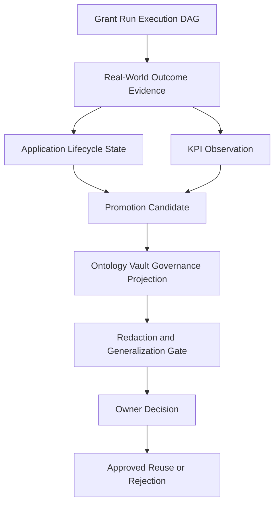

# GoldenQuill Promotion Governance

## What This Module Owns

GoldenQuill Promotion Governance owns the domain contract for learning from
grant work without turning drafts, reviewer comments, KPI observations,
retrieved evidence, or dashboard labels into reusable authority too early. It
records a grant-run execution DAG, captures source-backed real-world grant
movement, computes evidence-safe KPI observations, creates promotion candidates
from selected validated signals, routes those candidates through an Ontology
Vault governance layer, and records owner decisions for approved reuse,
rejection, retirement, contradiction, or private residue.

This module is the new source of truth for the GoldenQuill promotion-governance
feature. Earlier strategy and proposal files are historical migration evidence;
the behavior, concepts, gates, and validation obligations below are canonical
for DomainSpec planning.

## Scope Boundary

GoldenQuill owns grant-specific runtime shape: applications, opportunities,
run events, real-world outcomes, KPI observations, feedback, stage depth, and
grant-cycle evidence. The Ontology Vault governance layer owns promotion safety:
target owner routing, evidence sufficiency, contradiction paths, approved uses,
and non-promotion guardrails.

The selected architecture is:

```text
GoldenQuill local grant model
  -> evidence and outcome capture
  -> candidate generation
  -> Ontology Vault governance layer
  -> owner decision
  -> approved reuse, rejection, retirement, contradiction, or private residue
```

The first implementation slice is a fixture-only validator. It proves the
contract before dashboard work, production memory writes, org-vault mutation,
signed-card mutation, production importers, or automatic promotion.

## Module Map



## Capabilities

| Capability | What | Key Aspects | Detail |
| --- | --- | --- | --- |
| Capture Grant Run DAG | Preserve what happened in a grant run, in what order, and which gate allowed or blocked the next step. | [domain.md](domain.md), [operations.md](operations.md), [workflows.md](workflows.md), [states.md](states.md) | Minimum node and edge families are mandatory. |
| Capture Real-World Outcome Evidence | Record source-backed grant movement after discovery, delivery, submission, award, decline, reporting, and closeout. | [domain.md](domain.md), [events.md](events.md), [operations.md](operations.md) | Outcome events can create learning candidates but cannot approve them. |
| Compute Evidence-Safe KPIs | Track grant progress, quality movement, strategy fit, effort, ROI, capacity, and relationship work without confusing metrics with authority. | [domain.md](domain.md), [operations.md](operations.md), [observability.md](observability.md) | Every KPI requires source events, denominator semantics, and interpretation limits. |
| Create Promotion Candidates | Convert validated outcomes, feedback, and KPI signals into candidate learning while keeping candidate state separate from approved reuse. | [domain.md](domain.md), [operations.md](operations.md), [states.md](states.md) | Candidates carry `proposed_allowed_uses`; they never carry final approved uses. |
| Apply Governance And Privacy Gates | Enforce Ontology Vault compatibility, contradiction path, redaction/generalization, and owner-routing rules. | [mappings.md](mappings.md), [operations.md](operations.md), [workflows.md](workflows.md) | Governance projection does not mutate target artifacts. |
| Record Owner Decisions | Record approved, rejected, retired, or contradicted decisions with `approved_allowed_uses` only after owner approval. | [domain.md](domain.md), [operations.md](operations.md), [events.md](events.md), [states.md](states.md) | Owner decisions are the first point where approved reuse can exist. |

## Execution DAG Contract

The execution DAG is the run/process graph. It answers:

- what happened in this grant run;
- in what order it happened;
- which gate allowed or blocked the next step.

Minimum execution nodes:

| Node | Purpose |
| --- | --- |
| `run_context` | One bounded grant run, including org scope, opportunity, operator, and run id. |
| `project_context_reference` | Source pointer to the applicant/project context used for the run. |
| `rfa_reference` | Source pointer to the RFA, NOFO, or funder instruction source. |
| `scout_discovery_record` | Record that the opportunity was found. |
| `scout_verification_record` | Record that the opportunity was verified as usable or rejected. |
| `operator_review_decision` | Human go/no-go or review decision after discovery. |
| `rfa_dissection` | Extracted requirements, deadlines, forms, criteria, and constraints. |
| `kgie_preflight` | Pre-draft fit, evidence, eligibility, and gap check. |
| `scribe_section_draft` | Drafted proposal section or section version. |
| `editor_suggestion_report` | Clarity, structure, and reviewer-fit suggestions. |
| `judge_score_report` | Rubric scoring and risk assessment. |
| `responsiveness_map` | Map from RFA/rubric requirements to draft responses. |
| `red_team_review` | Conditional adversarial or risk review. |
| `logician_gate_result` | Deterministic pass, fail, or warn gate result. |
| `operator_signoff` | Human approval to deliver, revise, pause, or stop. |
| `delivery_envelope` | Final package delivered, submitted, or handed off. |

Minimum execution edges:

| Edge | Meaning |
| --- | --- |
| `precedes` | One run event happened before another. |
| `consumes` | A step used a source, artifact, or decision. |
| `emits` | A step produced an artifact or event. |
| `blocked_by_gate` | A gate prevented traversal to the next step. |
| `revised_by` | A draft or artifact was changed by a later review or revision. |
| `approved_by` | A human or owner approval allowed the next transition. |
| `delivered_as` | A delivery envelope was emitted as a submission or handoff. |

Example pass path:

```text
run_context
  precedes scout_discovery_record
  precedes scout_verification_record
  approved_by operator_review_decision
  emits rfa_dissection
  emits kgie_preflight
  precedes scribe_section_draft
  revised_by editor_suggestion_report
  emits judge_score_report
  emits responsiveness_map
  approved_by logician_gate_result
  approved_by operator_signoff
  delivered_as delivery_envelope
```

Example blocked path:

```text
kgie_preflight
  blocked_by_gate logician_gate_result
  emits evidence_gap
  prevents scribe_section_draft
```

No draft, delivery envelope, KPI observation, outcome learning, or promotion
candidate may skip the run DAG. The validator must be able to explain which
prior node and which gate allowed it.

## Real-World Evidence Contract

Grant writing improves through real-world feedback:

- a grant was submitted but never reviewed;
- an agency retrieved the application;
- reviewer feedback arrived;
- the grant was declined;
- the grant won but for less money than requested;
- a post-award report was accepted;
- a funder relationship improved;
- a repeated rejection revealed a strategy gap.

These signals become source-backed candidates that can be reviewed, redacted,
approved, rejected, retired, contradicted, or kept private. They do not become
approved reusable knowledge by appearing in a draft, dashboard, or staff
memory.

GoldenQuill separates five evidence states:

| State | Grant Meaning |
| --- | --- |
| application stage | Artifact or application stage, such as submitted, under review, awarded, declined. |
| outcome event | Final source-backed notification, award, decline, withdrawal, report acceptance, or closeout. |
| validation state | Verified claim, compliance pass, source-resolved evidence, reviewer-confirmed feedback, denominator check, or interpretation check. |
| graph authority | Visible authored trace first; structured edges only after validator parity. |
| source truth | No grant truth from proposal prose, dashboard label, or staff memory. |

Rules:

```text
application status != outcome truth
review feedback != funding validation
award notification != post-award performance
proposal claim != source fact
dashboard KPI != promotion authority
```

Every outcome event must carry:

- source document path, URL, portal export, email archive, report, or agency notice;
- notification or event date;
- portal status and/or agency status when present;
- amount requested and amount awarded when relevant;
- funder, program, applicant, and org scope;
- outcome class;
- follow-up obligations;
- interpretation limits.

## Outcome Examples

These examples are canonical fixture obligations for the first validation slice.

### Submitted But Not Reviewed

```text
delivery_envelope
  delivered_as grant_submission
grant_outcome_event(event_kind=portal_validated)
application_lifecycle_state(current_stage=portal_validated)
grant_kpi_observation(metric_kind=submission_validated_rate)
```

Use: track operational completion. Do not infer proposal quality.

### Declined After Review

```text
grant_outcome_event(event_kind=feedback_received)
grant_outcome_event(event_kind=declined)
grant_kpi_observation(metric_kind=review_reached_rate)
promotion_candidate(candidate_kind=lesson, privacy_scope=org_scoped)
```

Use: create a private learning candidate. Workspace reuse requires
redaction/generalization and owner approval.

### Awarded For Less Than Requested

```text
grant_outcome_event(event_kind=awarded, amount_requested=500000, amount_awarded=300000)
grant_kpi_observation(metric_kind=award_amount_realization)
promotion_candidate(candidate_kind=budget_framing_lesson)
```

Use: learn from budget framing or funder preference. Do not treat the win as
evidence that every proposal claim was strong.

### Blocked Before Draft

```text
kgie_preflight
  blocked_by_gate logician_gate_result
logician_gate_result(emits=evidence_gap)
```

Use: no Scribe draft should exist downstream unless a later operator decision or
evidence fix reopens traversal.

### Successful Closeout

```text
grant_outcome_event(event_kind=report_accepted)
grant_outcome_event(event_kind=closed_out)
grant_kpi_observation(metric_kind=grant_retention_rate)
promotion_candidate(candidate_kind=stewardship_lesson)
```

Use: feed stewardship and funder relationship learning. Keep org facts private
unless generalized.

## KPI Catalog

### Lifecycle Depth

| KPI | Formula / Source |
| --- | --- |
| `stage_depth` | deepest reached stage in the local lifecycle enum |
| `stage_depth_score` | numeric score for comparison across opportunities |
| `submission_validated_rate` | validated submissions / submitted applications |
| `agency_retrieved_rate` | agency-retrieved applications / validated submissions |
| `review_reached_rate` | applications with agency/reviewer review signal / submitted applications |
| `final_decision_rate` | awarded plus declined / submitted applications |
| `closeout_completed_rate` | closed awards / awarded grants |

### Outcome Evidence

| KPI | Formula / Source |
| --- | --- |
| `win_rate_by_count` | awarded / final decisions |
| `win_rate_by_dollars` | awarded dollars / requested dollars for final decisions |
| `decline_rate` | declined / final decisions |
| `pending_rate` | pending / submitted applications |
| `award_amount_realization` | awarded amount / requested amount |
| `partial_award_rate` | partial awards / awards |
| `resubmission_success_rate` | awarded resubmissions / final-decision resubmissions |
| `repeat_funder_win_rate` | repeat-funder awards / repeat-funder final decisions |
| `new_funder_conversion_rate` | new-funder awards / new-funder final decisions |

### Quality And Review Movement

| KPI | Signal |
| --- | --- |
| `compliance_pass_rate` | Logician pre-submit gates passed / attempted |
| `rubric_coverage_score` | covered rubric criteria / total criteria |
| `reviewer_objection_resolution_rate` | resolved objections / total objections |
| `evidence_gap_resolution_rate` | resolved evidence gaps / identified gaps |
| `section_revision_delta` | score or risk improvement across draft iterations |
| `review_feedback_quality` | coded feedback specificity and actionability |
| `resubmission_delta` | score/review movement from prior submission to next |

### Strategy Fit

| KPI | Signal |
| --- | --- |
| `go_no_go_selectivity` | pursued opportunities / researched opportunities |
| `high_match_pursuit_rate` | high-fit pursued / high-fit identified |
| `low_fit_avoidance_rate` | low-fit not pursued / low-fit identified |
| `relationship_present_rate` | submissions with existing funder relationship / submissions |
| `prior_award_alignment` | proposal fit against funder prior-award corpus |
| `program_drift_rate` | funder/RFA requirements that changed after discovery |

### Effort And ROI

| KPI | Signal |
| --- | --- |
| `hours_per_submission` | staff hours / submitted application |
| `cost_per_submitted_application` | labor plus tools / submitted application |
| `cost_per_award` | labor plus tools / awards |
| `dollars_requested_per_hour` | requested dollars / grant-work hours |
| `dollars_awarded_per_hour` | awarded dollars / grant-work hours |
| `cycle_time_discovery_to_submit` | submission date - discovery date |
| `cycle_time_submit_to_decision` | decision date - submission date |
| `reporting_burden_hours` | post-award reporting hours / award |

### Capacity And Relationship

| KPI | Signal |
| --- | --- |
| `stakeholder_contacts` | grant-seeking contacts per period |
| `new_stakeholder_engagement_rate` | new stakeholders engaged / stakeholders engaged |
| `collaboration_artifacts_count` | MOUs, MOAs, support letters, partner commitments |
| `staff_consultations` | staff consultations for proposal/program development |
| `internal_training_hours` | hours spent improving internal grant capability |
| `funder_touchpoints` | contacts with new and existing funders |
| `grant_retention_rate` | repeat support year over year |

Every KPI observation must include numerator, denominator, denominator
definition, source events, segment, value, and interpretation limits. KPI
observations may create candidates after validation; they cannot promote.

## External Grant Lifecycle Baseline

| Source | What It Contributes | Design Use |
| --- | --- | --- |
| Grants.gov Grant Lifecycle | Federal grant lifecycle includes pre-award, award, and post-award phases; work progresses through opportunity search, registration, completion, submission, agency retrieval, review, award notification, reporting, and closeout. | Use lifecycle depth as a first-class metric, not only final outcome. |
| Grants.gov Check Application Status | Applicants can track validation, agency receipt, and agency tracking number before later status moves to the agency. | Split `portal_status` from `agency_status`; do not assume portal status knows final outcome. |
| NIH FY 2025 By The Numbers | NIH reports applications, awards, success rates, award sizes, and trend changes. | Track funder benchmark context beside internal win rate. |
| NSF Funding Rates | NSF denominator semantics define funding rate as new competitively reviewed awards divided by competitive awards plus declines. | Store denominator semantics with each KPI. |
| NSF Proposal and Award Overview | NSF review criteria include intellectual merit and broader impacts; repeated submission behavior matters. | Track criterion-specific review signals and resubmission learning. |
| Instrumentl Grant Performance Dashboard | Common grant KPIs include amount awarded, won/lost, win rate, applications by status, new vs repeat funders, amount requested, and grants researched. | Adopt a practical dashboard starter set without letting dashboard labels become truth. |
| Grant Professionals Association Strategy Paper | Grant-professional metrics include stakeholder contacts, new stakeholder engagement, proposals to new funders, grant retention, dollars secured, funder contacts, consultations, trainings, collaborations, and data-maintenance work. | Add relationship, stewardship, and capacity metrics beyond win rate. |

## Domain Concepts

| Concept | Type | Key Constraints |
| --- | --- | --- |
| [GrantRunNode](domain.md#grantrunnode) | Entity | Must use one of the mandatory execution node kinds and preserve run id, org scope, source, artifact, and gate references. |
| [GrantRunEdge](domain.md#grantrunedge) | Entity | Must use one of the mandatory execution edge kinds and explain order, consumption, emission, blocking, revision, approval, or delivery. |
| [MemoryEvidencePacketRef](domain.md#memoryevidencepacketref) | Value Object | References evidence only; never approves reuse. |
| [GrantOutcomeEvent](domain.md#grantoutcomeevent) | Entity/Event source | Must be source-backed and may create candidates but cannot approve them. |
| [ApplicationLifecycleState](states.md#applicationlifecyclestate) | State Machine | Tracks deepest verified application stage; stage depth is not win/loss. |
| [GrantKpiObservation](domain.md#grantkpiobservation) | Entity | Requires source events, denominator definition, and interpretation limits. |
| [PromotionCandidate](domain.md#promotioncandidate) | Entity | Carries proposed allowed uses only; not approved reuse. |
| [OwnerDecision](domain.md#ownerdecision) | Entity | Owns approved allowed uses and final disposition. |
| [OntologyVaultProjection](mappings.md#ontologyvaultprojection) | Mapping | Enforces governance compatibility without mutating target artifacts. |
| [RedactionGeneralizationGate](operations.md#redactiongeneralizationgate) | Operation | Blocks workspace-safe reuse of org-scoped feedback until privacy-safe abstraction and owner approval. |

## Concept Registry

| Concept | ID | Type |
| --- | --- | --- |
| [GrantRunNode](domain.md#grantrunnode) | goldenquill-promotion-governance.GrantRunNode | Entity |
| [GrantRunEdge](domain.md#grantrunedge) | goldenquill-promotion-governance.GrantRunEdge | Entity |
| [MemoryEvidencePacketRef](domain.md#memoryevidencepacketref) | goldenquill-promotion-governance.MemoryEvidencePacketRef | Value Object |
| [GrantOutcomeEvent](domain.md#grantoutcomeevent) | goldenquill-promotion-governance.GrantOutcomeEvent | Entity |
| [ApplicationLifecycleState](states.md#applicationlifecyclestate) | goldenquill-promotion-governance.ApplicationLifecycleState | State Machine |
| [GrantKpiObservation](domain.md#grantkpiobservation) | goldenquill-promotion-governance.GrantKpiObservation | Entity |
| [PromotionCandidate](domain.md#promotioncandidate) | goldenquill-promotion-governance.PromotionCandidate | Entity |
| [OwnerDecision](domain.md#ownerdecision) | goldenquill-promotion-governance.OwnerDecision | Entity |
| [OntologyVaultProjection](mappings.md#ontologyvaultprojection) | goldenquill-promotion-governance.OntologyVaultProjection | Mapping |
| [RecordGrantRunEvent](operations.md#recordgrantrunevent) | goldenquill-promotion-governance.RecordGrantRunEvent | Operation |
| [RecordOutcomeEvent](operations.md#recordoutcomeevent) | goldenquill-promotion-governance.RecordOutcomeEvent | Operation |
| [ComputeKpiObservation](operations.md#computekpiobservation) | goldenquill-promotion-governance.ComputeKpiObservation | Operation |
| [CreatePromotionCandidate](operations.md#createpromotioncandidate) | goldenquill-promotion-governance.CreatePromotionCandidate | Operation |
| [ValidatePromotionGovernance](operations.md#validatepromotiongovernance) | goldenquill-promotion-governance.ValidatePromotionGovernance | Operation |
| [RedactionGeneralizationGate](operations.md#redactiongeneralizationgate) | goldenquill-promotion-governance.RedactionGeneralizationGate | Operation |
| [RecordOwnerDecision](operations.md#recordownerdecision) | goldenquill-promotion-governance.RecordOwnerDecision | Operation |
| [GrantPromotionGovernanceWorkflow](workflows.md#grantpromotiongovernanceworkflow) | goldenquill-promotion-governance.GrantPromotionGovernanceWorkflow | Workflow |
| [PromotionAuthorityPolicy](workflows.md#promotionauthoritypolicy) | goldenquill-promotion-governance.PromotionAuthorityPolicy | Policy |
| [EvidenceStatePolicy](workflows.md#evidencestatepolicy) | goldenquill-promotion-governance.EvidenceStatePolicy | Policy |

## Feature Concept Graph

| From | Edge | To | Evidence | Notes |
| --- | --- | --- | --- | --- |
| goldenquill-promotion-governance.RecordGrantRunEvent | produces | goldenquill-promotion-governance.GrantRunNode | [operations.md](operations.md#recordgrantrunevent) | Captures run steps. |
| goldenquill-promotion-governance.GrantRunNode | emits | goldenquill-promotion-governance.GrantOutcomeEvent | [events.md](events.md#grantoutcomeeventrecorded) | Delivery and later source-backed movement can emit outcome events. |
| goldenquill-promotion-governance.RecordOutcomeEvent | produces | goldenquill-promotion-governance.GrantOutcomeEvent | [operations.md](operations.md#recordoutcomeevent) | Outcome events are source-backed. |
| goldenquill-promotion-governance.GrantOutcomeEvent | transitions | goldenquill-promotion-governance.ApplicationLifecycleState | [states.md](states.md#applicationlifecyclestate) | Outcome events advance verified stage. |
| goldenquill-promotion-governance.ComputeKpiObservation | produces | goldenquill-promotion-governance.GrantKpiObservation | [operations.md](operations.md#computekpiobservation) | KPI observations require denominator semantics. |
| goldenquill-promotion-governance.CreatePromotionCandidate | produces | goldenquill-promotion-governance.PromotionCandidate | [operations.md](operations.md#createpromotioncandidate) | Candidates are proposal-level learning. |
| goldenquill-promotion-governance.PromotionCandidate | contains | goldenquill-promotion-governance.MemoryEvidencePacketRef | [domain.md](domain.md#promotioncandidate) | Candidate source evidence is reference-only. |
| goldenquill-promotion-governance.OntologyVaultProjection | maps | goldenquill-promotion-governance.PromotionCandidate | [mappings.md](mappings.md#ontologyvaultprojection) | Projection checks compatibility. |
| goldenquill-promotion-governance.PromotionAuthorityPolicy | applies | goldenquill-promotion-governance.CreatePromotionCandidate | [workflows.md](workflows.md#promotionauthoritypolicy) | KPIs and evidence create candidates only. |
| goldenquill-promotion-governance.RedactionGeneralizationGate | enforces | goldenquill-promotion-governance.RecordOwnerDecision | [operations.md](operations.md#redactiongeneralizationgate) | Workspace-safe reuse requires privacy gate. |
| goldenquill-promotion-governance.RecordOwnerDecision | produces | goldenquill-promotion-governance.OwnerDecision | [operations.md](operations.md#recordownerdecision) | Approved uses live on owner decisions. |

## Aspect Docs

| Aspect | Contains | Key Concepts |
| --- | --- | --- |
| [Architecture](architecture.md) | Six-view architecture, source contracts, dependencies, guardrails, decisions, risks, and gate result | Execution DAG, governance layer, fixture-only first slice |
| [Glossary](glossary.md) | Source-linked definitions for feature terms | application stage, outcome event, promotion candidate, owner decision |
| [Domain](domain.md) | Entities, value objects, enums, and data contracts | GrantRunNode, GrantOutcomeEvent, GrantKpiObservation, PromotionCandidate |
| [Operations](operations.md) | Business operations, rules, calculations, and error states | RecordOutcomeEvent, ComputeKpiObservation, ValidatePromotionGovernance |
| [Mappings](mappings.md) | Boundary transformations | OntologyVaultProjection, outcome-to-lifecycle, KPI-to-candidate |
| [Workflows](workflows.md) | Orchestration and policies | GrantPromotionGovernanceWorkflow, PromotionAuthorityPolicy |
| [States](states.md) | State machines and invariants | ApplicationLifecycleState, PromotionCandidateState, OwnerDecisionState |
| [Events](events.md) | Domain events and consumers | GrantOutcomeEventRecorded, PromotionCandidateCreated, OwnerDecisionRecorded |
| [Observability](observability.md) | OTel-style metrics and business KPIs | lifecycle depth, denominator failures, governance gate results |
| [Test Specification](TEST-SPEC.md) | Positive/negative fixture obligations | fail-closed validator, source and denominator safety |

## Cross-Feature Dependencies

| Capability | Depends On | Via | Why |
| --- | --- | --- | --- |
| Capture Grant Run DAG | GoldenQuill Scout, Scribe, Editor, Judge, Logician, operator review | Source artifacts and run events | The DAG records their outputs and gates without replacing them. |
| Capture Real-World Outcome Evidence | Evidence packet source capture | [MemoryEvidencePacketRef](domain.md#memoryevidencepacketref) | Outcome events need source references but evidence packets do not approve reuse. |
| Apply Governance And Privacy Gates | Ontology Vault governance layer | [OntologyVaultProjection](mappings.md#ontologyvaultprojection) | Promotion safety must remain governed rather than inferred from local metrics. |
| Record Owner Decisions | Operator or owning lifecycle route | [OwnerDecision](domain.md#ownerdecision) | Approved allowed uses require owner decision. |

## Produces For

| Consumer | Consumes Capability | Via | What |
| --- | --- | --- | --- |
| GoldenQuill L0 validator | Capture Grant Run DAG, Capture Real-World Outcome Evidence, Compute Evidence-Safe KPIs | [TEST-SPEC.md](TEST-SPEC.md), [operations.md](operations.md) | Positive and negative fixture contract. |
| GoldenQuill grant dashboard | Compute Evidence-Safe KPIs | [observability.md](observability.md) | Read-model metrics with interpretation limits. |
| Ontology Vault governance route | Apply Governance And Privacy Gates | [mappings.md](mappings.md#ontologyvaultprojection) | PromotionRecord-compatible projection evidence. |
| Task Session implementation plan | All capabilities | [architecture.md](architecture.md), [TEST-SPEC.md](TEST-SPEC.md) | Bounded L0 implementation contract. |

## First Slice

Build only:

- fixture schema;
- validator;
- positive fixture;
- negative fixtures;
- deterministic pytest command.

The first slice must include fixtures for:

- a pass path from `run_context` to `delivery_envelope`;
- a blocked path where `kgie_preflight` is blocked by `logician_gate_result`;
- a declined-after-review outcome;
- an awarded-for-less-than-requested outcome;
- a submitted-but-not-reviewed outcome;
- a successful post-award report or closeout outcome.

Do not build:

- UI;
- dashboard;
- real data importer;
- production memory writes;
- signed-card mutation;
- org-vault mutation;
- automatic promotion.

## Acceptance Criteria

- An outcome event without a source fails.
- A KPI without denominator definition fails.
- A candidate with approved uses before owner decision fails.
- Org-scoped feedback cannot become workspace-safe without redaction/generalization.
- A valid redacted learning candidate passes.
- A valid owner decision with approved uses passes.
- The governance projection requires evidence, review gate, and contradiction path.
- Stage depth can use the global baseline and can name a future profile override.
- A run DAG can explain which gate allowed or blocked the next step.
- Outcome examples can create candidates without promoting them directly.
- No production org memory, signed cards, dashboard, or owner artifacts mutate in L0.
- Validator output is deterministic.
- Vocabulary stays GoldenQuill-native.

## Vocabulary Policy

Use these terms in implementation-facing docs:

- application stage;
- final outcome;
- validation state;
- evidence packet;
- source-backed event;
- grant outcome event;
- KPI observation;
- stage-depth score;
- promotion candidate;
- owner decision;
- governance layer;
- proposed allowed uses;
- approved allowed uses;
- redaction/generalization gate;
- org-scoped feedback;
- workspace-safe learning.

Avoid importing historical method vocabulary into the active implementation
surface. Older research ledgers may preserve source history, but active design,
validator, fixture, and implementation docs use GoldenQuill-native terms.

## References

- Discovery: [discovery/goldenquill-promotion-governance.md](discovery/goldenquill-promotion-governance.md)
- Architecture: [architecture.md](architecture.md)
- Domain: [domain.md](domain.md)
- Operations: [operations.md](operations.md)
- States: [states.md](states.md)
- Events: [events.md](events.md)
- Mappings: [mappings.md](mappings.md)
- Workflows: [workflows.md](workflows.md)
- Observability: [observability.md](observability.md)
- Tests: [TEST-SPEC.md](TEST-SPEC.md)
- Glossary: [glossary.md](glossary.md)
