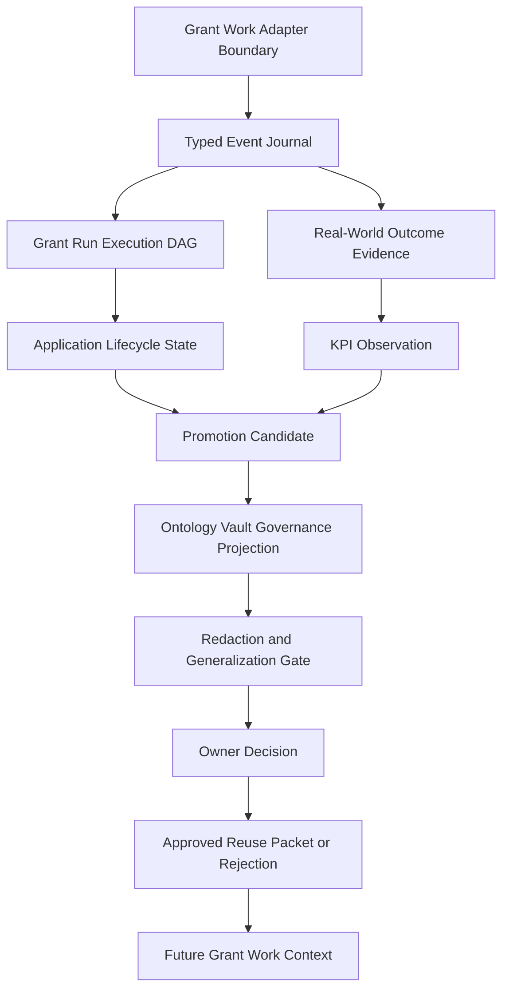

# GoldenQuill Promotion Governance

## What This Module Owns

GoldenQuill Promotion Governance owns the domain contract for learning from
grant work without turning drafts, reviewer comments, KPI observations,
retrieved evidence, or dashboard labels into reusable authority too early. It
accepts typed events from bounded grant-work adapters, records a grant-run
execution DAG, captures source-backed real-world grant movement, computes
evidence-safe KPI observations, creates promotion candidates from selected
validated signals, routes those candidates through an Ontology Vault governance
layer, records owner decisions for approved reuse, and publishes approved reuse
packets back into future grant-work context.

This module is the new source of truth for the GoldenQuill promotion-governance
feature. Earlier strategy and proposal files are historical migration evidence;
the behavior, concepts, gates, and validation obligations below are canonical
for DomainSpec planning.

## Scope Boundary

GoldenQuill owns grant-specific runtime shape: applications, opportunities,
run events, real-world outcomes, KPI observations, feedback, stage depth, and
grant-cycle evidence. The Ontology Vault governance layer owns promotion safety:
target owner routing, evidence sufficiency, contradiction paths, approved uses,
and non-promotion guardrails.

The selected architecture is:

```text
GoldenQuill grant work and external outcome sources
  -> bounded adapter boundary
  -> typed event journal
  -> execution DAG and read-model projection
  -> candidate generation
  -> Ontology Vault governance layer
  -> owner decision
  -> approved reuse packet, rejection, retirement, contradiction, or private residue
  -> future grant work context
```

The first implementation slice is a fixture-only event-spine and projection
validator. It proves the contract before dashboard work, production memory
writes, org-vault mutation, signed-card mutation, production importers, or
automatic promotion.

## Module Map



## Capabilities

| Capability | What | Key Aspects | Detail |
| --- | --- | --- | --- |
| Accept Grant Work Events | Accept typed events from bounded grant-work adapters before DAG or metric projection. | [domain.md](domain.md), [events.md](events.md), [operations.md](operations.md), [workflows.md](workflows.md) | Adapters cannot write promotion authority directly. |
| Project Event Spine | Project accepted events into DAG nodes and edges, lifecycle state, KPIs, and candidate inputs. | [mappings.md](mappings.md), [operations.md](operations.md), [observability.md](observability.md) | Projection receipts make replay and idempotency auditable. |
| Capture Grant Run DAG | Preserve what happened in a grant run, in what order, and which gate allowed or blocked the next step. | [domain.md](domain.md), [operations.md](operations.md), [workflows.md](workflows.md), [states.md](states.md) | Minimum node and edge families are mandatory. |
| Capture Real-World Outcome Evidence | Record source-backed grant movement after discovery, delivery, submission, award, decline, reporting, and closeout. | [domain.md](domain.md), [events.md](events.md), [operations.md](operations.md) | Outcome events can create learning candidates but cannot approve them. |
| Compute Evidence-Safe KPIs | Track grant progress, quality movement, strategy fit, effort, ROI, capacity, and relationship work without confusing metrics with authority. | [domain.md](domain.md), [operations.md](operations.md), [observability.md](observability.md) | Every KPI requires source events, denominator semantics, and interpretation limits. |
| Analyze KPI Action Intelligence | Relate source-backed grant action facts to later KPI response windows through registered statistical methods. | [analytics-methods.md](analytics-methods.md), [operations.md](operations.md), [mappings.md](mappings.md), [observability.md](observability.md) | Method outputs are evidence only; they may create BI insight candidates but cannot approve reuse. |
| Define BI Optimization Chains | Express grant node, KPI, method, and BI optimization relationships as plain-language and schema-backed chain definitions. | [optimization-chains.md](optimization-chains.md), [schemas/optimization-chain.schema.json](schemas/optimization-chain.schema.json), [analytics-methods.md](analytics-methods.md) | Chains explain and package evidence; they still cannot approve reuse. |
| Create Promotion Candidates | Convert validated outcomes, feedback, and KPI signals into candidate learning while keeping candidate state separate from approved reuse. | [domain.md](domain.md), [operations.md](operations.md), [states.md](states.md) | Candidates carry `proposed_allowed_uses`; they never carry final approved uses. |
| Apply Governance And Privacy Gates | Enforce Ontology Vault compatibility, contradiction path, redaction/generalization, and owner-routing rules. | [mappings.md](mappings.md), [operations.md](operations.md), [workflows.md](workflows.md) | Governance projection does not mutate target artifacts. |
| Record Owner Decisions | Record approved, rejected, retired, or contradicted decisions with `approved_allowed_uses` only after owner approval. | [domain.md](domain.md), [operations.md](operations.md), [events.md](events.md), [states.md](states.md) | Owner decisions are the first point where approved reuse can exist. |
| Publish Approved Reuse | Return accumulated knowledge to future grant work after owner decision. | [domain.md](domain.md), [workflows.md](workflows.md), [mappings.md](mappings.md) | Approved reuse packets are the only future-context input with approved uses. |

## Execution DAG Contract

The execution DAG is the run/process graph. It answers:

- what happened in this grant run;
- in what order it happened;
- which gate allowed or blocked the next step.

Minimum execution nodes:

| Node | Purpose |
| --- | --- |
| `run_context` | One bounded grant run, including org scope, opportunity, operator, and run id. |
| `project_context_reference` | Source pointer to the applicant/project context used for the run. |
| `rfa_reference` | Source pointer to the RFA, NOFO, or funder instruction source. |
| `scout_discovery_record` | Record that the opportunity was found. |
| `scout_verification_record` | Record that the opportunity was verified as usable or rejected. |
| `operator_review_decision` | Human go/no-go or review decision after discovery. |
| `rfa_dissection` | Extracted requirements, deadlines, forms, criteria, and constraints. |
| `kgie_preflight` | Pre-draft fit, evidence, eligibility, and gap check. |
| `scribe_section_draft` | Drafted proposal section or section version. |
| `editor_suggestion_report` | Clarity, structure, and reviewer-fit suggestions. |
| `judge_score_report` | Rubric scoring and risk assessment. |
| `responsiveness_map` | Map from RFA/rubric requirements to draft responses. |
| `red_team_review` | Conditional adversarial or risk review. |
| `logician_gate_result` | Deterministic pass, fail, or warn gate result. |
| `operator_signoff` | Human approval to deliver, revise, pause, or stop. |
| `delivery_envelope` | Final package delivered, submitted, or handed off. |

Minimum execution edges:

| Edge | Meaning |
| --- | --- |
| `precedes` | One run event happened before another. |
| `consumes` | A step used a source, artifact, or decision. |
| `emits` | A step produced an artifact or event. |
| `blocked_by_gate` | A gate prevented traversal to the next step. |
| `revised_by` | A draft or artifact was changed by a later review or revision. |
| `approved_by` | A human or owner approval allowed the next transition. |
| `delivered_as` | A delivery envelope was emitted as a submission or handoff. |

Example pass path:

```text
run_context
  precedes scout_discovery_record
  precedes scout_verification_record
  approved_by operator_review_decision
  emits rfa_dissection
  emits kgie_preflight
  precedes scribe_section_draft
  revised_by editor_suggestion_report
  emits judge_score_report
  emits responsiveness_map
  approved_by logician_gate_result
  approved_by operator_signoff
  delivered_as delivery_envelope
```

Example blocked path:

```text
kgie_preflight
  blocked_by_gate logician_gate_result
  emits evidence_gap
  prevents scribe_section_draft
```

No draft, delivery envelope, KPI observation, outcome learning, or promotion
candidate may skip the run DAG. The validator must be able to explain which
prior node and which gate allowed it.

## Grant Work Ingestion Contract

Grant work feeds the execution DAG through typed GoldenQuill events. An adapter
may observe a portal, source document, workflow seat output, operator decision,
uploader result, CycleReceipt, Reflection Packet, or legacy artifact batch, but
it must not write DAG authority, promotion authority, or approved reusable
knowledge directly.

Required event envelope:

| Field | Required | Purpose |
| --- | --- | --- |
| `event_id` | yes | Stable event identifier. |
| `event_kind` | yes | Event family from [GrantWorkEventKind](domain.md#grantworkeventkind). |
| `producer_kind` | yes | Producer family from [AdapterProducerKind](domain.md#adapterproducerkind). |
| `producer_id` | yes | Stable adapter or component identifier. |
| `run_id` | conditional | Required when the event belongs to a bounded grant run. |
| `org_scope` | yes | Privacy and reuse boundary. |
| `source_ref` | conditional | Required for source-backed or external facts. |
| `occurred_at` | yes | Source or workflow event time. |
| `captured_at` | yes | GoldenQuill capture time. |
| `idempotency_key` | yes | Replay and duplicate detection key. |
| `payload_ref` or validated payload | yes | Event body or local artifact pointer. |
| `interpretation_limits` | yes | What this event cannot prove. |
| `gate_refs` | conditional | Gates that allowed, warned, or blocked the event. |

The event journal is the replayable source for DAG node and edge projection,
lifecycle state, KPI observations, promotion candidates, and approved reuse
handoffs. Direct DAG writes are allowed only as a test helper or internal
implementation detail behind the same event validation.

Rules:

```text
adapter output != DAG authority until event validation passes
event journal != approved reusable knowledge
approved reuse != valid until owner decision records approved_allowed_uses
```

## Real-World Evidence Contract

Grant writing improves through real-world feedback:

- a grant was submitted but never reviewed;
- an agency retrieved the application;
- reviewer feedback arrived;
- the grant was declined;
- the grant won but for less money than requested;
- a post-award report was accepted;
- a funder relationship improved;
- a repeated rejection revealed a strategy gap.

These signals become source-backed candidates that can be reviewed, redacted,
approved, rejected, retired, contradicted, or kept private. They do not become
approved reusable knowledge by appearing in a draft, dashboard, or staff
memory.

GoldenQuill separates five evidence states:

| State | Grant Meaning |
| --- | --- |
| application stage | Artifact or application stage, such as submitted, under review, awarded, declined. |
| outcome event | Final source-backed notification, award, decline, withdrawal, report acceptance, or closeout. |
| validation state | Verified claim, compliance pass, source-resolved evidence, reviewer-confirmed feedback, denominator check, or interpretation check. |
| graph authority | Visible authored trace first; structured edges only after validator parity. |
| source truth | No grant truth from proposal prose, dashboard label, or staff memory. |

Rules:

```text
application status != outcome truth
review feedback != funding validation
award notification != post-award performance
proposal claim != source fact
dashboard KPI != promotion authority
```

Every outcome event must carry:

- source document path, URL, portal export, email archive, report, or agency notice;
- notification or event date;
- portal status and/or agency status when present;
- amount requested and amount awarded when relevant;
- funder, program, applicant, and org scope;
- outcome class;
- follow-up obligations;
- interpretation limits.

## Outcome Examples

These examples are canonical fixture obligations for the first validation slice.

### Submitted But Not Reviewed

```text
delivery_envelope
  delivered_as grant_submission
grant_outcome_event(event_kind=portal_validated)
application_lifecycle_state(current_stage=portal_validated)
grant_kpi_observation(metric_kind=submission_validated_rate)
```

Use: track operational completion. Do not infer proposal quality.

### Declined After Review

```text
grant_outcome_event(event_kind=feedback_received)
grant_outcome_event(event_kind=declined)
grant_kpi_observation(metric_kind=review_reached_rate)
promotion_candidate(candidate_kind=lesson, privacy_scope=org_scoped)
```

Use: create a private learning candidate. Workspace reuse requires
redaction/generalization and owner approval.

### Awarded For Less Than Requested

```text
grant_outcome_event(event_kind=awarded, amount_requested=500000, amount_awarded=300000)
grant_kpi_observation(metric_kind=award_amount_realization)
promotion_candidate(candidate_kind=budget_framing_lesson)
```

Use: learn from budget framing or funder preference. Do not treat the win as
evidence that every proposal claim was strong.

### Blocked Before Draft

```text
kgie_preflight
  blocked_by_gate logician_gate_result
logician_gate_result(emits=evidence_gap)
```

Use: no Scribe draft should exist downstream unless a later operator decision or
evidence fix reopens traversal.

### Successful Closeout

```text
grant_outcome_event(event_kind=report_accepted)
grant_outcome_event(event_kind=closed_out)
grant_kpi_observation(metric_kind=grant_retention_rate)
promotion_candidate(candidate_kind=stewardship_lesson)
```

Use: feed stewardship and funder relationship learning. Keep org facts private
unless generalized.

## KPI Catalog

### Lifecycle Depth

| KPI | Formula / Source |
| --- | --- |
| `stage_depth` | deepest reached stage in the local lifecycle enum |
| `stage_depth_score` | numeric score for comparison across opportunities |
| `submission_validated_rate` | validated submissions / submitted applications |
| `agency_retrieved_rate` | agency-retrieved applications / validated submissions |
| `review_reached_rate` | applications with agency/reviewer review signal / submitted applications |
| `final_decision_rate` | awarded plus declined / submitted applications |
| `closeout_completed_rate` | closed awards / awarded grants |

### Outcome Evidence

| KPI | Formula / Source |
| --- | --- |
| `win_rate_by_count` | awarded / final decisions |
| `win_rate_by_dollars` | awarded dollars / requested dollars for final decisions |
| `decline_rate` | declined / final decisions |
| `pending_rate` | pending / submitted applications |
| `award_amount_realization` | awarded amount / requested amount |
| `partial_award_rate` | partial awards / awards |
| `resubmission_success_rate` | awarded resubmissions / final-decision resubmissions |
| `repeat_funder_win_rate` | repeat-funder awards / repeat-funder final decisions |
| `new_funder_conversion_rate` | new-funder awards / new-funder final decisions |

### Quality And Review Movement

| KPI | Signal |
| --- | --- |
| `compliance_pass_rate` | Logician pre-submit gates passed / attempted |
| `rubric_coverage_score` | covered rubric criteria / total criteria |
| `reviewer_objection_resolution_rate` | resolved objections / total objections |
| `evidence_gap_resolution_rate` | resolved evidence gaps / identified gaps |
| `section_revision_delta` | score or risk improvement across draft iterations |
| `review_feedback_quality` | coded feedback specificity and actionability |
| `resubmission_delta` | score/review movement from prior submission to next |

### Strategy Fit

| KPI | Signal |
| --- | --- |
| `go_no_go_selectivity` | pursued opportunities / researched opportunities |
| `high_match_pursuit_rate` | high-fit pursued / high-fit identified |
| `low_fit_avoidance_rate` | low-fit not pursued / low-fit identified |
| `relationship_present_rate` | submissions with existing funder relationship / submissions |
| `prior_award_alignment` | proposal fit against funder prior-award corpus |
| `program_drift_rate` | funder/RFA requirements that changed after discovery |

### Effort And ROI

| KPI | Signal |
| --- | --- |
| `hours_per_submission` | staff hours / submitted application |
| `cost_per_submitted_application` | labor plus tools / submitted application |
| `cost_per_award` | labor plus tools / awards |
| `dollars_requested_per_hour` | requested dollars / grant-work hours |
| `dollars_awarded_per_hour` | awarded dollars / grant-work hours |
| `cycle_time_discovery_to_submit` | submission date - discovery date |
| `cycle_time_submit_to_decision` | decision date - submission date |
| `reporting_burden_hours` | post-award reporting hours / award |

### Capacity And Relationship

| KPI | Signal |
| --- | --- |
| `stakeholder_contacts` | grant-seeking contacts per period |
| `new_stakeholder_engagement_rate` | new stakeholders engaged / stakeholders engaged |
| `collaboration_artifacts_count` | MOUs, MOAs, support letters, partner commitments |
| `staff_consultations` | staff consultations for proposal/program development |
| `internal_training_hours` | hours spent improving internal grant capability |
| `funder_touchpoints` | contacts with new and existing funders |
| `grant_retention_rate` | repeat support year over year |

Every KPI observation must include numerator, denominator, denominator
definition, source events, segment, value, and interpretation limits. KPI
observations may create candidates after validation; they cannot promote.

## Analytics Method Registry

Concrete implementation definitions for grant-action/KPI analytics live in
[analytics-methods.md](analytics-methods.md). That registry defines:

- `GrantActionFact`, `GrantLifecycleTransitionFact`, `GrantOutcomeFact`,
  `GrantCostFact`, and `KpiResponseWindow` projection contracts;
- `StatisticalMethodSpec`, `ActionKpiAssociation`, and
  `BIInsightCandidate` contracts;
- method families including descriptive cohorts, funnel transitions, sequence
  mining, time-to-event summaries, Bayesian updating, regression, hierarchical
  models, difference-in-differences, propensity matching, uplift modeling, and
  anomaly/residual analysis;
- maturity levels and fail-closed guards for sample size, temporal leakage,
  censoring, missing outcomes, selection bias, confounding, multiple
  comparisons, and aggregate privacy;
- the L0 falsification fixture for a naive-positive Red Team association.

Analytics outputs are source-backed evidence only. They may create
[BIInsightCandidate](analytics-methods.md#biinsightcandidate-profile) records,
which are governed as [PromotionCandidate](domain.md#promotioncandidate)
profiles before any owner decision or approved reuse packet exists.

## Optimization Chain Definitions

[optimization-chains.md](optimization-chains.md) defines the business-language
and schema-backed bridge from analytics evidence to BI optimization. An
optimization chain states:

```text
When [grant node or action] happens,
measure [outcome KPI] over [response window]
using [analytical method]
to produce [named BI optimization],
with [claim label, guardrail, and allowed-use boundary].
```

Optimization chains carry multiple expression forms for the same idea:
plain-language, operator, executive, contract, causal-careful, dashboard-label,
and ontology forms. The JSON Schema lives in
[schemas/optimization-chain.schema.json](schemas/optimization-chain.schema.json),
with an initial Red Team review fixture at
[examples/optimization-chain.red-team-review.json](examples/optimization-chain.red-team-review.json).

Optimization chains may explain competitive advantage and prepare
[BIInsightCandidate](analytics-methods.md#biinsightcandidate-profile) creation,
but they cannot approve reuse or override the claim labels emitted by registered
analytics methods.

## External Grant Lifecycle Baseline

| Source | What It Contributes | Design Use |
| --- | --- | --- |
| Grants.gov Grant Lifecycle | Federal grant lifecycle includes pre-award, award, and post-award phases; work progresses through opportunity search, registration, completion, submission, agency retrieval, review, award notification, reporting, and closeout. | Use lifecycle depth as a first-class metric, not only final outcome. |
| Grants.gov Check Application Status | Applicants can track validation, agency receipt, and agency tracking number before later status moves to the agency. | Split `portal_status` from `agency_status`; do not assume portal status knows final outcome. |
| NIH FY 2025 By The Numbers | NIH reports applications, awards, success rates, award sizes, and trend changes. | Track funder benchmark context beside internal win rate. |
| NSF Funding Rates | NSF denominator semantics define funding rate as new competitively reviewed awards divided by competitive awards plus declines. | Store denominator semantics with each KPI. |
| NSF Proposal and Award Overview | NSF review criteria include intellectual merit and broader impacts; repeated submission behavior matters. | Track criterion-specific review signals and resubmission learning. |
| Instrumentl Grant Performance Dashboard | Common grant KPIs include amount awarded, won/lost, win rate, applications by status, new vs repeat funders, amount requested, and grants researched. | Adopt a practical dashboard starter set without letting dashboard labels become truth. |
| Grant Professionals Association Strategy Paper | Grant-professional metrics include stakeholder contacts, new stakeholder engagement, proposals to new funders, grant retention, dollars secured, funder contacts, consultations, trainings, collaborations, and data-maintenance work. | Add relationship, stewardship, and capacity metrics beyond win rate. |

## Domain Concepts

| Concept | Type | Key Constraints |
| --- | --- | --- |
| [GrantWorkEvent](domain.md#grantworkevent) | Entity | Typed event accepted from a bounded adapter; cannot approve reuse. |
| [GrantWorkEventEnvelope](domain.md#grantworkeventenvelope) | Value Object | Required event wrapper carrying producer, idempotency, source, scope, and interpretation fields. |
| [AdapterProducer](domain.md#adapterproducer) | Entity | Names adapter family and producer identity without granting authority. |
| [EventProjectionReceipt](domain.md#eventprojectionreceipt) | Entity | Records what an accepted event projected into and preserves replay/idempotency evidence. |
| [ApprovedReusePacket](domain.md#approvedreusepacket) | Entity | Carries owner-approved allowed uses into future grant context. |
| [GrantRunNode](domain.md#grantrunnode) | Entity | Must use one of the mandatory execution node kinds and preserve run id, org scope, source, artifact, and gate references. |
| [GrantRunEdge](domain.md#grantrunedge) | Entity | Must use one of the mandatory execution edge kinds and explain order, consumption, emission, blocking, revision, approval, or delivery. |
| [MemoryEvidencePacketRef](domain.md#memoryevidencepacketref) | Value Object | References evidence only; never approves reuse. |
| [GrantOutcomeEvent](domain.md#grantoutcomeevent) | Entity/Event source | Must be source-backed and may create candidates but cannot approve them. |
| [ApplicationLifecycleState](states.md#applicationlifecyclestate) | State Machine | Tracks deepest verified application stage; stage depth is not win/loss. |
| [GrantKpiObservation](domain.md#grantkpiobservation) | Entity | Requires source events, denominator definition, and interpretation limits. |
| [GrantActionFact](analytics-methods.md#grantactionfact) | Entity/read-model | Analytics-ready grant action fact derived from accepted events and DAG evidence. |
| [KpiResponseWindow](analytics-methods.md#kpiresponsewindow) | Entity/read-model | Temporal join between prior action facts and later KPI movement. |
| [StatisticalMethodSpec](analytics-methods.md#statisticalmethodspec) | Policy | Allowed analytics method, maturity gate, assumptions, bias checks, and output schema. |
| [ActionKpiAssociation](analytics-methods.md#actionkpiassociation) | Entity | Method output linking an action pattern to KPI movement with claim label and limits. |
| [OptimizationChainDefinition](optimization-chains.md#core-definition) | Entity/contract | Plain-language and schema-backed bridge from grant node, KPI, method, and association evidence to a named BI optimization. |
| [OptimizationChainExpression](optimization-chains.md#expression-forms) | Value Object | Required sentence forms that express the same optimization chain for operators, executives, dashboards, contracts, and ontology projection. |
| [BIInsightCandidate](analytics-methods.md#biinsightcandidate-profile) | Entity profile | PromotionCandidate profile for governed BI findings. |
| [PromotionCandidate](domain.md#promotioncandidate) | Entity | Carries proposed allowed uses only; not approved reuse. |
| [OwnerDecision](domain.md#ownerdecision) | Entity | Owns approved allowed uses and final disposition. |
| [OntologyVaultProjection](mappings.md#ontologyvaultprojection) | Mapping | Enforces governance compatibility without mutating target artifacts. |
| [RedactionGeneralizationGate](operations.md#redactiongeneralizationgate) | Operation | Blocks workspace-safe reuse of org-scoped feedback until privacy-safe abstraction and owner approval. |
| [AcceptGrantWorkEvent](operations.md#acceptgrantworkevent) | Operation | Validates adapter events before any projection. |
| [ProjectEventToDag](operations.md#projecteventtodag) | Operation | Projects accepted events into DAG nodes and edges. |
| [ProjectEventToLifecycleAndKpi](operations.md#projecteventtolifecycleandkpi) | Operation | Projects accepted events into lifecycle and KPI read models. |
| [ProjectGrantActionFacts](operations.md#projectgrantactionfacts) | Operation | Projects accepted events and DAG nodes into analytics-ready action facts. |
| [BuildKpiResponseWindow](operations.md#buildkpiresponsewindow) | Operation | Builds temporal response windows for action/KPI analysis. |
| [EvaluateActionKpiAssociation](operations.md#evaluateactionkpiassociation) | Operation | Runs a registered analytics method and emits bounded association evidence. |
| [CreateBIInsightCandidate](operations.md#createbiinsightcandidate) | Operation | Converts valid action/KPI association evidence into a governed candidate profile. |
| [PublishApprovedReusePacket](operations.md#publishapprovedreusepacket) | Operation | Publishes approved allowed uses after owner decision. |
| [HydrateFutureGrantContext](operations.md#hydratefuturegrantcontext) | Operation | Feeds approved reuse into future grant-work context. |

## Concept Registry

| Concept | ID | Type |
| --- | --- | --- |
| [GrantWorkEvent](domain.md#grantworkevent) | goldenquill-promotion-governance.GrantWorkEvent | Entity |
| [GrantWorkEventEnvelope](domain.md#grantworkeventenvelope) | goldenquill-promotion-governance.GrantWorkEventEnvelope | Value Object |
| [AdapterProducer](domain.md#adapterproducer) | goldenquill-promotion-governance.AdapterProducer | Entity |
| [EventProjectionReceipt](domain.md#eventprojectionreceipt) | goldenquill-promotion-governance.EventProjectionReceipt | Entity |
| [ApprovedReusePacket](domain.md#approvedreusepacket) | goldenquill-promotion-governance.ApprovedReusePacket | Entity |
| [GrantRunNode](domain.md#grantrunnode) | goldenquill-promotion-governance.GrantRunNode | Entity |
| [GrantRunEdge](domain.md#grantrunedge) | goldenquill-promotion-governance.GrantRunEdge | Entity |
| [MemoryEvidencePacketRef](domain.md#memoryevidencepacketref) | goldenquill-promotion-governance.MemoryEvidencePacketRef | Value Object |
| [GrantOutcomeEvent](domain.md#grantoutcomeevent) | goldenquill-promotion-governance.GrantOutcomeEvent | Entity |
| [ApplicationLifecycleState](states.md#applicationlifecyclestate) | goldenquill-promotion-governance.ApplicationLifecycleState | State Machine |
| [GrantKpiObservation](domain.md#grantkpiobservation) | goldenquill-promotion-governance.GrantKpiObservation | Entity |
| [OptimizationChainDefinition](optimization-chains.md#core-definition) | goldenquill-promotion-governance.OptimizationChainDefinition | Entity/contract |
| [OptimizationChainExpression](optimization-chains.md#expression-forms) | goldenquill-promotion-governance.OptimizationChainExpression | Value Object |
| [PromotionCandidate](domain.md#promotioncandidate) | goldenquill-promotion-governance.PromotionCandidate | Entity |
| [OwnerDecision](domain.md#ownerdecision) | goldenquill-promotion-governance.OwnerDecision | Entity |
| [OntologyVaultProjection](mappings.md#ontologyvaultprojection) | goldenquill-promotion-governance.OntologyVaultProjection | Mapping |
| [RecordGrantRunEvent](operations.md#recordgrantrunevent) | goldenquill-promotion-governance.RecordGrantRunEvent | Operation |
| [RecordOutcomeEvent](operations.md#recordoutcomeevent) | goldenquill-promotion-governance.RecordOutcomeEvent | Operation |
| [ComputeKpiObservation](operations.md#computekpiobservation) | goldenquill-promotion-governance.ComputeKpiObservation | Operation |
| [CreatePromotionCandidate](operations.md#createpromotioncandidate) | goldenquill-promotion-governance.CreatePromotionCandidate | Operation |
| [ValidatePromotionGovernance](operations.md#validatepromotiongovernance) | goldenquill-promotion-governance.ValidatePromotionGovernance | Operation |
| [RedactionGeneralizationGate](operations.md#redactiongeneralizationgate) | goldenquill-promotion-governance.RedactionGeneralizationGate | Operation |
| [RecordOwnerDecision](operations.md#recordownerdecision) | goldenquill-promotion-governance.RecordOwnerDecision | Operation |
| [AcceptGrantWorkEvent](operations.md#acceptgrantworkevent) | goldenquill-promotion-governance.AcceptGrantWorkEvent | Operation |
| [ProjectEventToDag](operations.md#projecteventtodag) | goldenquill-promotion-governance.ProjectEventToDag | Operation |
| [ProjectEventToLifecycleAndKpi](operations.md#projecteventtolifecycleandkpi) | goldenquill-promotion-governance.ProjectEventToLifecycleAndKpi | Operation |
| [PublishApprovedReusePacket](operations.md#publishapprovedreusepacket) | goldenquill-promotion-governance.PublishApprovedReusePacket | Operation |
| [HydrateFutureGrantContext](operations.md#hydratefuturegrantcontext) | goldenquill-promotion-governance.HydrateFutureGrantContext | Operation |
| [GrantPromotionGovernanceWorkflow](workflows.md#grantpromotiongovernanceworkflow) | goldenquill-promotion-governance.GrantPromotionGovernanceWorkflow | Workflow |
| [GrantRunCaptureLoop](workflows.md#grantruncaptureloop) | goldenquill-promotion-governance.GrantRunCaptureLoop | Workflow |
| [OutcomeMeasurementLoop](workflows.md#outcomemeasurementloop) | goldenquill-promotion-governance.OutcomeMeasurementLoop | Workflow |
| [KnowledgeFeedbackLoop](workflows.md#knowledgefeedbackloop) | goldenquill-promotion-governance.KnowledgeFeedbackLoop | Workflow |
| [PromotionAuthorityPolicy](workflows.md#promotionauthoritypolicy) | goldenquill-promotion-governance.PromotionAuthorityPolicy | Policy |
| [EvidenceStatePolicy](workflows.md#evidencestatepolicy) | goldenquill-promotion-governance.EvidenceStatePolicy | Policy |

## Feature Concept Graph

| From | Edge | To | Evidence | Notes |
| --- | --- | --- | --- | --- |
| goldenquill-promotion-governance.AcceptGrantWorkEvent | produces | goldenquill-promotion-governance.GrantWorkEvent | [operations.md](operations.md#acceptgrantworkevent) | Adapter outputs become typed events only after validation. |
| goldenquill-promotion-governance.GrantWorkEvent | projects_to | goldenquill-promotion-governance.GrantRunNode | [mappings.md](mappings.md#grantworkeventtodagnode) | DAG authority starts at projection receipt, not adapter output. |
| goldenquill-promotion-governance.GrantWorkEvent | projects_to | goldenquill-promotion-governance.GrantOutcomeEvent | [mappings.md](mappings.md#grantworkeventtooutcomeevent) | Outcome evidence remains source-backed. |
| goldenquill-promotion-governance.RecordGrantRunEvent | produces | goldenquill-promotion-governance.GrantRunNode | [operations.md](operations.md#recordgrantrunevent) | Captures run steps. |
| goldenquill-promotion-governance.GrantRunNode | emits | goldenquill-promotion-governance.GrantOutcomeEvent | [events.md](events.md#grantoutcomeeventrecorded) | Delivery and later source-backed movement can emit outcome events. |
| goldenquill-promotion-governance.RecordOutcomeEvent | produces | goldenquill-promotion-governance.GrantOutcomeEvent | [operations.md](operations.md#recordoutcomeevent) | Outcome events are source-backed. |
| goldenquill-promotion-governance.GrantOutcomeEvent | transitions | goldenquill-promotion-governance.ApplicationLifecycleState | [states.md](states.md#applicationlifecyclestate) | Outcome events advance verified stage. |
| goldenquill-promotion-governance.ComputeKpiObservation | produces | goldenquill-promotion-governance.GrantKpiObservation | [operations.md](operations.md#computekpiobservation) | KPI observations require denominator semantics. |
| goldenquill-promotion-governance.ProjectGrantActionFacts | produces | goldenquill-promotion-governance.GrantActionFact | [operations.md](operations.md#projectgrantactionfacts) | Action facts are analytics features only. |
| goldenquill-promotion-governance.BuildKpiResponseWindow | produces | goldenquill-promotion-governance.KpiResponseWindow | [operations.md](operations.md#buildkpiresponsewindow) | Windows prevent temporal leakage and preserve censoring. |
| goldenquill-promotion-governance.EvaluateActionKpiAssociation | produces | goldenquill-promotion-governance.ActionKpiAssociation | [operations.md](operations.md#evaluateactionkpiassociation) | Method output is evidence only. |
| goldenquill-promotion-governance.ActionKpiAssociation | explains_through | goldenquill-promotion-governance.OptimizationChainDefinition | [optimization-chains.md](optimization-chains.md#chain-position-in-the-bi-flow) | Chain definitions translate evidence into named BI optimization language. |
| goldenquill-promotion-governance.OptimizationChainDefinition | may_prepare | goldenquill-promotion-governance.BIInsightCandidate | [optimization-chains.md](optimization-chains.md#authority-rule) | Chain definitions cannot approve reuse. |
| goldenquill-promotion-governance.CreateBIInsightCandidate | produces | goldenquill-promotion-governance.BIInsightCandidate | [operations.md](operations.md#createbiinsightcandidate) | BI insight is a PromotionCandidate profile. |
| goldenquill-promotion-governance.CreatePromotionCandidate | produces | goldenquill-promotion-governance.PromotionCandidate | [operations.md](operations.md#createpromotioncandidate) | Candidates are proposal-level learning. |
| goldenquill-promotion-governance.PromotionCandidate | contains | goldenquill-promotion-governance.MemoryEvidencePacketRef | [domain.md](domain.md#promotioncandidate) | Candidate source evidence is reference-only. |
| goldenquill-promotion-governance.OntologyVaultProjection | maps | goldenquill-promotion-governance.PromotionCandidate | [mappings.md](mappings.md#ontologyvaultprojection) | Projection checks compatibility. |
| goldenquill-promotion-governance.PromotionAuthorityPolicy | applies | goldenquill-promotion-governance.CreatePromotionCandidate | [workflows.md](workflows.md#promotionauthoritypolicy) | KPIs and evidence create candidates only. |
| goldenquill-promotion-governance.RedactionGeneralizationGate | enforces | goldenquill-promotion-governance.RecordOwnerDecision | [operations.md](operations.md#redactiongeneralizationgate) | Workspace-safe reuse requires privacy gate. |
| goldenquill-promotion-governance.RecordOwnerDecision | produces | goldenquill-promotion-governance.OwnerDecision | [operations.md](operations.md#recordownerdecision) | Approved uses live on owner decisions. |
| goldenquill-promotion-governance.OwnerDecision | produces | goldenquill-promotion-governance.ApprovedReusePacket | [mappings.md](mappings.md#ownerdecisiontoapprovedreusepacket) | Approved uses become consumable by future grant context. |
| goldenquill-promotion-governance.HydrateFutureGrantContext | consumes | goldenquill-promotion-governance.ApprovedReusePacket | [operations.md](operations.md#hydratefuturegrantcontext) | Future runs consume approved allowed uses only. |

## Aspect Docs

| Aspect | Contains | Key Concepts |
| --- | --- | --- |
| [Architecture](architecture.md) | Six-view architecture, source contracts, dependencies, guardrails, decisions, risks, and gate result | Event spine, execution DAG, governance layer, fixture-only first slice |
| [Glossary](glossary.md) | Source-linked definitions for feature terms | application stage, outcome event, promotion candidate, owner decision |
| [Domain](domain.md) | Entities, value objects, enums, and data contracts | GrantWorkEvent, GrantRunNode, GrantOutcomeEvent, GrantKpiObservation, PromotionCandidate, ApprovedReusePacket |
| [Operations](operations.md) | Business operations, rules, calculations, and error states | AcceptGrantWorkEvent, ProjectEventToDag, RecordOutcomeEvent, ComputeKpiObservation, ValidatePromotionGovernance |
| [Analytics Methods](analytics-methods.md) | Concrete analytics method implementation definitions | GrantActionFact, KpiResponseWindow, StatisticalMethodSpec, ActionKpiAssociation, BIInsightCandidate |
| [Optimization Chains](optimization-chains.md) | Plain-language and schema-backed BI optimization definitions | OptimizationChainDefinition, OptimizationChainExpression, desired BI optimization |
| [Mappings](mappings.md) | Boundary transformations | event-to-DAG, event-to-outcome, outcome-to-lifecycle, KPI-to-candidate, owner-decision-to-approved-reuse |
| [Workflows](workflows.md) | Orchestration and policies | GrantRunCaptureLoop, OutcomeMeasurementLoop, KnowledgeFeedbackLoop, PromotionAuthorityPolicy |
| [States](states.md) | State machines and invariants | ApplicationLifecycleState, PromotionCandidateState, OwnerDecisionState |
| [Events](events.md) | Domain events and consumers | GrantWorkEventAccepted, GrantOutcomeEventRecorded, PromotionCandidateCreated, ApprovedReusePacketPublished |
| [Observability](observability.md) | OTel-style metrics and business KPIs | event acceptance, projection latency, lifecycle depth, denominator failures, governance gate results |
| [Test Specification](TEST-SPEC.md) | Positive/negative fixture obligations | event-spine fixtures, fail-closed validator, source and denominator safety |

## Cross-Feature Dependencies

| Capability | Depends On | Via | Why |
| --- | --- | --- | --- |
| Accept Grant Work Events | GoldenQuill Scout, seats, Uploader, WPFA, Reflection Packet, outcome sources, backfill | [AdapterProducer](domain.md#adapterproducer) and [GrantWorkEventEnvelope](domain.md#grantworkeventenvelope) | Normalizes live and backfilled grant movement through one ingestion boundary. |
| Capture Grant Run DAG | GoldenQuill Scout, Scribe, Editor, Judge, Logician, operator review | Source artifacts and run events | The DAG records their outputs and gates without replacing them. |
| Capture Real-World Outcome Evidence | Evidence packet source capture | [MemoryEvidencePacketRef](domain.md#memoryevidencepacketref) | Outcome events need source references but evidence packets do not approve reuse. |
| Apply Governance And Privacy Gates | Ontology Vault governance layer | [OntologyVaultProjection](mappings.md#ontologyvaultprojection) | Promotion safety must remain governed rather than inferred from local metrics. |
| Record Owner Decisions | Operator or owning lifecycle route | [OwnerDecision](domain.md#ownerdecision) | Approved allowed uses require owner decision. |
| Publish Approved Reuse | Owner decision, memory query, Funding Goal, Scout/Scribe/Judge/Logician context | [ApprovedReusePacket](domain.md#approvedreusepacket) | Accumulated knowledge returns only after governance approval. |

## Produces For

| Consumer | Consumes Capability | Via | What |
| --- | --- | --- | --- |
| Event-spine validator | Accept Grant Work Events and Project Event Spine | [TEST-SPEC.md](TEST-SPEC.md), [operations.md](operations.md) | Fixture-only proof of adapter event acceptance, replay, and projection behavior. |
| GoldenQuill L0 validator | Capture Grant Run DAG, Capture Real-World Outcome Evidence, Compute Evidence-Safe KPIs | [TEST-SPEC.md](TEST-SPEC.md), [operations.md](operations.md) | Positive and negative fixture contract. |
| GoldenQuill grant dashboard | Compute Evidence-Safe KPIs | [observability.md](observability.md) | Read-model metrics with interpretation limits. |
| Ontology Vault governance route | Apply Governance And Privacy Gates | [mappings.md](mappings.md#ontologyvaultprojection) | PromotionRecord-compatible projection evidence. |
| Task Session implementation plan | All capabilities | [architecture.md](architecture.md), [TEST-SPEC.md](TEST-SPEC.md) | Bounded L0 implementation contract. |
| Future GoldenQuill grant runs | Publish Approved Reuse | [ApprovedReusePacket](domain.md#approvedreusepacket), [HydrateFutureGrantContext](operations.md#hydratefuturegrantcontext) | Approved knowledge for Scout, Scribe, Judge, Logician, Funding Goal, and memory query context. |

## First Slice

Build only:

- event envelope fixture schema;
- fake adapter fixtures;
- event acceptance validator;
- event-to-DAG projector;
- projection receipts;
- positive event and DAG fixtures;
- negative event and projection fixtures;
- deterministic pytest command.

The first slice must include fixtures for:

- a valid adapter event that projects to expected DAG nodes and edges;
- duplicate event replay with identical content as no-op;
- duplicate event replay with changed content as contradiction or residue;
- adapter event attempting to set approved uses;
- a pass path from `run_context` to `delivery_envelope`;
- a blocked path where `kgie_preflight` is blocked by `logician_gate_result`;
- a declined-after-review outcome;
- an awarded-for-less-than-requested outcome;
- a submitted-but-not-reviewed outcome;
- a successful post-award report or closeout outcome.

Do not build:

- UI;
- dashboard;
- real data importer;
- production memory writes;
- signed-card mutation;
- org-vault mutation;
- automatic promotion.

## Acceptance Criteria

- An outcome event without a source fails.
- An adapter event without a required source fails.
- A duplicate event idempotency key with identical content is no-op replay.
- A duplicate event idempotency key with different content blocks as contradiction or residue.
- Adapter output cannot set approved uses.
- A KPI without denominator definition fails.
- A candidate with approved uses before owner decision fails.
- Org-scoped feedback cannot become workspace-safe without redaction/generalization.
- A valid redacted learning candidate passes.
- A valid owner decision with approved uses passes.
- A valid owner decision can publish an approved reuse packet.
- Future grant context hydration consumes only approved allowed uses.
- The governance projection requires evidence, review gate, and contradiction path.
- Stage depth can use the global baseline and can name a future profile override.
- A run DAG can explain which gate allowed or blocked the next step.
- Outcome examples can create candidates without promoting them directly.
- No production org memory, signed cards, dashboard, or owner artifacts mutate in L0.
- Validator output is deterministic.
- Vocabulary stays GoldenQuill-native.

## Vocabulary Policy

Use these terms in implementation-facing docs:

- application stage;
- final outcome;
- validation state;
- evidence packet;
- source-backed event;
- grant work event;
- event envelope;
- adapter producer;
- event projection receipt;
- grant outcome event;
- KPI observation;
- stage-depth score;
- promotion candidate;
- owner decision;
- governance layer;
- proposed allowed uses;
- approved allowed uses;
- redaction/generalization gate;
- org-scoped feedback;
- workspace-safe learning.
- approved reuse packet.

Avoid importing historical method vocabulary into the active implementation
surface. Older research ledgers may preserve source history, but active design,
validator, fixture, and implementation docs use GoldenQuill-native terms.

## References

- Discovery: [discovery/goldenquill-promotion-governance.md](discovery/goldenquill-promotion-governance.md)
- Architecture: [architecture.md](architecture.md)
- Domain: [domain.md](domain.md)
- Operations: [operations.md](operations.md)
- States: [states.md](states.md)
- Events: [events.md](events.md)
- Mappings: [mappings.md](mappings.md)
- Workflows: [workflows.md](workflows.md)
- Observability: [observability.md](observability.md)
- Tests: [TEST-SPEC.md](TEST-SPEC.md)
- Glossary: [glossary.md](glossary.md)
- Refresh evidence: [development/refresh-runs/20260605T000000Z-grant-work-dag-cycle/REFRESH-REPORT.md](development/refresh-runs/20260605T000000Z-grant-work-dag-cycle/REFRESH-REPORT.md)
