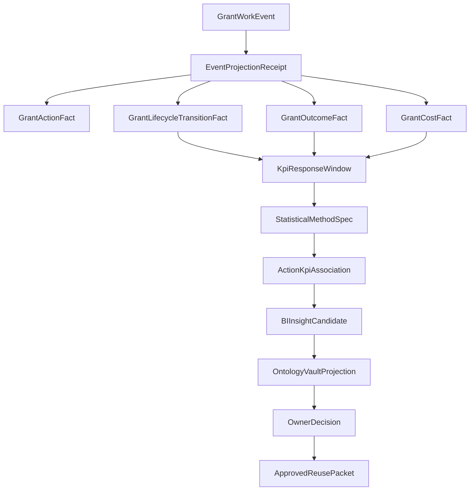

# Analytics Methods: GoldenQuill Promotion Governance

This document defines how GoldenQuill implements analytics methods that relate
grant actions to KPI movement. It is a method registry and implementation
contract, not a dashboard design and not promotion authority.

## Authority Rule

```text
ActionKpiAssociation != approved reusable knowledge
BIInsightCandidate != approved reusable knowledge
approved reusable knowledge begins only at OwnerDecision.approved_allowed_uses
```

Analytics methods may produce evidence-bounded associations. Those associations
may create BI insight candidates. Candidates must still pass governance,
privacy, owner decision, and approved-reuse packet rules.

## Implementation Pipeline



## Projection Contracts

### GrantActionFact

`GrantActionFact` is the analytics-ready representation of one grant action.

Required fields:

| Field | Type | Description |
| --- | --- | --- |
| `action_fact_id` | string | Stable fact id. |
| `run_id` | string | Bounded grant run. |
| `application_id` | string | Application or opportunity instance. |
| `event_ids` | string[] | Accepted event ids that produced the fact. |
| `projection_receipt_ids` | string[] | Receipts proving projection side effects. |
| `dag_node_refs` | string[] | DAG nodes represented by the action. |
| `action_kind` | string | Normalized action family, such as `red_team_review` or `logician_gate_passed`. |
| `actor_kind` | string | Seat, operator, adapter, or system actor family. |
| `stage` | [ApplicationStage](domain.md#applicationstage) | Stage where the action occurred. |
| `occurred_at` | timestamp | Source or workflow occurrence time. |
| `duration_minutes` | number | Optional duration when known. |
| `cost_ref` | string | Optional [GrantCostFact](#grantcostfact) reference. |
| `source_refs` | [SourceRef](domain.md#sourceref)[] | Evidence refs. |
| `org_scope` | [OrgScope](domain.md#orgscope) | Privacy and reuse boundary. |
| `context_tags` | string[] | Funder, program, grant family, amount band, or route tags. |
| `validation_state` | [ValidationState](domain.md#validationstate) | Projection validation state. |

Validation:

- source-backed actions require at least one `source_ref`;
- every action fact must reference an accepted event or projection receipt;
- action facts cannot contain `approved_allowed_uses`;
- backfilled facts must preserve original occurrence time and capture time.

### GrantLifecycleTransitionFact

`GrantLifecycleTransitionFact` records stage movement over time.

Required fields:

| Field | Type | Description |
| --- | --- | --- |
| `transition_id` | string | Stable transition id. |
| `run_id` | string | Bounded grant run. |
| `application_id` | string | Application instance. |
| `prior_stage` | [ApplicationStage](domain.md#applicationstage) | Previous stage. |
| `new_stage` | [ApplicationStage](domain.md#applicationstage) | New verified stage. |
| `effective_at` | timestamp | Date/time the transition happened. |
| `source_event_id` | string | Source event that supports the transition. |
| `projection_receipt_id` | string | Projection receipt. |
| `source_refs` | [SourceRef](domain.md#sourceref)[] | Supporting sources. |
| `interpretation_limits` | string[] | What the transition does not prove. |

### GrantOutcomeFact

`GrantOutcomeFact` is a source-backed outcome projection for BI queries.

Outcome families:

```text
submitted
portal_validated
agency_retrieved
under_review
feedback_received
awarded
declined
withdrawn
report_accepted
closed_out
```

Required fields:

| Field | Type | Description |
| --- | --- | --- |
| `outcome_fact_id` | string | Stable outcome fact id. |
| `outcome_event_id` | string | Source [GrantOutcomeEvent](domain.md#grantoutcomeevent). |
| `run_id` | string | Bounded grant run. |
| `application_id` | string | Application instance. |
| `outcome_family` | string | One of the outcome families above. |
| `event_date` | date | Source event date. |
| `amount_requested` | number | Requested amount when relevant. |
| `amount_awarded` | number | Awarded amount when relevant. |
| `source_refs` | [SourceRef](domain.md#sourceref)[] | Supporting sources. |
| `org_scope` | [OrgScope](domain.md#orgscope) | Privacy boundary. |
| `interpretation_limits` | string[] | What the outcome does not prove. |

### GrantCostFact

`GrantCostFact` records effort and cost evidence linked to actions or DAG nodes.

Required fields:

| Field | Type | Description |
| --- | --- | --- |
| `cost_fact_id` | string | Stable cost fact id. |
| `run_id` | string | Bounded grant run. |
| `action_fact_id` | string | Optional action fact reference. |
| `dag_node_ref` | string | Optional DAG node reference. |
| `actor_kind` | string | Seat, operator, adapter, or system. |
| `labor_minutes` | number | Human or workflow effort. |
| `tool_cost` | number | Tool/model cost. |
| `external_spend` | number | External service spend. |
| `currency` | string | Currency code. |
| `rate_card_version` | string | Rate card used for labor/tool allocation. |
| `allocation_method` | string | Direct, estimated, proportional, or imported. |
| `cost_period` | string | Date, week, month, quarter, or run period. |
| `source_refs` | [SourceRef](domain.md#sourceref)[] | Supporting evidence. |
| `interpretation_limits` | string[] | What the cost fact does not prove. |

### KpiResponseWindow

`KpiResponseWindow` is the temporal join between prior action facts and later KPI
movement.

Required fields:

| Field | Type | Description |
| --- | --- | --- |
| `window_id` | string | Stable response window id. |
| `run_id` | string | Bounded grant run. |
| `application_id` | string | Application instance. |
| `window_kind` | string | Stage transition, outcome, quality, cost, relationship, or stewardship window. |
| `anchor_action_refs` | string[] | Prior action facts being evaluated. |
| `kpi_kind` | [GrantKpiKind](domain.md#grantkpikind) | KPI measured. |
| `baseline_ref` | string | Baseline KPI, stage, or fact ref. |
| `response_ref` | string | Later KPI, stage, outcome, or fact ref. |
| `opened_at` | timestamp | Window start. |
| `expected_by` | timestamp | Optional expected response deadline. |
| `closed_at` | timestamp | Window end when known. |
| `status` | string | `open`, `closed`, `stale`, `censored`, or `blocked`. |
| `days_open` | number | Duration when computable. |
| `denominator_cohort` | string | Cohort denominator definition. |
| `source_refs` | [SourceRef](domain.md#sourceref)[] | Evidence refs. |
| `interpretation_limits` | string[] | What the window does not prove. |

Validation:

- every anchor action must occur before `closed_at` or response measurement;
- pending outcomes must be `censored`, not treated as losses;
- rate and ratio KPIs require denominator cohort;
- response windows cannot cross org scope without privacy approval.

## Method Registry Schema

### StatisticalMethodSpec

`StatisticalMethodSpec` defines one allowed analytics method and the checks that
must pass before it can run.

Required fields:

| Field | Type | Description |
| --- | --- | --- |
| `method_id` | string | Stable method id. |
| `method_family` | [StatisticalMethodFamily](#statisticalmethodfamily) | Method family. |
| `maturity_level` | [AnalyticsMaturityLevel](#analyticsmaturitylevel) | Required data maturity. |
| `minimum_observations` | number | Minimum observations for the method. |
| `minimum_segments` | number | Minimum non-empty comparison segments. |
| `required_fields` | string[] | Required input fields. |
| `bias_checks` | string[] | Checks that must pass or be recorded as residue. |
| `allowed_claim_labels` | [AnalyticsClaimLabel](#analyticsclaimlabel)[] | Maximum claim labels this method may emit. |
| `blocked_claims` | [AnalyticsClaimLabel](#analyticsclaimlabel)[] | Claims this method may never emit. |
| `promotion_limit` | string | Required statement: method output is evidence only. |
| `output_schema` | string | Usually `ActionKpiAssociation`. |

## StatisticalMethodFamily

| Family | Implementation Definition | First Maturity |
| --- | --- | --- |
| `descriptive_cohort` | Compare KPI summaries for grants with and without an action pattern. | L0 |
| `funnel_transition` | Compare stage transition rates after action patterns. | L0 |
| `sequence_mining` | Count ordered action sequences and later KPI outcomes. | L0-L1 |
| `time_to_event` | Measure time from action or stage to later outcome, preserving censored cases. | L1 |
| `bayesian_update` | Update a prior belief about action usefulness with observed evidence and uncertainty. | L1-L2 |
| `regression_glm` | Estimate association between action and KPI while controlling named covariates. | L2 |
| `hierarchical_model` | Model nested org, funder, program, writer, or grant-family variation. | L2 |
| `difference_in_differences` | Compare before/after change against comparison group. | L3 |
| `propensity_matching` | Compare treated and untreated runs with similar measured covariates. | L3 |
| `uplift_model` | Estimate which future opportunities benefit from an action. | L4 |
| `anomaly_residual` | Flag outlier action/KPI behavior for investigation. | L0-L1 |

## AnalyticsMaturityLevel

| Level | Allowed Families | Gate |
| --- | --- | --- |
| `L0_fixture_descriptive` | `descriptive_cohort`, `funnel_transition`, `sequence_mining`, `anomaly_residual` | Synthetic or early production facts with denominator checks. |
| `L1_observed_temporal` | L0 plus `time_to_event`, `bayesian_update` | Stable timing, censoring, and repeated windows. |
| `L2_controlled_association` | L1 plus `regression_glm`, `hierarchical_model` | Enough observations, covariates, and clusters. |
| `L3_quasi_causal` | L2 plus `difference_in_differences`, `propensity_matching` | Comparison design and treatment-selection evidence. |
| `L4_decision_policy` | L3 plus `uplift_model` | Large treated/untreated history and monitoring. |

## AnalyticsClaimLabel

| Label | Meaning | May Create Candidate |
| --- | --- | --- |
| `descriptive_pattern` | Observed pattern only. | yes, with weak confidence. |
| `correlation_candidate` | Association exists after denominator and segment checks. | yes. |
| `controlled_association` | Association survives specified covariates or grouping. | yes. |
| `quasi_causal_candidate` | Quasi-causal design is satisfied but still assumption-bound. | yes, with explicit assumptions. |
| `decision_support_only` | Useful context but not reusable guidance. | conditional. |
| `blocked_or_residue` | Too sparse, biased, private, contradicted, or invalid. | no. |

## ActionKpiAssociation

`ActionKpiAssociation` is the output of a statistical method.

Required fields:

| Field | Type | Description |
| --- | --- | --- |
| `association_id` | string | Stable association id. |
| `method_id` | string | [StatisticalMethodSpec](#statisticalmethodspec) used. |
| `maturity_level` | [AnalyticsMaturityLevel](#analyticsmaturitylevel) | Data maturity used. |
| `action_pattern_ref` | string | Action pattern or query ref. |
| `kpi_window_refs` | string[] | Response windows evaluated. |
| `segment` | string | Funder, program, org, stage, period, or cohort. |
| `sample_size` | number | Observation count. |
| `comparison_size` | number | Comparison/control count when relevant. |
| `effect_value` | number | Difference, rate, hazard ratio, coefficient, posterior mean, or score. |
| `effect_unit` | string | Unit of effect. |
| `confidence_summary` | string | Confidence interval, credible interval, uncertainty class, or descriptive note. |
| `claim_label` | [AnalyticsClaimLabel](#analyticsclaimlabel) | Maximum allowed claim. |
| `bias_notes` | string[] | Bias checks and findings. |
| `source_refs` | [SourceRef](domain.md#sourceref)[] | Supporting evidence. |
| `interpretation_limits` | string[] | What the association does not prove. |
| `promotion_limit` | string | Required statement that output is not approved reuse. |

Validation:

- `claim_label` must be allowed by the method spec;
- `sample_size` must meet method spec gate;
- bias checks must pass or downgrade to `blocked_or_residue`;
- no association may contain approved allowed uses.

## Method Definitions

### Descriptive Cohort

Use for L0 comparisons of KPI summaries between action-present and
action-absent cohorts.

Inputs:

- `GrantActionFact[]`
- `KpiResponseWindow[]`
- segment key
- KPI value or transition flag

Formula:

```text
treated_mean = mean(kpi_value where action_present)
comparison_mean = mean(kpi_value where action_absent)
effect_value = treated_mean - comparison_mean
```

Allowed labels: `descriptive_pattern`, `correlation_candidate`,
`blocked_or_residue`.

Fail closed when:

- either cohort is empty;
- denominator definitions differ;
- action happens after the response window;
- org scope aggregation threshold is not met.

### Funnel Transition

Use for lifecycle stage conversion.

Formula:

```text
transition_rate = count(reached_target_stage) / count(eligible_start_stage)
effect_value = transition_rate_with_action - transition_rate_without_action
```

Required fields:

- `prior_stage`
- `new_stage`
- `effective_at`
- `denominator_cohort`
- `source_event_id`

Allowed labels: `descriptive_pattern`, `correlation_candidate`.

### Sequence Mining

Use to discover repeated ordered action paths before KPI movement.

Implementation:

1. Build ordered action sequences per `run_id`.
2. Keep sequences that occur at least `minimum_observations`.
3. Join each sequence to later `KpiResponseWindow`.
4. Emit support, confidence, and lift-like descriptive scores.

Formulas:

```text
support = count(sequence) / count(runs)
confidence = count(sequence and outcome) / count(sequence)
baseline = count(outcome) / count(runs)
lift = confidence / baseline
```

Allowed labels: `descriptive_pattern`, `correlation_candidate`.

Fail closed when sequence order is ambiguous or support is below gate.

### Time To Event

Use for cycle time and delayed outcomes with pending cases.

Implementation:

```text
duration = event_or_censor_date - anchor_action_date
status = observed if outcome event exists else censored
```

L1 may compute medians and survival curves. Cox-style hazard ratios are L2+ and
require covariates and proportional-hazard checks.

Allowed labels: `descriptive_pattern`, `correlation_candidate`,
`decision_support_only`.

Fail closed when pending outcomes are treated as declines or losses.

### Bayesian Update

Use when evidence is sparse and a prior must be explicit.

Implementation:

```text
posterior = update(prior, observed_successes, observed_failures)
effect_value = posterior_mean - prior_mean
confidence_summary = credible_interval
```

Allowed labels: `decision_support_only`, `correlation_candidate`.

Fail closed when the prior is hidden or not source-linked.

### Regression / GLM

Use only at L2 when covariates and sample size are adequate.

Implementation:

```text
kpi_value_or_event ~ action_present + funder_family + amount_band + org_scope + stage + prior_relationship + time_period
```

Required gates:

- minimum observations;
- covariate coverage;
- no perfect separation for logistic models;
- missingness report;
- segment privacy threshold.

Allowed labels: `controlled_association`, `decision_support_only`.

### Hierarchical Model

Use only at L2 when observations are nested.

Implementation:

```text
kpi_value ~ action_present + covariates + random_effect(org/funder/program/writer)
```

Allowed labels: `controlled_association`, `decision_support_only`.

Fail closed when there are too few clusters or cluster sizes are sparse.

### Difference In Differences

Use only at L3 when a known workflow change has a before/after and comparison
group.

Formula:

```text
effect = (post_treated - pre_treated) - (post_comparison - pre_comparison)
```

Required gates:

- named intervention date;
- comparison group;
- pre-period and post-period windows;
- parallel-trend assumption note;
- no concurrent unmodeled policy change.

Allowed labels: `quasi_causal_candidate`, `decision_support_only`.

### Propensity Matching

Use only at L3 when action selection is biased and measured confounders exist.

Implementation:

1. Estimate propensity of receiving action from pre-action covariates.
2. Match or weight action-present and action-absent runs.
3. Compare KPI response windows in matched/weighted set.

Fail closed when overlap is poor or important confounders are missing.

Allowed labels: `quasi_causal_candidate`, `decision_support_only`.

### Uplift Model

Use only at L4 for future action targeting.

Implementation:

```text
uplift = predicted_kpi_with_action - predicted_kpi_without_action
```

Required gates:

- large treated and untreated history;
- stable action definitions;
- post-deployment monitoring;
- owner-approved allowed use limiting recommendation scope.

Allowed labels: `decision_support_only`.

### Anomaly / Residual Analysis

Use to flag unusual grant runs for review.

Implementation:

```text
residual = observed_kpi - expected_kpi_for_segment
anomaly_score = abs(residual) / segment_scale
```

Allowed labels: `descriptive_pattern`, `blocked_or_residue`.

Fail closed when anomaly is treated as proof of quality or failure.

## BIInsightCandidate Profile

`BIInsightCandidate` is a profile of
[PromotionCandidate](domain.md#promotioncandidate). It must preserve all
PromotionCandidate rules and add:

| Field | Type | Required |
| --- | --- | --- |
| `association_refs` | [ActionKpiAssociation](#actionkpiassociation)[] | yes |
| `method_id` | string | yes |
| `claim_label` | [AnalyticsClaimLabel](#analyticsclaimlabel) | yes |
| `confidence_class` | string | yes |
| `minimum_group_threshold` | number | yes |
| `privacy_gate_ref` | string | conditional |
| `interpretation_limits` | string[] | yes |

The profile maps:

```text
association_refs -> source_kpis/source_packets
claim_label + method_id -> proposed_relation
interpretation_limits + bias_notes -> promotion_blockers/residue
requested future use -> proposed_allowed_uses
```

## Method Block Metrics

Validators should emit these counters:

| Metric | Blocks |
| --- | --- |
| `gq.promotion_governance.analytics.method_sample_gate_failed` | minimum observation or segment gate failed. |
| `gq.promotion_governance.analytics.temporal_leakage_blocked` | action is not prior to response window. |
| `gq.promotion_governance.analytics.censoring_required` | pending outcome needs censored handling. |
| `gq.promotion_governance.analytics.selection_bias_unchecked` | treatment-selection bias is not addressed. |
| `gq.promotion_governance.analytics.multiple_comparison_residue` | exploratory scan produces residue instead of candidate. |
| `gq.promotion_governance.analytics.aggregate_privacy_threshold_failed` | aggregate is too small or scoped for safe reuse. |

## L0 Required Fixture

The L0 validator must include a falsification fixture:

```text
12 grant runs
action pattern: red_team_review_before_final_signoff
KPI: reviewer_objection_resolution_rate
confounder: high-risk grants are more likely to receive red_team_review
naive result: positive association
guarded result: downgraded to correlation_candidate or blocked_or_residue
promotion result: no approved reuse packet without owner decision
```

