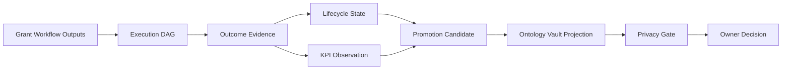
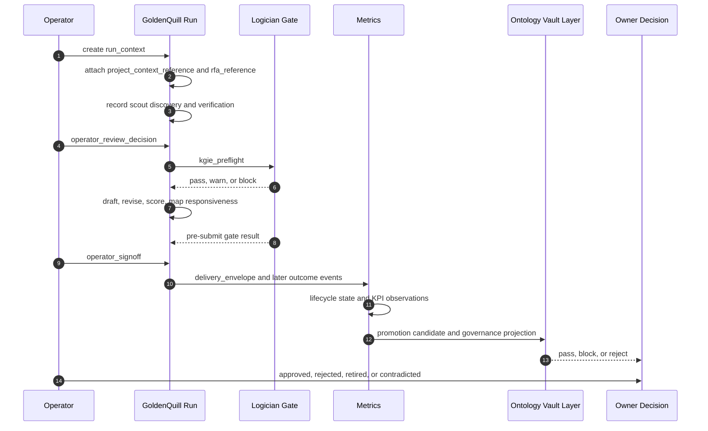

# GoldenQuill Promotion Governance Architecture

This architecture is the feature-level companion to [SPEC.md](SPEC.md). The
architecture is canonical for the DomainSpec feature and copies the governing
content into this folder so the feature is not dependent on external proposal
documents.

## Architecture Intent

The architecture must let GoldenQuill learn from grant runs while preserving
source truth, private feedback boundaries, KPI denominator semantics, gate
history, and owner-approved promotion authority. It must make the first slice
small enough to validate with synthetic fixtures and strong enough to prevent
draft prose, dashboard metrics, or model agreement from becoming reusable
knowledge without review.

## Scope Boundary

Owned behavior:

- represent grant-run execution nodes and edges;
- record source-backed grant outcome events;
- project application lifecycle state;
- compute KPI observations with denominator definitions;
- create promotion candidates from selected validated signals;
- project candidates into an Ontology Vault governance-compatible shape;
- enforce redaction/generalization before workspace-safe reuse;
- record owner decisions and approved allowed uses;
- validate all of the above with positive and negative fixtures.

Excluded behavior:

- production org-vault mutation;
- signed-card mutation;
- dashboard implementation;
- production data importer;
- automatic promotion from KPI thresholds;
- canonical Ontology Vault template mutation;
- workspace-safe reuse of org-scoped feedback without privacy gate and owner
  approval.

## Source Contracts

| Contract ID | Source | Required | Notes |
| --- | --- | --- | --- |
| SC-001 | [SPEC.md](SPEC.md) | yes | Feature capability, concept, KPI, evidence-state, and acceptance source of truth. |
| SC-002 | [domain.md](domain.md) | yes | Entity, value object, enum, and field contracts. |
| SC-003 | [operations.md](operations.md) | yes | Rule and error-state contract for the validator surface. |
| SC-004 | [states.md](states.md) | yes | Application lifecycle, promotion candidate, and owner decision state machines. |
| SC-005 | [mappings.md](mappings.md) | yes | Ontology Vault projection and boundary transformations. |
| SC-006 | [TEST-SPEC.md](TEST-SPEC.md) | yes | Fixture and fail-closed verification obligations. |
| SC-007 | [discovery/goldenquill-promotion-governance.md](discovery/goldenquill-promotion-governance.md) | yes | Discovery evidence used to start spec writing. |

## Design Goals and Non-Goals

| Type | Item | Why |
| --- | --- | --- |
| Goal | Track real-world grant progress from prospect through award, decline, reporting, and closeout. | Grant quality cannot be measured by win/loss alone. |
| Goal | Convert wins, rejections, reviewer comments, and KPI signals into candidates without automatic promotion. | GoldenQuill must learn without creating false authority. |
| Goal | Keep private applicant and funder feedback private until redacted and approved. | Cross-client learning must not leak org-scoped context. |
| Goal | Keep Ontology Vault responsible for promotion governance. | Local grant semantics must not drift into ungoverned memory authority. |
| Goal | Make every candidate auditable through source evidence, owner decision, approved uses, and contradiction path. | Future reuse must be explainable and reversible. |
| Non-goal | Build dashboard UI in L0. | The first slice proves the data contract only. |
| Non-goal | Mutate production memory, signed cards, or org-vault data in L0. | The validator must be fixture-only. |
| Non-goal | Promote from KPI thresholds. | Metrics are signals, not authority. |

## View 1: Context View

GoldenQuill already has a grant workflow with discovery, drafting, editing,
scoring, gate checks, and operator decisions. The missing feature is a governed
learning path around that workflow:

- what happened in the world;
- what evidence supports that event;
- what the event suggests;
- what may be reused;
- who is allowed to approve reuse;
- what must stay private, rejected, retired, or contradicted.

This feature sits after and around Scout, Scribe, Editor, Judge, Logician, card
governance, and org-vault memory. It does not replace them.

| Actor or System | Relationship to Feature | Contract Source |
| --- | --- | --- |
| Scout | Produces discovery and verification records consumed by the execution DAG. | [SPEC.md](SPEC.md#execution-dag-contract) |
| Operator | Makes go/no-go, signoff, and owner decisions. | [operations.md](operations.md#recordownerdecision) |
| Logician | Produces gate results that can block traversal or candidate promotion. | [domain.md](domain.md#grantrunnode) |
| Scribe, Editor, Judge | Produce draft, suggestion, score, and responsiveness artifacts as run nodes. | [SPEC.md](SPEC.md#execution-dag-contract) |
| Outcome source | Provides portal export, agency notice, email, award notice, decline, report acceptance, or closeout evidence. | [domain.md](domain.md#grantoutcomeevent) |
| Ontology Vault governance layer | Checks promotion-governance compatibility and approved-use boundaries. | [mappings.md](mappings.md#ontologyvaultprojection) |

## View 2: High-Level Structure View



Candidate implementation shape:

```text
projects/goldenquill/pipeline/grant_dag/
  models.py
  validate.py
  execution/
    run_nodes.py
    run_edges.py
    traversal.py
  promotion/
    candidates.py
    decisions.py
    allowed_uses.py
  ontology_vault/
    adapter.py
    promotion_record_projection.py
    governance_checks.py
  metrics/
    outcome_events.py
    lifecycle.py
    kpi_observations.py
    stage_profiles.py
  privacy/
    redaction.py
    generalization.py
  fixtures/
    README.md

projects/goldenquill/tests/grant_dag/
  test_promotion_governance.py
  test_outcome_metrics.py
  test_feedback_generalization.py
  fixtures/
```

| Component | Primary Contracts | Responsibility |
| --- | --- | --- |
| `execution` | [GrantRunNode](domain.md#grantrunnode), [GrantRunEdge](domain.md#grantrunedge) | Record run order, artifacts, gates, revisions, approvals, blocks, and delivery. |
| `metrics` | [GrantOutcomeEvent](domain.md#grantoutcomeevent), [ApplicationLifecycleState](states.md#applicationlifecyclestate), [GrantKpiObservation](domain.md#grantkpiobservation) | Capture real-world movement and compute denominator-safe metrics. |
| `promotion` | [PromotionCandidate](domain.md#promotioncandidate), [OwnerDecision](domain.md#ownerdecision) | Represent candidate learning and final owner disposition. |
| `ontology_vault` | [OntologyVaultProjection](mappings.md#ontologyvaultprojection) | Enforce governance compatibility and non-promotion guardrails. |
| `privacy` | [RedactionGeneralizationGate](operations.md#redactiongeneralizationgate) | Keep org-scoped feedback private unless generalized and approved. |
| `validate` | [ValidatePromotionGovernance](operations.md#validatepromotiongovernance), [TEST-SPEC.md](TEST-SPEC.md) | Fail closed on missing source, missing denominator, premature approved uses, missing contradiction path, or unsafe feedback reuse. |

## View 3: Low-Level Components View

| Component | Owns | Consumes | Collaboration Rule |
| --- | --- | --- | --- |
| [GrantRunNode](domain.md#grantrunnode) | Execution node kind, source reference, gate reference, artifact reference. | Existing workflow artifacts. | Only mandatory or future-approved node kinds are valid. |
| [GrantRunEdge](domain.md#grantrunedge) | Execution edge kind, source and target nodes, validation state. | Grant run nodes. | Every run edge must be evidence-backed and local to a run id. |
| [GrantOutcomeEvent](domain.md#grantoutcomeevent) | Event kind, date, source, amount, statuses, feedback refs. | Outcome sources and delivery envelope. | Outcome events create learning signals, not approved reuse. |
| [GrantKpiObservation](domain.md#grantkpiobservation) | Metric kind, numerator, denominator, denominator definition, source events. | Outcome events and run DAG. | KPI observations can create candidates only after validation. |
| [PromotionCandidate](domain.md#promotioncandidate) | Candidate state, proposed uses, target owner, blockers, contradiction path. | Evidence refs, outcome events, KPI observations. | Candidates are not approved reuse and cannot carry `approved_allowed_uses`. |
| [OwnerDecision](domain.md#ownerdecision) | Decision, approved uses, conditions, contradiction path. | Promotion candidate and governance projection. | Approved allowed uses live here only. |
| [OntologyVaultProjection](mappings.md#ontologyvaultprojection) | Governance state, validation result, evidence refs, review gate. | Promotion candidate and owner decision. | Projection checks compatibility but does not mutate canonical artifacts. |

## View 4: Workflow Process View



| Flow | Happy Path | Failure or Compensation | Contract Source |
| --- | --- | --- | --- |
| Grant run capture | Create run context, attach sources, record discovery, verify, gate, draft, review, sign off, deliver. | Block traversal when a gate fails; do not emit downstream draft or delivery unless reopened by evidence fix or operator decision. | [workflows.md](workflows.md#grantpromotiongovernanceworkflow) |
| Outcome capture | Record source-backed event, project stage, compute KPI, create candidate. | Reject event without source; reject KPI without denominator definition. | [operations.md](operations.md#recordoutcomeevent) |
| Promotion governance | Validate candidate, project to governance layer, apply privacy gate, ask owner decision. | Keep candidate blocked, rejected, retired, or contradicted. | [operations.md](operations.md#validatepromotiongovernance) |

## View 5: Decision Flow View

| Decision Point | Options or Branches | Selection Rule | Outcome |
| --- | --- | --- | --- |
| Does the event have a source? | yes / no | [RecordOutcomeEvent](operations.md#recordoutcomeevent) requires source reference. | No source blocks event acceptance. |
| Is the signal a KPI? | yes / no | [ComputeKpiObservation](operations.md#computekpiobservation) requires denominator definition and interpretation limits. | Missing denominator blocks KPI. |
| Does it contain org-scoped feedback? | yes / no | [RedactionGeneralizationGate](operations.md#redactiongeneralizationgate) required for workspace-safe reuse. | Ungeneralized feedback remains org-scoped. |
| Is there a contradiction path? | yes / no | [ValidatePromotionGovernance](operations.md#validatepromotiongovernance) requires contradiction path. | Missing contradiction path blocks promotion. |
| Does governance projection pass? | pass / flag / block | [OntologyVaultProjection](mappings.md#ontologyvaultprojection) validates evidence, review gate, target owner, and allowed-use separation. | Owner may decide only after pass or explicit flagged review. |
| Owner approves? | approved / rejected / retired / contradicted | [RecordOwnerDecision](operations.md#recordownerdecision) records final disposition. | Approved allowed uses are recorded only on owner decision. |

## View 6: Dependency Interface View

| Dependency or Interface | Direction | Contract | Boundary Rule |
| --- | --- | --- | --- |
| Existing evidence packets | inbound | [MemoryEvidencePacketRef](domain.md#memoryevidencepacketref) | Source reference only; no promotion authority. |
| Outcome sources | inbound | [GrantOutcomeEvent](domain.md#grantoutcomeevent) | Portal, agency, email, report, or operator-uploaded source is required. |
| KPI projection | internal | [GrantKpiObservation](domain.md#grantkpiobservation) | Read model with denominator semantics; no promotion authority. |
| Ontology Vault layer | outbound/internal | [OntologyVaultProjection](mappings.md#ontologyvaultprojection) | Promotion governance only; no direct production mutation. |
| Org-vault memory | outbound future handoff | [OwnerDecision](domain.md#ownerdecision) | Private by default; no L0 mutation. |
| Card governance | outbound future handoff | [RecordOwnerDecision](operations.md#recordownerdecision) | No signed-card mutation in first slice. |
| Logician gates | inbound | [GrantRunNode](domain.md#grantrunnode) and [GrantRunEdge](domain.md#grantrunedge) | Gate failures can create candidates, not promotion. |

## Constraints

| Constraint | Source | Impact |
| --- | --- | --- |
| Evidence references do not approve reuse. | [SPEC.md](SPEC.md#real-world-evidence-contract) | `MemoryEvidencePacketRef` cannot carry approved allowed uses. |
| KPI observations cannot promote. | [SPEC.md](SPEC.md#kpi-catalog) | KPIs may create candidates only after validation. |
| Feedback is org-scoped by default. | [operations.md](operations.md#redactiongeneralizationgate) | Workspace-safe learning requires redaction/generalization and owner approval. |
| Stage depth is not a final outcome. | [states.md](states.md#applicationlifecyclestate) | Stage metrics cannot be interpreted as award or decline truth. |
| L0 is fixture-only. | [TEST-SPEC.md](TEST-SPEC.md#fixture-corpus) | No production importers, dashboard, memory writes, or signed-card mutation. |

## Dependency And Interface Rules

| Rule ID | Rule | Applies To | Enforcement |
| --- | --- | --- | --- |
| A-R1 | Every outcome event must carry a source reference. | [RecordOutcomeEvent](operations.md#recordoutcomeevent) | Validator blocks missing `source_ref`. |
| A-R2 | Every KPI must carry denominator definition and interpretation limits. | [ComputeKpiObservation](operations.md#computekpiobservation) | Validator blocks denominatorless KPI. |
| A-R3 | `approved_allowed_uses` cannot appear before [OwnerDecision](domain.md#ownerdecision). | [PromotionCandidate](domain.md#promotioncandidate) | Validator blocks premature approved uses. |
| A-R4 | Ontology Vault projection cannot mutate target artifacts. | [OntologyVaultProjection](mappings.md#ontologyvaultprojection) | Projection output is audit evidence only. |
| A-R5 | Org-scoped feedback cannot become workspace-safe without redaction/generalization and owner approval. | [RedactionGeneralizationGate](operations.md#redactiongeneralizationgate) | Validator blocks unsafe reuse. |

## Data and Evidence Artifacts

| Artifact | Produced By | Used For | Contract Source |
| --- | --- | --- | --- |
| Grant run node fixture | [RecordGrantRunEvent](operations.md#recordgrantrunevent) | Validating execution DAG traversal. | [domain.md](domain.md#grantrunnode) |
| Grant run edge fixture | [RecordGrantRunEvent](operations.md#recordgrantrunevent) | Validating order, consumption, emission, blocking, revision, approval, and delivery. | [domain.md](domain.md#grantrunedge) |
| Outcome event fixture | [RecordOutcomeEvent](operations.md#recordoutcomeevent) | Validating source-backed grant movement. | [domain.md](domain.md#grantoutcomeevent) |
| KPI observation fixture | [ComputeKpiObservation](operations.md#computekpiobservation) | Validating denominator and interpretation safety. | [domain.md](domain.md#grantkpiobservation) |
| Promotion candidate fixture | [CreatePromotionCandidate](operations.md#createpromotioncandidate) | Validating candidate lifecycle and allowed-use split. | [domain.md](domain.md#promotioncandidate) |
| Governance projection fixture | [OntologyVaultProjection](mappings.md#ontologyvaultprojection) | Validating promotion-governance compatibility. | [mappings.md](mappings.md#ontologyvaultprojection) |
| Owner decision fixture | [RecordOwnerDecision](operations.md#recordownerdecision) | Validating approved uses, rejection, retirement, and contradiction. | [domain.md](domain.md#ownerdecision) |

## Extension Points

| Extension Point | Allowed Variation | Guardrail |
| --- | --- | --- |
| Funder-family stage profile | Override display label, score, or ordering for a grant family. | Must name profile, source evidence, and why global baseline is insufficient. |
| Additional KPI families | Add new dashboard or learning metrics. | Must define numerator, denominator, source events, segment, and interpretation limits. |
| Additional run node kinds | Add future workflow artifacts. | Must preserve run id, source, gate, and traversal semantics. |
| Production dashboard | Expose validated read model. | Dashboard labels remain observations, not source truth. |

## Trade-offs and Guardrails

| Trade-off | Benefit | Cost | Guardrail |
| --- | --- | --- | --- |
| Local GoldenQuill model with Ontology Vault governance layer | Fast grant-specific validation with governance compatibility. | Possible drift if projection is weak. | Projection and governance checks are mandatory. |
| Fixture-only L0 | Low-risk validation surface. | No immediate dashboard value. | L0 exit requires positive and negative fixtures. |
| KPIs can create candidates | Outcome-driven learning loop. | Risk of metric overreach. | Owner approval remains required. |
| Redaction/generalization gate | Cross-client learning becomes possible. | Adds workflow complexity. | Feedback remains org-scoped until gate and owner approval pass. |

## Decision Log

| Decision ID | Decision | Options Considered | Reason |
| --- | --- | --- | --- |
| D-001 | GoldenQuill local model with Ontology Vault governance layer. | Local model, Ontology Vault companion schema, bridge artifact. | GoldenQuill needs local grant semantics while Ontology Vault owns promotion safety. |
| D-002 | First executable slice lives in GoldenQuill `grant_dag`. | GoldenQuill package, memory mesh development folder, Ontology Vault fixtures. | Grant lifecycle and KPI semantics need local test pressure first. |
| D-003 | Split proposed and approved allowed uses. | Evidence-owned, candidate-owned, owner-decision-owned, split. | Candidate intent and authorized reuse must stay separate. |
| D-004 | Selected KPIs may create candidates only. | Dashboard-only, selected candidate generation, threshold promotion. | Balanced learning without false authority. |
| D-005 | Feedback uses redaction/generalization gate. | Always org-scoped, gated generalization, manual only. | Reusable learning is useful but must be privacy-safe. |
| D-006 | Global stage baseline with optional funder-family override. | Global score, family score, hybrid. | Baseline supports comparison while preserving later accuracy. |

## Risks

| Risk ID | Risk | Mitigation | Owner |
| --- | --- | --- | --- |
| RK-001 | KPI optimization distorts grant behavior. | KPIs create candidates only; owner approval remains required. | GoldenQuill |
| RK-002 | Private feedback leaks into shared learning. | Org-scoped by default; redaction/generalization gate required. | GoldenQuill |
| RK-003 | Local model drifts from governance layer. | Projection and governance checks are mandatory validator steps. | Ontology Vault layer |
| RK-004 | Evidence packets become promotion authority. | Evidence references stay read-only. | GoldenQuill |
| RK-005 | Stage scoring overfits federal grants. | Global baseline plus funder-family profile override. | GoldenQuill |
| RK-006 | Dashboard appears more authoritative than source evidence. | Dashboard observations include interpretation limits and source event refs. | GoldenQuill |

## Downstream Planning Notes

- Implementation-plan inputs: [SPEC.md](SPEC.md), [domain.md](domain.md), [operations.md](operations.md), [mappings.md](mappings.md), [TEST-SPEC.md](TEST-SPEC.md).
- Test implications: positive and negative fixture corpus is required before runtime integration.
- Observability implications: record lifecycle depth, denominator failures, governance gate results, redaction blocks, and owner decisions.
- Documentation implications: this DomainSpec folder is the new source of truth; earlier proposal docs are historical evidence only.

## Design Transport Notes

Carry this design into the next Task Session as `TASK-GDAG-PROMO-001:
Implement fixture-only promotion governance validator`. The implementation must
use synthetic/demo fixtures only and verify fail-closed behavior before any
runtime importer, dashboard, memory write, card mutation, org-vault mutation, or
automatic promotion path is added.

## Gate Result

- Status: pass
- Reason: blocker-level choices about ownership, first implementation home,
  metric authority, org-scoped learning, allowed uses, and stage-depth scoring
  are resolved.
- Required follow-up: implement L0 fixture-only validator from [TEST-SPEC.md](TEST-SPEC.md).
