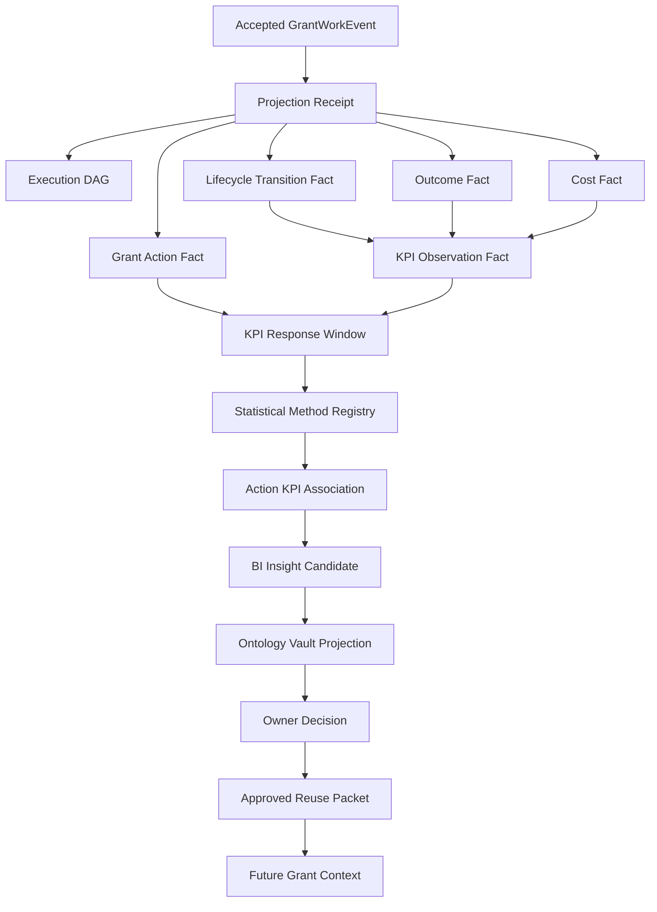

# Refine Result: KPI Action Ontology BI

## Verdict

Pass.

The refined architecture should treat grant-run business intelligence as a
separate governed projection layer between the event/DAG spine and ontology
promotion. The smallest coherent implementation unit is:

```text
GrantWorkEvent
  -> EventProjectionReceipt
  -> GrantActionFact / lifecycle transition / outcome / cost / KPI facts
  -> KpiResponseWindow
  -> StatisticalMethodSpec
  -> ActionKpiAssociation
  -> BIInsightCandidate
  -> OntologyVaultProjection
  -> OwnerDecision
  -> ApprovedReusePacket
  -> FutureGrantContext
```

The answer to "how do we correlate KPI with grant actions?" is: do not correlate
raw dashboard KPIs to vague action labels. First project the run into
source-backed action facts and response windows, then run only methods whose
assumptions are satisfied, then emit evidence-bounded association records. Those
association records can propose ontology intelligence, but they cannot approve
reuse.

## Core Architecture



## Required Canonical Concepts

| Concept | Purpose |
| --- | --- |
| `GrantActionFact` | Analytics-ready fact derived from accepted event, DAG node, actor/seat, artifact, gate, duration, and source refs. |
| `GrantLifecycleTransitionFact` | Prior stage, new stage, effective date, source event, run/application id, and projection receipt. |
| `GrantOutcomeFact` | Source-backed outcome family such as submitted, retrieved, reviewed, feedback received, awarded, declined, withdrawn, report accepted, or closed out. |
| `GrantCostFact` | Labor minutes, actor/seat, tool/model cost, external spend, currency, rate card, allocation basis, and DAG refs. |
| `GrantKpiObservationFact` | Durable KPI observation with denominator, source facts, interpretation limits, and segment/cohort. |
| `GrantBiSnapshot` | Append/replay-friendly materialized view by org, run, opportunity, funder, program, stage, period, and cohort. |
| `KpiResponseWindow` | Temporal join between prior actions and later KPI movement, with censoring and leakage guards. |
| `StatisticalMethodSpec` | Registry entry for allowed method family, assumptions, maturity gate, required fields, bias checks, and claim labels. |
| `ActionKpiAssociation` | Method output with sample, effect/difference, uncertainty, claim label, bias notes, source refs, and limits. |
| `BIInsightCandidate` | Ontology-governed promotion candidate subtype or mapping target for analytical findings. |

## Statistical Technique Ladder

| Maturity | Techniques | Allowed Claim |
| --- | --- | --- |
| L0 | descriptive cohorts, funnel/stage transitions | `descriptive_pattern`, `correlation_candidate` |
| L1 | sequence mining, simple survival/time-to-event with censoring, Bayesian decision support | `correlation_candidate`, `decision_support_only` |
| L2 | regression/GLM, hierarchical or mixed-effects models | `controlled_association` |
| L3 | difference-in-differences, propensity matching, other quasi-causal designs | `quasi_causal_candidate` |
| L4 | uplift modeling and automated treatment targeting | `decision_support_only`, with strong production gates |

L0 should be the first implementation slice. Higher levels remain blocked until
event coverage, sample sizes, covariates, treatment-selection metadata, and
privacy thresholds are proven.

## Fail-Closed Method Guards

Every statistical method must check:

- temporal leakage;
- right-censoring and pending outcomes;
- missing outcome data;
- small samples and sparse segments;
- treatment-selection bias;
- confounding and covariate coverage;
- funder/org/program clustering;
- multiple exploratory comparisons;
- aggregate privacy thresholds;
- interpretation limits;
- promotion limit: statistical output is evidence only.

## Ontology And Promotion Boundary

`BIInsightCandidate` should be canonicalized as either:

1. a subtype/profile of `PromotionCandidate`, or
2. an explicit mapping target that converts into `PromotionCandidate` before
   `OntologyVaultProjection`.

It must carry:

- `association_refs`;
- `method_id`;
- `claim_label`;
- `confidence_class`;
- `privacy_scope`;
- `redaction_status`;
- `minimum_group_threshold`;
- `interpretation_limits`;
- `proposed_allowed_uses`;
- `target_owner`;
- `contradiction_path`;
- `owner_decision_ref` only after decision.

Approved BI feedback must pass through `OwnerDecision` and
`ApprovedReusePacket`. Future grant work may consume only approved allowed uses,
matching scope, status, confidence/claim label, and interpretation limits.

## Toy Fixture

The first validation slice should include a tiny falsification game:

```text
12 grant runs
action pattern: Red Team review before final signoff
KPI: reviewer objection resolution rate
confounder: high-risk grants are more likely to receive Red Team
naive result: Red Team appears associated with better resolution
controlled/segmented result: claim is downgraded or marked residue
governance result: no approved packet until owner decision
```

This proves GoldenQuill can produce useful BI while refusing false confidence.

## Subagent Synthesis

| Role | Verdict | Key Contribution |
| --- | --- | --- |
| analytics-methods | pass with hardening | Add method registry, maturity ladder, fail-closed statistical guards, method-block observability, and toy fixtures. |
| grant-ops-data | pass with runtime gaps | Add concrete runtime fact models for action, lifecycle transition, outcome, cost, KPI observation, response windows, and BI snapshots. |
| ontology-governance | pass with canonicalization deltas | Canonicalize `BIInsightCandidate`, add BI-to-ontology mappings, aggregate privacy fields, and BI-specific approved packet validation. |

## Recommended Next Routes

1. `invoke refresh with patch proposal` for canonical docs:
   - add BI concepts to `domain.md`;
   - add `ActionKpiAssociationToBIInsightCandidate` and
     `BIInsightCandidateToOntologyVaultProjection` to `mappings.md`;
   - add method registry and BI projection operations to `operations.md`;
   - add BI response-window and method-block events to `events.md`;
   - extend `TEST-SPEC.md` with toy falsification and privacy fixtures;
   - extend `observability.md` with method-block counters.
2. Task Session `GQ-BI-001`: fixture-only action fact and KPI response window
   schemas plus validators.
3. Task Session `GQ-BI-002`: statistical method registry validator and L0
   descriptive/funnel/sequence fixtures.
4. Task Session `GQ-BI-003`: BI insight candidate ontology bridge and approved
   BI feedback packet validation.

## Residue

- Exact sample-size thresholds remain deferred.
- Production causal inference remains future work.
- Dashboard UX is out of scope.
- Runtime event-spine models do not yet exist in code.
- Funding lattice can join to BI facts but must not become the grant-run system
  of record.
