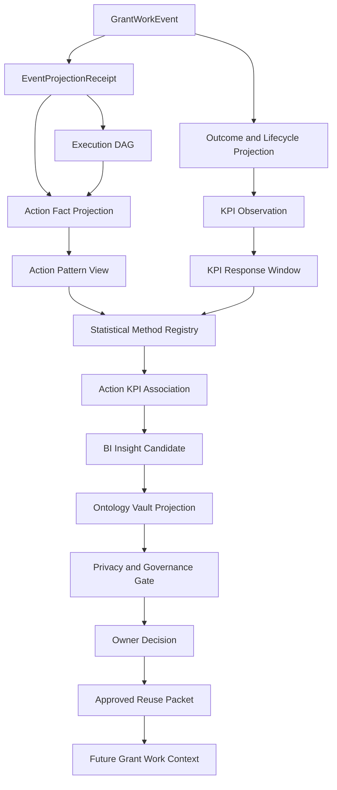

# Design: KPI Action Ontology BI Architecture

## Component Chart



## Data Flow

1. Adapter emits `GrantWorkEvent`.
2. Event acceptance validates producer, source, idempotency, scope, and limits.
3. Event projection writes `EventProjectionReceipt`.
4. Execution projection writes DAG nodes/edges.
5. BI projection derives `ActionFact` rows from accepted events and DAG nodes.
6. Outcome projection writes lifecycle/outcome/KPI observations.
7. `KpiResponseWindow` binds action timing to later KPI movement.
8. Method registry selects allowed method by data maturity.
9. Method emits `ActionKpiAssociation` with claim label and bias checks.
10. Strong enough associations become `BIInsightCandidate`.
11. Ontology Vault projection checks compatibility, contradiction, privacy, and
    owner route.
12. Owner decision may publish approved reuse packet.
13. Future grant context consumes only approved packet uses.

## Proposed Domain Additions

| Concept | Type | Fields |
| --- | --- | --- |
| `ActionFact` | Entity/read-model | `action_fact_id`, `run_id`, `event_ids`, `dag_node_refs`, `action_kind`, `actor_kind`, `stage`, `occurred_at`, `source_refs`, `org_scope`, `context_tags`, `validation_state` |
| `ActionPattern` | Value/read-model | `pattern_id`, `action_kind_sequence`, `window`, `segment`, `support_count`, `source_query_ref` |
| `KpiResponseWindow` | Entity/read-model | `window_id`, `run_id`, `anchor_action_refs`, `kpi_kind`, `baseline_ref`, `response_ref`, `start_at`, `end_at`, `censoring_state`, `denominator_definition` |
| `StatisticalMethodSpec` | Policy | `method_id`, `method_family`, `minimum_observations`, `required_fields`, `bias_checks`, `allowed_claim_labels`, `blocked_claims` |
| `ActionKpiAssociation` | Entity | `association_id`, `method_id`, `action_pattern_ref`, `kpi_window_refs`, `effect_or_difference`, `confidence`, `sample_size`, `bias_notes`, `claim_label`, `interpretation_limits` |
| `BIInsightCandidate` | Entity | `candidate_id`, `association_refs`, `proposed_relation`, `target_owner`, `allowed_use_request`, `scope`, `confidence_class`, `contradiction_path`, `residue` |

## Ontology Bridge

`BIInsightCandidate` should project to the ontology as a local governed claim:

```text
candidate: "Red Team review before final signoff is associated with higher objection resolution"
relation: action_pattern associated_with kpi_movement
scope: funder family / org scope / stage / segment
evidence: ActionKpiAssociation refs + source events + KPI windows
confidence: descriptive/correlation/controlled/quasi-causal
limits: sample size, bias, missingness, censoring
contradiction: future contrary association or owner challenge
approved uses: only after OwnerDecision
```

## Toy Falsification Fixture

Fixture must include:

- 12 historical grant runs;
- an action pattern, such as `red_team_review`;
- KPI response, such as `reviewer_objection_resolution_rate`;
- a confounder, such as high-risk grants being more likely to receive Red Team;
- one naive association that looks positive;
- one segmented or controlled check that downgrades the claim to
  `correlation_candidate` or `blocked_or_residue`;
- proof that no approved reuse packet is published without owner decision.

## BI Feedback Into Pipeline

Approved BI packets may hydrate future context as:

- Scout opportunity selection hints;
- Scribe drafting reminders;
- Judge scoring risk prompts;
- Logician gate threshold review prompts;
- operator go/no-go decision context;
- funding-goal strategy notes;
- dashboard explanatory read models.

They must not auto-route applications, auto-approve claims, or override owner
decisions.
