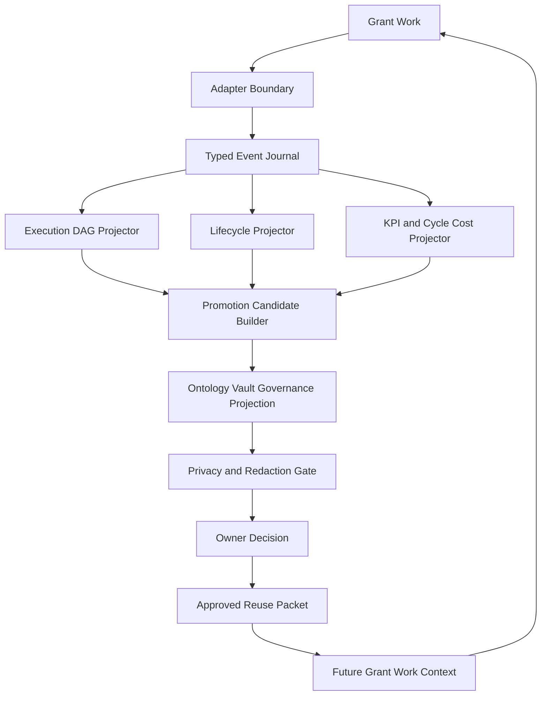
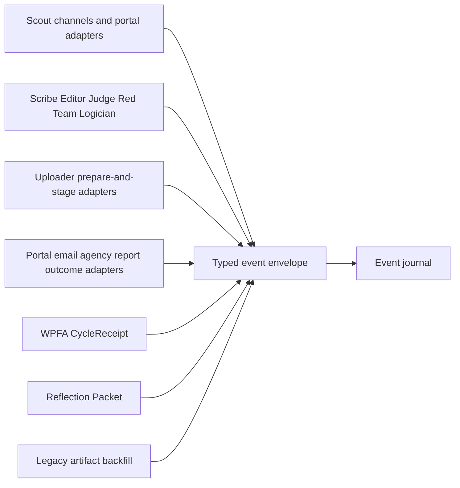
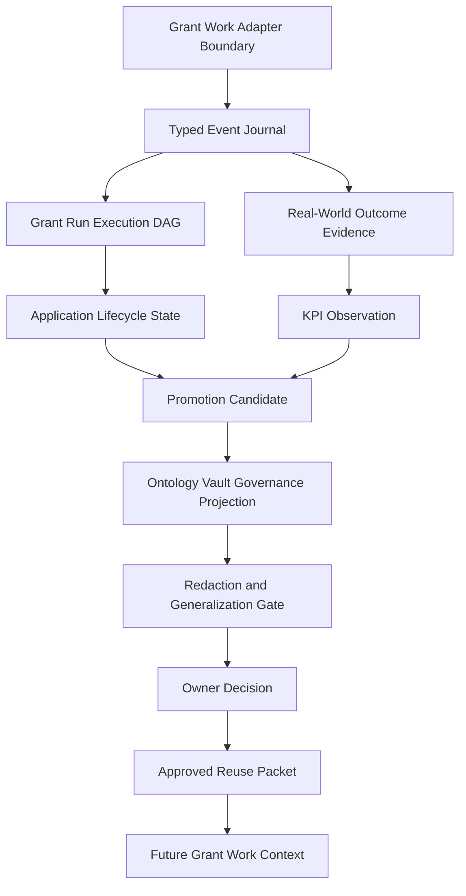

# Refresh Patch Proposal: Grant Work DAG Cycle

Mutation mode: proposal-only.

## Patch Proposal TOC

- [Patch Set A: SPEC.md](#patch-set-a-specmd)
- [Patch Set B: domain.md](#patch-set-b-domainmd)
- [Patch Set C: events.md](#patch-set-c-eventsmd)
- [Patch Set D: operations.md](#patch-set-d-operationsmd)
- [Patch Set E: workflows.md](#patch-set-e-workflowsmd)
- [Patch Set F: architecture.md](#patch-set-f-architecturemd)
- [Patch Set G: mappings.md](#patch-set-g-mappingsmd)
- [Patch Set H: observability.md](#patch-set-h-observabilitymd)
- [Patch Set I: TEST-SPEC.md](#patch-set-i-test-specmd)
- [Patch Set J: TOC And Index Updates](#patch-set-j-toc-and-index-updates)
- [Proposed First Task Session](#proposed-first-task-session)

## Patch Set A: SPEC.md

Add a section after `Execution DAG Contract`:

```markdown
## Grant Work Ingestion Contract

Grant work feeds the execution DAG through typed GoldenQuill events. An adapter
may observe a portal, source document, workflow seat output, operator decision,
uploader result, CycleReceipt, Reflection Packet, or legacy artifact batch, but
it must not write promotion authority directly.

Required event envelope:

- `event_id`
- `event_kind`
- `producer_kind`
- `producer_id`
- `run_id`
- `org_scope`
- `source_ref`
- `occurred_at`
- `captured_at`
- `idempotency_key`
- `payload_ref` or validated payload
- `interpretation_limits`
- `gate_refs`

The event journal is the replayable source for DAG node/edge projection,
lifecycle state, KPI observations, promotion candidates, and approved reuse
handoffs. Direct DAG writes are allowed only as a test helper or internal
implementation detail behind the same event validation.
```

Add a rule:

```text
adapter output != DAG authority until event validation passes
event journal != approved reusable knowledge
approved reuse != valid until owner decision records approved_allowed_uses
```

## Patch Set B: domain.md

Add entities/value objects:

- `GrantWorkEvent`
- `GrantWorkEventEnvelope`
- `AdapterProducer`
- `EventProjectionReceipt`
- `ApprovedReusePacket`

Add enum families:

- `GrantWorkEventKind`: `run_node_recorded`, `run_edge_recorded`,
  `gate_result_recorded`, `outcome_event_recorded`, `kpi_observation_recorded`,
  `cycle_receipt_recorded`, `reflection_packet_recorded`,
  `owner_decision_recorded`, `approved_reuse_available`.
- `AdapterProducerKind`: `seat`, `portal`, `uploader`, `operator_upload`,
  `outcome_source`, `wpfa_cycle_accountant`, `reflection_packet`,
  `memory_query`, `legacy_backfill`.

## Patch Set C: events.md

Add domain events:

- `GrantWorkEventAccepted`
- `GrantWorkEventRejected`
- `DagProjectionUpdated`
- `KpiProjectionUpdated`
- `PromotionCandidateProjected`
- `ApprovedReusePacketPublished`
- `FutureGrantContextHydrated`

## Patch Set D: operations.md

Add operations:

- `AcceptGrantWorkEvent`
- `ProjectEventToDag`
- `ProjectEventToLifecycleAndKpi`
- `PublishApprovedReusePacket`
- `HydrateFutureGrantContext`

Key operation rules:

- Missing `source_ref` blocks external or source-backed event acceptance.
- Duplicate `idempotency_key` with identical content is no-op replay.
- Duplicate `idempotency_key` with different content is contradiction/residue.
- Adapter producers cannot set `approved_allowed_uses`.
- Projection receipts must name created or updated DAG nodes, lifecycle states,
  KPI observations, or candidates.

## Patch Set E: workflows.md

Split `GrantPromotionGovernanceWorkflow` into three named loops:

1. `GrantRunCaptureLoop`: grant work -> adapter -> typed event -> DAG
   projection.
2. `OutcomeMeasurementLoop`: outcome events -> lifecycle/KPI/cycle-cost
   projections -> candidate generation.
3. `KnowledgeFeedbackLoop`: candidate -> governance/privacy/owner decision ->
   approved reuse packet -> future grant context.

## Patch Set F: architecture.md

Add component charts:





Add decision:

| Decision ID | Decision | Options Considered | Reason |
| --- | --- | --- | --- |
| D-007 | Grant work enters the DAG through typed events emitted by bounded adapters. | Event-first, direct DAG writers, command/API only, batch import, memory-first. | Event-first preserves replay, idempotency, source truth, adapter isolation, and promotion-governance boundaries. |

## Patch Set G: mappings.md

Add mappings:

- `GrantWorkEventToDagNode`
- `GrantWorkEventToDagEdge`
- `GrantWorkEventToOutcomeEvent`
- `OwnerDecisionToApprovedReusePacket`
- `ApprovedReusePacketToFutureGrantContext`

## Patch Set H: observability.md

Add metric families:

- event acceptance/rejection counts by producer;
- projection latency;
- idempotent replay count;
- duplicate conflict count;
- outcome evidence freshness;
- cycle-cost projection completeness;
- approved reuse publication count;
- future-context hydration count;
- governance/privacy block counts.

## Patch Set I: TEST-SPEC.md

Add fixture obligations:

- valid adapter event projects to expected DAG node and edge;
- adapter event without source fails;
- duplicate idempotency key with identical content is no-op;
- duplicate idempotency key with changed content blocks as contradiction;
- direct approved-use field from adapter is rejected;
- declined-after-review outcome creates candidate but not approved reuse;
- approved owner decision publishes approved reuse packet;
- future grant context hydration consumes only approved allowed uses.

## Patch Set J: TOC And Index Updates

Update the docs' table-of-contents and index surfaces so the new event-spine
proposal is discoverable from the canonical feature entry points.

### SPEC.md

Update `Module Map` to include the event ingestion and approved-reuse loop:



Add rows to `Capabilities`:

| Capability | What | Key Aspects | Detail |
| --- | --- | --- | --- |
| Accept Grant Work Events | Accept typed events from bounded adapters before DAG or metric projection. | `domain.md`, `events.md`, `operations.md`, `workflows.md` | Adapters cannot write promotion authority directly. |
| Project Event Spine | Project accepted events into DAG nodes/edges, lifecycle, KPIs, and candidates. | `mappings.md`, `operations.md`, `observability.md` | Projection receipts make replay and idempotency auditable. |
| Publish Approved Reuse | Return accumulated knowledge to future grant work after owner decision. | `domain.md`, `workflows.md`, `mappings.md` | Approved reuse packets are the only future-context input with approved uses. |

Add rows to `Domain Concepts` and `Concept Registry`:

- `GrantWorkEvent`
- `GrantWorkEventEnvelope`
- `AdapterProducer`
- `EventProjectionReceipt`
- `ApprovedReusePacket`
- `AcceptGrantWorkEvent`
- `ProjectEventToDag`
- `ProjectEventToLifecycleAndKpi`
- `PublishApprovedReusePacket`
- `HydrateFutureGrantContext`
- `GrantRunCaptureLoop`
- `OutcomeMeasurementLoop`
- `KnowledgeFeedbackLoop`

Add edges to `Feature Concept Graph`:

| From | Edge | To | Evidence | Notes |
| --- | --- | --- | --- | --- |
| `AcceptGrantWorkEvent` | produces | `GrantWorkEvent` | `operations.md` | Adapter outputs become typed events only after validation. |
| `GrantWorkEvent` | projects_to | `GrantRunNode` | `mappings.md` | DAG authority starts at projection receipt, not adapter output. |
| `GrantWorkEvent` | projects_to | `GrantOutcomeEvent` | `mappings.md` | Outcome evidence remains source-backed. |
| `OwnerDecision` | produces | `ApprovedReusePacket` | `mappings.md` | Approved uses become consumable by future grant context. |
| `HydrateFutureGrantContext` | consumes | `ApprovedReusePacket` | `operations.md` | Future runs consume approved allowed uses only. |

Update `Aspect Docs` descriptions:

- `Domain`: include event envelope, adapter producer, projection receipt, and approved reuse packet.
- `Operations`: include event acceptance, projection, approved reuse publication, and future context hydration.
- `Mappings`: include event-to-DAG/outcome and owner-decision-to-approved-reuse mappings.
- `Workflows`: include the three loops: capture, measurement, feedback.
- `Observability`: include event acceptance, projection latency, replay/conflict, and hydration metrics.
- `Test Specification`: include event-spine fixture obligations.

Update `Cross-Feature Dependencies`:

| Capability | Depends On | Via | Why |
| --- | --- | --- | --- |
| Accept Grant Work Events | Scout, seats, Uploader, WPFA, Reflection Packet, outcome sources, backfill | `AdapterProducer` and `GrantWorkEventEnvelope` | Normalizes live and backfilled grant movement through one ingestion boundary. |
| Publish Approved Reuse | Owner decision, memory query, Funding Goal, Scout/Scribe/Judge/Logician context | `ApprovedReusePacket` | Accumulated knowledge returns only after governance approval. |

Update `Produces For`:

| Consumer | Consumes Capability | Via | What |
| --- | --- | --- | --- |
| Future GoldenQuill grant runs | Publish Approved Reuse | `ApprovedReusePacket` and `HydrateFutureGrantContext` | Approved knowledge for Scout/Scribe/Judge/Logician/Funding Goal context. |
| Event-spine validator | Accept Grant Work Events and Project Event Spine | `TEST-SPEC.md` | Fixture-only proof of adapter event acceptance and projection behavior. |

Update `First Slice` to make event-spine projection the first executable unit:

- event envelope fixture schema;
- fake adapter fixtures;
- event acceptance validator;
- event-to-DAG projector;
- projection receipts;
- positive and negative event replay/idempotency fixtures.

Update `References` with:

- `development/refresh-runs/20260605T000000Z-grant-work-dag-cycle/REFRESH-REPORT.md`
- `development/refresh-runs/20260605T000000Z-grant-work-dag-cycle/REFRESH-PATCH-PROPOSAL.md`

### architecture.md

Update `Source Contracts` with a new proposal-row while it is still not applied:

| Contract ID | Source | Required | Notes |
| --- | --- | --- | --- |
| SC-008 | `development/refresh-runs/20260605T000000Z-grant-work-dag-cycle/REFRESH-PATCH-PROPOSAL.md` | proposal | Event-spine, adapter, approved-reuse, and project-split refresh proposal. |

Add the event-spine component chart to `View 2: High-Level Structure View`.

Add the adapter component chart to `View 6: Dependency Interface View`.

Add the knowledge feedback chart to `View 4: Workflow Process View` or a new
`View 7: Knowledge Feedback View`.

Update `Decision Log` with `D-007` from Patch Set F.

Update `Extension Points` with:

| Extension Point | Allowed Variation | Guardrail |
| --- | --- | --- |
| Adapter producer family | Add a producer for a new portal, workflow seat, importer, or report source. | Must emit the typed event envelope and cannot set approved uses. |
| Projection target | Add a new read model or downstream projection. | Must write projection receipts and preserve event idempotency. |
| Approved reuse consumer | Add future grant-work consumers. | Must consume only approved allowed uses from owner decisions. |

Update `Downstream Planning Notes` so the next route is
`TASK-GQ-DAG-001: Implement fixture-only event spine and DAG projection`.

### domain.md

Update the `Entities`, `Value Objects`, and `Enums` local section indexes by
adding the new headings in the correct area:

- under `Entities`: `GrantWorkEvent`, `AdapterProducer`, `EventProjectionReceipt`, `ApprovedReusePacket`;
- under `Value Objects`: `GrantWorkEventEnvelope`;
- under `Enums`: `GrantWorkEventKind`, `AdapterProducerKind`.

### events.md

Update the events heading order/index with:

- `GrantWorkEventAccepted`
- `GrantWorkEventRejected`
- `DagProjectionUpdated`
- `KpiProjectionUpdated`
- `PromotionCandidateProjected`
- `ApprovedReusePacketPublished`
- `FutureGrantContextHydrated`

Keep existing events in place; the new event-spine events should precede or
wrap the current projection-specific events.

### operations.md

Update the operations heading order/index with:

- `AcceptGrantWorkEvent`
- `ProjectEventToDag`
- `ProjectEventToLifecycleAndKpi`
- existing grant/outcome/KPI/candidate/governance operations;
- `PublishApprovedReusePacket`
- `HydrateFutureGrantContext`.

### workflows.md

Update the workflow index so `GrantPromotionGovernanceWorkflow` becomes an
umbrella workflow composed from:

- `GrantRunCaptureLoop`
- `OutcomeMeasurementLoop`
- `KnowledgeFeedbackLoop`

Keep `PromotionAuthorityPolicy` and `EvidenceStatePolicy` as policies consumed
by those loops.

### mappings.md

Update the mapping index with:

- `GrantWorkEventToDagNode`
- `GrantWorkEventToDagEdge`
- `GrantWorkEventToOutcomeEvent`
- existing lifecycle/KPI/governance mappings;
- `OwnerDecisionToApprovedReusePacket`
- `ApprovedReusePacketToFutureGrantContext`

### observability.md

Update the metrics/index sections with a new `Event Spine Metrics` group:

- event acceptance/rejection counts by producer;
- projection latency;
- idempotent replay count;
- duplicate conflict count;
- projection receipt completeness;
- future-context hydration count.

### TEST-SPEC.md

Update `Fixture Corpus`, `Test Matrix`, and `Connections` to include:

- event envelope fixture corpus;
- adapter producer fixture corpus;
- projection receipt fixture corpus;
- replay/idempotency fixture corpus;
- approved reuse/future context fixture corpus.

## Proposed First Task Session

`TASK-GQ-DAG-001: Implement fixture-only event spine and DAG projection`.

Write scope:

- event envelope fixture schema;
- fake adapter fixtures;
- event acceptance validator;
- event-to-DAG projector;
- projection receipts;
- pytest fixtures for pass, missing source, duplicate no-op, duplicate conflict,
  and forbidden approved-use attempt.
