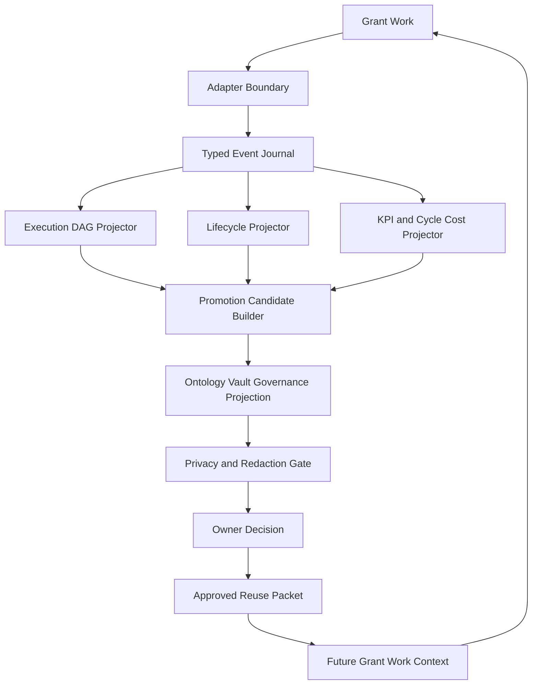
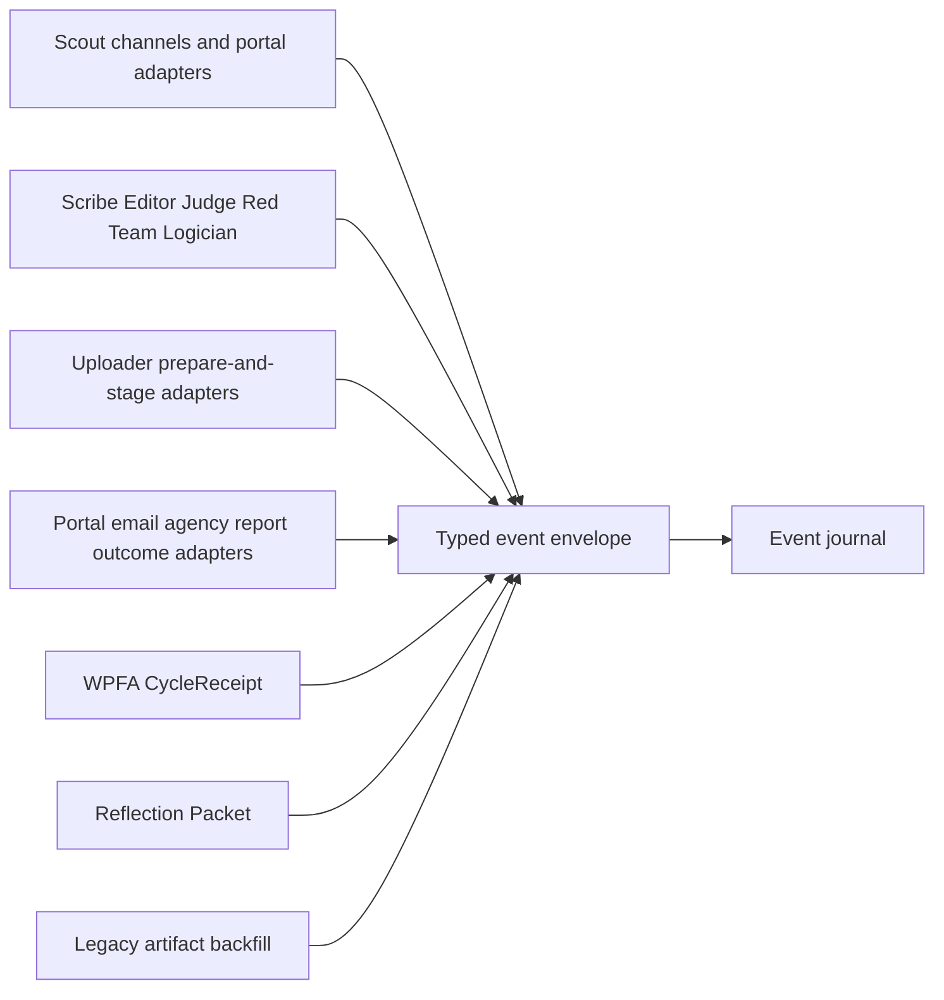
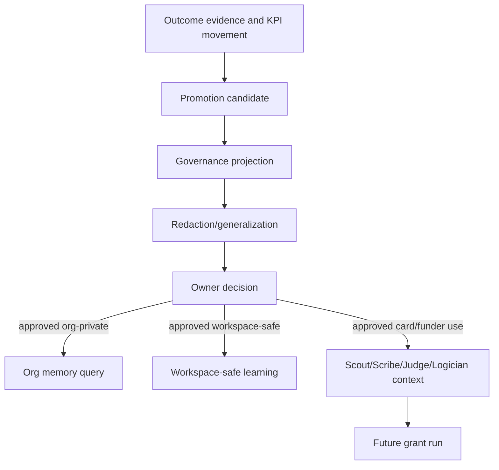

# Invoke Refresh Report: Grant Work DAG Cycle

## Refresh Scope

Proposal-only refresh of the GoldenQuill Promotion Governance artifact set.
This report does not mutate canonical files. It proposes deltas for:

- `SPEC.md`
- `architecture.md`
- `domain.md`
- `events.md`
- `operations.md`
- `workflows.md`
- `mappings.md`
- `observability.md`
- `TEST-SPEC.md`
- TOC/index surfaces inside those docs

## Source Signals

| ID | Type | Target Artifacts | Claim | Confidence | Mutation Safety |
| --- | --- | --- | --- | --- | --- |
| RS-001 | artifact_drift | `SPEC.md`, `architecture.md`, `workflows.md` | The current docs define an execution DAG but do not fully specify the ingestion boundary from live grant work into that DAG. | high | safe |
| RS-002 | evidence_added | `architecture.md`, `events.md`, `operations.md` | GoldenQuill already has adapter-shaped surfaces: Scout channels, portal adapters, uploader adapters, outcome sources, WPFA/CycleReceipt, Reflection Packet, and memory query. | high | safe |
| RS-003 | status_changed | `architecture.md`, `TEST-SPEC.md` | The first slice should probably become event-spine plus DAG projection fixtures, not only graph fixtures manually written in final form. | medium | needs_review |
| RS-004 | route_changed | `architecture.md`, `workflows.md`, `mappings.md` | Accumulated knowledge should return to grant work only after promotion candidate validation, privacy gate, owner decision, and approved allowed uses. | high | safe |
| RS-005 | evidence_added | `observability.md`, `domain.md` | Outcome measurement needs families beyond win/loss: lifecycle depth, review movement, compliance quality, effort/cost, ROI, relationship/stewardship, learning quality, and governance throughput. | high | safe |
| RS-006 | route_changed | `architecture.md`, `TEST-SPEC.md` | The effort should split into self-contained development projects: event spine, adapter contracts, metrics/cost, knowledge feedback, governance/privacy, and operator decision UX. | high | safe |
| RS-007 | artifact_drift | `SPEC.md`, `architecture.md`, `domain.md`, `events.md`, `operations.md`, `workflows.md`, `mappings.md`, `observability.md`, `TEST-SPEC.md` | The proposal adds new concepts, operations, mappings, events, workflows, and fixtures that must be reflected in TOC/index surfaces. | high | safe |

## Delta Summary

| Delta Class | Count | Summary |
| --- | --- | --- |
| `evidence_added` | 2 | Existing GoldenQuill strategy and blueprint evidence supports adapter, memory, Reflection Packet, and outcome-measurement deltas. |
| `artifact_drift` | 2 | The architecture has a DAG but not a crisp ingestion/adapter/event boundary; TOC/index sections also need proposal alignment. |
| `status_changed` | 1 | L0 should validate event-to-DAG projection, not just final DAG fixtures. |
| `route_changed` | 2 | Add explicit knowledge feedback route and split development projects. |

## Proposed Architecture Decision

Use event-first adapters.

Adapters translate internal or external grant-work surfaces into typed
GoldenQuill events. They must include source references, idempotency keys, org
scope, event time, producer identity, interpretation limits, and gate metadata.
Projectors consume those events to build the DAG, lifecycle state, KPI
observations, promotion candidates, governance projections, owner decisions, and
approved reuse packets.

Adapters are not authority holders. Events are not approved learning. KPIs are
not promotion authority. Approved reusable knowledge begins only at owner
decision after governance and privacy gates.

## Alternatives

| Alternative | Keep For | Defer Or Reject Because |
| --- | --- | --- |
| Event-first adapters | Recommended live path and fixture spine. | Needs event schema and projection validator work. |
| Direct DAG writers | Very small demos only. | Harder to replay, audit, and isolate adapter failures. |
| Command/API only | Useful implementation wrapper around event appends. | Should not replace the event journal. |
| Batch artifact import | Legacy/backfill path. | Should emit the same event schema; not a separate truth path. |
| Memory-first learning | None for L0. | Violates source-truth and promotion-governance boundary. |

## Proposed Development Split

| Project | Objective | Validation |
| --- | --- | --- |
| GQ-DAG-001 Event Spine and DAG Projection | Define event envelope, event families, idempotency, event-to-node/edge projection. | Fixtures prove pass path, blocked path, duplicate event replay, missing source failure. |
| GQ-ADAPTER-001 Adapter Contracts | Define producer protocols for Scout, Scribe/Editor/Judge/Logician, Uploader, portals, reports, operator uploads, and backfill. | Fake adapters emit valid and invalid typed events. |
| GQ-METRICS-001 Outcome Measurement and Cycle Cost | Define lifecycle, quality, cost, ROI, relationship, stewardship, and learning metrics. | KPI fixtures require denominator semantics, source events, and interpretation limits. |
| GQ-KNOWLEDGE-001 Reflection and Feedback | Define how Reflection Packet, memory query, Funding Goal, and approved reuse feed future runs. | End-to-end fixture from outcome to approved reuse to future Scout/Scribe context. |
| GQ-GOV-001 Governance and Privacy | Keep promotion safety, redaction, owner decision, contradiction path, and approved-use split explicit. | Fail-closed governance and privacy fixtures. |
| GQ-UX-001 Operator Decision Surface | Define review queues and dashboard read models without production mutation. | Fixture UI/read-model contract; no direct memory/card/org-vault writes. |

## Component Cycle



## Adapter Component Chart



## Knowledge Feedback Chart



## Validation

Review checks completed in this proposal pass:

- Target artifact inventory resolved.
- Source signals mapped to proposed changes.
- Mutation mode is proposal-only.
- Canonical target files were not edited.

Recommended validation after apply-approved:

```bash
python3 -m pytest tests/grant_dag
```

Add narrower commands once the event-spine fixture package exists.

## Next Route

`task-session` after approval, starting with GQ-DAG-001 Event Spine and DAG
Projection.
