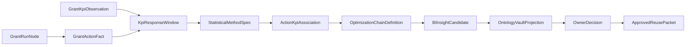

# Optimization Chains: GoldenQuill Promotion Governance

This document defines how GoldenQuill expresses a grant-work learning loop as a
plain-language business-intelligence chain and as a validation-ready contract.
It sits on top of [analytics-methods.md](analytics-methods.md): analytics
methods measure action/KPI relationships; optimization chains name what those
relationships mean for future pipeline improvement.

## Authority Rule

```text
OptimizationChainDefinition != approved reusable knowledge
OptimizationChainDefinition -> BIInsightCandidate only when evidence, limits, and governance route are present
approved reusable knowledge begins only at OwnerDecision.approved_allowed_uses
```

An optimization chain may explain a competitive advantage, produce a
dashboard-safe BI label, or prepare a candidate for governance. It cannot decide
that future grant work must follow the pattern.

## Core Definition

An `OptimizationChainDefinition` is a governed sentence contract:

```text
When [grant node or grant action] happens,
measure [outcome KPI] over [response window]
using [analytical method]
to produce [named BI optimization],
with [claim label, guardrail, and allowed-use boundary].
```

The competitive advantage is the repeatable loop, not any single dashboard
number: GoldenQuill captures grant work as evidence-backed action chains,
measures what changed afterward, applies method-specific statistical guards, and
turns only owner-approved findings into reusable pipeline intelligence.

## Chain Position In The BI Flow



The chain does not replace [ActionKpiAssociation](analytics-methods.md#actionkpiassociation)
or [BIInsightCandidate](analytics-methods.md#biinsightcandidate-profile). It
adds an explainable bridge between statistical output and business-language
optimization.

## Required Contract Fields

| Field | Type | Required | Meaning |
| --- | --- | --- | --- |
| `chain_id` | string | yes | Stable optimization-chain id. |
| `chain_name` | string | yes | Human-readable chain name. |
| `status` | string | yes | `candidate`, `validated`, `approved`, `rejected`, `retired`, `contradicted`, or `residue`. |
| `grant_node_refs` | string[] | yes | Grant DAG node kinds or concrete node refs. |
| `action_fact_refs` | string[] | yes | [GrantActionFact](analytics-methods.md#grantactionfact) refs or action query refs. |
| `outcome_kpi_refs` | string[] | yes | KPI kinds or [GrantKpiObservation](domain.md#grantkpiobservation) refs. |
| `response_window_refs` | string[] | yes | [KpiResponseWindow](analytics-methods.md#kpiresponsewindow) refs. |
| `analytics_method_ref` | string | yes | [StatisticalMethodSpec](analytics-methods.md#statisticalmethodspec) method id. |
| `association_refs` | string[] | yes | [ActionKpiAssociation](analytics-methods.md#actionkpiassociation) evidence refs. |
| `desired_bi_optimization` | string | yes | Name of the BI optimization produced. |
| `claim_label` | string | yes | Maximum allowed claim from [AnalyticsClaimLabel](analytics-methods.md#analyticsclaimlabel). |
| `confidence_class` | string | yes | Plain confidence class, such as `weak`, `moderate`, `strong`, or `blocked`. |
| `expression_set` | object | yes | Required sentence forms for operators, executives, dashboards, and contracts. |
| `governance_route` | object | yes | Candidate, privacy, owner-decision, and approved-reuse path. |
| `approved_reuse_target` | object | yes | Intended future grant-work surface if approved. |
| `interpretation_limits` | string[] | yes | What the chain does not prove. |
| `privacy_scope` | string | yes | Org/workspace/generalization boundary. |
| `example_fixture_refs` | string[] | yes | Fixtures or examples that test the chain. |

## Expression Forms

Every chain must carry the same idea in multiple forms so it can serve both
plain-language strategy and machine validation.

| Form | Template | Use |
| --- | --- | --- |
| `plain_language` | `When we do [action], we watch [KPI] with [method] so we can improve [BI optimization].` | Non-technical explanation. |
| `operator` | `For [grant node], compare [KPI] before/after [response window] using [method]; emit [optimization] only as [claim label].` | Workflow design and implementation. |
| `executive` | `Our advantage is learning which grant actions reliably improve [KPI] while preserving evidence, privacy, and owner approval.` | Competitive-advantage story. |
| `contract` | `OptimizationChainDefinition(chain_id, grant_node_refs, outcome_kpi_refs, analytics_method_ref, desired_bi_optimization, claim_label, governance_route).` | Schema, validators, and test fixtures. |
| `causal_careful` | `This chain says [method-specific claim], not proof that [action] caused [KPI] unless quasi-causal gates pass.` | Prevents overclaiming. |
| `dashboard_label` | `[BI optimization]: [KPI] movement after [grant action], [claim label].` | BI surface label. |
| `ontology` | `[action pattern] -> measured_by -> [KPI window] -> evaluated_with -> [method] -> proposes -> [BI optimization].` | Ontology and graph projection. |

## Optimization Chain Catalog

| Chain ID | Grant Nodes | KPI | Method | Desired BI Optimization | Plain-Language Sentence |
| --- | --- | --- | --- | --- | --- |
| `optchain.evidence-gap-reduction` | `kgie_preflight`, `evidence_gap_patch` | `evidence_gap_resolution_rate` | `descriptive_cohort`, later `funnel_transition` | Evidence Gap Reduction Insight | When preflight finds evidence gaps, measure how often those gaps get resolved before submission so GoldenQuill can learn which gap patterns slow or improve readiness. |
| `optchain.objection-risk-reduction` | `red_team_review`, `reviewer_objection_response` | `reviewer_objection_resolution_rate` | `descriptive_cohort`, `sequence_mining` | Objection Risk Reduction Insight | When Red Team review finds objections, measure later objection resolution so GoldenQuill can identify which adversarial checks create useful proposal improvements. |
| `optchain.compliance-drag-reduction` | `logician_gate_result`, `pre_submit_gate_result` | `compliance_pass_rate`, `cycle_time_discovery_to_submit` | `funnel_transition`, `time_to_event` | Compliance Drag Reduction Insight | When a Logician gate warns or blocks, measure pass rate and cycle time afterward so GoldenQuill can separate useful compliance friction from avoidable delay. |
| `optchain.rubric-coverage-lift` | `responsiveness_map`, `judge_score_report` | `rubric_coverage_score`, `review_reached_rate` | `descriptive_cohort`, later `regression_glm` | Rubric Coverage Lift Insight | When responsiveness mapping improves rubric coverage, measure later review-stage movement so GoldenQuill can tune draft work toward funder criteria. |
| `optchain.pursuit-selectivity` | `operator_review_decision`, `scout_verification_record` | `high_match_pursuit_rate`, `low_fit_avoidance_rate`, `win_rate_by_count` | `funnel_transition`, `descriptive_cohort` | Pursuit Selectivity Optimization | When operators choose go or no-go, measure fit quality and downstream outcomes so GoldenQuill can improve which opportunities enter the pipeline. |
| `optchain.submission-retrieval-reliability` | `delivery_envelope`, `portal_validation_record` | `agency_retrieved_rate`, `portal_validation_success_rate` | `funnel_transition` | Submission Retrieval Reliability | When delivery and portal validation happen, measure whether agencies retrieve the package so GoldenQuill can reduce silent submission failure. |
| `optchain.stewardship-retention` | `report_accepted`, `closed_out` | `grant_retention_rate`, `reporting_burden_hours` | `descriptive_cohort`, later `time_to_event` | Stewardship Retention Insight | When reporting and closeout finish cleanly, measure retention and burden so GoldenQuill can learn which stewardship practices preserve future funding relationships. |

## Example: Objection Risk Reduction

| Form | Sentence |
| --- | --- |
| Plain language | When Red Team review finds objections, we measure later objection resolution with descriptive cohorts so we can produce Objection Risk Reduction Insight. |
| Operator | For `red_team_review`, compare `reviewer_objection_resolution_rate` across response windows using `method.descriptive_cohort.v1`; emit only `descriptive_pattern` unless stronger gates pass. |
| Executive | GoldenQuill's advantage is that proposal risk review becomes measurable learning, not just reviewer notes lost after submission. |
| Contract | `OptimizationChainDefinition(optchain.objection-risk-reduction, red_team_review, reviewer_objection_resolution_rate, method.descriptive_cohort.v1, Objection Risk Reduction Insight, descriptive_pattern).` |
| Causal careful | This chain shows whether objection resolution improved after Red Team review in the observed cohort; it does not prove Red Team review caused improvement. |
| Dashboard label | Objection Risk Reduction Insight: objection resolution after Red Team review, descriptive pattern. |
| Ontology | `red_team_review -> measured_by -> reviewer_objection_resolution_rate_window -> evaluated_with -> method.descriptive_cohort.v1 -> proposes -> Objection Risk Reduction Insight`. |

## Contract Rules

| Rule ID | Rule | Failure |
| --- | --- | --- |
| OCR-001 | Every chain must name at least one grant node or action pattern. | Reject chain. |
| OCR-002 | Every KPI must have denominator semantics and a response window. | Reject chain. |
| OCR-003 | Every method must resolve to [StatisticalMethodSpec](analytics-methods.md#statisticalmethodspec). | Reject chain. |
| OCR-004 | Every chain must preserve [ActionKpiAssociation](analytics-methods.md#actionkpiassociation) evidence refs. | Reject chain. |
| OCR-005 | `claim_label` may not exceed the source association or method spec. | Downgrade or reject chain. |
| OCR-006 | Competitive-advantage wording must say whether the chain is candidate, validated, approved, or residue. | Reject public or executive expression. |
| OCR-007 | No expression form may claim approved reuse unless an [OwnerDecision](domain.md#ownerdecision) approved it. | Reject chain. |
| OCR-008 | Workspace-wide learning requires privacy scope, redaction/generalization status, and owner-decision route. | Block reuse projection. |
| OCR-009 | Causal language requires `quasi_causal_candidate` or stronger gates. | Downgrade expression. |
| OCR-010 | The schema fixture must include all expression forms. | Reject fixture. |

## Competitive Advantage Statement

GoldenQuill's competitive advantage is not a generic grant dashboard. It is a
governed optimization loop:

1. grant work is captured as source-backed DAG nodes and events;
2. each meaningful action can become an analytics-ready fact;
3. outcome KPIs are measured with denominator and time-window discipline;
4. statistical methods produce bounded claims instead of magic certainty;
5. BI optimizations are expressed as reusable sentence contracts;
6. owner decisions decide which findings may guide future work.

In plain language: GoldenQuill learns which grant actions actually improve the
pipeline, remembers the lesson only when the evidence and privacy rules allow
it, and feeds approved intelligence back into future grant work.

## Schema And Fixture

The JSON Schema for this contract is
[schemas/optimization-chain.schema.json](schemas/optimization-chain.schema.json).
The first concrete fixture is
[examples/optimization-chain.red-team-review.json](examples/optimization-chain.red-team-review.json).
