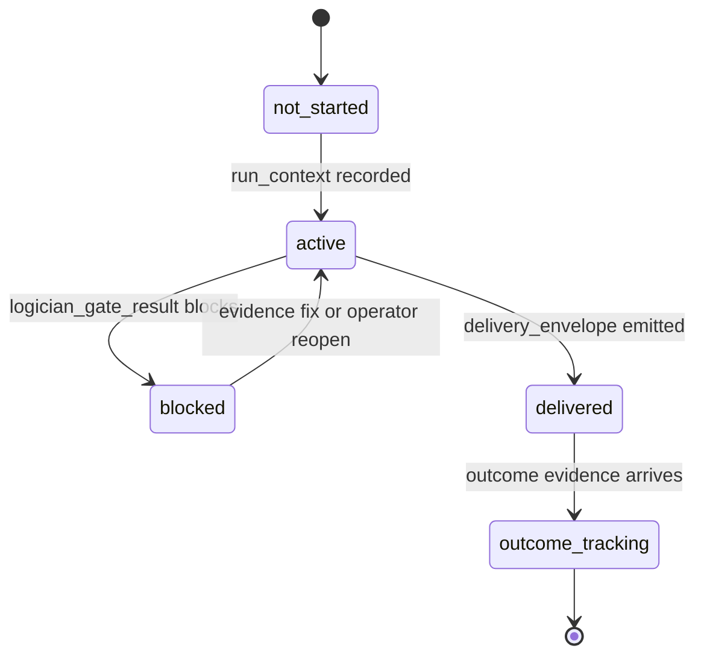
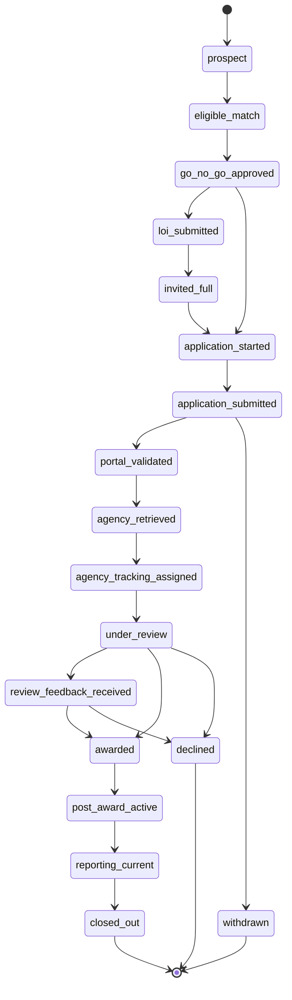
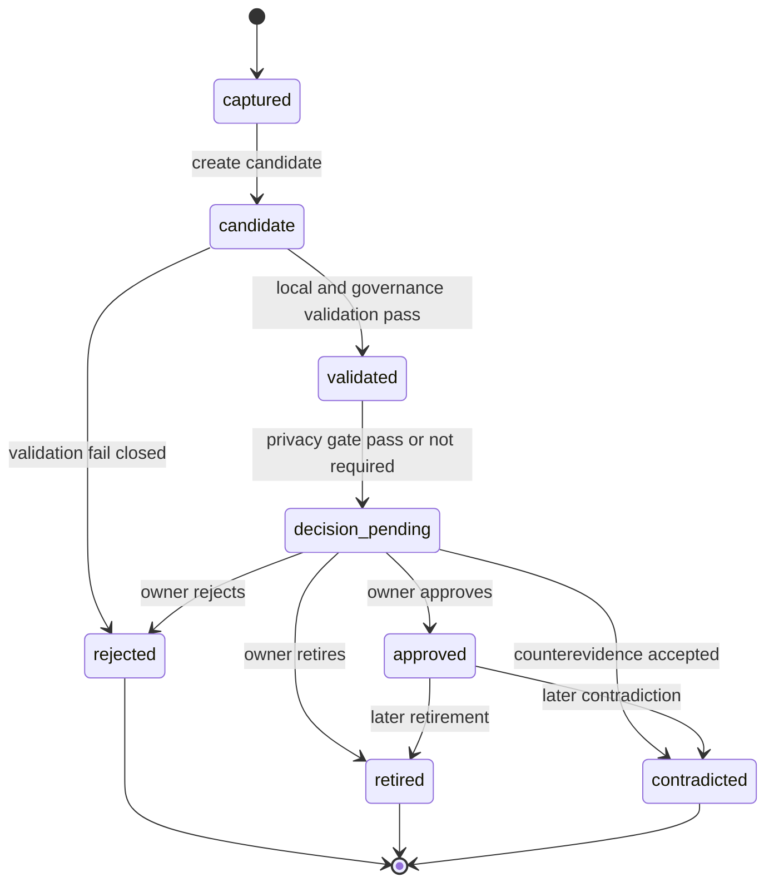
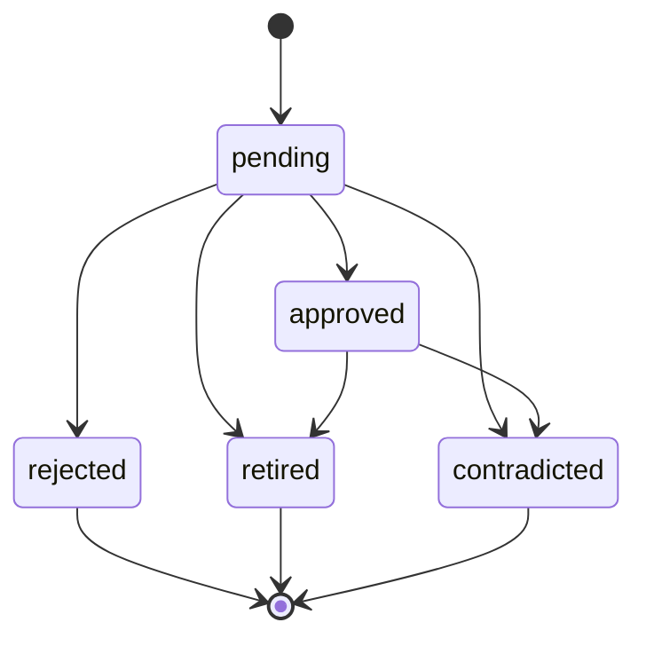
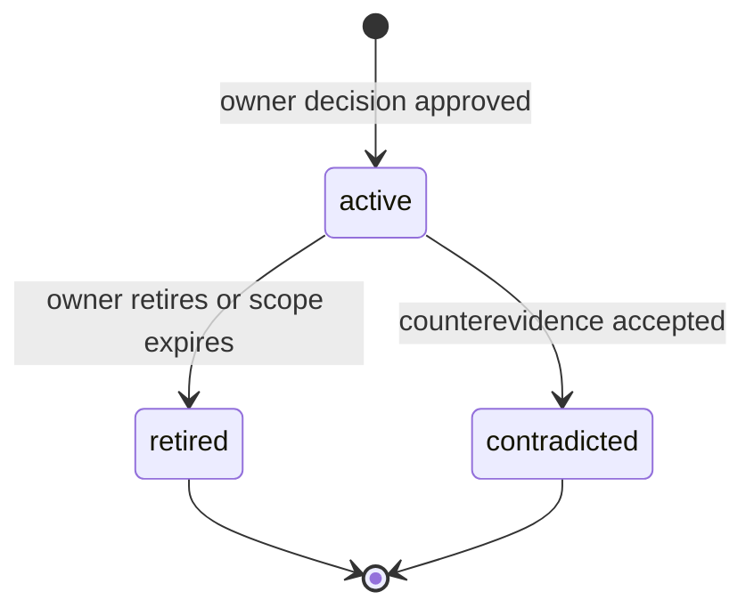

# State Machines: GoldenQuill Promotion Governance

## GrantRunTraversalState

### Transition Table

| From | Event | To | Guard | Effect |
| --- | --- | --- | --- | --- |
| `not_started` | `run_context` recorded | `active` | Run id exists. | Run DAG begins. |
| `active` | `logician_gate_result` blocks | `blocked` | Gate result is fail/block. | Downstream traversal stops. |
| `blocked` | evidence fix or operator reopen | `active` | Reopen evidence exists. | Traversal may continue. |
| `active` | `delivery_envelope` emitted | `delivered` | Operator signoff exists. | Delivery is recorded. |
| `delivered` | outcome event arrives | `outcome_tracking` | Source-backed event exists. | Real-world evidence tracking begins. |

### Invariants

| ID | Invariant | Formal |
| --- | --- | --- |
| GRT-I1 | No downstream draft or delivery may follow a blocked gate without reopen evidence. | `blocked_by_gate -> no downstream delivery_envelope until reopen` |
| GRT-I2 | Every non-initial node has a path from `run_context`. | `node != run_context -> path(run_context,node)` |
| GRT-I3 | Every delivery requires `operator_signoff`. | `delivery_envelope -> exists operator_signoff approved_by edge` |

## ApplicationLifecycleState

### Transition Table

| From | Event | To | Guard | Effect |
| --- | --- | --- | --- | --- |
| `prospect` | eligible match found | `eligible_match` | Source or operator fit evidence. | Stage depth advances. |
| `eligible_match` | operator approves pursuit | `go_no_go_approved` | Operator review decision exists. | Pursuit is allowed. |
| `go_no_go_approved` | LOI submitted | `loi_submitted` | Source-backed submission. | Stage depth advances. |
| `loi_submitted` | full application invited | `invited_full` | Source-backed invitation. | Stage depth advances. |
| `go_no_go_approved` or `invited_full` | application started | `application_started` | Work artifact exists. | Application work begins. |
| `application_started` | application submitted | `application_submitted` | Delivery envelope exists. | Submission recorded. |
| `application_submitted` | portal validates | `portal_validated` | Portal source exists. | Portal validation recorded. |
| `portal_validated` | agency retrieves | `agency_retrieved` | Agency or portal source exists. | Agency receipt recorded. |
| `agency_retrieved` | tracking assigned | `agency_tracking_assigned` | Agency tracking source exists. | Tracking recorded. |
| `agency_tracking_assigned` | review starts | `under_review` | Agency/reviewer signal exists. | Review reached. |
| `under_review` | feedback arrives | `review_feedback_received` | Feedback source exists. | Feedback available for learning candidate. |
| `under_review` or `review_feedback_received` | award notice | `awarded` | Award source exists. | Final outcome recorded. |
| `under_review` or `review_feedback_received` | decline notice | `declined` | Decline source exists. | Final outcome recorded. |
| `application_submitted` | withdrawal source | `withdrawn` | Withdrawal source exists. | Final outcome blocks win/loss interpretation. |
| `awarded` | award active | `post_award_active` | Award acceptance or start source. | Stewardship tracking begins. |
| `post_award_active` | report current | `reporting_current` | Report source exists. | Reporting metric advances. |
| `reporting_current` | closeout source | `closed_out` | Closeout source exists. | Closeout completed. |

### Invariants

| ID | Invariant | Formal |
| --- | --- | --- |
| ALS-I1 | Application stage is not final outcome truth. | `stage_depth != final_outcome` |
| ALS-I2 | Final outcome requires source-backed event. | `stage in {awarded,declined,withdrawn,closed_out} -> source_ref != null` |
| ALS-I3 | Global stage baseline may be overridden only by named profile. | `profile_override -> stage_profile != global and source_ref != null` |

## PromotionCandidateState

### Transition Table

| From | Event | To | Guard | Effect |
| --- | --- | --- | --- | --- |
| `captured` | [CreatePromotionCandidate](operations.md#createpromotioncandidate) | `candidate` | Source event, KPI, or evidence packet exists. | Candidate is proposal-level. |
| `candidate` | [ValidatePromotionGovernance](operations.md#validatepromotiongovernance) passes | `validated` | Evidence, review gate, contradiction path, and projection pass. | Candidate can approach owner decision. |
| `candidate` | validation fails | `rejected` | Fail-closed rule triggers. | Candidate cannot be reused. |
| `validated` | [RedactionGeneralizationGate](operations.md#redactiongeneralizationgate) passes or is not required | `decision_pending` | Privacy gate satisfied. | Candidate can be decided. |
| `decision_pending` | owner approves | `approved` | [OwnerDecision](domain.md#ownerdecision) with approved uses exists. | Approved reuse allowed by decision. |
| `decision_pending` | owner rejects | `rejected` | Decision source exists. | Reuse forbidden. |
| `decision_pending` | owner retires | `retired` | Decision source exists. | Candidate inactive. |
| `decision_pending` | counterevidence accepted | `contradicted` | Contradiction path activated. | Candidate contradicted. |

### Invariants

| ID | Invariant | Formal |
| --- | --- | --- |
| PCS-I1 | Candidates cannot contain approved allowed uses. | `candidate.approved_allowed_uses == null` |
| PCS-I2 | Approved state requires owner decision. | `state == approved -> owner_decision_ref != null` |
| PCS-I3 | Workspace-safe reuse requires generalized redaction state and owner approval. | `workspace_reuse -> redaction_status == generalized and owner_decision.approved` |

## OwnerDecisionState

### Transition Table

| From | Event | To | Guard | Effect |
| --- | --- | --- | --- | --- |
| `pending` | approve | `approved` | Approved allowed uses and decision source exist. | Approved reuse is recorded. |
| `pending` | reject | `rejected` | Decision source exists and no approved uses granted. | Candidate cannot be reused. |
| `pending` | retire | `retired` | Decision source exists. | Candidate inactive. |
| `pending` | contradict | `contradicted` | Counterevidence source exists. | Candidate contradicted. |
| `approved` | retire | `retired` | Later retirement source exists. | Approved reuse ends. |
| `approved` | contradict | `contradicted` | Later counterevidence source exists. | Approved reuse invalidated. |

### Invariants

| ID | Invariant | Formal |
| --- | --- | --- |
| ODS-I1 | Approved decisions require approved allowed uses. | `decision == approved -> len(approved_allowed_uses) > 0` |
| ODS-I2 | Non-approved decisions must not grant approved allowed uses. | `decision != approved -> len(approved_allowed_uses) == 0` |
| ODS-I3 | Every decision has decision source evidence. | `decision_source != null` |

## ApprovedReusePacketState

### Transition Table

| From | Event | To | Guard | Effect |
| --- | --- | --- | --- | --- |
| `[*]` | [PublishApprovedReusePacket](operations.md#publishapprovedreusepacket) | `active` | Approved owner decision with approved allowed uses exists. | Packet can hydrate future grant context within scope. |
| `active` | owner retires or scope expires | `retired` | Retirement source or expiry evidence exists. | Future hydration stops. |
| `active` | counterevidence accepted | `contradicted` | Contradiction path source exists. | Future hydration stops and existing context receipts become review targets. |

### Invariants

| ID | Invariant | Formal |
| --- | --- | --- |
| ARP-I1 | Active packets require approved allowed uses. | `packet.status == active -> len(packet.approved_allowed_uses) > 0` |
| ARP-I2 | Retired or contradicted packets cannot hydrate future grant context. | `packet.status in {retired,contradicted} -> no HydrateFutureGrantContext` |
| ARP-I3 | Hydration use must be a subset of approved allowed uses. | `requested_use in packet.approved_allowed_uses` |
