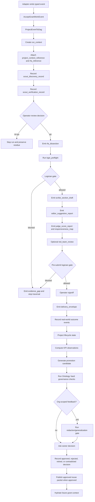
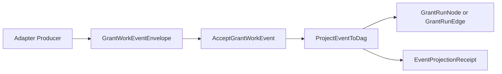
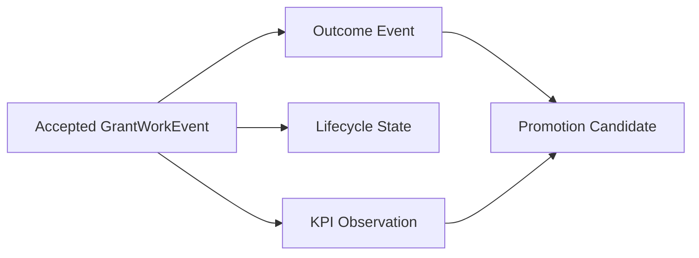
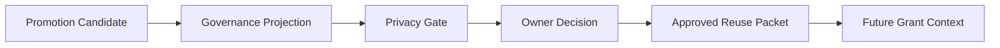

# Workflows: GoldenQuill Promotion Governance

## GrantPromotionGovernanceWorkflow

**Type:** Workflow
**Triggers:** A grant opportunity enters a bounded GoldenQuill run and later produces outcome evidence or KPI learning signals.
**Orchestrates:** [AcceptGrantWorkEvent](operations.md#acceptgrantworkevent), [ProjectEventToDag](operations.md#projecteventtodag), [RecordGrantRunEvent](operations.md#recordgrantrunevent), [RecordOutcomeEvent](operations.md#recordoutcomeevent), [ProjectEventToLifecycleAndKpi](operations.md#projecteventtolifecycleandkpi), [ComputeKpiObservation](operations.md#computekpiobservation), [CreatePromotionCandidate](operations.md#createpromotioncandidate), [ValidatePromotionGovernance](operations.md#validatepromotiongovernance), [RedactionGeneralizationGate](operations.md#redactiongeneralizationgate), [RecordOwnerDecision](operations.md#recordownerdecision), [PublishApprovedReusePacket](operations.md#publishapprovedreusepacket), [HydrateFutureGrantContext](operations.md#hydratefuturegrantcontext)
**Compensation Strategy:** fail closed, record residue, and preserve source evidence without promoting.
**Idempotency:** event-envelope based. Replaying the same `idempotency_key` is a no-op only when the event content matches; changed content under the same key blocks as contradiction/residue.

### Steps



### Step Table

| # | Step | Actor | Operation | On Success | On Failure | Compensation |
| --- | --- | --- | --- | --- | --- | --- |
| 1 | Accept grant-work event | Adapter boundary | [AcceptGrantWorkEvent](operations.md#acceptgrantworkevent) | Event ready for projection | Reject invalid event | Preserve event residue |
| 2 | Project event to DAG | Event projector | [ProjectEventToDag](operations.md#projecteventtodag) | Create or update DAG nodes/edges | Block invalid projection | Preserve projection receipt |
| 3 | Create run context | GoldenQuill | [RecordGrantRunEvent](operations.md#recordgrantrunevent) | Attach context references | Reject missing run id | Stop run |
| 4 | Record discovery and verification | Scout | [RecordGrantRunEvent](operations.md#recordgrantrunevent) | Ask operator decision | Preserve residue | Stop pursuit |
| 5 | Operator go/no-go | Operator | [RecordGrantRunEvent](operations.md#recordgrantrunevent) | Emit RFA dissection | Stop run | Preserve decision source |
| 6 | Preflight and gate | Logician | [RecordGrantRunEvent](operations.md#recordgrantrunevent) | Draft may begin | Block traversal | Emit evidence gap |
| 7 | Draft/review/score/map | Scribe, Editor, Judge | [RecordGrantRunEvent](operations.md#recordgrantrunevent) | Gate and signoff | Revise or block | Preserve revision edge |
| 8 | Delivery | Operator | [RecordGrantRunEvent](operations.md#recordgrantrunevent) | Outcome tracking begins | No delivery | Keep run as paused or blocked |
| 9 | Outcome/lifecycle/KPI projection | Metrics | [ProjectEventToLifecycleAndKpi](operations.md#projecteventtolifecycleandkpi) | Lifecycle/KPI projection | Reject source-less or denominatorless projection | Preserve projection receipt |
| 10 | Candidate creation | Validator/operator | [CreatePromotionCandidate](operations.md#createpromotioncandidate) | Governance projection | Reject unsafe candidate | Preserve residue |
| 11 | Governance validation | Ontology Vault layer | [ValidatePromotionGovernance](operations.md#validatepromotiongovernance) | Privacy gate or owner decision | Candidate blocked/rejected | Preserve blockers |
| 12 | Privacy gate | Privacy layer/operator | [RedactionGeneralizationGate](operations.md#redactiongeneralizationgate) | Owner decision may proceed | Candidate remains org-scoped | Preserve private residue |
| 13 | Owner decision | Owner/operator | [RecordOwnerDecision](operations.md#recordownerdecision) | Approved/rejected/retired/contradicted | Decision rejected | Return to decision pending |
| 14 | Publish approved reuse | Governance route | [PublishApprovedReusePacket](operations.md#publishapprovedreusepacket) | Approved reuse available | Packet rejected | Preserve decision and residue |
| 15 | Hydrate future context | Future run context builder | [HydrateFutureGrantContext](operations.md#hydratefuturegrantcontext) | Approved learning reaches future grant work | Scope or use rejected | Preserve audit record |

### Invariants

| ID | Invariant | Formal |
| --- | --- | --- |
| W-I1 | No source-less outcome event enters KPI or candidate generation. | `RecordOutcomeEvent.failed -> no downstream KPI/candidate` |
| W-I2 | No KPI creates approved reuse directly. | `KPI -> candidate_allowed and promotion_forbidden` |
| W-I3 | No workspace-safe reuse from org-scoped feedback without privacy gate and owner decision. | `workspace_reuse -> generalized and owner_approved` |
| W-I4 | No production mutation in L0. | `L0 -> no org_vault_write and no card_write and no dashboard_write` |
| W-I5 | No adapter output becomes DAG authority before event acceptance and projection. | `adapter_output -> accepted_event -> projection_receipt -> DAG` |
| W-I6 | Future grant context consumes only approved reuse packets. | `future_context -> ApprovedReusePacket.approved_allowed_uses` |

## GrantRunCaptureLoop

**Type:** Workflow
**Triggers:** Scout, workflow seats, Uploader, Logician, operator surfaces, or backfill emit grant-run events.
**Orchestrates:** [AcceptGrantWorkEvent](operations.md#acceptgrantworkevent), [ProjectEventToDag](operations.md#projecteventtodag), [RecordGrantRunEvent](operations.md#recordgrantrunevent)



Failure policy: invalid events are rejected before DAG projection. Duplicate
idempotency keys with identical content are no-op replay; changed content under
the same key blocks as contradiction or residue.

## OutcomeMeasurementLoop

**Type:** Workflow
**Triggers:** Outcome source, CycleReceipt, Reflection Packet, portal export, report, or operator upload is accepted as a grant-work event.
**Orchestrates:** [ProjectEventToLifecycleAndKpi](operations.md#projecteventtolifecycleandkpi), [RecordOutcomeEvent](operations.md#recordoutcomeevent), [ComputeKpiObservation](operations.md#computekpiobservation), [CreatePromotionCandidate](operations.md#createpromotioncandidate)



Failure policy: source-less outcomes, denominatorless KPIs, and KPI-only
promotion attempts fail closed.

## KnowledgeFeedbackLoop

**Type:** Workflow
**Triggers:** Candidate has enough evidence to enter governance and owner decision.
**Orchestrates:** [ValidatePromotionGovernance](operations.md#validatepromotiongovernance), [RedactionGeneralizationGate](operations.md#redactiongeneralizationgate), [RecordOwnerDecision](operations.md#recordownerdecision), [PublishApprovedReusePacket](operations.md#publishapprovedreusepacket), [HydrateFutureGrantContext](operations.md#hydratefuturegrantcontext)



Failure policy: rejected, retired, contradicted, unredacted, or unapproved
learning remains residue and cannot hydrate future grant context.

## PromotionAuthorityPolicy

**Type:** Policy
**Applies To:** [CreatePromotionCandidate](operations.md#createpromotioncandidate), [ValidatePromotionGovernance](operations.md#validatepromotiongovernance), [RecordOwnerDecision](operations.md#recordownerdecision)
**Trigger Conditions:** Any outcome event, KPI observation, feedback signal, or gate result proposes reusable learning.

### Decision Table

| Condition | Selected Behavior | Notes |
| --- | --- | --- |
| Source event is missing | Reject candidate generation | No grant truth from prose, dashboard label, or memory. |
| KPI lacks denominator definition | Reject KPI and candidate path | Denominator semantics are required. |
| Candidate includes `approved_allowed_uses` | Reject candidate | Approved uses live only on owner decision. |
| Candidate lacks contradiction path | Block promotion governance | Future counterevidence must be possible. |
| Candidate contains org-scoped feedback | Keep org-private unless redaction/generalization and owner approval pass | Prevents cross-client leakage. |
| Ontology Vault projection passes | Ask owner decision | Projection is still not mutation. |
| Owner approves | Record approved allowed uses on [OwnerDecision](domain.md#ownerdecision) | This is the first point where approved reuse exists. |

### Formula

```text
candidate_may_reach_owner =
  has_source_evidence
  and has_review_gate
  and has_contradiction_path
  and kpi_denominators_resolved
  and (not org_scoped_feedback or redaction_generalization_passed)
```

## EvidenceStatePolicy

**Type:** Policy
**Applies To:** [RecordOutcomeEvent](operations.md#recordoutcomeevent), [ComputeKpiObservation](operations.md#computekpiobservation), [ApplicationLifecycleState](states.md#applicationlifecyclestate)
**Trigger Conditions:** Any grant status, outcome, review feedback, award, decline, report, closeout, or dashboard observation is interpreted.

### Decision Table

| Condition | Selected Behavior | Notes |
| --- | --- | --- |
| Portal validates package | Advance application stage only | Does not mean agency review or final outcome. |
| Agency retrieves application | Advance lifecycle and feed cycle-time metrics | Does not prove proposal quality. |
| Review feedback arrives | Record source-backed feedback and possible org-scoped candidate | Feedback is not funding validation. |
| Award arrives | Record final outcome and amount realization metrics | Award does not validate every proposal claim. |
| Decline arrives | Record final outcome and review/strategy learning candidates | Decline is not automatic writing failure. |
| Report accepted or award closed out | Record stewardship and retention learning | Post-award success remains source-scoped. |

### Formula

```text
grant_truth =
  source_truth
  + application_stage
  + final_outcome
  + validation_state
  + interpretation_limits
```
