# Knowledge Graph Visualization

## Overview

Knowledge Graph Visualization provides a navigable UI that helps users understand what a set of feature specs and aspect docs represents as one coherent system.

Wave 1 delivers the V1 vision: Capability Atlas Board. It prioritizes fast comprehension, feature-to-capability navigation, taxonomy visibility, and concept drill-down backed by canonical DomainSpec relationships.

Wave 2 extends the module with the V2 vision: Relationship Constellation Canvas. It introduces multi-hop analysis, deterministic path tracing, and typed relationship-family projections.

Wave 3 extends the module with the V3 vision: Dependency Matrix + Trace Storyboard. It introduces governance-grade risk scoring, dependency state lifecycles, storyboard publication, and bounded exception handling.

## What This Module Owns

- Feature atlas navigation across documented features.
- Capability neighborhood exploration for a selected feature capability.
- Concept inspector context for taxonomy type, aspect evidence, and relationship neighbors.
- Canonical vocabulary projection from DomainSpec taxonomy and relationships.
- Deterministic shortest-path tracing across cross-feature graph segments.
- Multi-hop neighborhood exploration with bounded depth.
- Typed edge-family projections for analysis lenses.
- Feature-pair dependency matrix generation with per-pair risk scores.
- Governance risk lifecycle state management for dependency pairs.
- Release impact storyboard publication and trace evidence contracts.
- Bounded temporary mitigation via approved risk exceptions.

## Module Map

```mermaid
graph TD
  Atlas[GetFeatureAtlas]
  Neighborhood[GetCapabilityNeighborhood]
  NeighborhoodDepth[GetNeighborhoodByDepth]
  ShortestPath[GetShortestCrossFeaturePath]
  TypedProjection[GetEdgeTypedProjection]
  Matrix[GetDependencyMatrix]
  Storyboard[GetImpactStoryboard]
  Inspector[GetConceptInspectorContext]
  ScoreOp[ComputeDependencyRiskScore]
  StoryboardOp[BuildImpactStoryboard]
  ExceptionOp[ApproveRiskException]
  RiskState[DependencyRiskState]

  Snapshot[GraphSnapshot]
  Node[GraphNode]
  Edge[GraphEdge]
  Capability[CapabilityAnchor]
  Filter[ViewFilter]

  API[KnowledgeGraphReadAPI]

  API --> Atlas
  API --> Neighborhood
  API --> NeighborhoodDepth
  API --> ShortestPath
  API --> TypedProjection
  API --> Matrix
  API --> Storyboard
  API --> ScoreOp
  API --> StoryboardOp
  API --> ExceptionOp
  API --> Inspector

  Atlas --> Snapshot
  Atlas --> Capability
  Atlas --> Node

  Neighborhood --> Capability
  Neighborhood --> Node
  Neighborhood --> Edge

  NeighborhoodDepth --> Node
  NeighborhoodDepth --> Edge
  ShortestPath --> Edge
  TypedProjection --> Edge
  Matrix --> Snapshot
  Matrix --> Edge
  Matrix --> Node
  Storyboard --> Edge
  Storyboard --> Node

  ScoreOp --> Matrix
  StoryboardOp --> Storyboard
  ExceptionOp --> RiskState

  Inspector --> Node
  Inspector --> Edge

  Filter --> Atlas
  Filter --> Neighborhood
  Filter --> NeighborhoodDepth

  TraceWF[TraceSelectionWorkflow] --> ShortestPath
  TraceWF --> TypedProjection
  MultiHopWF[MultiHopAnalysisWorkflow] --> NeighborhoodDepth
  MultiHopWF --> TypedProjection
  RiskWF[RiskAssessmentWorkflow] --> ScoreOp
  RiskWF --> Matrix
  ReleaseWF[ReleaseImpactWorkflow] --> StoryboardOp
  ReleaseWF --> Storyboard
  ReleaseWF --> ExceptionOp

  ProjectionBuilt[ProjectionBuilt] --> Atlas
  TraceComputed[TraceComputed] --> ShortestPath
  LensSaved[LensSaved] --> TypedProjection
  RiskRaised[DependencyRiskRaised] --> Matrix
  RiskMitigated[DependencyRiskMitigated] --> Matrix
  StoryboardPublished[StoryboardPublished] --> Storyboard
```

## Capabilities

| Capability                                                                                       | What                                                                                   | Key Aspects                                                                                                                                                                 | Detail                                                                               |
| ------------------------------------------------------------------------------------------------ | -------------------------------------------------------------------------------------- | --------------------------------------------------------------------------------------------------------------------------------------------------------------------------- | ------------------------------------------------------------------------------------ |
| [V1 Capability Atlas Board](capabilities/v1-capability-atlas-board.md)                           | Navigate features and capabilities with taxonomy-aware context                         | [Queries](queries.md), [Interfaces](interfaces.md), [Mappings](mappings.md), [Stories](STORIES.md)                                                                          | Feature atlas, capability neighborhood preview, concept inspector context            |
| [V2 Relationship Constellation Canvas](capabilities/v2-relationship-constellation-canvas.md)     | Analyze multi-hop relationships and deterministic paths                                | [Queries](queries.md), [Mappings](mappings.md), [Workflows](workflows.md), [Events](events.md), [Stories](STORIES.md)                                                       | Depth-based neighborhood analysis, shortest path tracing, typed relation-family lens |
| [V3 Dependency Matrix + Trace Storyboard](capabilities/v3-dependency-matrix-trace-storyboard.md) | Govern dependency risk with matrix scores, storyboard evidence, and exception controls | [Operations](operations.md), [States](states.md), [Queries](queries.md), [Interfaces](interfaces.md), [Events](events.md), [Workflows](workflows.md), [Stories](STORIES.md) | Matrix scoring, risk-state lifecycle, release impact narrative, mitigation override  |

## Domain Concepts

| Concept                                                                      | ID                                                           | Type          | Description                                                           |
| ---------------------------------------------------------------------------- | ------------------------------------------------------------ | ------------- | --------------------------------------------------------------------- |
| [GraphSnapshot](domain.md#graphsnapshot)                                     | knowledge-graph-visualization.GraphSnapshot                  | Entity        | Immutable snapshot metadata for a generated visualization graph       |
| [GraphNode](domain.md#graphnode)                                             | knowledge-graph-visualization.GraphNode                      | Value Object  | Canonical concept node representation                                 |
| [GraphEdge](domain.md#graphedge)                                             | knowledge-graph-visualization.GraphEdge                      | Value Object  | Canonical typed relation between two concept nodes                    |
| [CapabilityAnchor](domain.md#capabilityanchor)                               | knowledge-graph-visualization.CapabilityAnchor               | Value Object  | Stable capability address for feature navigation                      |
| [ViewFilter](domain.md#viewfilter)                                           | knowledge-graph-visualization.ViewFilter                     | Value Object  | User-selected filter envelope for atlas and neighborhood views        |
| [VisualizationProfile](domain.md#visualizationprofile)                       | knowledge-graph-visualization.VisualizationProfile           | Value Object  | Named view profile with default filter settings                       |
| [FeaturePairImpact](domain.md#featurepairimpact)                             | knowledge-graph-visualization.FeaturePairImpact              | Value Object  | One dependency matrix cell with risk score and governance state       |
| [TraceStep](domain.md#tracestep)                                             | knowledge-graph-visualization.TraceStep                      | Value Object  | One ordered impact storyboard step                                    |
| [RiskException](domain.md#riskexception)                                     | knowledge-graph-visualization.RiskException                  | Value Object  | Temporary approved mitigation override for a dependency pair          |
| [RiskBand](domain.md#riskband)                                               | knowledge-graph-visualization.RiskBand                       | Enum          | Risk-state band used for scoring and governance decisions             |
| [RiskExceptionStatus](domain.md#riskexceptionstatus)                         | knowledge-graph-visualization.RiskExceptionStatus            | Enum          | Exception lifecycle status values                                     |
| [GetFeatureAtlas](queries.md#getfeatureatlas)                                | knowledge-graph-visualization.GetFeatureAtlas                | Query         | Returns feature cards and capability anchors under filters            |
| [GetCapabilityNeighborhood](queries.md#getcapabilityneighborhood)            | knowledge-graph-visualization.GetCapabilityNeighborhood      | Query         | Returns first-hop graph neighborhood for one capability               |
| [GetConceptInspectorContext](queries.md#getconceptinspectorcontext)          | knowledge-graph-visualization.GetConceptInspectorContext     | Query         | Returns concept evidence and related edges for inspector panel        |
| [GetShortestCrossFeaturePath](queries.md#getshortestcrossfeaturepath)        | knowledge-graph-visualization.GetShortestCrossFeaturePath    | Query         | Returns deterministic shortest path between two concepts              |
| [GetNeighborhoodByDepth](queries.md#getneighborhoodbydepth)                  | knowledge-graph-visualization.GetNeighborhoodByDepth         | Query         | Returns depth-bounded graph neighborhood for analysis                 |
| [GetEdgeTypedProjection](queries.md#getedgetypedprojection)                  | knowledge-graph-visualization.GetEdgeTypedProjection         | Query         | Returns grouped relation projections by edge type and family          |
| [GetDependencyMatrix](queries.md#getdependencymatrix)                        | knowledge-graph-visualization.GetDependencyMatrix            | Query         | Returns governance dependency matrix cells for selected filters       |
| [GetImpactStoryboard](queries.md#getimpactstoryboard)                        | knowledge-graph-visualization.GetImpactStoryboard            | Query         | Returns ordered impact storyboard for a selected dependency pair      |
| [KnowledgeGraphReadAPI](interfaces.md#external-knowledgegraphreadapi-rest)   | knowledge-graph-visualization.KnowledgeGraphReadAPI          | Interface     | Read-only API for atlas, neighborhood, and concept inspector          |
| [ComputeDependencyRiskScore](operations.md#computedependencyriskscore)       | knowledge-graph-visualization.ComputeDependencyRiskScore     | Operation     | Computes dependency risk score and governance state for one pair      |
| [BuildImpactStoryboard](operations.md#buildimpactstoryboard)                 | knowledge-graph-visualization.BuildImpactStoryboard          | Operation     | Builds publishable release impact storyboard                          |
| [ApproveRiskException](operations.md#approveriskexception)                   | knowledge-graph-visualization.ApproveRiskException           | Operation     | Applies temporary mitigation override for Warning or Critical pairs   |
| [DependencyRiskState](states.md#dependencyriskstate)                         | knowledge-graph-visualization.DependencyRiskState            | State Machine | Risk lifecycle across Stable, Watch, Warning, Critical, and Mitigated |
| [IndexToGraphMapping](mappings.md#indextographmapping)                       | knowledge-graph-visualization.IndexToGraphMapping            | Mapping       | Index metadata to graph snapshot, nodes, and edges                    |
| [FeatureDocsToCapabilityCards](mappings.md#featuredocstocapabilitycards)     | knowledge-graph-visualization.FeatureDocsToCapabilityCards   | Mapping       | Feature docs to atlas capability cards                                |
| [GraphToCanvasProjection](mappings.md#graphtocanvasprojection)               | knowledge-graph-visualization.GraphToCanvasProjection        | Mapping       | Graph query output to constellation canvas nodes and edges            |
| [RelationshipFamilyProjection](mappings.md#relationshipfamilyprojection)     | knowledge-graph-visualization.RelationshipFamilyProjection   | Mapping       | Edge list grouped into structural and behavioral families             |
| [GraphToDependencyMatrixMapping](mappings.md#graphtodependencymatrixmapping) | knowledge-graph-visualization.GraphToDependencyMatrixMapping | Mapping       | Graph and scoring output to dependency matrix cells                   |
| [PathToStoryboardMapping](mappings.md#pathtostoryboardmapping)               | knowledge-graph-visualization.PathToStoryboardMapping        | Mapping       | Path and risk context to storyboard output                            |
| [TraceSelectionWorkflow](workflows.md#traceselectionworkflow)                | knowledge-graph-visualization.TraceSelectionWorkflow         | Workflow      | Deterministic path selection and projection flow                      |
| [MultiHopAnalysisWorkflow](workflows.md#multihopanalysisworkflow)            | knowledge-graph-visualization.MultiHopAnalysisWorkflow       | Workflow      | Depth-based neighborhood and relation-family analysis flow            |
| [RiskAssessmentWorkflow](workflows.md#riskassessmentworkflow)                | knowledge-graph-visualization.RiskAssessmentWorkflow         | Workflow      | Pair-wise risk recomputation and escalation flow                      |
| [ReleaseImpactWorkflow](workflows.md#releaseimpactworkflow)                  | knowledge-graph-visualization.ReleaseImpactWorkflow          | Workflow      | Storyboard-driven release decision and exception flow                 |
| [ProjectionBuilt](events.md#projectionbuilt)                                 | knowledge-graph-visualization.ProjectionBuilt                | Event         | Projection synchronization completed                                  |
| [TraceComputed](events.md#tracecomputed)                                     | knowledge-graph-visualization.TraceComputed                  | Event         | Deterministic path result computed                                    |
| [LensSaved](events.md#lenssaved)                                             | knowledge-graph-visualization.LensSaved                      | Event         | Analyst lens settings persisted                                       |
| [DependencyRiskRaised](events.md#dependencyriskraised)                       | knowledge-graph-visualization.DependencyRiskRaised           | Event         | Risk escalation signal for governance triage                          |
| [DependencyRiskMitigated](events.md#dependencyriskmitigated)                 | knowledge-graph-visualization.DependencyRiskMitigated        | Event         | Mitigation approval signal for exception-driven overrides             |
| [StoryboardPublished](events.md#storyboardpublished)                         | knowledge-graph-visualization.StoryboardPublished            | Event         | Storyboard publication signal for release evidence                    |

## Concept Registry

| Concept                                                                      | ID                                                           | Type          |
| ---------------------------------------------------------------------------- | ------------------------------------------------------------ | ------------- |
| [GraphSnapshot](domain.md#graphsnapshot)                                     | knowledge-graph-visualization.GraphSnapshot                  | Entity        |
| [GraphNode](domain.md#graphnode)                                             | knowledge-graph-visualization.GraphNode                      | Value Object  |
| [GraphEdge](domain.md#graphedge)                                             | knowledge-graph-visualization.GraphEdge                      | Value Object  |
| [CapabilityAnchor](domain.md#capabilityanchor)                               | knowledge-graph-visualization.CapabilityAnchor               | Value Object  |
| [ViewFilter](domain.md#viewfilter)                                           | knowledge-graph-visualization.ViewFilter                     | Value Object  |
| [VisualizationProfile](domain.md#visualizationprofile)                       | knowledge-graph-visualization.VisualizationProfile           | Value Object  |
| [FeaturePairImpact](domain.md#featurepairimpact)                             | knowledge-graph-visualization.FeaturePairImpact              | Value Object  |
| [TraceStep](domain.md#tracestep)                                             | knowledge-graph-visualization.TraceStep                      | Value Object  |
| [RiskException](domain.md#riskexception)                                     | knowledge-graph-visualization.RiskException                  | Value Object  |
| [RiskBand](domain.md#riskband)                                               | knowledge-graph-visualization.RiskBand                       | Enum          |
| [RiskExceptionStatus](domain.md#riskexceptionstatus)                         | knowledge-graph-visualization.RiskExceptionStatus            | Enum          |
| [GetFeatureAtlas](queries.md#getfeatureatlas)                                | knowledge-graph-visualization.GetFeatureAtlas                | Query         |
| [GetCapabilityNeighborhood](queries.md#getcapabilityneighborhood)            | knowledge-graph-visualization.GetCapabilityNeighborhood      | Query         |
| [GetConceptInspectorContext](queries.md#getconceptinspectorcontext)          | knowledge-graph-visualization.GetConceptInspectorContext     | Query         |
| [GetShortestCrossFeaturePath](queries.md#getshortestcrossfeaturepath)        | knowledge-graph-visualization.GetShortestCrossFeaturePath    | Query         |
| [GetNeighborhoodByDepth](queries.md#getneighborhoodbydepth)                  | knowledge-graph-visualization.GetNeighborhoodByDepth         | Query         |
| [GetEdgeTypedProjection](queries.md#getedgetypedprojection)                  | knowledge-graph-visualization.GetEdgeTypedProjection         | Query         |
| [GetDependencyMatrix](queries.md#getdependencymatrix)                        | knowledge-graph-visualization.GetDependencyMatrix            | Query         |
| [GetImpactStoryboard](queries.md#getimpactstoryboard)                        | knowledge-graph-visualization.GetImpactStoryboard            | Query         |
| [KnowledgeGraphReadAPI](interfaces.md#external-knowledgegraphreadapi-rest)   | knowledge-graph-visualization.KnowledgeGraphReadAPI          | Interface     |
| [ComputeDependencyRiskScore](operations.md#computedependencyriskscore)       | knowledge-graph-visualization.ComputeDependencyRiskScore     | Operation     |
| [BuildImpactStoryboard](operations.md#buildimpactstoryboard)                 | knowledge-graph-visualization.BuildImpactStoryboard          | Operation     |
| [ApproveRiskException](operations.md#approveriskexception)                   | knowledge-graph-visualization.ApproveRiskException           | Operation     |
| [DependencyRiskState](states.md#dependencyriskstate)                         | knowledge-graph-visualization.DependencyRiskState            | State Machine |
| [IndexToGraphMapping](mappings.md#indextographmapping)                       | knowledge-graph-visualization.IndexToGraphMapping            | Mapping       |
| [FeatureDocsToCapabilityCards](mappings.md#featuredocstocapabilitycards)     | knowledge-graph-visualization.FeatureDocsToCapabilityCards   | Mapping       |
| [GraphToCanvasProjection](mappings.md#graphtocanvasprojection)               | knowledge-graph-visualization.GraphToCanvasProjection        | Mapping       |
| [RelationshipFamilyProjection](mappings.md#relationshipfamilyprojection)     | knowledge-graph-visualization.RelationshipFamilyProjection   | Mapping       |
| [GraphToDependencyMatrixMapping](mappings.md#graphtodependencymatrixmapping) | knowledge-graph-visualization.GraphToDependencyMatrixMapping | Mapping       |
| [PathToStoryboardMapping](mappings.md#pathtostoryboardmapping)               | knowledge-graph-visualization.PathToStoryboardMapping        | Mapping       |
| [TraceSelectionWorkflow](workflows.md#traceselectionworkflow)                | knowledge-graph-visualization.TraceSelectionWorkflow         | Workflow      |
| [MultiHopAnalysisWorkflow](workflows.md#multihopanalysisworkflow)            | knowledge-graph-visualization.MultiHopAnalysisWorkflow       | Workflow      |
| [RiskAssessmentWorkflow](workflows.md#riskassessmentworkflow)                | knowledge-graph-visualization.RiskAssessmentWorkflow         | Workflow      |
| [ReleaseImpactWorkflow](workflows.md#releaseimpactworkflow)                  | knowledge-graph-visualization.ReleaseImpactWorkflow          | Workflow      |
| [ProjectionBuilt](events.md#projectionbuilt)                                 | knowledge-graph-visualization.ProjectionBuilt                | Event         |
| [TraceComputed](events.md#tracecomputed)                                     | knowledge-graph-visualization.TraceComputed                  | Event         |
| [LensSaved](events.md#lenssaved)                                             | knowledge-graph-visualization.LensSaved                      | Event         |
| [DependencyRiskRaised](events.md#dependencyriskraised)                       | knowledge-graph-visualization.DependencyRiskRaised           | Event         |
| [DependencyRiskMitigated](events.md#dependencyriskmitigated)                 | knowledge-graph-visualization.DependencyRiskMitigated        | Event         |
| [StoryboardPublished](events.md#storyboardpublished)                         | knowledge-graph-visualization.StoryboardPublished            | Event         |

## Aspect Docs

- [Domain](domain.md) - Graph structure and filter value objects
- [Queries](queries.md) - Atlas, neighborhood, and concept inspector read contracts
- [Operations](operations.md) - Governance scoring, storyboard build, and exception approval operations
- [States](states.md) - Dependency risk lifecycle state machine
- [Interfaces](interfaces.md) - External and internal read interface contracts
- [Mappings](mappings.md) - Index and docs shape transformations
- [V1 Capability](capabilities/v1-capability-atlas-board.md) - Learnability-first interaction contract
- [Events](events.md) - Analysis lifecycle and lens signals
- [Workflows](workflows.md) - Deterministic trace and multi-hop analysis orchestration
- [V2 Capability](capabilities/v2-relationship-constellation-canvas.md) - Analysis-first graph interaction contract
- [V3 Capability](capabilities/v3-dependency-matrix-trace-storyboard.md) - Governance-first matrix and storyboard contract
- [Stories](STORIES.md) - Acceptance scenarios and coverage matrix
- [Decisions](DECISIONS.md) - Confirmed and open Wave 1, Wave 2, and Wave 3 choices
- [Tasks](TASKS.md) - Wave execution plan

## Cross-Feature Dependencies

| Depends On                                                          | Relationship | Why                                                                             |
| ------------------------------------------------------------------- | ------------ | ------------------------------------------------------------------------------- |
| [payment-processing](../payment-processing/SPEC.md)                 | queries      | Uses mature concept and aspect patterns as canonical visualization input sample |
| [domainspec-gsd-integration](../domainspec-gsd-integration/SPEC.md) | queries      | Uses cross-feature dependency and produces-for semantics as sample graph edges  |

## Produces For

| Consumer               | Via       | What                                                                   |
| ---------------------- | --------- | ---------------------------------------------------------------------- |
| DomainSpec maintainers | Query     | Fast feature and capability navigation with taxonomy context           |
| Feature authors        | Query     | Concept inspector evidence for doc-quality and link checks             |
| Governance reviewers   | Mapping   | Canonical relation projection for dependency previews                  |
| Governance leads       | Query     | Dependency matrix with risk score and effective state per feature pair |
| Release managers       | Query     | Impact storyboard evidence for release risk decisions                  |
| Governance approvers   | Operation | Controlled exception path to temporary Mitigated state                 |

## Stories

See [STORIES.md](STORIES.md) for V1, V2, and V3 user stories and acceptance checks.

## References

- [Wave plan](TASKS.md)
- [Wave 1 checkpoint](WAVE1-CHECKPOINT.md)
- [Wave 2 checkpoint](WAVE2-CHECKPOINT.md)
- [Wave 3 checkpoint](WAVE3-CHECKPOINT.md)
- [Test specification](TEST-SPEC.md)
- [Pipeline report](PIPELINE-REPORT.md)
- [Decisions](DECISIONS.md)
