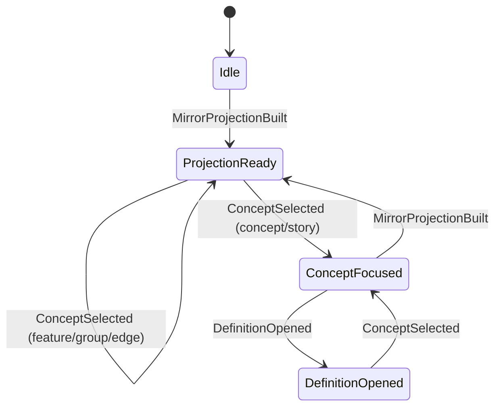

# State Machines: Knowledge Graph Visualization

## Capability Backlinks

- [Aspect Whiteboard Navigation](SPEC.md#aspect-whiteboard-navigation)
- [SPEC-Level Feature Atlas](SPEC.md#spec-level-feature-atlas)
- [Graph Layout & Edge Semantics Algorithm](SPEC.md#graph-layout--edge-semantics-algorithm)
- [Feature Drilldown By Aspect](SPEC.md#feature-drilldown-by-aspect)
- [Cross-Project Documentation Scope](SPEC.md#cross-project-documentation-scope)

## ExplorationState

### Transition Table

| From             | Event                 | To               | Guard                                                               | Effect                                                                 |
| ---------------- | --------------------- | ---------------- | ------------------------------------------------------------------- | ---------------------------------------------------------------------- |
| Idle             | MirrorProjectionBuilt | ProjectionReady  | Projection contains required files and hierarchy signature          | Session stores snapshot metadata and deterministic hierarchy signature |
| ProjectionReady  | ConceptSelected       | ProjectionReady  | Selection is feature card, aspect group card, or cross-feature edge | Session updates board context and optional `highlightedEdgeKey`        |
| ProjectionReady  | ConceptSelected       | ConceptFocused   | Selected concept exists in projection                               | Session stores selected concept and detail context                     |
| ConceptFocused   | DefinitionOpened      | DefinitionOpened | Definition pointer resolves to file anchor                          | Session stores last definition target and aspect                       |
| DefinitionOpened | ConceptSelected       | ConceptFocused   | New concept ID differs or re-focus requested                        | Session updates selected concept and keeps last valid highlight        |
| ConceptFocused   | MirrorProjectionBuilt | ProjectionReady  | Rebuild requested or stale projection                               | Session keeps concept only when resolvable in new hierarchy snapshot   |

### Invariants

| ID  | Invariant                                                       | Formal                                                                                        |
| --- | --------------------------------------------------------------- | --------------------------------------------------------------------------------------------- |
| I1  | Required file cards are always present when not Idle            | `state != Idle => {'SPEC','DOMAIN','OPERATIONS'} subsetOf cards.aspectKind`                   |
| I2  | Hierarchy signature is stable for identical canonical input     | `same(scope + index + files) => same(hierarchySignature)`                                     |
| I3  | Focused concept must exist in projection                        | `state in {'ConceptFocused','DefinitionOpened'} => exists concept(selectedConceptId)`         |
| I4  | Definition target must resolve before entering DefinitionOpened | `state = DefinitionOpened => exists(filePath, anchor)`                                        |
| I5  | Highlight handoff is preserved for cross-feature navigation     | `crossFeatureSelection => exists(session.highlightedEdgeKey)`                                 |
| I6  | Detail enrichment mode stays explicit or deterministic fallback | `state in {'ConceptFocused','DefinitionOpened'} => enrichmentMode in {'explicit','fallback'}` |
