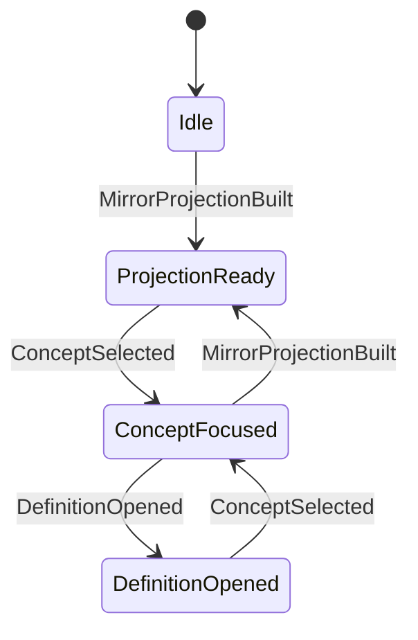

# State Machines: Knowledge Graph Visualization

## ExplorationState

### Transition Table

| From             | Event                 | To               | Guard                                        | Effect                                         |
| ---------------- | --------------------- | ---------------- | -------------------------------------------- | ---------------------------------------------- |
| Idle             | MirrorProjectionBuilt | ProjectionReady  | Projection contains required mirror files    | Session stores snapshot metadata               |
| ProjectionReady  | ConceptSelected       | ConceptFocused   | Concept exists in projection                 | Session stores selected concept                |
| ConceptFocused   | DefinitionOpened      | DefinitionOpened | Definition pointer resolves to file anchor   | Session stores last definition target          |
| DefinitionOpened | ConceptSelected       | ConceptFocused   | New concept ID differs or re-focus requested | Session updates selected concept               |
| ConceptFocused   | MirrorProjectionBuilt | ProjectionReady  | Rebuild requested or stale projection        | Session keeps concept only if still resolvable |

### Invariants

| ID  | Invariant                                                       | Formal                                                                                |
| --- | --------------------------------------------------------------- | ------------------------------------------------------------------------------------- |
| I1  | Required file cards are always present when not Idle            | `state != Idle => {'SPEC','DOMAIN','OPERATIONS'} subsetOf cards.aspectKind`           |
| I2  | Focused concept must exist in projection                        | `state in {'ConceptFocused','DefinitionOpened'} => exists concept(selectedConceptId)` |
| I3  | Definition target must resolve before entering DefinitionOpened | `state = DefinitionOpened => exists(filePath, anchor)`                                |
