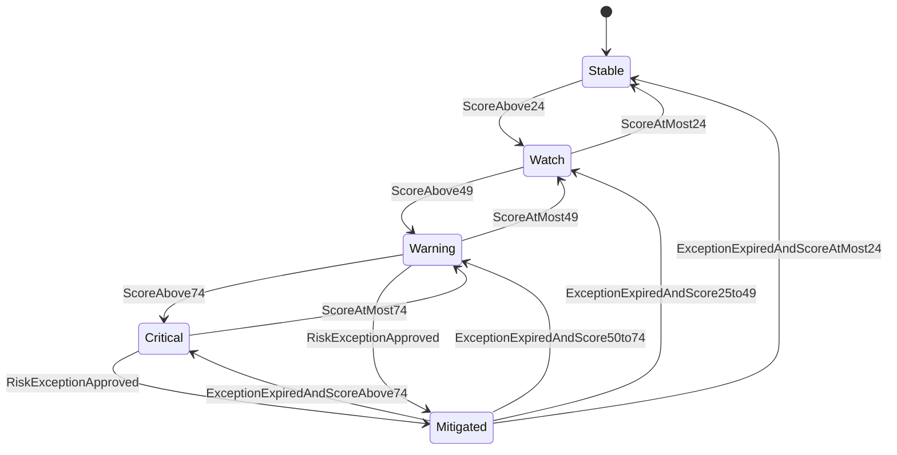

# State Machines: Knowledge Graph Visualization

## DependencyRiskState

Lifecycle of one dependency pair risk state in the governance matrix.

### States

| State     | Terminal | Description                                      |
| --------- | -------- | ------------------------------------------------ |
| Stable    | no       | Low dependency risk, no mitigation required      |
| Watch     | no       | Moderate risk to monitor                         |
| Warning   | no       | Elevated risk requiring active governance review |
| Critical  | no       | High risk requiring release gate decision        |
| Mitigated | no       | Exception-approved temporary mitigation state    |

### Transition Table

| From      | Event                            | To        | Guard                                   | Effect                                               |
| --------- | -------------------------------- | --------- | --------------------------------------- | ---------------------------------------------------- |
| Stable    | ScoreAbove24                     | Watch     | `24 < score <= 49`                      | Update matrix state to Watch                         |
| Watch     | ScoreAtMost24                    | Stable    | `score <= 24`                           | Update matrix state to Stable                        |
| Watch     | ScoreAbove49                     | Warning   | `49 < score <= 74`                      | Update matrix state to Warning                       |
| Warning   | ScoreAtMost49                    | Watch     | `24 < score <= 49`                      | Downgrade state after recomputation                  |
| Warning   | ScoreAbove74                     | Critical  | `score > 74`                            | Escalate state and emit `DependencyRiskRaised`       |
| Critical  | ScoreAtMost74                    | Warning   | `49 < score <= 74`                      | Downgrade state after recomputation                  |
| Warning   | RiskExceptionApproved            | Mitigated | `activeException == null`               | Persist exception and emit `DependencyRiskMitigated` |
| Critical  | RiskExceptionApproved            | Mitigated | `activeException == null`               | Persist exception and emit `DependencyRiskMitigated` |
| Mitigated | ExceptionExpiredAndScoreAtMost24 | Stable    | `exceptionExpired and score <= 24`      | Remove exception effect                              |
| Mitigated | ExceptionExpiredAndScore25to49   | Watch     | `exceptionExpired and 24 < score <= 49` | Remove exception effect                              |
| Mitigated | ExceptionExpiredAndScore50to74   | Warning   | `exceptionExpired and 49 < score <= 74` | Remove exception effect                              |
| Mitigated | ExceptionExpiredAndScoreAbove74  | Critical  | `exceptionExpired and score > 74`       | Remove exception effect and re-escalate              |

### Invalid Transitions (must be rejected)

| From      | Attempted Event       | Why Invalid                                   |
| --------- | --------------------- | --------------------------------------------- |
| Stable    | RiskExceptionApproved | Stable risk does not allow exception override |
| Watch     | RiskExceptionApproved | Watch risk does not allow exception override  |
| Mitigated | RiskExceptionApproved | Active mitigation already exists              |

### Invariants

| ID  | Invariant                                        | Formal                                                                         |
| --- | ------------------------------------------------ | ------------------------------------------------------------------------------ |
| I1  | One state per feature pair and snapshot          | `count(states(pair, snapshot)) == 1`                                           |
| I2  | Mitigated state requires active exception        | `state == Mitigated -> activeExceptionId != null`                              |
| I3  | Stable score range is bounded                    | `state == Stable -> score <= 24`                                               |
| I4  | Critical score range is bounded unless mitigated | `state == Critical -> score > 74`                                              |
| I5  | Exception does not alter computed score          | `state == Mitigated -> effectiveState != computedState and score is unchanged` |
