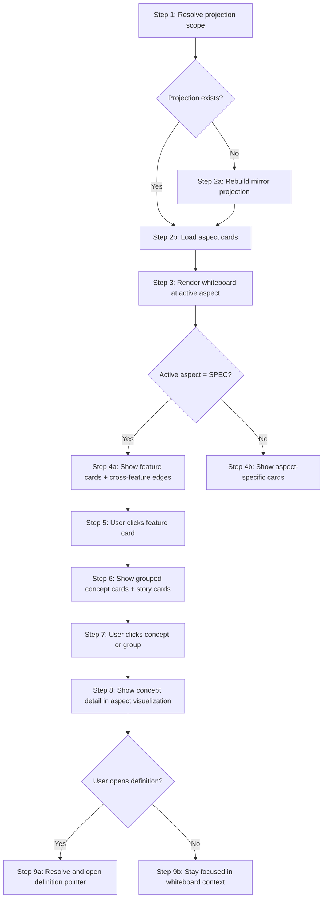

# Workflows: Knowledge Graph Visualization

## MirrorInteractionWorkflow

**Type:** Workflow
**Triggers:** Page open, aspect card click, feature card click, concept card click, open-definition action
**Orchestrates:** [RebuildMirrorProjection](operations.md#rebuildmirrorprojection), [SelectConcept](operations.md#selectconcept), [OpenDefinition](operations.md#opendefinition)
**Compensation Strategy:** notify-only
**Idempotency:** yes (projection rebuild and board derivation are deterministic)

### Steps



### Step Table

| #   | Step                  | Actor  | Operation                                                        | On Success                          | On Failure              | Compensation                          |
| --- | --------------------- | ------ | ---------------------------------------------------------------- | ----------------------------------- | ----------------------- | ------------------------------------- |
| 1   | Resolve scope         | System | [ResolveProjectionScope](operations.md#resolveprojectionscope)   | Scope context set                   | Return scope error      | Show source/feature scope remediation |
| 2   | Build/load projection | System | [RebuildMirrorProjection](operations.md#rebuildmirrorprojection) | Aspect cards + board data available | Return projection error | Surface missing-file diagnostics      |
| 3   | Select board card     | User   | [SelectConcept](operations.md#selectconcept)                     | Board level and detail synchronized | Keep prior board state  | Clear transient focus                 |
| 4   | Open definition       | User   | [OpenDefinition](operations.md#opendefinition)                   | Navigate to `file#anchor`           | Stay in focused card    | Show unresolved-pointer diagnostics   |

### Invariants

| ID     | Invariant                                          | Formal                                                             |
| ------ | -------------------------------------------------- | ------------------------------------------------------------------ |
| I-WF-1 | Aspect card rail always includes required files    | `{'SPEC','DOMAIN','OPERATIONS'} subsetOf aspectCards.aspectKind`   |
| I-WF-2 | SPEC board edges must come from relationship index | `forall e in specBoard.edges: e.source = 'SPEC.relationshipIndex'` |
| I-WF-3 | Concept cards must expose aspect grouping metadata | `forall conceptCard: exists conceptCard.groupKey`                  |
| I-WF-4 | Detail card belongs to selected card context       | `detailCard.cardId = session.selectedCardId`                       |
| I-WF-5 | Deep-link only opens known anchor                  | `exists(pointer.filePath, pointer.anchor)`                         |

---

## CardSyncPolicy

**Type:** Policy
**Applies To:** [MirrorInteractionWorkflow](#mirrorinteractionworkflow) step 2
**Trigger Conditions:** Rebuild requested or source checksum drift detected

### Decision Table

| Condition                                    | Selected Behavior                             | Notes                                |
| -------------------------------------------- | --------------------------------------------- | ------------------------------------ |
| Required aspect file missing                 | Block rebuild and return explicit diagnostics | Prevent silent partial boards        |
| SPEC relationship index missing/invalid      | Block SPEC whiteboard and return diagnostics  | Spec-level board must stay traceable |
| Required files present and checksums changed | Rebuild projection                            | Maintain board/index parity          |
| No checksum drift                            | Serve existing projection                     | Minimize unnecessary rebuild cost    |

### Formula

```
rebuildNeeded = missingRequiredFile OR checksumDriftDetected OR invalidRelationshipIndex
```

### Configuration Parameters

| Parameter             | Type     | Default                                   | Description                                         |
| --------------------- | -------- | ----------------------------------------- | --------------------------------------------------- |
| requiredFiles         | string[] | ["SPEC.md", "domain.md", "operations.md"] | Minimum mirrored files                              |
| staleThresholdMinutes | integer  | 10                                        | Max age before stale label                          |
| rebuildOnOpen         | boolean  | true                                      | Force rebuild check on page load                    |
| requireSpecIndex      | boolean  | true                                      | Block SPEC board when relationship index is invalid |
