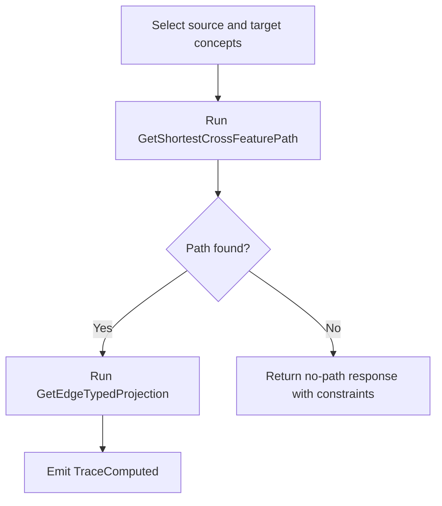
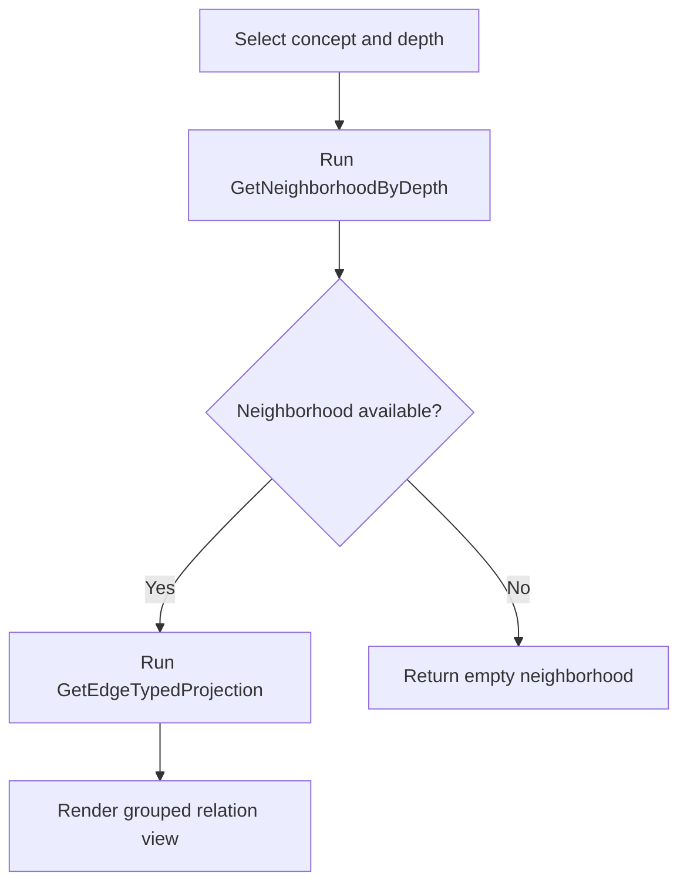
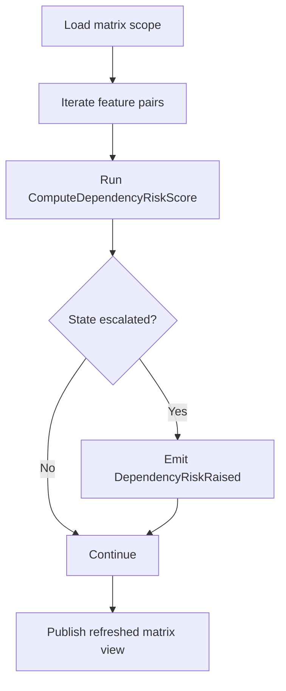
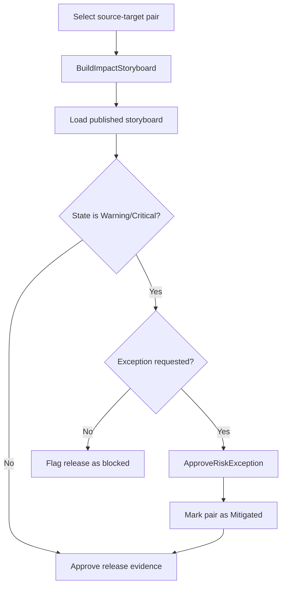

# Workflows: Knowledge Graph Visualization

## TraceSelectionWorkflow

**Type:** Workflow
**Triggers:** Analyst selects source and target concepts in constellation view
**Orchestrates:** [GetShortestCrossFeaturePath](queries.md#getshortestcrossfeaturepath), [GetEdgeTypedProjection](queries.md#getedgetypedprojection)

### Steps

### Step Table

| #   | Step                                | Operation                                                             | On Success           | On Failure                       |
| --- | ----------------------------------- | --------------------------------------------------------------------- | -------------------- | -------------------------------- |
| 1   | Validate source and target concepts | [GetShortestCrossFeaturePath](queries.md#getshortestcrossfeaturepath) | Go to step 2         | Return invalid-input response    |
| 2   | Compute deterministic path          | [GetShortestCrossFeaturePath](queries.md#getshortestcrossfeaturepath) | Go to step 3         | Return no-path response          |
| 3   | Build typed relation projection     | [GetEdgeTypedProjection](queries.md#getedgetypedprojection)           | Emit `TraceComputed` | Return projection-error response |

### Policies

| Policy              | Applies At | Logic                                                                                                              |
| ------------------- | ---------- | ------------------------------------------------------------------------------------------------------------------ |
| PathRankingPolicy   | Step 2     | Prefer path with highest cross-feature relevance, then shortest edge count, then lexical tie-breaker by concept id |
| EdgeWhitelistPolicy | Step 3     | Reject any edge type not included in [EdgeType](domain.md#edgetype)                                                |

### Compensation

| Step | Compensation Action                 | Condition                                          |
| ---- | ----------------------------------- | -------------------------------------------------- |
| 3    | Discard transient projection output | Projection generation fails after path computation |

### Invariants

| ID       | Invariant                                                        | Formal                          |
| -------- | ---------------------------------------------------------------- | ------------------------------- |
| WF-TS-01 | Returned path is deterministic for the same input and filter set | `sameInput => samePath`         |
| WF-TS-02 | Returned path never includes non-canonical edge types            | `path.edges[].type in EdgeType` |

---

## MultiHopAnalysisWorkflow

**Type:** Workflow
**Triggers:** Analyst expands depth or applies lens filters in constellation view
**Orchestrates:** [GetNeighborhoodByDepth](queries.md#getneighborhoodbydepth), [GetEdgeTypedProjection](queries.md#getedgetypedprojection)

### Steps

### Step Table

| #   | Step                            | Operation                                                   | On Success          | On Failure                         |
| --- | ------------------------------- | ----------------------------------------------------------- | ------------------- | ---------------------------------- |
| 1   | Validate depth and filters      | [GetNeighborhoodByDepth](queries.md#getneighborhoodbydepth) | Go to step 2        | Return invalid-filter response     |
| 2   | Retrieve multi-hop neighborhood | [GetNeighborhoodByDepth](queries.md#getneighborhoodbydepth) | Go to step 3        | Return neighborhood-error response |
| 3   | Build edge-family projection    | [GetEdgeTypedProjection](queries.md#getedgetypedprojection) | Render grouped view | Return projection-error response   |

### Policies

| Policy                       | Applies At | Logic                                                     |
| ---------------------------- | ---------- | --------------------------------------------------------- |
| DepthLimitPolicy             | Step 1     | Allow depth range [1..4] in V2                            |
| ProjectionCompletenessPolicy | Step 3     | Edge-family counts must reconcile with projected edge set |

### Compensation

| Step | Compensation Action                                    | Condition                 |
| ---- | ------------------------------------------------------ | ------------------------- |
| 3    | Return raw neighborhood without grouped family summary | Projection grouping fails |

### Invariants

| ID       | Invariant                                                             | Formal                                      |
| -------- | --------------------------------------------------------------------- | ------------------------------------------- |
| WF-MH-01 | Neighborhood must include only nodes reachable within requested depth | `distance(node, root) <= depth`             |
| WF-MH-02 | Grouped family counts equal projected edge count                      | `sum(familyCounts) = projectedEdges.length` |

---

## RiskAssessmentWorkflow

**Type:** Workflow
**Triggers:** Governance refresh cycle, release pre-checkpoint, or explicit matrix refresh request
**Orchestrates:** [ComputeDependencyRiskScore](operations.md#computedependencyriskscore), [GetDependencyMatrix](queries.md#getdependencymatrix)

### Steps

### Step Table

| #   | Step                                | Operation                                                              | On Success               | On Failure                             |
| --- | ----------------------------------- | ---------------------------------------------------------------------- | ------------------------ | -------------------------------------- |
| 1   | Load current matrix scope           | [GetDependencyMatrix](queries.md#getdependencymatrix)                  | Go to step 2             | Return matrix-load error               |
| 2   | Recompute selected pair risk score  | [ComputeDependencyRiskScore](operations.md#computedependencyriskscore) | Go to step 3             | Record pair-level failure and continue |
| 3   | Evaluate escalation and publication | [GetDependencyMatrix](queries.md#getdependencymatrix)                  | Publish refreshed matrix | Return publication warning             |

### Policies

| Policy              | Applies At | Logic                                                                          |
| ------------------- | ---------- | ------------------------------------------------------------------------------ |
| PairSelectionPolicy | Step 1     | Include pairs filtered by release scope, min risk band, and snapshot freshness |
| EscalationPolicy    | Step 3     | Any transition to Warning or Critical emits `DependencyRiskRaised`             |

### Compensation

| Step | Compensation Action                                        | Condition                         |
| ---- | ---------------------------------------------------------- | --------------------------------- |
| 2    | Revert pair update attempt and keep previous matrix values | Risk recomputation fails for pair |

### Invariants

| ID       | Invariant                                                            | Formal                                                        |
| -------- | -------------------------------------------------------------------- | ------------------------------------------------------------- |
| WF-RA-01 | Matrix publication reflects latest successful recomputation per pair | `publishedCell.version >= recomputedCell.version`             |
| WF-RA-02 | Escalation events must match state-severity increases only           | `emit(DependencyRiskRaised) -> severity(new) > severity(old)` |

---

## ReleaseImpactWorkflow

**Type:** Workflow
**Triggers:** Release decision request for one high-risk dependency pair
**Orchestrates:** [BuildImpactStoryboard](operations.md#buildimpactstoryboard), [GetImpactStoryboard](queries.md#getimpactstoryboard), [ApproveRiskException](operations.md#approveriskexception)

### Steps

### Step Table

| #   | Step                               | Operation                                                             | On Success                            | On Failure                                   |
| --- | ---------------------------------- | --------------------------------------------------------------------- | ------------------------------------- | -------------------------------------------- |
| 1   | Generate release impact storyboard | [BuildImpactStoryboard](operations.md#buildimpactstoryboard)          | Go to step 2                          | Return storyboard-generation error           |
| 2   | Retrieve published storyboard      | [GetImpactStoryboard](queries.md#getimpactstoryboard)                 | Go to step 3                          | Return storyboard-read error                 |
| 3   | Resolve governance decision        | [ApproveRiskException](operations.md#approveriskexception) (optional) | Mark Mitigated or keep existing state | Block release when critical risk unmitigated |

### Policies

| Policy                | Applies At | Logic                                                                |
| --------------------- | ---------- | -------------------------------------------------------------------- |
| ReleaseGatePolicy     | Step 3     | Warning/Critical requires documented decision before release         |
| ExceptionWindowPolicy | Step 3     | Exception expiry must be within 30 days and linked to release window |

### Compensation

| Step | Compensation Action                 | Condition                                           |
| ---- | ----------------------------------- | --------------------------------------------------- |
| 3    | Revoke provisional release approval | Exception approval fails after provisional decision |

### Invariants

| ID       | Invariant                                                                | Formal                                          |
| -------- | ------------------------------------------------------------------------ | ----------------------------------------------- |
| WF-RI-01 | Release evidence must include one published storyboard for decision pair | `decision(pair) -> exists(storyboard(pair))`    |
| WF-RI-02 | Mitigated state requires active non-expired exception                    | `state == Mitigated -> exists(activeException)` |
