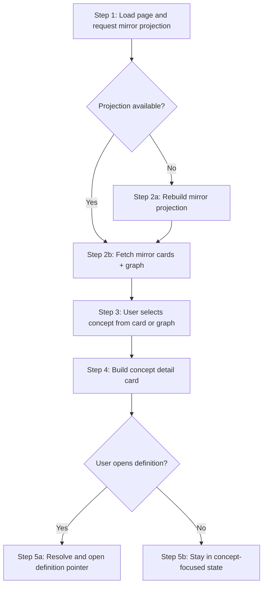

# Workflows: Knowledge Graph Visualization

## MirrorInteractionWorkflow

**Type:** Workflow
**Triggers:** Knowledge graph page open, card click, graph node click, definition open action
**Orchestrates:** [RebuildMirrorProjection](operations.md#rebuildmirrorprojection), [SelectConcept](operations.md#selectconcept), [OpenDefinition](operations.md#opendefinition)
**Compensation Strategy:** notify-only
**Idempotency:** yes (rebuild and selection are deterministic)

### Steps



### Step Table

| #   | Step                       | Actor  | Operation                                                        | On Success              | On Failure              | Compensation                              |
| --- | -------------------------- | ------ | ---------------------------------------------------------------- | ----------------------- | ----------------------- | ----------------------------------------- |
| 1   | Load or refresh projection | System | [RebuildMirrorProjection](operations.md#rebuildmirrorprojection) | Fetch cards/graph       | Return projection error | Notify user with missing-file diagnostics |
| 2   | Focus concept              | User   | [SelectConcept](operations.md#selectconcept)                     | Show detail card        | Keep prior selection    | Clear transient highlight                 |
| 3   | Open definition            | User   | [OpenDefinition](operations.md#opendefinition)                   | Navigate to file anchor | Stay focused on concept | Show unresolved-anchor error in panel     |

### Invariants

| ID     | Invariant                                      | Formal                                                     |
| ------ | ---------------------------------------------- | ---------------------------------------------------------- |
| I-WF-1 | Mirror view always includes required files     | `{'SPEC','DOMAIN','OPERATIONS'} subsetOf cards.aspectKind` |
| I-WF-2 | Concept detail card belongs to focused concept | `detailCard.conceptId = session.selectedConceptId`         |
| I-WF-3 | Deep-link only opens known anchor              | `exists(pointer.filePath, pointer.anchor)`                 |

---

## CardSyncPolicy

**Type:** Policy
**Applies To:** [MirrorInteractionWorkflow](#mirrorinteractionworkflow) step 1
**Trigger Conditions:** Rebuild requested or source file checksum drift detected

### Decision Table

| Condition                                    | Selected Behavior                             | Notes                              |
| -------------------------------------------- | --------------------------------------------- | ---------------------------------- |
| Required mirror file missing                 | Block rebuild and return explicit diagnostics | Prevent silent partial projections |
| Required files present and checksums changed | Rebuild projection                            | Maintain card/graph parity         |
| No checksum drift                            | Serve existing projection                     | Minimize unnecessary rebuild cost  |

### Formula (if applicable)

```
rebuildNeeded = missingRequiredFile OR checksumDriftDetected
```

### Configuration Parameters

| Parameter             | Type     | Default                                   | Description                      |
| --------------------- | -------- | ----------------------------------------- | -------------------------------- |
| requiredFiles         | string[] | ["SPEC.md", "domain.md", "operations.md"] | Minimum mirrored files           |
| staleThresholdMinutes | integer  | 10                                        | Max age before stale label       |
| rebuildOnOpen         | boolean  | true                                      | Force rebuild check on page load |
