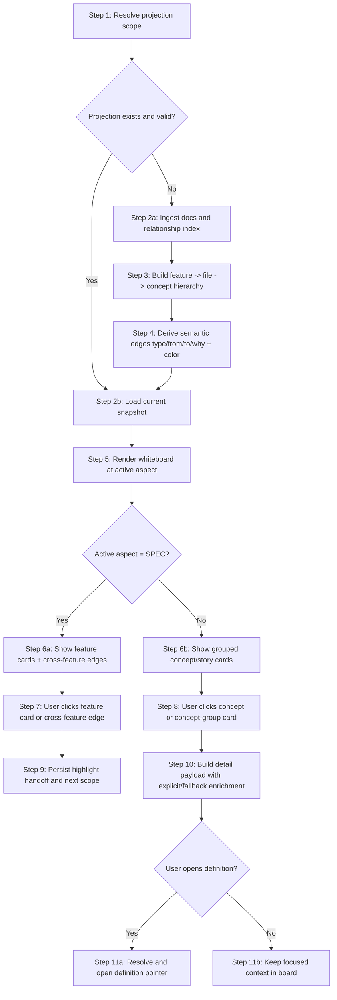

# Workflows: Knowledge Graph Visualization

## Capability Backlinks

- [Aspect Whiteboard Navigation](SPEC.md#aspect-whiteboard-navigation)
- [SPEC-Level Feature Atlas](SPEC.md#spec-level-feature-atlas)
- [Graph Layout & Edge Semantics Algorithm](SPEC.md#graph-layout--edge-semantics-algorithm)
- [Feature Drilldown By Aspect](SPEC.md#feature-drilldown-by-aspect)
- [Cross-Project Documentation Scope](SPEC.md#cross-project-documentation-scope)

## MirrorInteractionWorkflow

**Type:** Workflow
**Triggers:** Page open, aspect card click, feature card click, concept card click, edge click, open-definition action
**Orchestrates:** [ResolveProjectionScope](operations.md#resolveprojectionscope), [RebuildMirrorProjection](operations.md#rebuildmirrorprojection), [SelectConcept](operations.md#selectconcept), [OpenDefinition](operations.md#opendefinition)
**Interaction Anchor:** [WHITEBOARD-PROTOTYPE.html](WHITEBOARD-PROTOTYPE.html)
**Compensation Strategy:** deterministic error response + retain last valid projection
**Idempotency:** yes (projection rebuild and board derivation are deterministic)

### Steps



### Step Table

| #   | Step                              | Actor  | Operation                                                        | On Success                                              | On Failure                    | Compensation                            |
| --- | --------------------------------- | ------ | ---------------------------------------------------------------- | ------------------------------------------------------- | ----------------------------- | --------------------------------------- |
| 1   | Resolve scope                     | System | [ResolveProjectionScope](operations.md#resolveprojectionscope)   | Scope context set                                       | Return scope error            | Show source/feature scope remediation   |
| 2   | Ingest/build snapshot when needed | System | [RebuildMirrorProjection](operations.md#rebuildmirrorprojection) | Deterministic hierarchy + semantic edges are available  | Return projection/index error | Serve last valid snapshot if compatible |
| 3   | Select card/edge context          | User   | [SelectConcept](operations.md#selectconcept)                     | Board level, detail, and highlight context synchronized | Keep prior board state        | Clear transient selection               |
| 4   | Open definition                   | User   | [OpenDefinition](operations.md#opendefinition)                   | Navigate to `file#anchor` in resolved source scope      | Stay in focused card          | Show unresolved-pointer diagnostics     |

### Invariants

| ID     | Invariant                                          | Formal                                                               |
| ------ | -------------------------------------------------- | -------------------------------------------------------------------- |
| I-WF-1 | Aspect card rail always includes required files    | `{'SPEC','DOMAIN','OPERATIONS'} subsetOf aspectCards.aspectKind`     |
| I-WF-2 | SPEC board edges must come from relationship index | `forall e in specBoard.edges: e.source = 'SPEC.relationshipIndex'`   |
| I-WF-3 | Hierarchy projection is deterministic              | `ordered(feature->file->concept) produces stable hierarchySignature` |
| I-WF-4 | Concept cards must expose aspect grouping metadata | `forall conceptCard: exists conceptCard.groupKey`                    |
| I-WF-5 | Cross-feature edge click preserves highlight key   | `edgeClick -> exists(session.highlightedEdgeKey)`                    |
| I-WF-6 | Detail payload keeps enrichment mode semantics     | `detail.enrichmentMode in {'explicit','fallback'}`                   |
| I-WF-7 | Deep-link only opens known anchor                  | `exists(pointer.filePath, pointer.anchor)`                           |

---

## CardSyncPolicy

**Type:** Policy
**Applies To:** [MirrorInteractionWorkflow](#mirrorinteractionworkflow) step 2
**Trigger Conditions:** Rebuild requested, source checksum drift detected, or hierarchy contract drift detected

### Decision Table

| Condition                                    | Selected Behavior                             | Notes                                                    |
| -------------------------------------------- | --------------------------------------------- | -------------------------------------------------------- |
| Required aspect file missing                 | Block rebuild and return explicit diagnostics | Prevent silent partial hierarchy                         |
| SPEC relationship index missing/invalid      | Block SPEC whiteboard and return diagnostics  | SPEC-level graph must stay traceable                     |
| Required files present and checksums changed | Rebuild projection                            | Maintain hierarchy/index parity                          |
| Hierarchy signature mismatch                 | Rebuild projection                            | Preserve deterministic `feature -> file -> concept` path |
| No drift and no request                      | Serve existing projection                     | Minimize unnecessary rebuild cost                        |

### Formula

```
rebuildNeeded = missingRequiredFile OR checksumDriftDetected OR invalidRelationshipIndex OR hierarchySignatureMismatch
```

### Configuration Parameters

| Parameter             | Type     | Default                                   | Description                                         |
| --------------------- | -------- | ----------------------------------------- | --------------------------------------------------- |
| requiredFiles         | string[] | ["SPEC.md", "domain.md", "operations.md"] | Minimum mirrored files                              |
| staleThresholdMinutes | integer  | 10                                        | Max age before stale label                          |
| rebuildOnOpen         | boolean  | true                                      | Force rebuild check on page load                    |
| requireSpecIndex      | boolean  | true                                      | Block SPEC board when relationship index is invalid |
| enforceHierarchySig   | boolean  | true                                      | Enforce deterministic hierarchy signature checks    |
