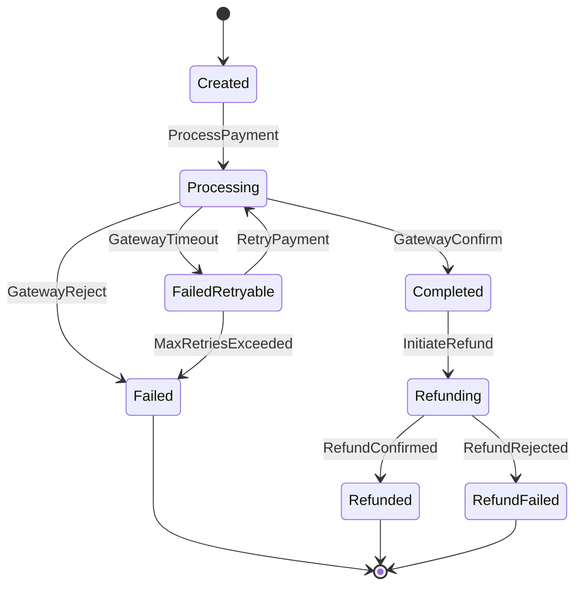

# State Machines: Payment Processing

## PaymentStatus

The complete lifecycle of a payment transaction from creation through final resolution.

### States

| State           | Terminal | Description                              |
| --------------- | -------- | ---------------------------------------- |
| Created         | no       | Transaction initialized, rules validated |
| Processing      | no       | Gateway call in flight                   |
| Completed       | no       | Payment confirmed by gateway             |
| Failed          | yes      | Payment permanently failed               |
| FailedRetryable | no       | Gateway timed out, eligible for retry    |
| Refunding       | no       | Refund request sent to gateway           |
| Refunded        | yes      | Refund confirmed                         |
| RefundFailed    | yes      | Refund was rejected by gateway           |

### Transition Table

| From            | Event              | To              | Guard                    | Effect                                                |
| --------------- | ------------------ | --------------- | ------------------------ | ----------------------------------------------------- |
| Created         | ProcessPayment     | Processing      | R1-R5 pass               | Emit `payment.PaymentInitiated`, call gateway         |
| Processing      | GatewayConfirm     | Completed       | —                        | Store gatewayRef, emit `payment.PaymentCompleted`     |
| Processing      | GatewayReject      | Failed          | —                        | Store rejection reason, emit `payment.PaymentFailed`  |
| Processing      | GatewayTimeout     | FailedRetryable | —                        | Schedule retry per RetryPolicy                        |
| FailedRetryable | RetryPayment       | Processing      | R9, R10 pass             | Increment retryCount, call gateway                    |
| FailedRetryable | MaxRetriesExceeded | Failed          | retryCount >= maxRetries | Emit `payment.PaymentFailed`                          |
| Completed       | InitiateRefund     | Refunding       | R6-R8 pass               | Send refund to gateway                                |
| Refunding       | RefundConfirmed    | Refunded        | —                        | Update refundedAmount, emit `payment.RefundCompleted` |
| Refunding       | RefundRejected     | RefundFailed    | —                        | Store rejection reason                                |

### Invalid Transitions (must be rejected)

| From         | Attempted Event | Why Invalid                          |
| ------------ | --------------- | ------------------------------------ |
| Created      | GatewayConfirm  | Has not been sent to gateway yet     |
| Completed    | RetryPayment    | Already succeeded — nothing to retry |
| Failed       | any             | Terminal state                       |
| Refunded     | InitiateRefund  | Already refunded                     |
| RefundFailed | RefundConfirmed | Refund was rejected                  |

### Invariants

| ID  | Invariant                                 | Formal                                                       |
| --- | ----------------------------------------- | ------------------------------------------------------------ |
| I1  | Completed payments have gateway reference | `status == Completed → gatewayRef != null`                   |
| I2  | Refunded amount ≤ original amount         | `refundedAmount <= amount`                                   |
| I3  | Retry count bounded                       | `retryCount <= maxRetries`                                   |
| I4  | Terminal states are immutable             | `status ∈ {Failed, Refunded, RefundFailed} → no transitions` |
| I5  | Fee is always present                     | `status != Created → fee != null`                            |
| I6  | Created timestamp never changes           | `∀ transitions: createdAt' == createdAt`                     |
