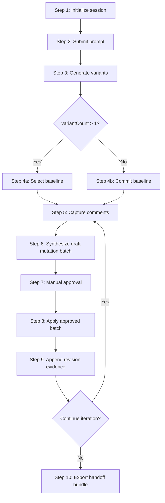
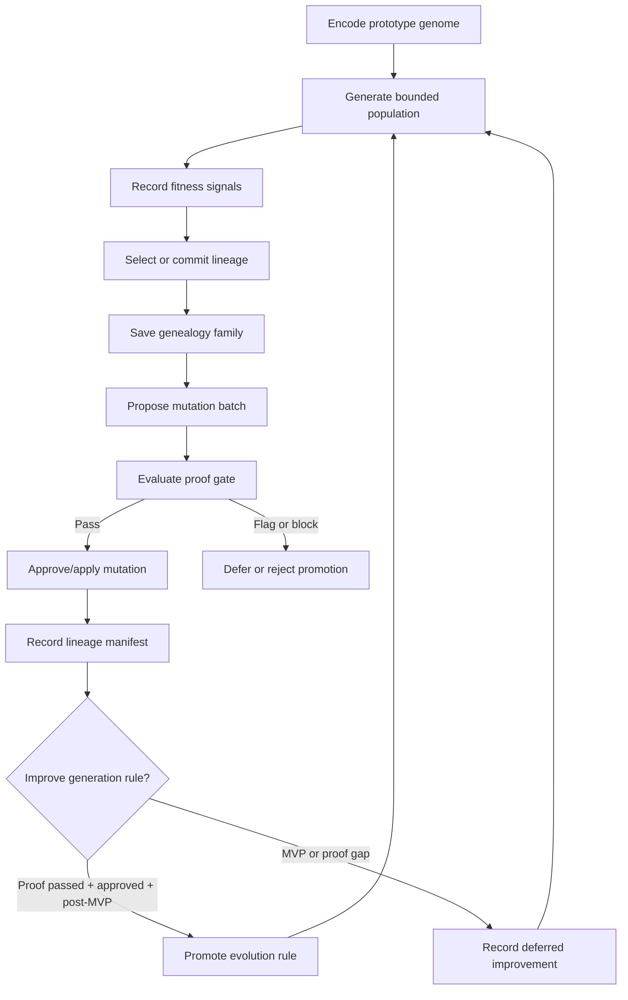

# Workflows: UI Prototyping Studio

## Capability Backlinks

- [Variant Generation and Baseline Gate](SPEC.md#variant-generation-and-baseline-gate)
- [Prototype Revision Loop](SPEC.md#prototype-revision-loop)
- [Manual Governance and Apply Control](SPEC.md#manual-governance-and-apply-control)
- [Genetic Evolution Engine](SPEC.md#genetic-evolution-engine)
- [Godel Proof and Self-Improvement Gate](SPEC.md#godel-proof-and-self-improvement-gate)
- [Design Artifact Export and Handoff](SPEC.md#design-artifact-export-and-handoff)

## MVPStudioIterationWorkflow

**Type:** Workflow
**Triggers:** Session start, prompt submit, batch approval, apply, handoff export
**Orchestrates:** [InitializeSession](operations.md#initializesession), [SubmitPrompt](operations.md#submitprompt), [GenerateVariants](operations.md#generatevariants), [SelectOrCommitBaseline](operations.md#selectorcommitbaseline), [CaptureCommentEvent](operations.md#capturecommentevent), [SynthesizeMutationBatch](operations.md#synthesizemutationbatch), [ApproveMutationBatch](operations.md#approvemutationbatch), [ApplyApprovedBatch](operations.md#applyapprovedbatch), [ExportDesignHandoff](operations.md#exportdesignhandoff)
**Compensation Strategy:** notify-only
**Idempotency:** conditional (deterministic by session + revision + ordered comment set)

### Steps



### Step Table

| #   | Step                     | Actor       | Operation                                                        | On Success               | On Failure                 | Compensation                   |
| --- | ------------------------ | ----------- | ---------------------------------------------------------------- | ------------------------ | -------------------------- | ------------------------------ |
| 1   | Initialize session       | User        | [InitializeSession](operations.md#initializesession)             | Session ready            | Return validation error    | Show variant count remediation |
| 2   | Submit prompt            | User        | [SubmitPrompt](operations.md#submitprompt)                       | Prompt captured          | Return prompt error        | Keep session initialized       |
| 3   | Generate variants        | System      | [GenerateVariants](operations.md#generatevariants)               | Variants ready           | Return generation error    | Keep prompt context            |
| 4   | Resolve baseline         | User/System | [SelectOrCommitBaseline](operations.md#selectorcommitbaseline)   | Baseline ready           | Return baseline gate error | Keep variants visible          |
| 5   | Capture comments         | User        | [CaptureCommentEvent](operations.md#capturecommentevent)         | Comment log updated      | Return schema error        | Keep previous comments         |
| 6   | Draft mutation batch     | System      | [SynthesizeMutationBatch](operations.md#synthesizemutationbatch) | Draft batch created      | Return synthesis error     | Keep comment set               |
| 7   | Approve batch            | User        | [ApproveMutationBatch](operations.md#approvemutationbatch)       | Batch approved           | Return approval error      | Keep draft batch               |
| 8   | Apply batch              | User        | [ApplyApprovedBatch](operations.md#applyapprovedbatch)           | Revision applied         | Return gate/stale error    | Keep prior revision head       |
| 9   | Record revision evidence | System      | [ApplyApprovedBatch](operations.md#applyapprovedbatch)           | Manifest appended        | Return append error        | Mark apply as failed           |
| 10  | Export handoff           | User/System | [ExportDesignHandoff](operations.md#exportdesignhandoff)         | Handoff bundle published | Return reference error     | Keep revision evidence         |

### Invariants

| ID     | Invariant                                                                      | Formal                                                                   |
| ------ | ------------------------------------------------------------------------------ | ------------------------------------------------------------------------ |
| I-WF-1 | Variant count remains bounded through all workflow steps                       | `StudioSession.variantCount.value in {1,2,3}`                            |
| I-WF-2 | Multi-option flow cannot enter apply branch before explicit baseline selection | `variantCount>1 -> selectionGate='satisfied' before ApplyApprovedBatch`  |
| I-WF-3 | Single-option flow marks baseline as committed before comment stage            | `variantCount=1 -> baseline.mode='committed' before CaptureCommentEvent` |
| I-WF-4 | Draft batches require explicit approval prior to apply                         | `MutationBatch.status='draft' -> not ApplyApprovedBatch`                 |
| I-WF-5 | Auto-apply is forbidden                                                        | `applyRequestedBy != 'system:auto'`                                      |
| I-WF-6 | Every successful apply appends exactly one manifest entry                      | `appendCount(RevisionManifestEntry)=1 per successful apply`              |

---

## GovernanceGatePolicy

**Type:** Policy
**Applies To:** [MVPStudioIterationWorkflow](#mvpstudioiterationworkflow) steps 4, 7, and 8
**Trigger Conditions:** Baseline resolution, batch approval, and apply requests

### Decision Table

| Condition                                                   | Selected Behavior                        | Notes                         |
| ----------------------------------------------------------- | ---------------------------------------- | ----------------------------- |
| `variantCount > 1` and no explicit baseline selection       | Block transition to comments/tasks/apply | Enforces D-005                |
| `variantCount = 1`                                          | Auto-mark baseline as committed          | Enforces D-006                |
| Batch status is `draft`                                     | Block apply                              | Explicit approval required    |
| Batch status is `approved` and source revision matches head | Allow apply                              | Deterministic safe path       |
| Batch source revision stale                                 | Block apply and require re-synthesis     | Prevents stale mutation apply |
| Apply trigger identity is system auto-runner                | Reject apply                             | Enforces FR-012               |

### Formula

```
allowApply = (
  selectionGate == 'satisfied' AND
  batch.status == 'approved' AND
  batch.sourceRevisionId == session.revisionHeadId AND
  applyRequestedBy != 'system:auto'
)
```

### Configuration Parameters

| Parameter                       | Type    | Default | Description                                                 |
| ------------------------------- | ------- | ------- | ----------------------------------------------------------- |
| requireSelectionForMultiVariant | boolean | true    | Blocks non-selected multi-variant apply path                |
| singleVariantCommitsBaseline    | boolean | true    | Enables committed baseline semantics for `variantCount = 1` |
| forbidAutoApply                 | boolean | true    | Blocks auto-apply in MVP                                    |
| requireSourceRevisionMatch      | boolean | true    | Rejects stale batch apply                                   |

---

## VariantCountPolicy

**Type:** Policy
**Applies To:** [InitializeSession](operations.md#initializesession), [GenerateVariants](operations.md#generatevariants)
**Trigger Conditions:** Session start and generation request

### Decision Table

| Condition                                 | Selected Behavior | Notes                   |
| ----------------------------------------- | ----------------- | ----------------------- |
| `requestedVariantCount` is missing        | Use default `3`   | Enforces FR-001         |
| `requestedVariantCount` in `{1,2,3}`      | Accept value      | MVP bounded exploration |
| `requestedVariantCount` outside `{1,2,3}` | Reject request    | Validation error path   |

### Formula

```
variantCount = requestedVariantCount ?? 3
isValid = variantCount in {1,2,3}
```

### Configuration Parameters

| Parameter           | Type    | Default | Description     |
| ------------------- | ------- | ------- | --------------- |
| minVariantCount     | integer | 1       | Lower bound     |
| maxVariantCount     | integer | 3       | Upper bound     |
| defaultVariantCount | integer | 3       | Session default |

---

## GodelDarwinEvolutionWorkflow

**Type:** Workflow
**Triggers:** Variant generation, baseline selection, comment capture, mutation synthesis, proof evaluation, revision apply
**Orchestrates:** [GenerateVariants](operations.md#generatevariants), [RecordFitnessSignal](operations.md#recordfitnesssignal), [SelectOrCommitBaseline](operations.md#selectorcommitbaseline), [SynthesizeMutationBatch](operations.md#synthesizemutationbatch), [EvaluateProofGate](operations.md#evaluateproofgate), [ApproveMutationBatch](operations.md#approvemutationbatch), [ApplyApprovedBatch](operations.md#applyapprovedbatch), [PromoteEvolutionRule](operations.md#promoteevolutionrule)
**Compensation Strategy:** defer promotion; preserve prior lineage
**Idempotency:** deterministic by session + generation index + genome + proof obligations

### Steps



### Genetic Mapping

| Genetic Concept | Studio Concept                                           | Operational Anchor                                               |
| --------------- | -------------------------------------------------------- | ---------------------------------------------------------------- |
| Genome          | [PrototypeGenome](domain.md#prototypegenome)             | Prompt, constraints, comments, tasks, environment refs           |
| Population      | [PrototypeVariant](domain.md#prototypevariant) set       | [GenerateVariants](operations.md#generatevariants)               |
| Fitness         | [FitnessSignal](domain.md#fitnesssignal) set             | [RecordFitnessSignal](operations.md#recordfitnesssignal)         |
| Selection       | [BaselineProvenance](domain.md#baselineprovenance)       | [SelectOrCommitBaseline](operations.md#selectorcommitbaseline)   |
| Family          | [BaselineGenealogyFamily](domain.md#baselinegenealogyfamily) | [SelectOrCommitBaseline](operations.md#selectorcommitbaseline) |
| Mutation        | [MutationBatch](domain.md#mutationbatch)                 | [SynthesizeMutationBatch](operations.md#synthesizemutationbatch) |
| Proof           | [ProofObligation](domain.md#proofobligation)             | [EvaluateProofGate](operations.md#evaluateproofgate)             |
| Lineage         | [RevisionManifestEntry](domain.md#revisionmanifestentry) | [ApplyApprovedBatch](operations.md#applyapprovedbatch)           |

### Invariants

| ID      | Invariant                                                            | Formal                                                        |
| ------- | -------------------------------------------------------------------- | ------------------------------------------------------------- |
| GD-WF-1 | Population size is bounded by [VariantCount](domain.md#variantcount) | `count(population) in {1,2,3}`                                |
| GD-WF-2 | Selection pressure must be captured before self-improvement          | `PromoteEvolutionRule -> count(FitnessSignal)>0`              |
| GD-WF-3 | Mutation cannot enter lineage without genealogy, proof, and approval | `ApplyApprovedBatch -> exists(BaselineGenealogyFamily) and proofStatus='pass' and batch.approved` |
| GD-WF-4 | MVP self-improvement is recorded as deferred, not applied            | `runtimeMvp -> RulePromotionDeferred`                         |

---

## GeneticSelectionPolicy

**Type:** Policy
**Applies To:** [GodelDarwinEvolutionWorkflow](#godeldarwinevolutionworkflow) population, fitness, and baseline selection stages
**Trigger Conditions:** Variant review, human selection, risk review, automated test feedback

### Decision Table

| Condition                                      | Selected Behavior                         | Notes                                          |
| ---------------------------------------------- | ----------------------------------------- | ---------------------------------------------- |
| Human selects a baseline                       | Treat as primary positive fitness signal  | Preserves intentional selection pressure       |
| Variant has high risk without offsetting value | Record negative risk fitness signal       | Does not auto-reject; informs proof layer      |
| Test/acceptance check passes for a revision    | Record positive evidence fitness signal   | Can support future generation-rule improvement |
| Test/acceptance check fails                    | Record blocker or negative fitness signal | Prevents unsafe promotion                      |

### Configuration Parameters

| Parameter                    | Type    | Default | Description                                        |
| ---------------------------- | ------- | ------- | -------------------------------------------------- |
| maxPopulationSize            | integer | 3       | Upper bound for generated variants                 |
| requireHumanLineageSelection | boolean | true    | Multi-variant lineage requires explicit selection  |
| acceptTestFitnessSignals     | boolean | true    | Allows test results to contribute to proof context |

---

## GodelProofGatePolicy

**Type:** Policy
**Applies To:** [EvaluateProofGate](operations.md#evaluateproofgate), [PromoteEvolutionRule](operations.md#promoteevolutionrule), [ApplyApprovedBatch](operations.md#applyapprovedbatch)
**Trigger Conditions:** Apply attempt, handoff export, or generation-rule promotion request

### Decision Table

| Condition                                      | Selected Behavior                       | Notes                                       |
| ---------------------------------------------- | --------------------------------------- | ------------------------------------------- |
| Any proof obligation is `block`                | Block apply or promotion                | Missing evidence is blocker by default      |
| Any proof obligation is `flag` and none block  | Allow handoff with gap; block promotion | Usable artifact, unsafe self-improvement    |
| All proof obligations pass                     | Allow approved mutation apply           | Promotion still requires human governance   |
| Actor is `system:auto` for promotion or apply  | Reject                                  | Prevents autonomous durable mutation        |
| Runtime phase is MVP and target is rule change | Defer promotion                         | Self-improvement contract is documented now |
