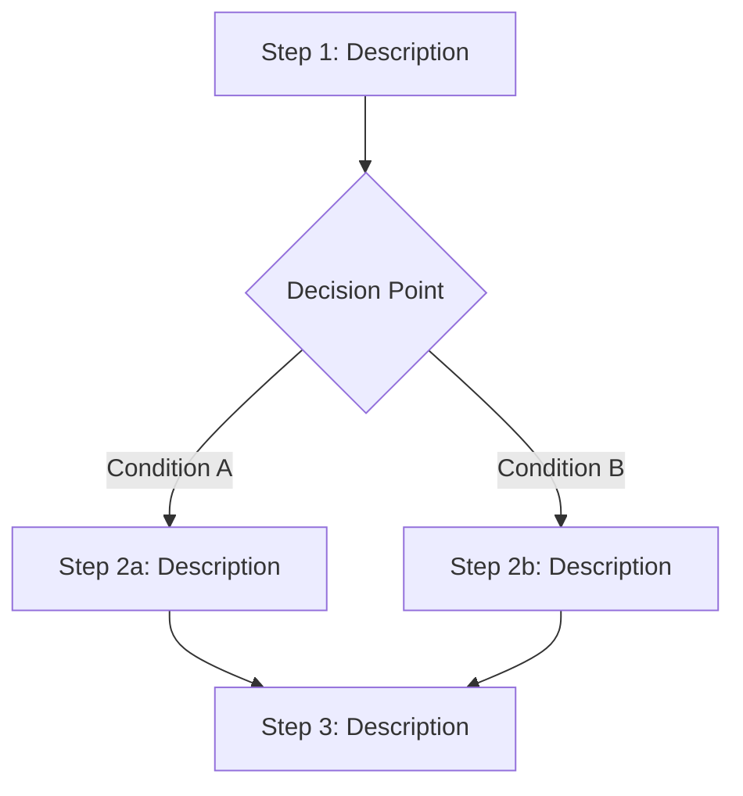

# Workflows: {Feature Name}

<!-- Behavioral concepts: Multi-step orchestrations that coordinate multiple operations.
     Each workflow documents its steps, decision points, policies, and compensation logic. -->

## {WorkflowName}

**Type:** Workflow
**Triggers:** <!-- What initiates this workflow: event, schedule, manual -->
**Orchestrates:** [{Op1}](operations.md#op1), [{Op2}](operations.md#op2)

### Steps

### Step Table

| #   | Step | Operation                         | On Success   | On Failure |
| --- | ---- | --------------------------------- | ------------ | ---------- |
| 1   |      | [{OperationName}](operations.md#) | Go to step 2 |            |
| 2   |      |                                   |              |            |

### Policies

<!-- Decision logic applied at branch points -->

| Policy | Applies At | Logic |
| ------ | ---------- | ----- |
|        | Step #     |       |

### Compensation

<!-- How to undo completed steps if a later step fails (saga pattern) -->

| Step | Compensation Action | Condition |
| ---- | ------------------- | --------- |
|      |                     |           |

### Invariants

| ID  | Invariant | Formal |
| --- | --------- | ------ |
|     |           |        |
