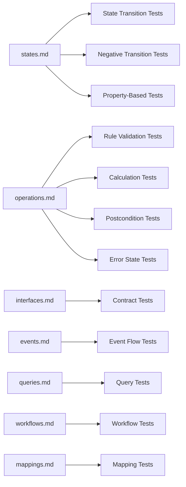

# Test Pipeline: Documentation → Tests

> How DFDS documentation maps to testable specifications.
> Each doc section produces specific test types with deterministic coverage.

## Pipeline Overview



## Test Generation Rules

### From `states.md`

#### 1. State Transition Tests (happy path)

**Rule:** Every row in the Transition Table = 1 test case.

| Transition Table Row                                   | Test                                                      |
| ------------------------------------------------------ | --------------------------------------------------------- |
| `From: Created, Event: ProcessPayment, To: Processing` | `test("ProcessPayment transitions Created → Processing")` |

**Template:**

```
GIVEN entity in state {From}
WHEN {Event} occurs
AND {Guard} is satisfied
THEN entity transitions to {To}
AND {Effect} is executed
```

**Coverage from Payment example:** 9 transition tests (one per row).

#### 2. Negative Transition Tests

**Rule:** Every entry in the Invalid Transitions table = 1 rejection test. Additionally, for every state × event combination NOT in the Transition Table, generate a rejection test.

| Invalid Transition                     | Test                                                |
| -------------------------------------- | --------------------------------------------------- |
| `From: Created, Event: GatewayConfirm` | `test("GatewayConfirm rejected in Created state")`  |
| `From: Failed, Event: any`             | `test("No transitions from terminal state Failed")` |

**Template:**

```
GIVEN entity in state {From}
WHEN {Event} occurs
THEN transition is rejected
AND state remains {From}
```

#### 3. Invariant Tests (property-based)

**Rule:** Every row in the Invariants table = 1 property-based test that must hold across ALL states.

| Invariant                                      | Test                                          |
| ---------------------------------------------- | --------------------------------------------- |
| `I1: status == Completed → gatewayRef != null` | `property("Completed always has gatewayRef")` |
| `I3: retryCount <= maxRetries`                 | `property("retryCount never exceeds max")`    |

**Template:**

```
FOR ALL reachable states of {Entity}
ASSERT {Formal expression} holds
```

**Coverage from Payment example:** 6 property tests (I1–I6).

---

### From `operations.md`

#### 4. Rule Validation Tests

**Rule:** Each rule = at least 2 tests (pass + fail).

| Rule                                        | Tests                                                                                               |
| ------------------------------------------- | --------------------------------------------------------------------------------------------------- |
| `R1: amount.value > 0`                      | `test("accepts positive amount")`, `test("rejects zero amount")`, `test("rejects negative amount")` |
| `R3: method ∈ enabledMethods(user.country)` | `test("accepts enabled method")`, `test("rejects disabled method")`                                 |

**Template:**

```
GIVEN valid input EXCEPT {rule field} is {invalid value}
WHEN {Operation} is executed
THEN {Error} is returned
AND no state change occurs
```

**Coverage from Payment example:** 10 rules × 2+ tests = 20+ rule tests.

#### 5. Calculation Tests

**Rule:** Each calculation row = 1+ correctness tests. Each property in the Properties table = 1 property test.

| Calculation                    | Tests                                                                                                       |
| ------------------------------ | ----------------------------------------------------------------------------------------------------------- |
| `C1: amount × feeRate(method)` | `test("CREDIT_CARD fee = 2.9% + $0.30")`, `test("BANK_TRANSFER fee = 0.8%")`, `test("minimum fee applied")` |

**Template:**

```
GIVEN amount = {value} AND method = {method}
WHEN FeeCalculation is applied
THEN fee = {expected}
```

#### 6. Postcondition Tests

**Rule:** Each postcondition bullet = 1 assertion test.

| Postcondition                                      | Test                                                 |
| -------------------------------------------------- | ---------------------------------------------------- |
| "PaymentTransaction exists with status=Processing" | `test("transaction created with Processing status")` |
| "`PaymentInitiated` event emitted"                 | `test("PaymentInitiated event emitted on success")`  |

**Template:**

```
GIVEN valid input
WHEN {Operation} succeeds
THEN {postcondition} holds
```

#### 7. Error State Tests

**Rule:** Each error state row = 1 negative test.

| Error State                          | Test                                                        |
| ------------------------------------ | ----------------------------------------------------------- |
| `R3 violated → METHOD_NOT_AVAILABLE` | `test("returns METHOD_NOT_AVAILABLE for disabled method")`  |
| `Gateway timeout → FailedRetryable`  | `test("transitions to FailedRetryable on gateway timeout")` |

---

### From `interfaces.md`

#### 8. Contract Tests

**Rule:** Each endpoint × response status = 1 contract test.

| Endpoint × Status      | Test                                                        |
| ---------------------- | ----------------------------------------------------------- |
| `POST /payments → 201` | `test("POST /payments returns 201 with valid input")`       |
| `POST /payments → 400` | `test("POST /payments returns 400 for invalid amount")`     |
| `POST /payments → 422` | `test("POST /payments returns 422 for unavailable method")` |

**Template:**

```
GIVEN {auth context}
WHEN {METHOD} {path} with {request body}
THEN response status = {status}
AND response body matches {shape}
```

**Coverage from Payment example:** 4 endpoints × 2-4 statuses = ~12 contract tests.

#### 9. Field Mapping Tests (interface)

**Rule:** Each "Maps To" entry = 1 mapping verification.

```
GIVEN API request field {source}
WHEN mapped to operation input
THEN operation receives {target} with correct value
```

---

### From `events.md`

#### 10. Event Producer Tests

**Rule:** Each event = 1 test that the producing operation emits it with correct payload.

| Event              | Test                                                                 |
| ------------------ | -------------------------------------------------------------------- |
| `PaymentInitiated` | `test("ProcessPayment emits PaymentInitiated with correct payload")` |

**Template:**

```
GIVEN {operation} succeeds
THEN {event} is emitted
AND payload contains {fields with expected values}
```

#### 11. Event Consumer Tests

**Rule:** Each consumer row = 1 test that the consumer handles the event correctly.

| Consumer                             | Test                                                           |
| ------------------------------------ | -------------------------------------------------------------- |
| `AuditLog consumes PaymentInitiated` | `test("AuditLog records payment attempt on PaymentInitiated")` |

---

### From `queries.md`

#### 12. Query Tests

**Rule:** Each query = tests for: correct output shape, filtering, authorization, empty results.

| Query               | Tests                                                                                                                      |
| ------------------- | -------------------------------------------------------------------------------------------------------------------------- |
| `GetPaymentStatus`  | `test("returns correct fields")`, `test("404 for unknown ID")`, `test("owner can view own")`, `test("non-owner rejected")` |
| `GetPaymentHistory` | `test("filters by orderId")`, `test("filters by status")`, `test("paginates correctly")`, `test("scoped to own user")`     |

---

### From `workflows.md`

#### 13. Workflow Tests

**Rule:** Each step = 1 happy path test. Each failure path = 1 compensation test. Each policy = 1 decision test.

---

### From `mappings.md`

#### 14. Mapping Tests

**Rule:** Each field mapping row = 1 transformation test. Each validation row = 1 rejection test.

| Mapping                          | Tests                                           |
| -------------------------------- | ----------------------------------------------- |
| `amount → amount.value (direct)` | `test("maps amount field directly")`            |
| `status → lowercase`             | `test("transforms CREDIT_CARD to credit_card")` |

---

## Coverage Summary (Payment Processing Example)

| Source        | Test Type             | Estimated Count |
| ------------- | --------------------- | --------------- |
| states.md     | Transition (happy)    | 9               |
| states.md     | Transition (negative) | 5+              |
| states.md     | Invariant (property)  | 6               |
| operations.md | Rule validation       | 20+             |
| operations.md | Calculation           | 6+              |
| operations.md | Postcondition         | 8               |
| operations.md | Error state           | 8               |
| interfaces.md | Contract              | 12+             |
| events.md     | Producer              | 4               |
| events.md     | Consumer              | 8               |
| queries.md    | Query                 | 8+              |
| mappings.md   | Field mapping         | 15+             |
| mappings.md   | Validation            | 4               |
| **Total**     |                       | **~113 tests**  |

Every test traces back to a specific doc line. If the doc changes, the corresponding tests must be updated.

## Traceability Format

Tests should reference their documentation source:

```
/**
 * @source features/payment-processing/states.md#paymentstatus
 * @transition Created → Processing (ProcessPayment)
 * @invariant I1
 */
test("ProcessPayment transitions Created → Processing", () => { ... })
```

This enables:

- **Doc change → find affected tests** (grep for `@source`)
- **Test failure → find the spec** (follow `@source` + `@transition`)
- **Coverage audit** — verify every doc row has a `@source` reference
